# Implementation plan — 49-spec rollout, pipelined execution

**Author:** primary orchestrator
**Branch:** `claude/kind-feynman-S6hmw`
**Date:** 2026-05-25
**Inputs:** `CLUSTERING-REVIEW.md` (15 existing specs in 6 clusters),
`preferences.md`, `larger-list-preferences.md` (Tiers S/D/A/B/C, ordered
S → D → B1+B2+B6 → A → rest of B → C), and the 34 newly-authored specs
plus 15 augmentations from Phase 0.

This plan replaces the single-pass clustering with a **pipelined**
8-phase rollout designed for the user's stated working pattern:
> *"I will probably do them by phase, then go through a cycle of
> implementing what we have up to now of the architecture. Phase N+1
> implementation while Phase N outputs are running against a full build."*

The phase boundaries are drawn primarily by **file-locality**, not by
ROI tier, so Phase N's debug-fixes during soak rarely collide with
Phase N+1's parallel implementation.

---

## 1. Pipelined execution model

Each phase produces a batch of PRs that merge to `main`. After Phase N
merges, the architecture rebuilds against the union; Phase N+1
implementation starts on a fresh branch off `main` **while** Phase N's
output soaks in the live system. Bugs found during soak land as
hotfix PRs on a hotfix branch that merges to `main` — Phase N+1
rebases when ready.

```mermaid
gantt
  title 8-phase pipelined rollout
  dateFormat X
  axisFormat %s
  section Phase 0
  Spec authoring (49 SPEC files)  :done, p0, 0, 1
  section Phase 1
  Implement S-foundations         :p1, after p0, 2
  Soak P1 (debug, hotfixes)       :crit, p1s, after p1, 1
  section Phase 2
  Implement S-chainsaw+diag       :p2, after p1, 2
  Soak P2                         :crit, p2s, after p2, 1
  section Phase 3
  Implement D-cleanup             :p3, after p2, 2
  Soak P3                         :crit, p3s, after p3, 1
  section Phase 4
  Implement B-lints (priority)    :p4, after p3, 2
  Soak P4                         :crit, p4s, after p4, 1
  section Phase 5
  Implement skill enhancements    :p5, after p4, 3
  Soak P5                         :crit, p5s, after p5, 1
  section Phase 6
  Implement A-debug-scripts       :p6, after p5, 2
  Soak P6                         :crit, p6s, after p6, 1
  section Phase 7
  Implement drift+regression+B    :p7, after p6, 3
  Soak P7                         :crit, p7s, after p7, 1
  section Phase 8
  Implement C-observability       :p8, after p7, 2
  Soak P8                         :crit, p8s, after p8, 1
```

**Pipelining rule:** Phase N+1 implementation may start as soon as Phase
N's PRs are *merged*, even if the soak period for Phase N is ongoing.
The soak period exists to surface bugs in the deployed architecture;
those bugs become hotfix PRs that land independently.

**Conflict isolation rule:** Phase N+1's content should be drawn from a
**different file tree** than the most likely Phase N hotfix surfaces
(see §2). When unavoidable overlap exists, Phase N+1 either waits or
the overlapping items shift to Phase N+2.

---

## 2. Cross-phase conflict zones

The following files / directories see the heaviest churn across phases.
For each, only ONE phase should be in active flight at a time;
subsequent phases coordinate via PR rebase.

| Hot file or directory | Touched by phases | Why |
|---|---|---|
| `.claude/skills/crossplane-claim-verify/SKILL.md` | 5 (A1, A2, C2) | All three are skill-phase additions |
| `.claude/skills/terraform-ci-watch/SKILL.md` | 5 (A5, C3) | Two adjacent skill enhancements |
| `tests/chainsaw/**/*.yaml` | 2 (A4 catch hook, C4 golden files, S9 fixtures) | Each touches every scenario |
| `AGENTS.md` | every phase (small edits to §6/§7/§8) | Section-scoped, low-blast-radius if coordinated |
| `tests/unit/run.sh` | 1, 2, 4, 7 | Each new lint appends one line |
| `tests/unit/_lib/hcl_extract.sh` | 4 (B2, B3, B6) | New shared helper introduced in B2 |
| `scripts/_lib/aws-cli-helpers.sh` | 1 (introduced), all later consume | Read-only after Phase 1 |
| `scripts/_lib/k8s-helpers.sh` | 2 (introduced), all later consume | Read-only after Phase 2 |
| `terraform/**/providers.tf` | 8 (LC4 default_tags) — touches every provider block | One-shot retag |
| `terraform/**/*.tf` (broad) | 4 (B-lints audit), 8 (C-additions) | Phase 4 audits, Phase 8 adds |
| `.github/workflows/*` | 3 (D-deletions/replacements), 7 (drift) | Workflow churn |
| `.pre-commit-config.yaml` | 1 (S6), 3 (D5) | Two phases touch hooks |
| `policies/audit/*.yaml` | 7 (B4 Kyverno SA-existence policy) | Single-phase |
| `tests/integration/run.sh` | 7 (regression dir, drift) | Single phase |

**Action:** when implementing Phase N+1 before Phase N's soak completes,
the implementer must check this table and rebase if a hotfix lands in a
shared file.

---

## 3. Phase 0 — Spec authoring (in flight)

49 subagents dispatched in parallel (sonnet, background). Each produces
one `SPEC-*.md` per the canonical template at
`/home/user/k8-platform/ai/brainstorming/specs/SPEC-TEMPLATE.md`.

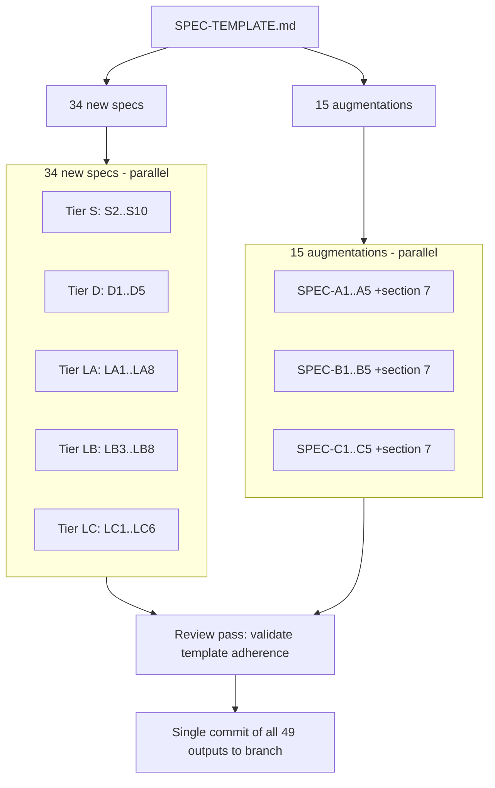

**Soak watch (Phase 0):** review the new specs for template adherence
before committing. Specs that don't include §7 testing suggestions get
sent back to their subagent.

**Unlocks:** every later phase.

---

## 4. Phase 1 — Tier S foundations (shared libs + small primitives)

**Scope:** establish shared script libraries plus the smallest, most
broadly-consumed Tier S primitives. Minimal cross-phase file footprint
to allow Phase 2 to start while Phase 1 soaks.

**PRs:**
- **PR-1.0** — `scripts/_lib/aws-cli-helpers.sh` extraction (skeleton + tests).
- **PR-1.S4** — SPEC-S4 `scripts/whereami.sh --json`.
- **PR-1.S5** — SPEC-S5 `scripts/phase-status.sh`.
- **PR-1.S6** — SPEC-S6 kubeconform pre-commit hook.
- **PR-1.S10** — SPEC-S10 `runbook-apply-zero-resources.md`.

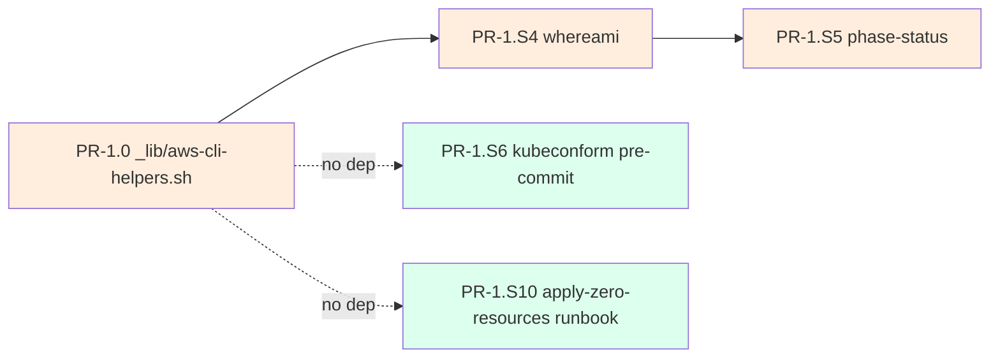

**Internal parallelism:** S4 chains on the lib (sequential). S5 chains on
S4 (sequential — needs whereami JSON). S6 and S10 fully parallel —
independent file trees.

**Hot files touched:** `scripts/_lib/`, `.pre-commit-config.yaml`,
`AGENTS.md §7`, `ai/testing-guidelines.md` (small bullets).

**Soak watch:** kubeconform pre-commit hook against existing manifests
may flag rollout-audit pain. Authors of phase-1 PRs must run the audit
before merge so the hook is green on day 1.

**Unlocks:** Phase 2 (chainsaw infra), Phase 6 (debug scripts).

---

## 5. Phase 2 — Tier S chainsaw infra + diagnostic scripts

**Scope:** chainsaw catch hook + golden files + the heavy-leverage
diagnostic scripts (`crossplane-trace`, `irsa-trust-validator`,
`wait-for-claim`, `composition-render-dryrun`). All scoped to
`tests/chainsaw/`, `scripts/`, and `scripts/_lib/k8s-helpers.sh`
(introduced here).

**PRs:**
- **PR-2.0** — `scripts/_lib/k8s-helpers.sh` extraction.
- **PR-2.A4** — SPEC-A4 chainsaw `catch:` hook (= larger-list S1).
- **PR-2.C4** — SPEC-C4 chainsaw golden files. Stacks on PR-2.A4.
- **PR-2.S2** — SPEC-S2 `crossplane-trace.sh`.
- **PR-2.S3** — SPEC-S3 `irsa_trust_validator.py --all`.
- **PR-2.S7** — SPEC-S7 `wait-for-claim.sh`.
- **PR-2.S9** — SPEC-S9 composition render dry-run helper.

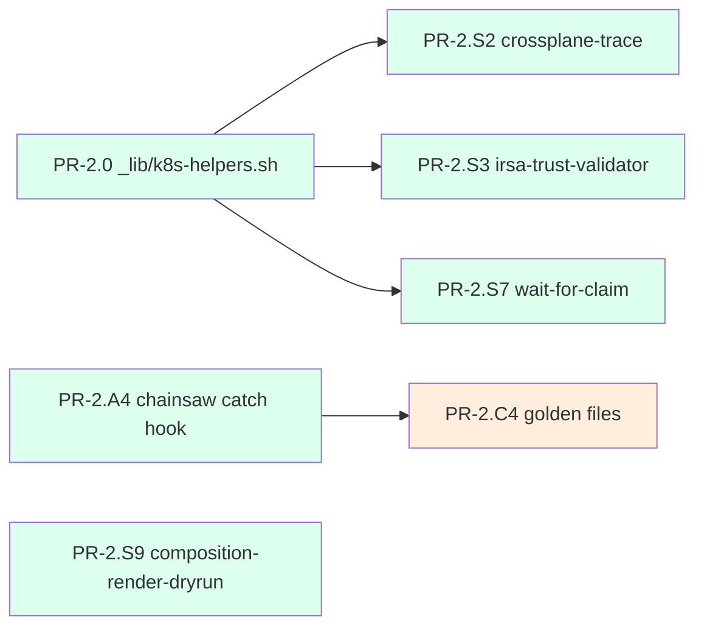

**Internal parallelism:** PR-2.0 unblocks three scripts in parallel.
A4 → C4 is a stack (golden files extend the catch infra). S9 fully
parallel with everything.

**Hot files touched:** `tests/chainsaw/**`, `scripts/_lib/`,
`scripts/*.sh`, `scripts/*.py`.

**Soak watch:** the catch hook will run on every red chainsaw scenario
— expect noisy first-day output before authors tune the truncation
budgets. Hotfix candidates: the `_lib/catch-block.yaml` truncation
thresholds.

**Unlocks:** Phase 5 (skill enhancements consume the diagnostic scripts).

---

## 6. Phase 3 — Tier D cleanup (legacy workflow removal)

**Scope:** delete or replace the GitHub Actions workflow scaffolding
that the sandbox makes obsolete. Scoped to `.github/` + a few scripts.

**PRs:**
- **PR-3.D1** — SPEC-D1 delete `post-comment.py` + test.
- **PR-3.D2** — SPEC-D2 replace `phase-2-diagnose.yml` with
  `scripts/diagnose/phase-2.sh`. **Folds in or supersedes SPEC-A3** (the
  spec subagent will surface the resolution).
- **PR-3.D3** — SPEC-D3 delete `chainsaw-verify.yml` + lint to prevent
  re-emergence. Hard-depends on PR-2.A4 (chainsaw runs locally).
- **PR-3.D4** — SPEC-D4 inline `aws-creds-check.sh` into
  `scripts/preflight.sh`.
- **PR-3.D5** — SPEC-D5 move `terraform-validate.yml` + `unit-tests.yml`
  to pre-commit / pre-push hooks; retain minimum CI on main.

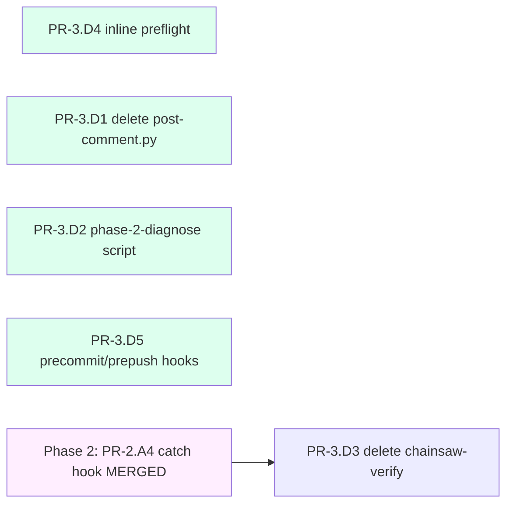

**Internal parallelism:** D1, D2, D4, D5 all independent — parallel.
D3 hard-depends on the Phase 2 catch hook being merged so chainsaw
debugging works without the verifier.

**Hot files touched:** `.github/workflows/`, `.github/scripts/`,
`scripts/preflight.sh`, `.pre-commit-config.yaml` (touched in Phase 1
too — Phase 3 must rebase if a Phase 1 hotfix lands).

**Soak watch:** D5's local-hooks rollout will hit dev-env friction.
Document the `make hooks-install` flow before merging.

**Unlocks:** clean canvas for Phase 4 lints to land without legacy
workflow noise.

---

## 7. Phase 4 — Cheap-lint static enforcement (priority: B1+B2+B6)

**Scope:** the static-lint suite from CLUSTERING-REVIEW.md Cluster 2,
plus the new SPEC-LB6 (DeploymentRuntimeConfig SA-pinned lint) called
out as priority in `larger-list-preferences.md`. All under `tests/unit/`
+ a broad rollout audit across the repo.

**PRs:**
- **PR-4.0 (baseline cleanup)** — CLUSTERING-REVIEW.md PR-2.0. Audits
  + fixes the union of B1/B2/B3/B5/B6/LB6 violations across the repo.
  Each fix is its own commit; no new tests yet.
- **PR-4.B2** — SPEC-B2 IRSA SA-pinned lint. Introduces
  `tests/unit/_lib/hcl_extract.sh` shared parser + `# noqa:` convention.
- **PR-4.B3** — SPEC-B3 `terraform_data` manifest hash lint. Reuses
  helper.
- **PR-4.LB6** — SPEC-LB6 DeploymentRuntimeConfig SA-pinned lint
  (priority). Reuses helper. Forms "IRSA binding integrity" suite with B2.
- **PR-4.B1** — SPEC-B1 shell safety lint.
- **PR-4.B5** — SPEC-B5 account-ID hardcode lint.

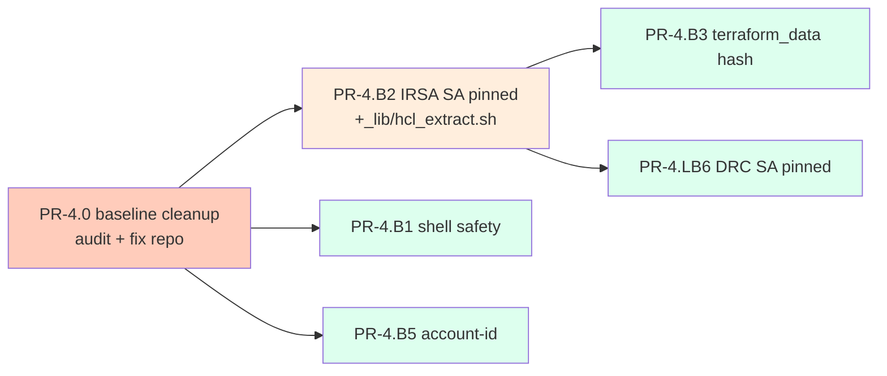

**Internal parallelism:** baseline cleanup first (single PR). Then B2
(introduces helper) before B3 + LB6 (consume helper). B1 + B5 fully
parallel — no shared helper. B3 + LB6 parallel with B1 + B5.

**Hot files touched:** `tests/unit/`, `tests/unit/_lib/hcl_extract.sh`,
`tests/unit/run.sh` (each lint appends), `terraform/**/*.tf` (broad
audit-fix pass in PR-4.0), `AGENTS.md §6.1 + §8.1`, possibly
`ai/handoff.md` (if account-ID literals found).

**Soak watch:** new lints flagging unexpected things in next PRs. The
audit-and-fix pass should leave the lints green from day 1. Watch for
edge cases (e.g., a Terraform file with a string that *looks* like an
account ID).

**Unlocks:** Phase 5 + later can author code with the lints catching
regressions at commit time.

---

## 8. Phase 5 — Skill enhancements + auto-tagging prereq

**Scope:** CLUSTERING-REVIEW.md Cluster 1 + Cluster 5 (both modify
`.claude/skills/*/SKILL.md`), plus SPEC-LC4 auto-tagging Terraform prereq
(= PR-5.0 from CLUSTERING-REVIEW.md) which is needed by SPEC-C3 in this
phase. Also includes the krew wrapper that ties multiple Phase 6 scripts
together.

**PRs:**
- **PR-5.LC4** — SPEC-LC4 `default_tags` Terraform prereq. Touches every
  `provider "aws"` block (broad terraform edit).
- **PR-5.A1** — SPEC-A1 crossplane-claim-verify Phase 6.0 chain walk.
- **PR-5.A2** — SPEC-A2 decision tree. Stacks on PR-5.A1.
- **PR-5.C2** — SPEC-C2 AWS shape assertion. Stacks on PR-5.A1 (not A2).
- **PR-5.A5** — SPEC-A5 terraform-ci-watch failure diff.
- **PR-5.C3** — SPEC-C3 terraform tag check. Stacks on PR-5.LC4.
- **PR-5.LA5** — SPEC-LA5 `kubectl k8p` krew wrapper. Reserve until late
  Phase 6 (depends on backed scripts existing).

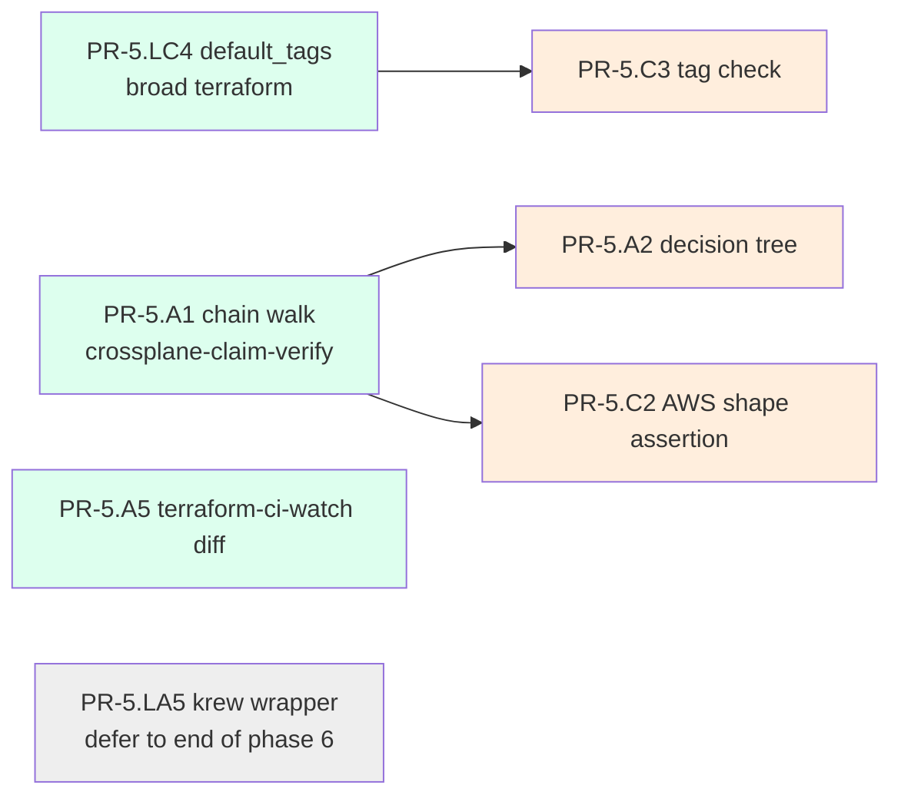

**Internal parallelism:** LC4, A1, A5 all start in parallel. A2 + C2
stack on A1 (same skill, sequence to avoid SKILL.md conflicts). C3
stacks on LC4. LA5 deferred.

**Hot files touched:** `.claude/skills/crossplane-claim-verify/`,
`.claude/skills/terraform-ci-watch/`, `terraform/**/providers.tf`
(every provider block), new `crossplane/xrds/<name>/aws-shape-contract.yaml`.

**Soak watch:** the chain walk runs on every claim failure during Phase
6 work. Expect tuning of truncation and condition format. The
`default_tags` retag triggers one-shot drift on apply — watch for
unexpected resource churn.

**Unlocks:** Phase 6 (debug scripts use the new chain walk format). The
krew wrapper LA5 stays deferred to the very end of Phase 6.

---

## 9. Phase 6 — Tier A debug script accelerators

**Scope:** the seven non-skill Tier A scripts. All under `scripts/`,
all consume the `_lib/` modules from Phases 1 + 2. Heaviest parallel
opportunity in the plan.

**PRs (all parallel after sanity check):**
- **PR-6.LA1** — SPEC-LA1 `crossplane-version-report.sh`.
- **PR-6.LA2** — SPEC-LA2 `eso-trace.sh`.
- **PR-6.LA3** — SPEC-LA3 `kyverno-decision-explain.sh`.
- **PR-6.LA4** — SPEC-LA4 `diff-state.sh phase=N`.
- **PR-6.LA6** — SPEC-LA6 `crossplane-reset-provider.sh`.
- **PR-6.LA7** — SPEC-LA7 `argocd-syncwave-view.sh`.
- **PR-6.LA8** — SPEC-LA8 `r53-watch.sh`.
- **PR-6.LA5** — SPEC-LA5 `kubectl k8p` krew wrapper. Lands LAST, after
  the seven scripts above (the wrapper dispatches to them).

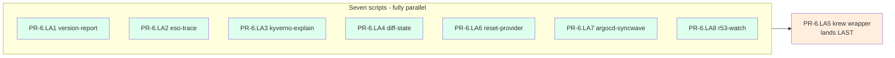

**Internal parallelism:** seven PRs land in any order (different
files). LA5 wrapper requires the seven below to be merged.

**Hot files touched:** `scripts/*.sh` (all new files), `scripts/_lib/`
(read-only consumption), `AGENTS.md §7` (one bullet per script).

**Soak watch:** scripts get exercised across every later debug session.
Watch for sandbox-quota issues (LA1 reads provider package metadata —
should be quota-free). LA4 diff-state is the riskiest (mixes terraform
plan + live state).

**Unlocks:** Phase 7 (regression corpus + drift detection use these
scripts in fixtures).

---

## 10. Phase 7 — Drift detection + regression corpus + rest of Tier B

**Scope:** CLUSTERING-REVIEW.md Cluster 3 (combined SPEC-C1+SPEC-C5
drift) + the new Tier B regression / integration tests + remaining
existing B-tier specs.

**PRs:**
- **PR-7.C1C5** — combined SPEC-C1 + SPEC-C5 (terraform drift detection
  per Cluster 3). Single PR; shared
  `scripts/diagnose/tf-drift-check.sh`.
- **PR-7.LB4** — SPEC-LB4 bug regression corpus scaffold +
  `tests/regression/` directory + backfill four known bugs.
- **PR-7.LB3** — SPEC-LB3 bidirectional IRSA invariant integration
  tests.
- **PR-7.LB5** — SPEC-LB5 manifest hash drift integration test (runtime
  pair for B3).
- **PR-7.LB7** — SPEC-LB7 UID-shadowing integration test.
- **PR-7.LB8** — SPEC-LB8 Kyverno apiVersion + fail-open lint.
- **PR-7.B4** — SPEC-B4 Kyverno SA-existence audit policy +
  CronJob. Stacks on Phase 5's PR-5.A2 (decision tree consumes the
  PolicyReport).

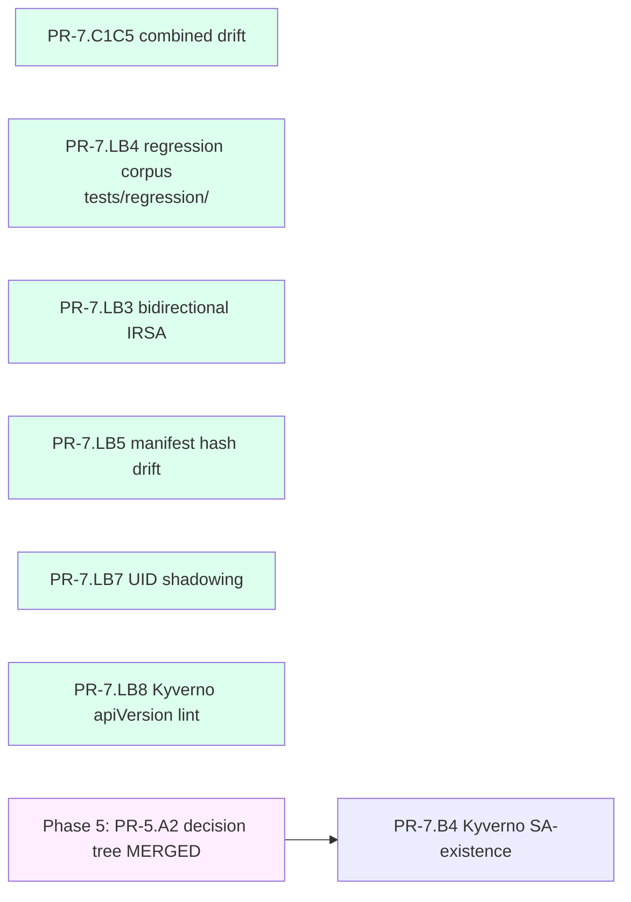

**Internal parallelism:** six PRs fully parallel — touch different
test directories. PR-7.B4 chains on Phase 5's PR-5.A2.

**Hot files touched:** `tests/integration/`, `tests/regression/` (new),
`tests/unit/`, `policies/audit/`, `crossplane/policies/`, `.github/workflows/terraform-test.yml`
(drift check addition).

**Soak watch:** regression corpus backfill exercises four known bugs.
Watch for chainsaw scenarios that the backfill tests overlap with —
deduplicate if found.

**Unlocks:** Phase 8 observability foundations have a regression safety
net.

---

## 11. Phase 8 — Tier C observability + Logs Insights

**Scope:** Terraform additions for observability foundations + the
dashboards + the deferred Logs Insights queries from Phase 1. All
touches under `terraform/` (mostly observability root) + new
`dashboards/` directory.

**PRs:**
- **PR-8.LC1** — SPEC-LC1 CloudTrail → CW log group, 7-day retention.
- **PR-8.LC2** — SPEC-LC2 EKS control-plane logging.
- **PR-8.LC3** — SPEC-LC3 VPC flow logs.
- **PR-8.S8** — SPEC-S8 Logs Insights saved queries. Stacks on PR-8.LC1
  + PR-8.LC2 (queries reference those log groups).
- **PR-8.LC5** — SPEC-LC5 `cleanup-orphans.sh`. Stacks on Phase 5's
  PR-5.LC4 (needs tags).
- **PR-8.LC6** — SPEC-LC6 three CloudWatch dashboards.

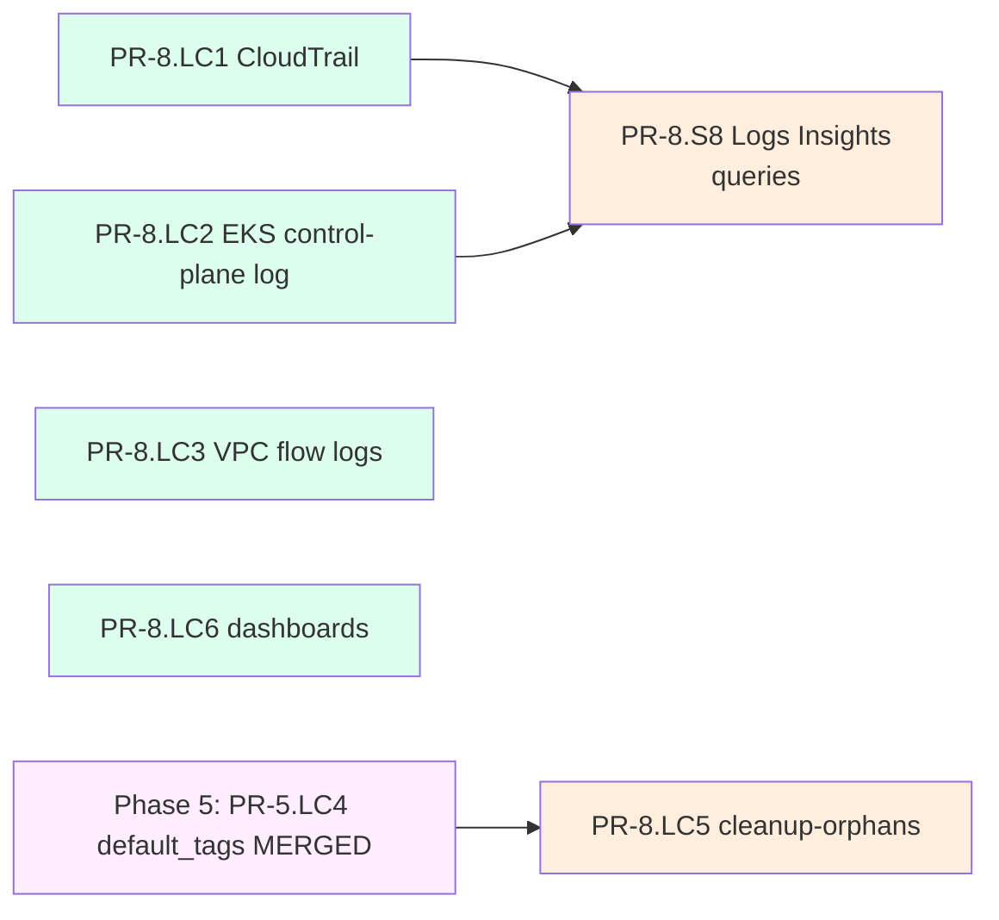

**Internal parallelism:** LC1, LC2, LC3, LC6 parallel (different
terraform resources). S8 waits on LC1 + LC2. LC5 waits on Phase 5's
LC4.

**Hot files touched:** `terraform/base/` or `terraform/observability/`
(new resources), `dashboards/*.json` (new), `terraform/**/providers.tf`
(read-only — tags must exist from Phase 5).

**Soak watch:** terraform apply touches every resource that gets new
default_tags propagation. Watch for unintended retag drift caught by
Phase 7's drift detector — this is the system working as designed.
LC5's `cleanup-orphans.sh` is dry-run-by-default; never run with
`--delete` during soak.

**Unlocks:** project reaches observability-foundation completeness.
S8's saved queries are now functional. Dashboards become operationally
useful at phase 6 (workload clusters).

---

## 12. Pipelined timing — when does Phase N+1 start?

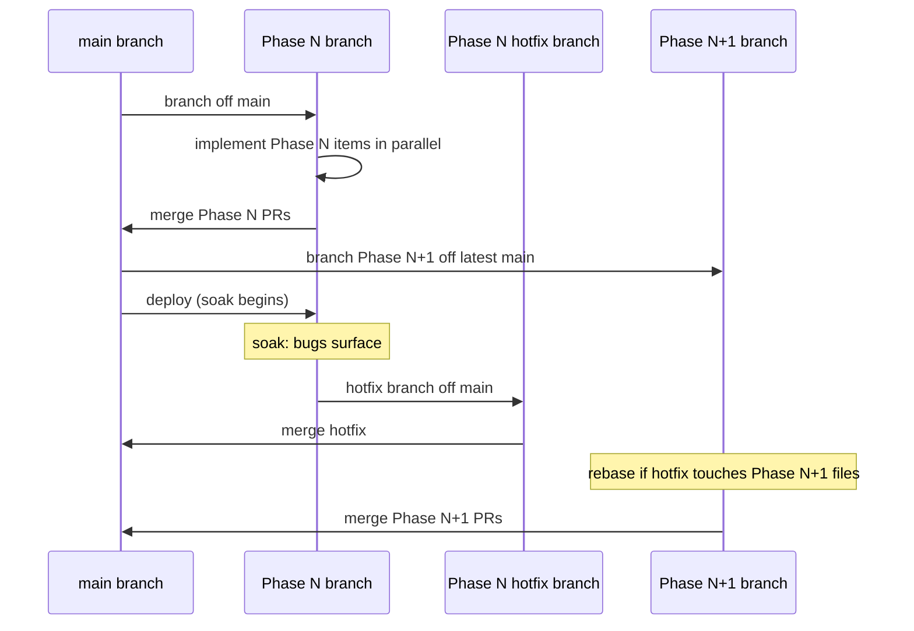

**Practical rule:** Phase N+1 implementation may begin as soon as Phase
N's PRs are merged to main. Phase N+1's PRs may NOT merge to main
until either (a) Phase N has been soaking for ≥1 session AND no
hotfixes are pending, OR (b) the implementer explicitly confirms no
conflict with hotfix-in-flight files via the §2 conflict-zone table.

---

## 13. Summary — phase ordering recap

| Phase | Title | Items | Critical hot files |
|---|---|---|---|
| 0 | Spec authoring (in flight) | 49 SPEC-*.md | none (new files only) |
| 1 | Tier S foundations | PR-1.0 + S4, S5, S6, S10 | `scripts/_lib/`, pre-commit |
| 2 | Tier S chainsaw + scripts | PR-2.0 + A4, C4, S2, S3, S7, S9 | `tests/chainsaw/`, `scripts/_lib/k8s-helpers.sh` |
| 3 | Tier D cleanup | D1, D2, D3, D4, D5 | `.github/workflows/`, `.github/scripts/` |
| 4 | Cheap lints (priority B1+B2+B6) | PR-4.0 + B1, B2, B3, B5, LB6 | `tests/unit/`, broad terraform/ audit |
| 5 | Skill enhancements | A1, A2, C2, A5, C3, LC4 (+LA5 deferred) | skill SKILL.md, terraform providers |
| 6 | Tier A debug scripts | LA1–LA4, LA6–LA8, then LA5 | `scripts/*` |
| 7 | Drift + regression + rest of B | C1+C5 combined, LB3, LB4, LB5, LB7, LB8, B4 | `tests/integration/`, `tests/regression/`, `policies/audit/` |
| 8 | Tier C observability | LC1, LC2, LC3, LC5, LC6, S8 | `terraform/observability/`, `dashboards/` |

**Total PRs:** ~60 (some clusters combine, some are stacks, some are
solo). Average per phase: 5–8 PRs. Each phase has at least 3 parallel
PRs once dependencies are resolved.

---

## 14. Open questions

1. **Phase 0 review pass.** Once the 49 subagents complete, do you want
   me to run a per-spec template-adherence review before committing the
   batch, or commit-then-review? My recommendation: spot-check ~5 specs,
   commit if they look good, full review can land as edit PRs.
2. **Phase merging cadence.** The pipelined model assumes ~1 phase per
   session (2–3 days each implementing + 1 soak session). Confirm this
   matches your working pattern; if you want denser cycles I'd merge
   Phases 1+2 into one and similar.
3. **Hotfix branch policy.** Where do hotfixes land — on top of the
   merged Phase N, or on a separate hotfix branch off main? I assumed
   the latter (clean separation); confirm.
4. **SPEC-A3 conflict with SPEC-D2.** SPEC-A3 patches the workflow that
   SPEC-D2 deletes/replaces. The Phase 0 subagent for D2 has been told
   to surface this conflict. Once both specs land we resolve.
5. **Krew wrapper LA5 timing.** I parked it at end of Phase 6. If you'd
   rather wait until you've used several individual scripts in anger
   before committing to the wrapper, defer it to Phase 7 or 8.
6. **Persist this plan?** This document is already committed. Should it
   live under `ai/brainstorming/specs/` (current) or be promoted to
   `ai/IMPLEMENTATION-PLAN.md` as a peer of `ai/PHASE-2-LIFECYCLE-PLAN.md`?
