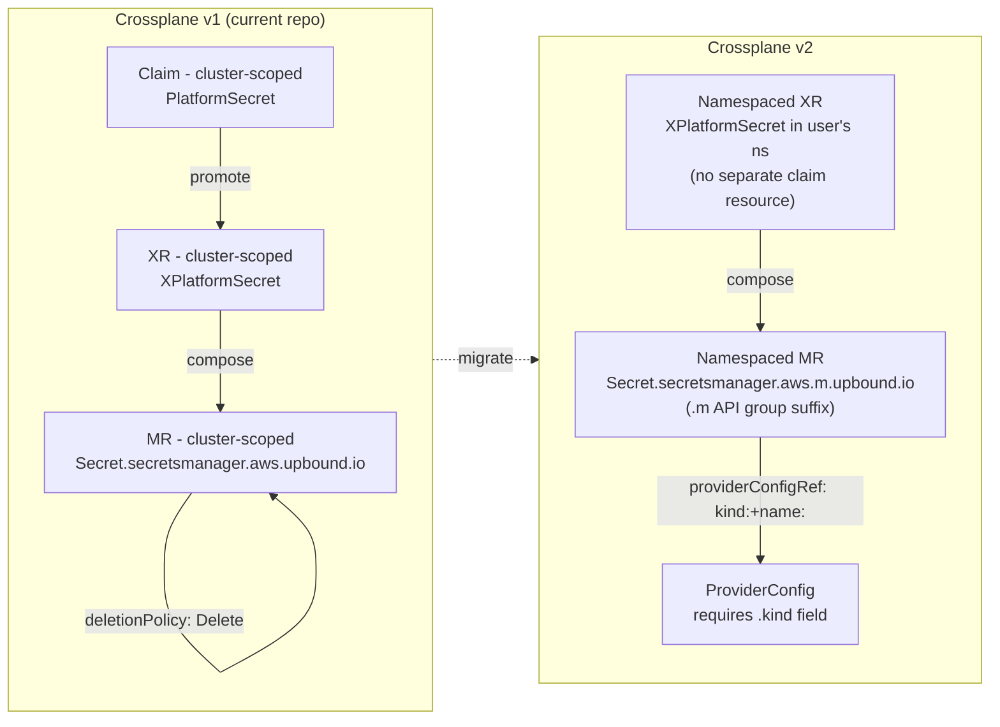

# 00 — Situation: why platform-secret scenarios are broken, what v2 demands

**Date:** 2026-05-25
**Author:** lead agent
**Status:** authoritative situation report; feeds the impact-tracing step

## 1. Symptom

Every `tests/chainsaw/platform-secret/*` scenario times out at 245 s
(chainsaw's default `assert:` wait) with this event sequence on the
`secretsmanager.aws.upbound.io/Secret` MR:

```
Successfully requested creation of external resource
Waiting for external resource existence to be confirmed
(repeats every reconcile)
```

The `XPlatformSecret` composite never reaches `Ready=True`; the
`PlatformSecret` claim stays `Ready=False` with message `Claim is
waiting for composite resource to become Ready`.

This blocks chainsaw scenarios 00 (creates), 01 (deletion-cleanup),
and 02 (rotation). `_smoke` (no Crossplane) passes; `meta-catch-fires`
(SPEC-A4, no AWS) passes once the marker grep was fixed.

## 2. Confirmed root cause

**Major-version mismatch between Crossplane and the Upbound providers.**

| Component | Pinned | Purpose-built for |
|---|---|---|
| Crossplane Helm chart | 2.3.0 | Crossplane v2 |
| `upbound/provider-family-aws` | v1.12.0 | Crossplane v1 |
| `upbound/provider-aws-secretsmanager` | v1.12.0 | Crossplane v1 |
| `function-patch-and-transform` | v0.8.2 | (both, but lagging) |

The v1.x Upbound provider line predates Crossplane v2's namespaced-MR
model. On a v2 control plane it installs and reports `Healthy=True`
but its observe path doesn't round-trip the secret it just created.

## 3. Evidence that "fresh AWS account" is NOT the cause

Re-read of the chainsaw failure log
(`actions/runs/26422972501/job/77781126520`):

| Observation | What it proves |
|---|---|
| Provider pod logs contain ONE line ("Beta feature enabled") and nothing else for 14 minutes | Provider's reconciler is silent — no exception path; consistent with v2 Crossplane silently producing `ResourceExists=false` on observe |
| ESO pod (`external-secrets-…`) successfully calls `fetching secret value` for `k8-platform/<XR-uid>` with `value: SECRET` (redaction placeholder) | The secret physically exists in AWS Secrets Manager. ESO uses the same AWS creds, same region — auth and account are fine |
| Crossplane fires `CreatedExternalResource` event | Crossplane provider's Create succeeded; AWS accepted the call |
| Crossplane then loops on `PendingExternalResource` for the rest of the scenario | Crossplane's Observe can't find what its own Create produced |

So: secret is in AWS, ESO reads it, the provider creates then loses
track. Pattern matches
[crossplane-contrib/provider-upjet-aws#1565](https://github.com/crossplane-contrib/provider-upjet-aws/issues/1565)
"Secret Manager Provider does not reconcile/import existing AWS secret"
(closed, not planned on the v1 line).

## 4. What Crossplane v2 demands

Direct from
[the v2 upgrade guide](https://docs.crossplane.io/latest/guides/upgrade-to-crossplane-v2/)
and
[the Upbound v1→v2 migration guide](https://docs.upbound.io/getstarted/upgrade-to-upbound/migrate-configurations-v2/):



Key breaking changes:

| Change | Effect on this repo |
|---|---|
| Namespaced MRs use `.m.<group>` API group | Every `secretsmanager.aws.upbound.io/*` → `secretsmanager.aws.m.upbound.io/*` (etc. for iam/ec2/eks) |
| XR/Claim separation removed (XRs become namespaced) | `claimNames:` block removed from XRDs; consumers create XRs directly in their namespace |
| `providerConfigRef` requires `kind` field | Every Composition that sets `providerConfigRef: name: default` needs `kind: ClusterProviderConfig` (or namespaced ProviderConfig) |
| `deletionPolicy` removed for namespaced MRs | `deletionPolicy: Delete` lines in Compositions must be removed |
| `namespace` field removed from secret references | `connectionDetails`/`writeConnectionSecretsToNamespace` patterns change |
| Native patch-and-transform removed | Already on `function-patch-and-transform` — OK, just bump version |
| External secret stores support removed | Re-verify ESO integration still works |

## 5. Latest GA versions to bump to

| Component | Old | New | Released |
|---|---|---|---|
| `provider-family-aws` | v1.12.0 | **v2.5.4** | 2026-05-22 |
| `provider-aws-secretsmanager` | v1.12.0 | **v2.5.4** | 2026-05-22 |
| `function-patch-and-transform` | v0.8.2 | **v0.10.6** | 2026-05-22 |
| Crossplane chart | 2.3.0 | (already current; latest v2.3.x) | — |

PR #98 (already opened, branch
`claude/bump-crossplane-providers-v2`) does the version-string bump.
It does NOT touch any manifest — that's the migration work this
analysis is producing the plan for.

## 6. Scope of the migration

29 files reference `aws.upbound.io` (v1 group). 2 XRDs use the v1
`CompositeResourceDefinition` + `claimNames` model. The session-built
tools (S2 crossplane-trace, S3 irsa-trust-validator, S6 kubeconform,
S9 composition-render, A4 catch hook, C4 golden files) all hard-code
v1 API groups in fixtures or grep patterns.

A flat list of v1-touched files (from `grep -rl "aws.upbound.io"`):

```
crossplane/compositions/platform-cluster.yaml
crossplane/compositions/platform-secret.yaml
crossplane/claims/example-platform-cluster.yaml
crossplane/rbac/01-crossplane-externalsecrets.yaml
crossplane/xrds/platform-cluster.yaml
crossplane/xrds/platform-secret.yaml
scripts/crossplane-trace.sh
scripts/diag-component.sh
scripts/fetch-crds-for-kubeconform.sh
tests/chainsaw/run.sh
tests/integration/05_crossplane_managed_resource.sh
tests/integration/06_crossplane_xrd_claim.sh
tests/unit/fixtures/composition-render/composition-missing-string-type.yaml
tests/unit/fixtures/crossplane-trace/mr-access-denied.json
tests/unit/fixtures/crossplane-trace/mr-failing-long.json
tests/unit/fixtures/crossplane-trace/mr-ok.json
tests/unit/fixtures/crossplane-trace/xr-12-refs.json
tests/unit/fixtures/crossplane-trace/xr-ok.json
tests/unit/fixtures/crossplane-trace/xr-with-mrs.json
tests/unit/fixtures/kubeconform/multi_doc_first_valid_second_invalid.yaml
tests/unit/fixtures/kubeconform/should_fail_string_transform_no_type.yaml
tests/unit/fixtures/kubeconform/should_fail_unknown_field.yaml
tests/unit/fixtures/kubeconform/should_pass_composition.yaml
tests/unit/fixtures/kubeconform/should_pass_skip_header.yaml
tests/unit/test_platform_cluster_composition.sh
tests/unit/test_platform_secret_composition.sh
ai/PHASE-2-LIFECYCLE-PLAN.md
ai/brainstorming/specs/SPEC-A1-crossplane-claim-chain-walk.md
ai/brainstorming/specs/SPEC-C2-claim-verify-aws-shape.md
ai/brainstorming/specs/SPEC-C4-chainsaw-golden-file-assert.md
ai/brainstorming/specs/SPEC-S6-kubeconform-precommit.md
```

Plus 53 JSON Schema files under `kubeconform-schemas/` derived from v1
CRDs — those don't reference `aws.upbound.io` in their text but they
ARE the v1 schemas and need regeneration against the v2 CRDs.

Plus the `kubeconform-schemas/` directory itself once the schemas are
regenerated — the names like `secret_v1beta1.json` will sit under a
different `groups/` subdirectory namespacing.

## 7. Why "right the fuck now"

- Provider release v2.5.4 is current; v1.12.0 is 18+ months old and
  unmaintained for new Crossplane.
- The version-mismatch symptom (`PendingExternalResource`) is
  100% reproducible against any fresh AWS account; we cannot
  diagnose any other class of AWS issue while this is masking the
  real signal.
- Every PR in flight in the autonomous run (#91, #94, #97 still open;
  #87, #88, #89, #90, #92, #93, #95, #96 merged) was authored against
  v1 API groups and will need partial rework.
- The chainsaw harness can't run integration-level coverage until this
  is resolved; the `_smoke`-filter workaround validates only that
  chainsaw itself functions.

## 8. What the migration is NOT

To bound the work:

- **Not** a re-architecture of XRDs. The platform-secret and
  platform-cluster XRDs stay; their shape changes from v1
  CompositeResourceDefinition with `claimNames` to v2 namespaced.
- **Not** a switch off Upbound providers to crossplane-contrib. The
  Upbound v2.x line is the supported path.
- **Not** a Crossplane chart change. We're already on 2.3.0.
- **Not** an ESO migration. ESO is independent of Crossplane.

## 9. Done criterion for the migration

1. Crossplane provider pods are on the v2.x packages.
2. All manifests under `crossplane/` use v2 API groups
   (`*.m.upbound.io`) and the namespaced XR model (no `claimNames`).
3. All schema-dependent tooling (kubeconform schema store, render
   fixtures, golden files, integration grep patterns) is regenerated
   against the v2 schemas.
4. Full chainsaw run (no `_smoke` filter) passes green on a fresh
   AWS account.
5. Phase 1 + Phase 2 verify still passes via `terraform-test.yml`'s
   `[management] e2e-verify` step.

## See also

- [PR #98 — provider version bump](https://github.com/lago-morph/k8-platform/pull/98) — already open
- [Crossplane v2 upgrade guide](https://docs.crossplane.io/latest/guides/upgrade-to-crossplane-v2/)
- [Upbound v1→v2 migration guide](https://docs.upbound.io/getstarted/upgrade-to-upbound/migrate-configurations-v2/)
- [Issue #1565 — Secret Manager observe bug on v1](https://github.com/crossplane-contrib/provider-upjet-aws/issues/1565)
