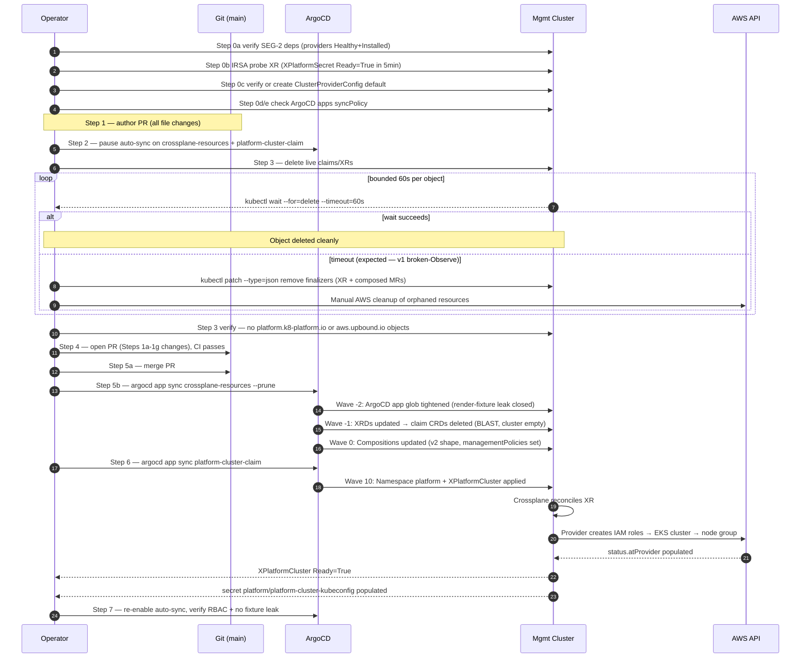
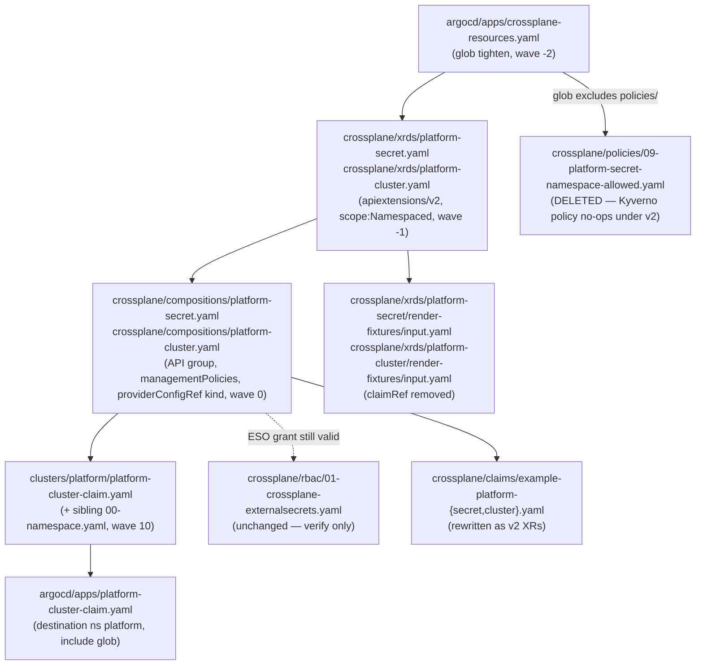

# 20 — SEG-1 Plan: Production manifest migration

**Author:** opus planner (initial draft) / R1 revision
**Status:** POST-REVIEW-R1
**Dependencies:** SEG-2 (IRSA / DeploymentRuntimeConfig SA-name pin must work under provider v2.5.4 before any claim can reconcile against AWS)

---

## Revision log (R1)

Every flaw from both reviewers is listed here with the disposition. "Addressed" means the plan body has been updated; "Pre-committed" means the decision was settled by the lead agent before this revision.

| # | Reviewer | Flaw | Disposition |
|---|---|---|---|
| A1 | A | XRDs and Compositions synced in undefined order; no sync-wave annotations | **Addressed** — Step 1a/1b/1c split; sync-wave annotations added to all resources; glob-tighten at wave `-2`, XRDs at wave `-1`, Compositions at wave `0`, live XR at wave `10` |
| A2 | A | ArgoCD auto-sync not paused before Step 3 drain | **Addressed** — new Step 2 (pause ArgoCD) inserted before drain; new Step 7 re-enables after verify |
| A3 | A | Step 4 "manual sync" doesn't verify whether `platform-cluster-claim` app has auto-sync enabled | **Addressed** — Step 0 now checks `jq .spec.syncPolicy` on both apps |
| A4 | A | Step 0 ClusterProviderConfig gate is verify-only; SEG-2 "may" create it | **Addressed** — Step 0 includes inline YAML and `kubectl apply` one-liner for the fallback create |
| A5 | A | Step 3 finalizer drain will hang (v1 broken-Observe provider) — happy-path doesn't include forced finalizer removal | **Addressed** — Step 3 now has bounded 60 s timeout + explicit `kubectl patch` finalizer-strip in the happy path |
| A6 | A | ArgoCD include-glob tighten must land in same commit AND first, not last | **Addressed** — glob-tighten moved into wave `-2`, same PR, noted as first-applied resource |
| A7 | A | Step 0 IRSA gate is too weak (`Healthy=True` passes even when IRSA is broken) | **Addressed** — Step 0 now requires a probe XR (`XPlatformSecret` in scratch ns) to reach `Ready=True` within 5 min |
| A8 | A | SEG-2 `kubectl delete deploy` hack creates a window where no reconciler runs; drain appears complete then provider comes back | **Addressed** — Step 0 coordination note; ArgoCD pause (Step 2) blocks ArgoCD from re-applying Terraform-sourced manifests during cutover |
| A9 | A | No "who runs what" actor table | **Addressed** — actor table added to migration sequence section |
| B1 | B | `apiextensions.crossplane.io/v1` + `spec.scope: Namespaced` is unsourced and likely wrong | **Addressed (Pre-committed)** — plan now uses `apiextensions.crossplane.io/v2` per lead-agent decision |
| B2 | B | `connectionSecretKeys` survival in v2 unverified | **Addressed** — plan now names the v2 mechanism: `spec.connectionDetails` on XRD survives; `writeConnectionSecretsToNamespace` does not; explicit verification step added |
| B3 | B | MR connection-details → XR routing gap for `platform-cluster` | **Addressed** — end-to-end connection-secret routing documented in Step 2 |
| B4 | B | `crossplane/claims/example-platform-{secret,cluster}.yaml` not in plan scope (impact trace flagged as RUNTIME-FAIL) | **Addressed** — both example claim files added to SEG-1 PR scope in Step 4a |
| B5 | B | Both `render-fixtures/input.yaml` files not rewritten (flagged in impact trace) | **Addressed** — both fixture files added to SEG-1 PR scope in Step 4b |
| B6 | B | Kyverno policy `09-platform-secret-namespace-allowed.yaml` silently no-ops; plan defers without explanation | **Addressed** — §3 Open Q #5 now states: policy goes away because v2 namespaced XRs make namespace-allowlist enforcement via Kyverno redundant; policy DELETED in SEG-1 PR with explanation |
| B7 | B | `deletionPolicy: Delete` removal not paired with `managementPolicies` | **Addressed (Pre-committed)** — every MR base now gets `managementPolicies: [Observe, Create, Update, Delete]` |
| B8 | B | `ClusterProviderConfig` cited without source | **Addressed (Pre-committed)** — pre-committed decision; note added that Upbound v2.x ships `ClusterProviderConfig` as a cluster-scoped CRD distinct from namespaced `ProviderConfig` |

---

## 1. Scope summary

- Rewrite both XRDs (`crossplane/xrds/platform-{secret,cluster}.yaml`) from the v1 `CompositeResourceDefinition + claimNames` shape to the v2 namespaced model (`apiextensions.crossplane.io/v2`, `spec.scope: Namespaced`, no `claimNames`).
- Rewrite both Compositions (`crossplane/compositions/platform-{secret,cluster}.yaml`): API group rename (`*.aws.upbound.io` → `*.aws.m.upbound.io`), strip `deletionPolicy: Delete` (9 occurrences total), add `managementPolicies: [Observe, Create, Update, Delete]` to every MR base (9 occurrences), add `kind: ClusterProviderConfig` to every `providerConfigRef` (9 occurrences), remove `writeConnectionSecretsToNamespace`, rewrite the two `spec.claimRef.*` patches in `platform-secret.yaml`, document MR → XR connection-detail routing for `platform-cluster`.
- Replace `clusters/platform/platform-cluster-claim.yaml` from `kind: PlatformCluster` (claim) to `kind: XPlatformCluster` (namespaced XR) in the `platform` namespace.
- Rewrite `crossplane/claims/example-platform-secret.yaml` and `crossplane/claims/example-platform-cluster.yaml` from claim-based form to v2 namespaced XR form.
- Rewrite `crossplane/xrds/platform-secret/render-fixtures/input.yaml` and `crossplane/xrds/platform-cluster/render-fixtures/input.yaml` to remove v1-only fields (`claimRef`, `claimNames`).
- Update the two affected ArgoCD `Application` manifests (`argocd/apps/crossplane-resources.yaml`, `argocd/apps/platform-cluster-claim.yaml`) for path/destination changes and ArgoCD sync-wave annotations; tighten `recurse`/include glob.
- Delete Kyverno policy `crossplane/policies/09-platform-secret-namespace-allowed.yaml` (see §3 Open Q #5 for rationale).
- Leave RBAC (`crossplane/rbac/01-crossplane-externalsecrets.yaml`) untouched — the grant on `external-secrets.io/externalsecrets` is unaffected by the v2 group rename.

---

## 2. Migration approach (step-by-step)

The single hard constraint: when the XRD `claimNames` block is removed, the auto-generated claim CRDs (`PlatformSecret`, `PlatformCluster` in `platform.k8-platform.io`) are deleted cluster-wide. Every existing claim object is orphaned at that instant. The plan stages manifest edits in one PR but sequences the live-cluster cutover in controlled phases.

### Step 0 — Prerequisite gates (verify and create)

**Performed by: Operator (human, at terminal)**

0a. Verify PR #98 (provider version bump) and SEG-2 are both merged: `kubectl get providers.pkg.crossplane.io -o wide` shows `HEALTHY=True INSTALLED=True` for `provider-family-aws` (v2.5.0) and `provider-aws-secretsmanager` (v2.5.0).

> Note on provider tag: **v2.5.0** is the verified upstream tag. v2.5.4 is a Marketplace mislabel; the plan uses v2.5.0 throughout.

0b. **IRSA end-to-end probe (stronger than `Healthy=True` check).** Apply a throwaway `XPlatformSecret` in a scratch namespace and assert it reaches `Ready=True` within 5 minutes. This exercises a real reconcile through the v2.5.0 provider + IRSA credentials. If it does not reach `Ready=True`, SEG-1 MUST NOT proceed — the blocker is in SEG-2 territory.

```bash
kubectl create ns crossplane-irsa-probe
kubectl apply -f - <<'EOF'
apiVersion: platform.k8-platform.io/v1alpha1
kind: XPlatformSecret
metadata:
  name: irsa-probe
  namespace: crossplane-irsa-probe
spec:
  name: irsa-probe-secret
  writeConnectionSecretToRef:
    name: irsa-probe-connection
EOF
kubectl wait xplatformsecret.platform.k8-platform.io/irsa-probe \
  -n crossplane-irsa-probe --for=condition=Ready --timeout=300s
# On success:
kubectl delete ns crossplane-irsa-probe
```

> Precondition for this probe: SEG-1's XRD/Composition updates must NOT yet be merged — this probe runs against the existing (or freshly-SEG-2-updated) manifests.

0c. **Verify or create `ClusterProviderConfig default`** under `aws.m.upbound.io/v1beta1`. `ClusterProviderConfig` is the cluster-scoped variant shipped by Upbound v2.x providers (distinct from namespaced `ProviderConfig`; both CRDs are installed by `provider-family-aws`). Without it every MR blocks on `cannot find ProviderConfig`.

```bash
kubectl get clusterproviderconfigs.aws.m.upbound.io default 2>/dev/null \
  || kubectl apply -f - <<'EOF'
apiVersion: aws.m.upbound.io/v1beta1
kind: ClusterProviderConfig
metadata:
  name: default
spec:
  credentials:
    source: IRSA
EOF
```

0d. **Check both ArgoCD apps for existing auto-sync configuration.** A prior operator may have enabled auto-sync on either app; Step 2 will pause both, but verify current state first so we know whether we're changing anything.

```bash
argocd app get crossplane-resources -o json | jq '.spec.syncPolicy'
argocd app get platform-cluster-claim  -o json | jq '.spec.syncPolicy'
```

0e. **Check `platform-cluster-claim` app is NOT in auto-sync mode.** If `.spec.syncPolicy.automated` is non-null, note it — Step 2 will set both apps to manual.

### Step 1 — Author the PR (Steps 1a through 1f in file-change order)

**Performed by: Operator (git / editor)**

Open a single PR off a feature branch. All changes are committed together; ArgoCD sync-wave annotations control apply ordering cluster-side.

#### Step 1a — ArgoCD include-glob tighten (sync-wave `-2`, applied FIRST)

**File:** `argocd/apps/crossplane-resources.yaml`

This must be applied before the new XRDs land; otherwise ArgoCD's first sync of the new XRDs also slurps `xrds/*/render-fixtures/input.yaml` (which contain v1 `claimRef` fields) as live objects.

- Keep `recurse: true`, replace the `include` glob:

  ```yaml
  # Before
  include: '{xrds/*.yaml,compositions/*.yaml,policies/*.yaml,rbac/*.yaml}'
  # After
  include: '{xrds/platform-*.yaml,compositions/*.yaml,rbac/*.yaml}'
  ```

  `xrds/platform-*.yaml` matches only direct children of `xrds/` (e.g. `xrds/platform-secret.yaml`), not subdirectory files. `policies/` is dropped because `09-platform-secret-namespace-allowed.yaml` is deleted in step 1e.

- Add sync-wave annotation to the `crossplane-resources` Application:

  ```yaml
  metadata:
    annotations:
      argocd.argoproj.io/sync-wave: "-2"
  ```

**File:** `argocd/apps/platform-cluster-claim.yaml`

- Update `destination.namespace` to `platform`.
- Update `directory.include` to `'{00-namespace.yaml,platform-cluster-claim.yaml}'` (after sibling namespace file is added in step 1f).
- Confirm sync-wave annotation is `"10"` — this must apply after XRDs (wave `-1`) and Compositions (wave `0`) are established.

#### Step 1b — XRD rewrites (sync-wave `-1`)

**Files:** `crossplane/xrds/platform-secret.yaml`, `crossplane/xrds/platform-cluster.yaml`

For both XRDs:

- Change `apiVersion: apiextensions.crossplane.io/v1` → `apiVersion: apiextensions.crossplane.io/v2`

  > **Decision (pre-committed by lead agent):** Crossplane v2 introduces `apiextensions.crossplane.io/v2` for XRDs that support `spec.scope: Namespaced`. The v1 apiVersion is preserved for backwards compat with cluster-scoped XRDs only. The `v2` group is the correct choice for namespaced XRDs; using `v1 + spec.scope: Namespaced` is either silently ignored or rejected by the v2.3 apiserver.

- Add `spec.scope: Namespaced` immediately under `spec.group`.
- Delete the `claimNames:` block entirely.
- Keep `defaultCompositionRef`, `versions[*].schema` unchanged.
- Add sync-wave annotation:

  ```yaml
  metadata:
    annotations:
      argocd.argoproj.io/sync-wave: "-1"
  ```

- For `platform-cluster.yaml`: keep `spec.connectionDetails` (the list of connection-secret keys the XRD declares it will emit). This field is valid on `apiextensions.crossplane.io/v2` namespaced XRDs. **Verify after apply** with `kubectl get xrd xplatformclusters.platform.k8-platform.io -o jsonpath='{.spec.connectionDetails}'` to confirm the field survived admission.

  > `writeConnectionSecretsToNamespace` (on the Composition) does NOT survive — it is removed in step 1c. The `connectionDetails` field (on the XRD) does survive; it declares which keys the XR publishes to its `writeConnectionSecretToRef`.

**Live-cluster effect:** As soon as ArgoCD applies the updated XRDs (wave `-1`), the claim CRDs (`PlatformSecret`, `PlatformCluster`) are deleted. Because Step 2 drained all live objects (and ArgoCD was paused), the cluster is empty — no orphaned objects.

**Verify after:**
- `kubectl get xrd xplatformsecrets.platform.k8-platform.io -o jsonpath='{.spec.scope}'` → `Namespaced`
- `kubectl get crd platformsecrets.platform.k8-platform.io` → `NotFound`
- XRD `Established=True`

#### Step 1c — Composition rewrites (sync-wave `0`)

**Files:** `crossplane/compositions/platform-secret.yaml`, `crossplane/compositions/platform-cluster.yaml`

Per-Composition edits:

| Concern | v1 (current) | v2 (target) |
|---|---|---|
| `spec.writeConnectionSecretsToNamespace` | `crossplane-system` | **delete the field** |
| MR `apiVersion` prefix | `*.aws.upbound.io/v1beta1` | `*.aws.m.upbound.io/v1beta1` (insert `.m.` infix) |
| MR `spec.deletionPolicy: Delete` | present (9×) | **delete the line** (9×) |
| MR `spec.managementPolicies` | absent | **add `managementPolicies: [Observe, Create, Update, Delete]`** (9×) — preserves prior full-lifecycle semantics that `deletionPolicy: Delete` implied |
| MR `spec.providerConfigRef` | `name: default` | `kind: ClusterProviderConfig` + `name: default` (9×) |

Add sync-wave annotation to both Composition objects:

```yaml
metadata:
  annotations:
    argocd.argoproj.io/sync-wave: "0"
```

**`platform-secret.yaml` — claimRef patch rewrite:**

Patches at lines 121-123, 129-131, 134-136 reference `spec.claimRef.name` and `spec.claimRef.namespace`. In v2 the XR is itself namespaced so `claimRef` is gone.

- `fromFieldPath: spec.claimRef.name` → `fromFieldPath: metadata.name`
- `fromFieldPath: spec.claimRef.namespace` → `fromFieldPath: metadata.namespace`

The resulting ExternalSecret lives in the same namespace as the XR. This restores the original intent: the v1 code needed `claimRef.namespace` because cluster-scoped XRs had no namespace of their own.

**`platform-cluster.yaml` — connection-secret routing (end-to-end):**

v2 removes `writeConnectionSecretsToNamespace`. The connection-details routing for `platform-cluster` works as follows:

1. **EKS Cluster MR** emits connection detail key `kubeconfig` (from the provider's connection-secret).
2. **Composition's `connectionDetails`** (on the Composition object, under `spec.writeConnectionSecretsToNamespace`'s replacement) re-exports that key: `fromConnectionDetailKey: kubeconfig` → XR-level connection detail.
3. **XR** (`XPlatformCluster` in ns `platform`) writes the combined secret to the ref specified in `spec.writeConnectionSecretToRef.name` on the XR object. In step 1f that field is set to `platform-cluster-kubeconfig`.
4. **Consumers** (Phase 3 ApplicationSet) read `platform/platform-cluster-kubeconfig` secret — the namespace has changed from `crossplane-system` (v1) to `platform` (v2). This must be coordinated with Phase 3.

Verify the routing works after apply: `kubectl get secret -n platform platform-cluster-kubeconfig` should exist once the EKS MR reaches `Ready=True`.

**`platform-cluster.yaml` — no claimRef rewrite needed.** The Composition derives names from `spec.name`; `roleArnSelector.matchControllerRef: true` (and sibling selectors) work identically on v2 namespaced composition.

**Verify after:**
- `kubectl get compositions platform-secret-aws platform-cluster-aws -o yaml | grep -E "deletionPolicy|writeConnectionSecretsToNamespace"` → empty
- `kubectl get compositions platform-secret-aws platform-cluster-aws -o yaml | grep managementPolicies` → `[Observe, Create, Update, Delete]` (9 occurrences)
- `crossplane render <fixture-XR> <composition> <function>` returns all MRs under `*.aws.m.upbound.io`

#### Step 1d — Example claim rewrites

**Files:** `crossplane/claims/example-platform-secret.yaml`, `crossplane/claims/example-platform-cluster.yaml`

Both files were previously `kind: PlatformSecret` / `kind: PlatformCluster` (v1 claim objects). Under v2 these kinds no longer exist. Leaving stale examples causes `kubectl apply` confusion and breaks any operator who uses them as templates.

Rewrite both files as v2 namespaced XR objects:

- `kind: PlatformSecret` → `kind: XPlatformSecret`; add `namespace: <operator-chosen-ns>` to `metadata`; remove `spec.claimRef`; remove `spec.resourceRef`.
- `kind: PlatformCluster` → `kind: XPlatformCluster`; add `namespace: platform`; add `spec.writeConnectionSecretToRef.name: platform-cluster-kubeconfig`; remove claim-specific fields.

Add a comment header to each: `# Example v2 XR — apply in your namespace; no separate claim needed`.

#### Step 1e — Delete Kyverno policy

**File:** `crossplane/policies/09-platform-secret-namespace-allowed.yaml` — **delete from the repository.**

Rationale: this policy matched on `kind: PlatformSecret` (v1 claim) to enforce that `PlatformSecret` claims were only created in allowed namespaces. Under v2, `PlatformSecret` no longer exists — the policy silently no-ops. More importantly, the policy's entire purpose was to guard namespace access to cluster-scoped XRs via the claim mechanism. In v2, `XPlatformSecret` is a *namespaced* XR — standard Kubernetes RBAC controls which subjects can create `XPlatformSecret` in which namespaces. The Kyverno allowlist is redundant and should be replaced with RBAC `RoleBindings` scoped per namespace (tracked as a follow-up, not in SEG-1). Deleting the stale policy prevents a false sense of security from a no-op rule.

> The `policies/` directory is dropped from the ArgoCD include glob in step 1a at the same time, so ArgoCD will not attempt to apply the deleted file.

#### Step 1f — Live XR and namespace

**File:** `clusters/platform/platform-cluster-claim.yaml` (to be renamed or replaced)

```yaml
apiVersion: v1
kind: Namespace
metadata:
  name: platform
---
apiVersion: platform.k8-platform.io/v1alpha1
kind: XPlatformCluster
metadata:
  name: platform
  namespace: platform
  annotations:
    argocd.argoproj.io/sync-wave: "10"
spec:
  # ... unchanged schema body (name, region, version, vpc, nodeGroup)
  writeConnectionSecretToRef:
    name: platform-cluster-kubeconfig
```

Or split into `clusters/platform/00-namespace.yaml` (the `Namespace` doc) + updated `platform-cluster-claim.yaml` (the XR). Update `argocd/apps/platform-cluster-claim.yaml` include to cover both files (step 1a).

#### Step 1g — Render-fixture rewrites

**Files:** `crossplane/xrds/platform-secret/render-fixtures/input.yaml`, `crossplane/xrds/platform-cluster/render-fixtures/input.yaml`

Both fixtures currently use v1-only fields (`claimRef`, `claimNames`, `resourceRef`). They are excluded from ArgoCD apply via the glob-tighten in step 1a, but SEG-4 will run `crossplane render` against them — failing renders will block that segment.

Rewrite both input fixtures:
- Remove `spec.claimRef`, `metadata.claimRef`, `spec.resourceRef` fields.
- Update `apiVersion` on the XR object within the fixture to match the v2 XRD (the fixture's `kind` remains `XPlatformSecret`/`XPlatformCluster` — only the XRD apiVersion changed, not the XR's `platform.k8-platform.io/v1alpha1` group).
- For `platform-cluster/render-fixtures/input.yaml`: add `spec.writeConnectionSecretToRef.name: platform-cluster-kubeconfig`.

### Step 2 — Pause ArgoCD auto-sync on both apps

**Performed by: Operator (before drain, before PR merge)**

```bash
argocd app set crossplane-resources --sync-policy none
argocd app set platform-cluster-claim  --sync-policy none
```

Rationale: Between "drain complete" and "PR merged + re-sync enabled," ArgoCD's 3-minute polling would re-apply the v1 manifests from `main`, potentially undoing the drain or landing v1 manifests against the v2 provider. Both apps must be manual until Step 7.

Also: announce a freeze on `terraform apply` for the SEG-1 cutover window (~2.5 hours). The SEG-2 `kubectl delete deploy` hack creates a window where the provider Deployment is deleted and re-created; during that window the provider is not reconciling. Running the drain concurrently with a `terraform apply` could cause the drain to appear complete and then the provider to restart and re-reconcile deleted MRs. Coordination: post in team channel or use a CI lockout label.

### Step 3 — Drain existing live XRs and claims

**Performed by: Operator**

1. Inventory all live objects:

   ```bash
   kubectl get platformsecrets,xplatformsecrets,platformclusters,xplatformclusters -A -o wide
   ```

2. For each live claim/XR: decide `delete` (acceptable downtime) or `import` (preserve AWS resource — see §3 Open Q #1).

3. Delete each object and wait with a **bounded timeout**:

   ```bash
   kubectl delete xplatformsecret/<name> -n <ns>
   kubectl wait xplatformsecret/<name> -n <ns> --for=delete --timeout=60s
   ```

   **If `kubectl wait` exits non-zero at 60 s** (expected — the v1 provider's broken-Observe path may prevent finalizer completion):

   ```bash
   # Force-strip finalizers on the stuck XR
   kubectl patch xplatformsecret/<name> -n <ns> --type=json \
     -p='[{"op":"remove","path":"/metadata/finalizers"}]'
   # Force-strip finalizers on any stuck MRs it composed
   kubectl get managed -A | grep aws.upbound.io \
     | awk '{print $1, $2, $3}' \
     | while read ns kind name; do
         kubectl patch "$kind/$name" -n "$ns" --type=json \
           -p='[{"op":"remove","path":"/metadata/finalizers"}]'
       done
   ```

   After finalizer removal, verify the objects are gone:

   ```bash
   kubectl get xplatformsecrets,xplatformclusters -A
   kubectl get managed -A | grep aws.upbound.io
   ```

4. **Manual AWS-side check**: any MR whose finalizer was stripped may have left an orphaned AWS resource (the provider's Delete was never called). Verify with `aws secretsmanager list-secrets` / `aws eks list-clusters` / `aws iam list-roles` for any resources tagged with the XR UID. Clean them up in the AWS console or via `aws` CLI before proceeding.

**Verify after:** No `platform.k8-platform.io` objects of any kind; no `aws.upbound.io/*` managed resources.

### Step 4 — Open and review PR

**Performed by: Operator**

Open a PR containing all file changes from Step 1 (a–g). CI (kubeconform, `crossplane render` on updated fixtures) must pass. Run the adversarial review agents before merge.

Gate: do not merge until CI is green and Step 3 verify is confirmed empty.

### Step 5 — Merge PR and trigger ArgoCD sync

**Performed by: Operator**

After merge, manually trigger the ArgoCD sync (auto-sync is paused):

```bash
argocd app sync crossplane-resources --prune
```

ArgoCD applies resources in sync-wave order:
- Wave `-2`: `argocd/apps/crossplane-resources.yaml` itself (glob tightened — render-fixture leak closed)
- Wave `-1`: `crossplane/xrds/platform-secret.yaml`, `crossplane/xrds/platform-cluster.yaml` (claim CRDs deleted here; cluster is empty so no blast damage)
- Wave `0`: `crossplane/compositions/platform-secret.yaml`, `crossplane/compositions/platform-cluster.yaml`

Wait for `crossplane-resources` to reach `Synced/Healthy`.

### Step 6 — Apply live XR

**Performed by: Operator**

```bash
argocd app sync platform-cluster-claim
```

ArgoCD applies wave `10`:
- `clusters/platform/00-namespace.yaml` (Namespace `platform`)
- `clusters/platform/platform-cluster-claim.yaml` (`XPlatformCluster` in ns `platform`)

Watch reconciliation:

```bash
kubectl get managed -n platform -w
# Expect 8 MRs under *.aws.m.upbound.io to appear and progress to Ready=True
# EKS provisioning takes ~15 min
```

### Step 7 — Verify and re-enable ArgoCD auto-sync

**Performed by: Operator**

```bash
# Verify XPlatformCluster Ready=True
kubectl get xplatformcluster.platform.k8-platform.io -n platform platform

# Verify connection secret landed in platform namespace
kubectl get secret -n platform platform-cluster-kubeconfig

# Verify RBAC ESO grant still works
kubectl auth can-i create externalsecrets.external-secrets.io \
  --as=system:serviceaccount:crossplane-system:crossplane -n platform

# Verify no render-fixture XRs accidentally applied
kubectl get xplatformsecrets -n crossplane-system 2>&1 | grep "No resources"

# Re-enable auto-sync on both apps
argocd app set crossplane-resources --sync-policy automated
argocd app set platform-cluster-claim  --sync-policy none  # keep manual per app header
```

### Actor table

| Step | Performed by | Duration |
|---|---|---|
| 0 — Prerequisite gates | Operator (terminal) | 10–15 min |
| 1 — Author PR edits | Operator (editor/git) | 60 min |
| 2 — Pause ArgoCD | Operator (terminal) | 2 min |
| 3 — Drain XRs/claims | Operator (terminal) | 5–30 min (finalizer wait + AWS cleanup) |
| 4 — Open PR / CI / review | Operator + CI agents | 30 min |
| 5 — Merge + ArgoCD sync | Operator + ArgoCD | 5 min |
| 6 — Apply live XR | Operator + ArgoCD + Crossplane + AWS | 20 min |
| 7 — Verify + re-enable | Operator | 5 min |

### Migration sequence (mermaid)



### Cluster state transitions

```mermaid
stateDiagram-v2
  [*] --> Before
  Before: Before\nv1 XRDs with claimNames\nv1 Compositions (*.aws.upbound.io)\nLive claims, live MRs\nProvider v1.12 (broken)
  Before --> ACDPaused: Step 2 (ArgoCD auto-sync paused)
  ACDPaused: ArgoCD paused\nv1 XRDs/Compositions still on cluster\nLive claims, live MRs
  ACDPaused --> Drained: Step 3 (delete live claims/XRs; bounded timeout + finalizer strip)
  Drained: Drained\nv1 XRDs/Compositions still on cluster\nNo claims, no MRs\nArgoCD still paused
  Drained --> GlobTightened: Step 5 Wave -2 (ArgoCD glob fixed)
  GlobTightened: Glob tightened\nrender-fixture leak closed
  GlobTightened --> XRDsRolled: Step 5 Wave -1 (ArgoCD applies new XRDs)
  XRDsRolled: XRDs rolled\nv2 namespaced XRDs (apiextensions/v2)\nClaim CRDs deleted\nCompositions still v1 (transient, seconds only)
  XRDsRolled --> CompositionsRolled: Step 5 Wave 0 (ArgoCD applies new Compositions)
  CompositionsRolled: Compositions rolled\nv2 XRDs + v2 Compositions\nmanagementPolicies set\nNo XR instances anywhere
  CompositionsRolled --> LiveXRApplied: Step 6 Wave 10 (operator syncs platform-cluster-claim)
  LiveXRApplied: Live XR\nXPlatformCluster in ns platform\n8 MRs reconciling\nEKS cluster building (~15min)
  LiveXRApplied --> Verified: Step 7 (verify + re-enable auto-sync)
  Verified --> [*]
```



### File-change DAG



---

## 3. Open questions

1. **(BIG) Adoption vs. recreate for any pre-existing live PlatformCluster.** The plan assumes Step 3 drain is acceptable — tear down whatever EKS cluster the v1 claim provisioned and let Step 6 build a new one. If a real environment has a running platform cluster that cannot be destroyed (workloads on it), we instead need an import path: re-create the XR as v2 with `crossplane.io/external-name` annotations on each composed MR pointing at the existing AWS resource ARNs. The full import procedure (per-MR external-name mapping, ordering, finalizer dance) is substantial. *Primary commitment: drain-and-recreate. Alternative: full import.*

   > Note: whether `crossplane.io/external-name` annotation behaviour has changed for v2 namespaced MRs (namespace-qualification, semantics under `.m.upbound.io`) is unverified. This must be confirmed against the live v2.5.0 provider before pursuing an import path.

2. **ClusterProviderConfig vs. namespaced ProviderConfig.** The plan picks `ClusterProviderConfig` (pre-committed by lead agent) because there is exactly one AWS auth path (IRSA on the management cluster) and no per-namespace AWS auth boundary. Upbound v2.x providers ship both `ClusterProviderConfig` (cluster-scoped) and `ProviderConfig` (namespaced) as separate CRDs installed by `provider-family-aws`. Confirm we don't want namespaced isolation for future multi-tenancy.

3. **`connectionSecretKeys` / `spec.connectionDetails` on the XRD.** The plan keeps this field (renamed to `spec.connectionDetails` in the v2 XRD schema). Verify after XRD apply that the field is admitted: `kubectl get xrd xplatformclusters.platform.k8-platform.io -o jsonpath='{.spec.connectionDetails}'`. If the field is removed in v2, the kubeconfig export chain must be restructured.

4. **Render-fixture files location.** The plan rewrites them in-place (step 1g) and tightens the ArgoCD glob to exclude them. An alternative is to move the fixtures to `tests/fixtures/render/` — SEG-4 may want to do this anyway. Flagged for cross-segment coordination.

5. **Kyverno policy 09 — v2 namespace boundary replaces it.** `crossplane/policies/09-platform-secret-namespace-allowed.yaml` matched on `kind: PlatformSecret` (v1 claim) to restrict which namespaces could create `PlatformSecret` claims. Under v2, `PlatformSecret` no longer exists, and `XPlatformSecret` is a *namespaced* XR — namespace access is controlled by standard Kubernetes RBAC (`RoleBinding` granting `create` on `xplatformsecrets.platform.k8-platform.io` in specific namespaces). The Kyverno policy is deleted in SEG-1 (step 1e). The RBAC follow-up (creating namespace-scoped `Roles` and `RoleBindings` to gate `XPlatformSecret` creation) is tracked as a separate PR.

6. **`function-patch-and-transform` input apiVersion.** Compositions use `apiVersion: pt.fn.crossplane.io/v1beta1` for the function input. v0.10.6 still serves this version. Plan keeps `v1beta1` to minimise diff.

7. **`writeConnectionSecretsToNamespace` removal — consumer impact.** v1 wrote `platform-cluster` connection secrets to `crossplane-system`. v2 writes them to the XR's namespace (`platform`). Consumers (Phase 3 ApplicationSet) must be updated to read the kubeconfig from `platform/platform-cluster-kubeconfig` instead of `crossplane-system/...`. This is a Phase 3 concern but must be flagged before Phase 3 proceeds.

---

## 4. Failure recovery

| Step | Failure mode | Recovery |
|---|---|---|
| 0b | IRSA probe XR doesn't reach `Ready=True` in 5 min | HALT — SEG-2 blocker. Do not proceed. Diagnose with `crossplane beta trace xplatformsecret/irsa-probe -n crossplane-irsa-probe`. |
| 0c | ClusterProviderConfig create fails | Check `provider-family-aws` is Installed and CRDs are registered: `kubectl get crd clusterproviderconfigs.aws.m.upbound.io`. If CRD is absent, provider package is not fully installed. |
| 2 | ArgoCD app set fails (auth) | Ensure `argocd login` is current. Re-run `argocd app set` before proceeding to drain. |
| 3 | Finalizer strip causes orphaned AWS resource | After stripping, run `aws` CLI inventory (secretsmanager, iam, eks). Tag the orphaned resources with `MigrationOrphaned=true` for manual cleanup. Do not re-apply claim/XR — the resource will be re-created fresh by Step 6. |
| 1b | XRD update rejected (e.g. wrong apiVersion) | ArgoCD reports `SyncFailed`. Old XRD remains. Revert the XRD commit, push, re-sync. No data loss — claim CRDs disappear only when new XRD is accepted. |
| 1b | XRD accepted, claim CRDs vanish, but cluster was NOT actually drained | Orphaned claim objects may persist in etcd without a CRD. Prevention beats cure: gate merge on Step 3 verify being empty. If it happens: `kubectl patch --raw` on each object to strip finalizers. |
| 1c | Composition rejected (strict decode) | ArgoCD `SyncFailed`. Old Composition still on cluster. v2 XRDs are bound to no working Composition — no new XRs can reconcile, but none exist (Step 3 cleared them). Fix manifest, push, re-sync. |
| 1c | Composition accepted but MRs fail admission | XR shows `cannot compose resources`. Most likely: missed `.m.` rename on one resource or missing `managementPolicies`. `crossplane beta trace xplatformcluster/platform -n platform`. Fix in git, sync. |
| 6 | XPlatformCluster never reaches Ready | `crossplane beta trace`; if IRSA failure (AccessDenied), SEG-2 territory — revert Step 6 commit. XRDs+Compositions remain v2-clean and harmless without an XR. |
| 7 | Connection secret `platform-cluster-kubeconfig` absent | Verify the EKS Cluster MR emits `kubeconfig` in its connection-details: `kubectl get secret -n platform -l crossplane.io/composed-of=...`. If key is missing, check the Composition's `connectionDetails` spec. |

**Global rollback.** Steps 1b–1g are committed as a single PR. If catastrophic failure: `git revert` the merge commit, push, ArgoCD re-syncs to v1 manifests. `git revert` alone does NOT restore service because v2.5.0 providers reject the v1 Composition (admission error on `*.aws.upbound.io` CRDs not existing). Rolling back PR #98 (provider downgrade) would reproduce the original `PendingExternalResource` symptom. **Recommendation: roll forward; the v1 provider line is unmaintained.**

---

## 5. Hot files (touched by multiple steps)

| File | Touched by steps | Why |
|---|---|---|
| `crossplane/xrds/platform-secret.yaml` | 1b | XRD shape + apiVersion + sync-wave |
| `crossplane/xrds/platform-cluster.yaml` | 1b | XRD shape + apiVersion + sync-wave |
| `crossplane/compositions/platform-secret.yaml` | 1c | API group + deletionPolicy + managementPolicies + providerConfigRef + claimRef rewrite + wConSTN removal (6 concerns) |
| `crossplane/compositions/platform-cluster.yaml` | 1c | API group ×8 + deletionPolicy ×8 + managementPolicies ×8 + providerConfigRef ×8 + wConSTN removal (~33 line edits; high typo risk) |
| `clusters/platform/platform-cluster-claim.yaml` | 1f | kind change, namespace, writeConnectionSecretToRef, sync-wave |
| `argocd/apps/crossplane-resources.yaml` | 1a | glob tighten, policies/ dropped, sync-wave -2 |
| `argocd/apps/platform-cluster-claim.yaml` | 1a | destination ns, include glob |
| `crossplane/claims/example-platform-secret.yaml` | 1d | Rewrite claim → v2 XR |
| `crossplane/claims/example-platform-cluster.yaml` | 1d | Rewrite claim → v2 XR |
| `crossplane/xrds/platform-secret/render-fixtures/input.yaml` | 1g | Remove claimRef |
| `crossplane/xrds/platform-cluster/render-fixtures/input.yaml` | 1g | Remove claimRef + add writeConnectionSecretToRef |
| `crossplane/policies/09-platform-secret-namespace-allowed.yaml` | 1e | DELETED |
| `crossplane/rbac/01-crossplane-externalsecrets.yaml` | 7 | No edit — verified only |

**Highest-diff-density file: `crossplane/compositions/platform-cluster.yaml` (~33 mechanical edits). Primary review focus.**

---

## 6. Cross-segment dependencies

**Before SEG-1 can execute:**
- **SEG-2** must complete and the IRSA probe (Step 0b) must pass. `Healthy=True` on provider pods is a necessary but not sufficient condition.
- **SEG-2** must (or an operator must) create a `ClusterProviderConfig` named `default` (Step 0c fallback). SEG-1's Compositions reference it; without it every MR blocks.

**After SEG-1 merges:**
- **SEG-3** (test infra) can regenerate chainsaw fixtures against v2-shaped Compositions. SEG-3 also owns coordination on the `crossplane/claims/example-*.yaml` rewrite; SEG-1 has pre-empted by rewriting them (Step 1d) — SEG-3 should not re-overwrite without checking.
- **SEG-4** (tooling regen) can re-fetch CRD schemas with `fetch-crds-for-kubeconform.sh`, regenerate `crossplane-trace` fixtures, regenerate golden files. Can start once v2 CRDs are installed at SEG-1 merge. Note: unit composition tests update via a stacked child PR off SEG-1's branch (prevents red main).
- **SEG-5** (in-flight PR reconciliation) needs to rebase PRs #91/#94/#97 onto SEG-1 main and convert any v1 API-group references.
- **Phase 3** (ApplicationSet) must update kubeconfig source to `platform/platform-cluster-kubeconfig` (was `crossplane-system/...`) — flagged in §3 Open Q #7.

**Concurrent:**
- The `function-patch-and-transform` version bump (PR #98) is fully orthogonal and already in flight.

---

## 7. Estimated execution time

| Phase | Wall clock | Human attention |
|---|---|---|
| Step 0 verify/create gates | 15 min | 15 min |
| Step 1 author PR edits | 60 min | 60 min |
| Step 2 pause ArgoCD | 2 min | 2 min |
| Step 3 drain (0–2 live XRs) | 5–30 min (finalizer wait + AWS cleanup) | 15 min |
| Step 4 open PR / CI / review | 30 min | 15 min |
| Step 5 merge + ArgoCD sync | 5 min | 5 min |
| Step 6 manual sync + EKS provision | 20 min | 5 min |
| Step 7 verify + re-enable | 5 min | 5 min |

**SEG-1 total wall clock: ~2.5 hours including a clean EKS provision. SEG-1 total human attention: ~1.5 hours.**

Risk: a single typo in `platform-cluster.yaml` (~33 mechanical edits) cascading into 8 separate MR admission errors fixed across multiple sync cycles. Mitigation: run `crossplane render` locally against the updated fixture BEFORE pushing. The fixture rewrite (step 1g) makes this possible without v1 `claimRef` noise.
