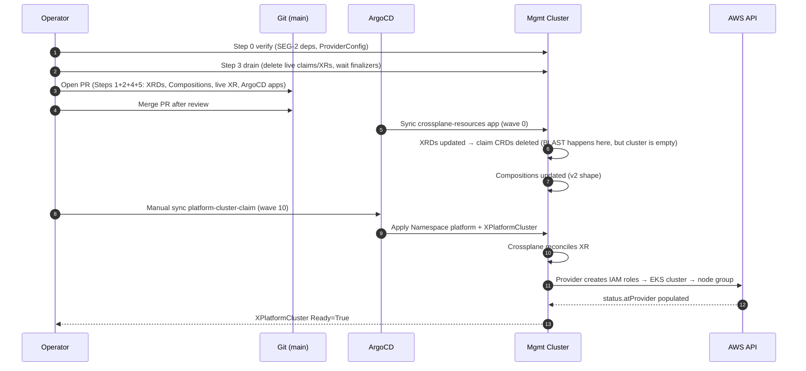
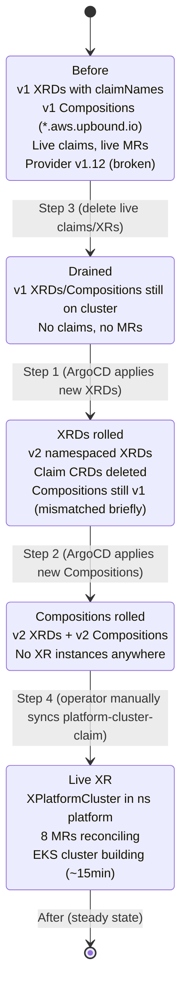
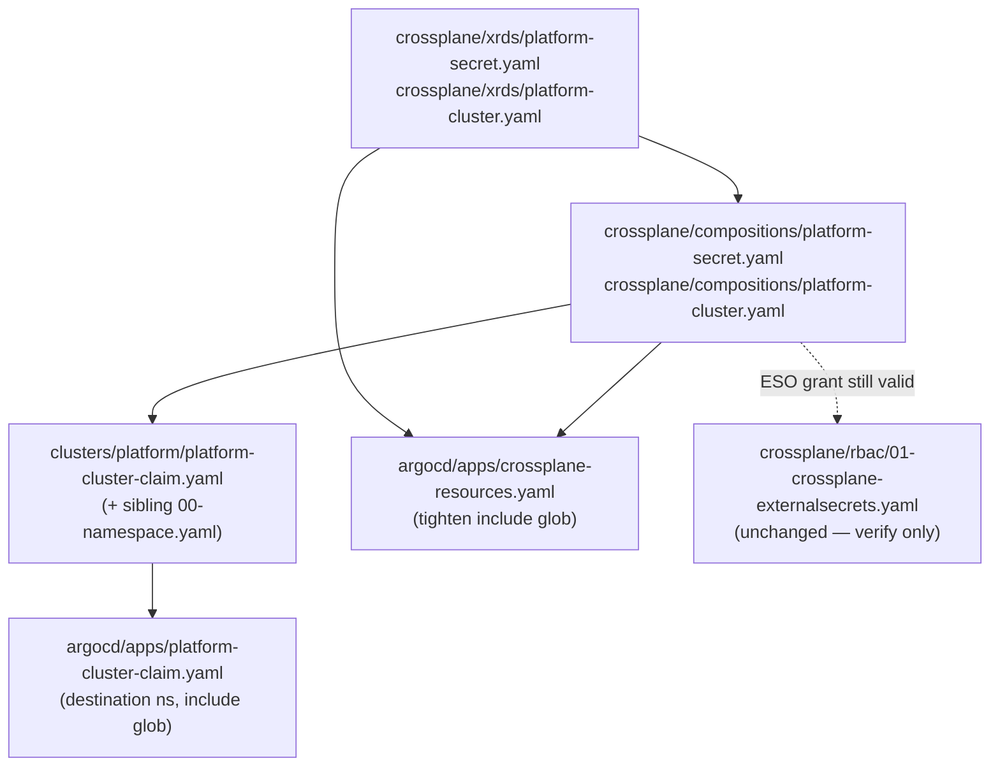

# 20 — SEG-1 Plan: Production manifest migration

**Author:** opus planner (initial draft)
**Status:** PRE-REVIEW
**Dependencies:** SEG-2 (IRSA / DeploymentRuntimeConfig SA-name pin must work under provider v2.5.4 before any claim can reconcile against AWS)

---

## 1. Scope summary

- Rewrite both XRDs (`crossplane/xrds/platform-{secret,cluster}.yaml`) from the v1 `CompositeResourceDefinition + claimNames` shape to the v2 namespaced model (`spec.scope: Namespaced`, no `claimNames`, no `connectionSecretKeys` for `platform-cluster`).
- Rewrite both Compositions (`crossplane/compositions/platform-{secret,cluster}.yaml`): API group rename (`*.aws.upbound.io` → `*.aws.m.upbound.io`), strip `deletionPolicy: Delete` (9 occurrences total), add `kind: ClusterProviderConfig` to every `providerConfigRef` (9 occurrences total), remove `writeConnectionSecretsToNamespace`, rewrite the two `spec.claimRef.*` patches in `platform-secret.yaml` (the claim-ref construct no longer exists on a namespaced XR).
- Replace `clusters/platform/platform-cluster-claim.yaml` from `kind: PlatformCluster` (claim) to `kind: XPlatformCluster` (namespaced XR) in a real namespace (`platform`, not `default`).
- Update the two affected ArgoCD `Application` manifests (`argocd/apps/crossplane-resources.yaml`, `argocd/apps/platform-cluster-claim.yaml`) for any path/destination changes and to stop recursing into `xrds/*/render-fixtures/` (a pre-existing bug surfaced by this migration).
- Leave RBAC (`crossplane/rbac/01-crossplane-externalsecrets.yaml`) untouched — the grant on `external-secrets.io/externalsecrets` is unaffected by the v2 group rename (ESO is not an Upbound provider).

Out of scope: Terraform/IRSA (SEG-2), test infra (SEG-3), tool regen (SEG-4), in-flight PR reconciliation (SEG-5), `crossplane/claims/example-*.yaml` (operator-only docs — owned by SEG-3 alongside chainsaw fixtures), Kyverno policy under `crossplane/policies/09-platform-secret-namespace-allowed.yaml` (logic gap, not a v2 break — flagged in §3).

---

## 2. Migration approach (step-by-step)

The single hard constraint: when the XRD `claimNames` block is removed, the auto-generated claim CRDs (`PlatformSecret`, `PlatformCluster` in `platform.k8-platform.io`) are deleted cluster-wide. Every existing claim object is orphaned at that instant. The plan therefore stages the manifest edits in one PR but sequences the live-cluster cutover in three controlled phases.

### Step 0 — Prerequisite gates (verify, don't change)

- SEG-2 has merged: `terraform apply` reports `Healthy=True` AND `Installed=True` on `provider-family-aws`, `provider-aws-secretsmanager`, and Crossplane core is `2.3.x`.
- A `ClusterProviderConfig` named `default` exists on the management cluster under `aws.m.upbound.io/v1beta1` (created by SEG-2 or by an operator one-liner — confirm before starting). Without it every MR will block on `cannot find ProviderConfig`.
- PR #98 (version bump) is merged.

**Verify:** `kubectl get providers.pkg.crossplane.io -o wide` shows `HEALTHY=True INSTALLED=True` for both providers; `kubectl get clusterproviderconfigs.aws.m.upbound.io default` returns the object.

### Step 1 — Edit XRDs to v2 namespaced shape

**Files:** `crossplane/xrds/platform-secret.yaml`, `crossplane/xrds/platform-cluster.yaml`.

For both XRDs:
- Keep `apiVersion: apiextensions.crossplane.io/v1` (Crossplane v2 still serves `apiextensions.crossplane.io/v1` for XRDs; the v2 surface adds `spec.scope` and removes `claimNames`).
- Add `spec.scope: Namespaced` (immediately under `spec.group`).
- Delete the `claimNames:` block entirely (lines 26-30 of `platform-secret.yaml`; lines 38-43 of `platform-cluster.yaml`).
- Keep `defaultCompositionRef`, `versions[*].schema` (the OpenAPI schemas are unchanged — no field rename, no type change).
- For `platform-cluster.yaml` only: keep `connectionSecretKeys` — v2 still honours these on namespaced XRs that emit connection details.

The metadata name (`xplatformsecrets.platform.k8-platform.io`) and `names.kind: XPlatformSecret` are unchanged, so the `XPlatformSecret`/`XPlatformCluster` CRD itself is **updated in place** (added `scope: Namespaced` on the generated CRD) — it is not recreated. **Existing XR objects survive the update.** What is deleted: the `PlatformSecret` and `PlatformCluster` claim CRDs auto-generated from the now-removed `claimNames` blocks.

**Live-cluster effect:** As soon as ArgoCD applies the updated XRD, the claim CRDs vanish. Any claim objects on the cluster become orphaned (the underlying XRs and AWS resources are preserved by Crossplane's finalizer + cross-resource refs, but the claim object's API kind is gone).

**Verify after:**
- `kubectl get xrd xplatformsecrets.platform.k8-platform.io -o jsonpath='{.spec.scope}'` → `Namespaced`.
- `kubectl get crd xplatformsecrets.platform.k8-platform.io -o jsonpath='{.spec.scope}'` → `Namespaced`.
- `kubectl get crd platformsecrets.platform.k8-platform.io` → `NotFound` (expected; the claim CRD is gone).
- XRD `Established=True` and `Offered=True` (or only `Established` in v2 — `Offered` is the claim-CRD condition and may stop being reported).

### Step 2 — Edit Compositions to v2 shape

**Files:** `crossplane/compositions/platform-secret.yaml`, `crossplane/compositions/platform-cluster.yaml`.

Per-Composition edits (same shape, two files):

| Concern | v1 (current) | v2 (target) |
|---|---|---|
| `spec.writeConnectionSecretsToNamespace` | `crossplane-system` | **delete the field**. Namespaced XR's connection secret lands in the XR's namespace by default; for `platform-cluster` we instead use `spec.writeConnectionSecretsToNamespace`'s v2 replacement: nothing — the XR author sets `spec.writeConnectionSecretToRef.name` on the XR itself (covered in step 4 for the live claim). |
| MR `apiVersion` | `secretsmanager.aws.upbound.io/v1beta1`, `iam.aws.upbound.io/v1beta1`, `eks.aws.upbound.io/v1beta1` | `secretsmanager.aws.m.upbound.io/v1beta1`, `iam.aws.m.upbound.io/v1beta1`, `eks.aws.m.upbound.io/v1beta1` (insert `.m.` infix) |
| MR `spec.deletionPolicy: Delete` | present (9×) | **delete the line** (9×) |
| MR `spec.providerConfigRef` | `name: default` (2 lines) | `kind: ClusterProviderConfig`<br>`name: default` (3 lines, 9×) |
| `connectionDetails[*].fromConnectionSecretKey` references | n/a in these files | n/a — not used here |

`platform-secret.yaml` additional concerns (the claim-ref rewrite):

- Lines 121-123, 129-131, 134-136 patch from `spec.claimRef.name`, `spec.claimRef.namespace`, `spec.claimRef.name` (claim's name → ExternalSecret name; claim's namespace → ExternalSecret namespace). In v2 there is no `claimRef` on the XR (the XR is itself namespaced, in the namespace the operator/consumer created it in).
  - Rewrite to: `fromFieldPath: metadata.name` (XR's own name) and `fromFieldPath: metadata.namespace` (XR's own namespace).
  - Resulting ExternalSecret lives in the same namespace as the XR. This was the intent of the v1 code; the v1 path was forced because v1 XRs were cluster-scoped so they had to look at `claimRef.namespace` to find the right namespace. v2 simplifies this.

`platform-cluster.yaml` additional concerns:

- The Composition does not use `claimRef.*` patches (it derives names from `spec.name`). No patch rewrites required beyond the API-group / deletionPolicy / providerConfigRef edits.
- The `roleArnSelector.matchControllerRef: true` (and `clusterNameSelector`, `nodeRoleArnSelector`) selectors work identically on v2 namespaced composition — `matchControllerRef` matches by the owning XR's UID. Unchanged.

**Live-cluster effect:** ArgoCD SSA-applies the updated Composition. With strict v2 decoding the rejected v1 fields (`deletionPolicy`, bare `providerConfigRef`, `writeConnectionSecretsToNamespace`) are now absent. The Composition is `Healthy`/`Established`. No XR/MR objects are touched until a fresh reconcile fires — which it will, immediately, because the Composition's `metadata.generation` bumps. Existing MRs of the old `*.aws.upbound.io` group are now strangers to the new Composition (different `apiVersion` in the base). Crossplane will not delete them (no owner-ref change), but it will create the v2-group equivalents on next reconcile, leading to duplicate AWS resources unless the XRs themselves are absent.

**This is the BLAST moment.** It is mandatory that no live XR exists in the cluster at the time the updated Composition is applied. Mitigation: before the cutover PR merges, scrub the cluster (step 3).

**Verify after:**
- `kubectl get compositions platform-secret-aws platform-cluster-aws -o yaml | grep -E "deletionPolicy|writeConnectionSecretsToNamespace"` → empty.
- `crossplane render <fixture-XR> <composition> <function>` (locally) returns 2 resources for `platform-secret` and 8 for `platform-cluster`, all under `*.aws.m.upbound.io`.

### Step 3 — Drain existing live XRs and claims

Before merging the PR that applies steps 1+2 to the live cluster:

1. `kubectl get platformsecrets,xplatformsecrets,platformclusters,xplatformclusters -A -o wide` — inventory.
2. For each live claim/XR found, decide: `delete` (no longer needed; allow Crossplane finalizer to tear down AWS) or `import` (re-create as v2 namespaced XR after cutover with `crossplane.io/external-name` annotation set so the v2 MR adopts the existing AWS resource — full import procedure out of scope here, flagged in §3).
3. Delete every chosen-for-deletion claim/XR, wait for Crossplane finalizers to drain (`kubectl wait --for=delete ...`).
4. Confirm `kubectl get managed -A | grep aws.upbound.io` → empty.

**Verify after:** no `platform.k8-platform.io` objects of any kind on the cluster; no `aws.upbound.io/*` managed resources.

### Step 4 — Replace `clusters/platform/platform-cluster-claim.yaml` with a namespaced XR

**File:** `clusters/platform/platform-cluster-claim.yaml`.

Replace top-of-file:

```yaml
apiVersion: platform.k8-platform.io/v1alpha1
kind: XPlatformCluster              # was: PlatformCluster
metadata:
  name: platform
  namespace: platform               # was: default — use a dedicated ns
spec:
  # ... unchanged schema body (name, region, version, vpc, nodeGroup)
  writeConnectionSecretToRef:       # NEW — was implicit via XRD wConSTN
    name: platform-cluster-kubeconfig
```

The `platform` namespace must exist before this object lands. Add a one-document prefix to the same file (or to a sibling `00-namespace.yaml`):

```yaml
apiVersion: v1
kind: Namespace
metadata:
  name: platform
---
```

Sibling-file is cleaner — the ArgoCD `include:` glob in `argocd/apps/platform-cluster-claim.yaml` (currently `platform-cluster-claim.yaml`) must be widened to `'*.yaml'` or `'{00-namespace.yaml,platform-cluster-claim.yaml}'`.

**Verify after:**
- `kubectl get ns platform` exists.
- `kubectl get xplatformcluster.platform.k8-platform.io -n platform platform` returns the object.
- Manually `argocd app sync platform-cluster-claim` (the Application is intentionally manual-sync per its own header comment) and watch `kubectl get managed -n platform -w` for the 8 MRs to appear.

### Step 5 — Tighten ArgoCD apps

**File:** `argocd/apps/crossplane-resources.yaml`.

- The `include:` glob `'{xrds/*.yaml,compositions/*.yaml,policies/*.yaml,rbac/*.yaml}'` combined with `recurse: true` inadvertently picks up `crossplane/xrds/platform-secret/render-fixtures/input.yaml` and `crossplane/xrds/platform-cluster/render-fixtures/input.yaml` because `recurse` descends into subdirs and `xrds/*.yaml` matches by basename. Under v2 these fixture files would be applied as live XR objects in `crossplane-system`, which is wrong and (because the fixtures use `claimRef`, a v1 field) would fail strict decoding.
- Change `recurse: true` to `recurse: false` AND keep `include: '{xrds/*.yaml,compositions/*.yaml,policies/*.yaml,rbac/*.yaml}'`. With `recurse: false`, only the top-level files in each named subdirectory match — and they don't, because the glob is rooted at `path: crossplane`, so we must instead change the glob.
- Concrete fix: keep `recurse: true`, replace the include with `'{xrds/platform-*.yaml,compositions/*.yaml,policies/*.yaml,rbac/*.yaml}'` so that `xrds/<dir>/render-fixtures/input.yaml` is excluded (`xrds/platform-*.yaml` matches only direct children of `xrds/`).

**File:** `argocd/apps/platform-cluster-claim.yaml`.

- Update the `destination.namespace` to `platform` (matches the new XR namespace).
- Update `directory.include` to `'{00-namespace.yaml,platform-cluster-claim.yaml}'` if a sibling namespace file is added.
- Sync wave stays `"10"` — XRD must be Established (wave 0) before XR object lands.

**Verify after:** `argocd app get crossplane-resources -o json | jq '.status.sync.status'` → `Synced`; no `XPlatformSecret`/`XPlatformCluster` instances accidentally created from fixture files.

### Step 6 — RBAC pass-through verification

**File:** `crossplane/rbac/01-crossplane-externalsecrets.yaml` — **no edits.** The grant targets `external-secrets.io` (ESO), not `*.aws.upbound.io`. The `crossplane` SA in `crossplane-system` still composes the ExternalSecret on a namespaced XR in v2, and the SSA call still flows through the same SA. Verify with:

- `kubectl auth can-i create externalsecrets.external-secrets.io --as=system:serviceaccount:crossplane-system:crossplane -n <any-ns>` → `yes`.

### Migration sequence (mermaid)



### Cluster state transitions



### File-change DAG



---

## 3. Open questions

These need architectural input before execution. The plan above commits to ONE primary approach per item; alternatives listed for the reviewer.

1. **(BIG) Adoption vs. recreate for any pre-existing live PlatformCluster.** The plan assumes Step 3 drain is acceptable — i.e. we tear down whatever EKS cluster the v1 claim provisioned and let Step 4 build a new one. If a real environment has a running platform cluster that cannot be destroyed (workloads on it), we instead need an import path: re-create the XR as v2 with `crossplane.io/external-name` annotations on each composed MR pointing at the existing AWS resource ARNs, and add `Observe`-only deletion-policy semantics (now driven by `managementPolicies`, not the removed `deletionPolicy`). The full import procedure (per-MR external-name mapping, ordering, finalizer dance) is substantial and is left as an explicit prompt for the architect. *Primary commitment: drain-and-recreate. Alternative: full import.*

2. **ClusterProviderConfig vs. namespaced ProviderConfig.** v2 offers both. `ClusterProviderConfig` is cluster-scoped (parity with v1's `ProviderConfig`); namespaced `ProviderConfig` lets each namespace pin its own AWS auth. The plan picks `ClusterProviderConfig` because we have exactly one AWS auth path (IRSA on the management cluster) and there is no per-namespace AWS auth boundary. Architect: confirm we don't want namespaced isolation for future multi-tenancy.

3. **`writeConnectionSecretsToNamespace` removal — where does the kubeconfig secret land?** v1 wrote `platform-cluster` connection secrets to `crossplane-system`. v2 writes them to the XR's namespace by default; the plan moves the XR to namespace `platform` and sets `writeConnectionSecretToRef.name: platform-cluster-kubeconfig`. Architect: confirm consumers (Phase 3 ApplicationSet) read the kubeconfig from `platform/platform-cluster-kubeconfig` and not from `crossplane-system/...`.

4. **Render-fixture files inside `crossplane/xrds/<name>/render-fixtures/`.** The plan tightens the ArgoCD include glob to exclude them. An alternative is to move the fixtures out of `crossplane/` entirely (e.g. to `tests/fixtures/render/`), removing the ArgoCD-include risk by structure rather than glob. SEG-4 (tooling regen) may want to do this anyway. Flagged for cross-segment coordination.

5. **`crossplane/policies/09-platform-secret-namespace-allowed.yaml` Kyverno policy.** After XRD migration, `kind: PlatformSecret` no longer exists; the policy silently no-ops. Should the policy be (a) updated to match `XPlatformSecret`, (b) reframed as an RBAC restriction (forbid `XPlatformSecret` create in disallowed namespaces), or (c) deleted as no-longer-needed because v2's namespaced XR model is itself the namespace boundary? *Primary commitment: defer to a follow-up PR (out of SEG-1).* Architect should pick (a/b/c) so we can file the follow-up.

6. **`function-patch-and-transform` version + input apiVersion.** The current Composition uses `apiVersion: pt.fn.crossplane.io/v1beta1` for the function input. v0.10.6 still serves this version, but it may also serve `v1`. Plan keeps `v1beta1` to minimise diff; architect can override.

---

## 4. Failure recovery

| Step | Failure mode | Recovery |
|---|---|---|
| 0 | ClusterProviderConfig missing | Apply a one-document `ClusterProviderConfig` (cluster-scoped) before merging the PR. No code rollback needed. |
| 1 | XRD update rejected by API server (e.g. typo, schema validation failure) | ArgoCD reports `SyncFailed`. The old XRD remains in place. Revert the XRD commit, push, re-sync. **No data loss** — claim CRDs only disappear once the new XRD is accepted. |
| 1 | XRD update accepted, claim CRDs vanish, **but the cluster was not actually drained** (Step 3 was skipped) | Orphaned claims persist as resources without a CRD. They are invisible to `kubectl get platformsecrets` but still occupy storage. Recovery: list with `kubectl get --raw /apis/platform.k8-platform.io/v1alpha1/namespaces/<ns>/platformsecrets` (won't work — CRD is gone). Reality: the etcd objects are pruned by the apiserver when their CRD is deleted; finalizers may block. If stuck, edit each object's finalizers via `kubectl patch --raw`. **Prevention beats cure**: gate the merge on the Step-3 inventory being empty. |
| 2 | Composition update rejected (strict decode error) | ArgoCD `SyncFailed`. Old Composition still on cluster. The new v2 XRDs are now bound to no working Composition — no new XRs can reconcile, but none exist (Step 3 cleared them), so no harm. Fix the Composition manifest, push, re-sync. |
| 2 | Composition accepted but renders MRs that admission rejects | XR shows `cannot compose resources: <reason>`. Inspect with `crossplane beta trace xplatformcluster/<name>`. Most likely cause: missed `.m.` rename on one resource. Fix in git, sync. |
| 3 | Finalizer hang on claim/XR delete | `kubectl patch <obj> -p '{"metadata":{"finalizers":[]}}' --type=merge`. Underlying AWS resources may be orphaned — clean up in console / via `aws` CLI. |
| 4 | XPlatformCluster never reaches Ready | Run `crossplane beta trace`; if IRSA failure (AccessDenied on AWS calls), this is SEG-2 territory — revert Step 4 commit, leave XRDs+Compositions in place (they are v2-clean and harmless without an XR). |
| 5 | ArgoCD app sync error after include-glob change | Revert just the ArgoCD-app commit; manifests under `crossplane/` continue to be served by the previous glob. |

**Global rollback.** Steps 1–5 are committed as a single PR. If catastrophic failure: `git revert` the merge commit, push, ArgoCD re-syncs to v1 manifests. The v1 manifests require provider v1.12 to work — provider v2.5.4 will reject the v1 Composition (admission error on `*.aws.upbound.io` CRDs not existing). So `git revert` alone does NOT restore service; it merely stops the bleeding. True restoration requires either rolling back PR #98 (provider downgrade) too, or rolling forward with a manifest fix. **Recommendation: roll forward; the v1 provider line is unmaintained and rolling back PR #98 reproduces the original symptom that motivated all of this.**

---

## 5. Hot files (touched by multiple steps)

| File | Touched by steps | Why |
|---|---|---|
| `crossplane/xrds/platform-secret.yaml` | 1 | Single edit (XRD shape) |
| `crossplane/xrds/platform-cluster.yaml` | 1 | Single edit (XRD shape) |
| `crossplane/compositions/platform-secret.yaml` | 2 | Single edit (API group + deletionPolicy + providerConfigRef + claimRef rewrite + wConSTN removal — 5 concerns in one file) |
| `crossplane/compositions/platform-cluster.yaml` | 2 | Single edit (API group ×8 resources + deletionPolicy ×8 + providerConfigRef ×8 + wConSTN removal — 25 concrete line edits in one file; high diff density, primary risk for typo-induced admission failures) |
| `clusters/platform/platform-cluster-claim.yaml` | 4 | kind change, namespace change, writeConnectionSecretToRef addition |
| `argocd/apps/crossplane-resources.yaml` | 5 | include-glob tighten (prevents render-fixture leak) |
| `argocd/apps/platform-cluster-claim.yaml` | 5 | destination namespace + include glob |
| `crossplane/rbac/01-crossplane-externalsecrets.yaml` | 6 | **No edit** — verified only |

**Highest-diff-density file: `crossplane/compositions/platform-cluster.yaml` (~25 mechanical edits across 8 resource templates). Primary review focus.**

---

## 6. Cross-segment dependencies

**Before SEG-1 can execute:**
- **SEG-2** must complete and verify that under provider v2.5.4 the IRSA SA-name pin still works (DeploymentRuntimeConfig override is honoured). Without this, every MR created by SEG-1's new Compositions will fail with `AccessDenied`, and we'll mis-diagnose the failure as a SEG-1 manifest bug.
- **SEG-2** must (or an operator must) create a `ClusterProviderConfig` named `default` under `aws.m.upbound.io/v1beta1`. SEG-1's Compositions reference it; without it every MR blocks.

**After SEG-1 merges:**
- **SEG-3** (test infra) can regenerate chainsaw fixtures against v2-shaped Compositions. SEG-3 also owns the `crossplane/claims/example-*.yaml` rewrite (claim → XR) since those files are referenced by integration tests.
- **SEG-4** (tooling regen) can re-fetch CRD schemas with `fetch-crds-for-kubeconform.sh`, regenerate `crossplane-trace` fixtures, regenerate golden files. SEG-4 cannot start meaningfully until the v2 CRDs are installed on a cluster, which happens at SEG-1 merge.
- **SEG-5** (in-flight PR reconciliation) needs to rebase PRs #91/#94/#97 onto the SEG-1 main and convert any v1 API-group references in those PRs.

**Concurrent:**
- The `function-patch-and-transform` version bump (PR #98) is fully orthogonal and already in flight.

---

## 7. Estimated execution time

| Phase | Wall clock | Human attention |
|---|---|---|
| Step 0 verify gates | 10 min | 10 min (one operator at terminal) |
| Step 3 drain (assuming 0–2 live XRs) | 5–30 min (finalizer wait) | 5 min |
| Author the PR (Steps 1, 2, 4, 5 edits) | 60 min | 60 min |
| Code review + adversarial review by 2 subagents | 30 min | 15 min |
| Merge + ArgoCD sync of crossplane-resources | 5 min | 5 min (watch sync) |
| Manual sync of platform-cluster-claim + EKS provision | 20 min | 5 min (kick sync, walk away, return) |
| Verify chainsaw on fresh AWS account (SEG-3 handoff) | n/a in SEG-1 | n/a |

**SEG-1 total wall clock: ~2.5 hours including a clean EKS provision. SEG-1 total human attention: ~1.5 hours.**

Risks that blow the budget: a single typo in the platform-cluster Composition (25 mechanical edits) cascading into 8 separate MR admission errors that have to be fixed one-by-one across multiple sync cycles. Mitigation: render the Composition locally with `crossplane render` against a fixture XR BEFORE pushing, not just after.
