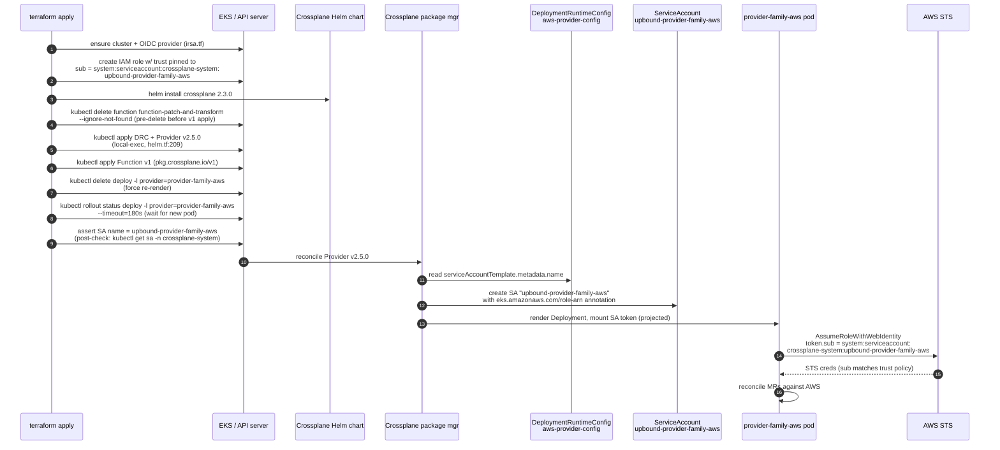

# 20 — SEG-2 Plan: Terraform infrastructure + IRSA

**Author:** opus planner (initial draft); revised post-review-R1
**Status:** POST-REVIEW-R1
**Dependencies:** PR #98 merged (amended to v2.5.0); SEG-1 awaits this

## 1. Scope summary

This segment owns everything Terraform applies for the Crossplane v1→v2
migration, plus the manifest heredocs Terraform produces:

- `terraform/management/variables.tf` — three version-string pins
  (`crossplane_provider_family_aws_version` → **v2.5.0**,
  `crossplane_provider_aws_secretsmanager_version` → **v2.5.0**,
  `crossplane_function_patch_and_transform_version` → `v0.10.6`).
  PR #98 must be amended to use v2.5.0 (see Step 0).
- `terraform/management/helm.tf` — the
  `locals.crossplane_aws_provider_manifest` heredoc
  (DeploymentRuntimeConfig + Provider) at L173–207; the
  `terraform_data.crossplane_function_patch_and_transform` block at
  L255–278 whose embedded Function manifest uses the wrong apiVersion
  (`pkg.crossplane.io/v1beta1`) for Crossplane v2.
- `terraform/management/irsa.tf` — `module.irsa_crossplane` at L89–105,
  trust-policy pin
  `"crossplane-system:upbound-provider-family-aws"`.
- `versions.env` (top of repo) and `tests/chainsaw/versions.env` —
  ensure no stale `v1.x` pins leak back in via merge.
- `terraform/management/terraform.tfvars.example` — stale doc-only
  drift (`crossplane_version = "2.0.1"`,
  `crossplane_provider_family_aws_version = "v1.12.0"`); fix for
  hygiene but not on the critical path.

**Out of scope:** Crossplane k8s manifests under `crossplane/` (SEG-1);
test harness (SEG-3); fixture / kubeconform-schema regen (SEG-4); PR
reconciliation (SEG-5).

### Sequence diagram — terraform apply → IRSA token exchange



If the DRC SA-name override is silently ignored, step 12 creates a SA
named `upbound-provider-aws-<hash>` instead, step 15's sub-claim no
longer matches the trust policy from step 2, and STS returns
`AccessDenied` on every MR reconcile.

## 2. Migration approach (step-by-step)

The single load-bearing question — **does v2.5.0 honour
`serviceAccountTemplate.metadata.name`?** — has documentary evidence
that it does. From the Crossplane v2.3 Providers docs (verified via
WebFetch on `docs.crossplane.io/latest/packages/providers/`):

> "Setting the `serviceAccountTemplate.metadata.name` field will
> override the name of service account created by the package manager
> and used in the provider deployment."

The doc adds a caveat — Crossplane will own that SA and the override is
"strongly discouraged" because of cross-package conflicts — but the
mechanism is preserved. Upbound's own IRSA guide
(`docs.upbound.io/manuals/packages/providers/aws-auth/aws-irsa/`)
confirms the default SA name in v2 is `upbound-provider-aws-<hash>`
(hash-suffixed) and recommends either a wildcard
(`StringLike` on `upbound-provider-aws-*`) **or** the DRC pin we
already use. We are using the second pattern; it remains valid.

**Known-fragile:** The DRC SA-name override is upstream-flagged as
potentially conflicting if the SA is reused across packages. This is
acceptable here (single family provider), but if the override is ever
dropped the IRSA trust policy in `irsa.tf:98` must be updated in the
same PR. The fallback (pre-create a stable SA, use
`deploymentTemplate.spec.template.spec.serviceAccountName`) is the
Upbound-recommended alternative for production hardening; defer unless
path (b) fires.

Conclusion: **path (a) from the hard rules applies — the simple
version bump is enough for IRSA, but we still owe two manifest-shape
fixes inside the terraform heredocs.**

### Step 0 — amend PR #98 to use v2.5.0 (not v2.5.4)

PR #98 (branch `claude/bump-crossplane-providers-v2`) pinned v2.5.4.
The pre-committed cross-segment decision is **v2.5.0**. Before merging
PR #98, amend its `variables.tf` defaults:

```
crossplane_provider_family_aws_version          = "v2.5.0"
crossplane_provider_aws_secretsmanager_version  = "v2.5.0"
```

Push the amendment to the PR branch. All subsequent steps in this plan
use v2.5.0.

### Step 1 — confirm version pins land (PR #98 amended to v2.5.0)

- `variables.tf` defaults: `v2.5.0`, `v2.5.0`, `v0.10.6`, chart
  `2.3.0`. Verify after the amendment.
- `versions.env` (top of repo) contains only `KUBECONFORM_VERSION`;
  no Crossplane pins live there, so nothing to bump. (The earlier
  prompt's note that `versions.env` carries the Crossplane pin is
  incorrect — that file is for CI-tool pins; the cluster-runtime
  pins live exclusively in `variables.tf`.) Document this in the
  PR so reviewers don't expect a second touch-up.
- `tests/chainsaw/versions.env` is SEG-3's concern; flag for them.

### Step 2 — fix the Function apiVersion in helm.tf (pre-delete first)

`terraform_data.crossplane_function_patch_and_transform`
(helm.tf:255–278) currently emits:

```yaml
apiVersion: pkg.crossplane.io/v1beta1
kind: Function
```

**Correction (R1B):** `Function.pkg.crossplane.io/v1` was promoted on
the v1.x Crossplane line (present as early as v1.17.1) — it is NOT a
v2.3 promotion. On Crossplane v2.3 the v1beta1 apiVersion is **not a
served version** — there is no conversion webhook, so the current
heredoc applying v1beta1 will fail with `no matches for kind "Function"
in version "pkg.crossplane.io/v1beta1"` on any fresh v2 cluster. The
edit to v1 is mandatory, not precautionary.

**Sequencing fix (R1A):** Do NOT rely on a conversion webhook to handle
the existing v1beta1 Function object on upgrade. Pre-delete it
unconditionally before re-applying as v1. Add this line to the
`local-exec` command in `helm.tf` **before** the Function apply:

```bash
kubectl delete function function-patch-and-transform --ignore-not-found
```

Then apply the corrected form:

```yaml
apiVersion: pkg.crossplane.io/v1
kind: Function
metadata:
  name: function-patch-and-transform
spec:
  package: xpkg.upbound.io/crossplane-contrib/function-patch-and-transform:v0.10.6
```

Add `var.crossplane_function_patch_and_transform_version` to the
`triggers_replace` list (it is already there) so the bump to v0.10.6
re-applies the Function. Also bump the `triggers_replace` sentinel
string so the delete-then-apply sequence runs on this deploy even if
only the apiVersion changed (the version variable didn't change).

This eliminates the rollback window that §4 originally listed as a
contingency — pre-delete costs one line and removes a hard-fail path.

Open question 2 from the original draft is now resolved: verify
v1beta1 is NOT served on Crossplane v2.3 (expected: confirmed), and
confirm the current Terraform path actually fails before the bump on a
fresh v2 cluster so the bug is reproduced before the fix is tested.

### Step 3 — leave the DRC + Provider heredoc alone in this PR

`locals.crossplane_aws_provider_manifest` (helm.tf:173–207) is
correct for v2:

- `pkg.crossplane.io/v1beta1` `DeploymentRuntimeConfig` — still the
  current GA API in v2.3.
- `pkg.crossplane.io/v1` `Provider` — unchanged across v1/v2.
- `serviceAccountTemplate.metadata.name: upbound-provider-family-aws`
  — verified to override the package-manager default in v2 (see
  evidence above). Known-fragile per Step 2 preamble.
- `runtimeConfigRef` pointing at the DRC — supported.

Update the package URL to use v2.5.0 (aligned with Step 0 / Step 1):

```yaml
spec:
  package: xpkg.upbound.io/upbound/provider-family-aws:v2.5.0
```

### Step 3a — add rollout-status wait + SA post-check after delete-deploy

The `kubectl delete deploy -l ...provider=provider-family-aws` hack
(helm.tf:242–244) is fire-and-forget (`--wait=false || true`). This
races the package manager: the new pod may come up before the old
hash-suffixed SA is garbage-collected; both SAs may briefly coexist, and
if the package manager re-creates the hash-suffixed SA after the DRC
apply (watch lag), the pod mounts the wrong token.

After the delete-deploy line, add:

```bash
kubectl rollout status deployment \
  -l pkg.crossplane.io/provider=provider-family-aws \
  -n crossplane-system \
  --timeout=180s

# Post-check: verify the package manager created the named SA
SA=$(kubectl get sa -n crossplane-system \
  upbound-provider-family-aws \
  -o jsonpath='{.metadata.name}' 2>/dev/null || echo "MISSING")
if [ "$SA" != "upbound-provider-family-aws" ]; then
  echo "ERROR: expected SA upbound-provider-family-aws, got: $SA"
  exit 1
fi
```

This turns a silent IRSA misconfiguration into a hard terraform apply
failure caught in CI rather than surfaced as `AccessDenied` during
chainsaw.

### Step 4 — leave irsa.tf alone

`module.irsa_crossplane` (irsa.tf:89–105) pins the trust policy to
`system:serviceaccount:crossplane-system:upbound-provider-family-aws`.
Because the DRC pin (step 3) continues to be honoured, the SA name on
the cluster will match this trust policy verbatim. **No change
required** to the IRSA module.

Contingency (path (b) from the hard rules): if a post-apply check
reveals the SA is actually `upbound-provider-aws-<hash>` despite the
DRC pin, switch `irsa.tf:98` to either:

- `["crossplane-system:upbound-provider-family-aws",
   "crossplane-system:upbound-provider-aws-*"]` — but the
  `iam-role-for-service-accounts-eks` module emits `StringEquals` on
  the OIDC sub, not `StringLike`, so the wildcard pattern would need a
  hand-written trust policy.
- The cleaner fallback is to drop the DRC SA-name pin entirely, let
  the default `upbound-provider-aws-<hash>` SA exist, and adopt the
  `deploymentTemplate.spec.template.spec.serviceAccountName` pattern
  Upbound recommends — pre-create a stable SA (via a new
  `terraform_data` `kubectl apply`) and reference it. This requires
  more plumbing; only execute if step 3a post-check proves the override
  ineffective.

### Step 5 — confirm no ProviderConfig is generated by terraform

Already true (see doc 12 §"ProviderConfig generation paths"). The
`default` ProviderConfig is created only by the chainsaw harness, not
by terraform. The v2 requirement that `providerConfigRef` carry
`kind: ClusterProviderConfig` is **SEG-1's** problem (it touches the
Composition manifests under `crossplane/`). Document the dependency
and move on; no terraform change needed.

### Step 5a — audit Helm chart `--set` args against v2.3

`helm.tf:152–161` passes the following args to Crossplane 2.3.0:

```
--enable-realtime-compositions=false
--enable-ssa-claims=false
--enable-custom-to-managed-resource-conversion=false
```

**These flags are unverified against the v2.3 chart.** Before marking
this block NOOP, run:

```bash
helm show values crossplane-stable/crossplane --version 2.3.0 \
  | grep -E 'realtimeCompositions|ssaClaims|customToManaged|realtime|ssa|managed.resource'
```

Or check the full values list for matching keys. If any flag name has
been renamed or removed, Helm will either silently ignore it or
hard-fail at install time. Confirm each flag is a valid v2.3 chart
value and document the result in the PR. Flag any deprecated flags to
SEG-5 for cleanup.

### Step 6 — verification step (insurance against the load-bearing unknown)

Before merging this PR, run a one-off local kind-cluster smoke to
prove the DRC override works for v2.5.0.

**IRSA limitation (R1A):** kind has no OIDC issuer. This probe can
verify only SA naming — it cannot verify the IRSA annotation round-trip
or STS token exchange. Do NOT claim the probe validates IRSA end-to-end.
IRSA correctness is validated by the first real `terraform apply` against
EKS, and by the `[management] e2e-verify` CI step.

```bash
# laptop-side, ~10 minutes
kind create cluster --name crossplane-v2-saname-probe
helm repo add crossplane-stable https://charts.crossplane.io/stable
helm install crossplane crossplane-stable/crossplane \
  --version 2.3.0 --namespace crossplane-system --create-namespace

# Verify v1beta1 Function is NOT served (confirm R1B finding)
kubectl api-resources | grep -i function

# Apply DRC + Provider (using v2.5.0)
kubectl apply -f - <<'YAML'
apiVersion: pkg.crossplane.io/v1beta1
kind: DeploymentRuntimeConfig
metadata: { name: aws-provider-config }
spec:
  serviceAccountTemplate:
    metadata:
      name: upbound-provider-family-aws
---
apiVersion: pkg.crossplane.io/v1
kind: Provider
metadata: { name: provider-family-aws }
spec:
  package: xpkg.upbound.io/upbound/provider-family-aws:v2.5.0
  runtimeConfigRef:
    apiVersion: pkg.crossplane.io/v1beta1
    kind: DeploymentRuntimeConfig
    name: aws-provider-config
YAML

# wait for INSTALLED=True HEALTHY=True (~3-5 min)
kubectl wait provider provider-family-aws --for=condition=Installed --timeout=300s
kubectl wait provider provider-family-aws --for=condition=Healthy --timeout=300s

# Simulate the delete-deploy cycle (as terraform does it)
kubectl delete deploy \
  -l pkg.crossplane.io/provider=provider-family-aws \
  -n crossplane-system --ignore-not-found

kubectl rollout status deployment \
  -l pkg.crossplane.io/provider=provider-family-aws \
  -n crossplane-system --timeout=180s

# Verify SA name
kubectl get sa -n crossplane-system
# PASS: SA named exactly "upbound-provider-family-aws" exists
# FAIL: only "upbound-provider-aws-<hash>" exists → invoke path (b)

# Confirm old hash-suffixed SA was GC'd (not still present)
kubectl get sa -n crossplane-system | grep upbound-provider-aws

# NOTE: No OIDC issuer in kind — IRSA annotation round-trip NOT tested here.
# IRSA validation is deferred to first EKS apply (CI: [management] e2e-verify).
```

Cost: ~10 min wall, zero AWS. Document the result (pass/fail + SA list)
in the PR description.

### Step 7 — tidy `terraform.tfvars.example`

Bump the stale `2.0.1` / `v1.12.0` example values to match the new
defaults so a fresh local clone doesn't override back to v1. Pure
documentation hygiene; no functional effect on CI.

### Step 8 — gate ArgoCD bootstrap until SEG-1 lands

`terraform_data.argocd_bootstrap` (`helm.tf:418–435`) auto-syncs on
every apply. If this PR's apply runs before SEG-1's manifests are
merged to `main`, ArgoCD will sync the **v1 manifests** against the
**v2 provider** → ADMISSION-REJECT storm (v1 API groups not served).

Before opening this PR's apply window, do ONE of the following:

**Option A (preferred — temporary):** Add a step in the PR description
instructing the merge operator to pause the ArgoCD Application manually
before `terraform apply` and unpause after SEG-1 merges:

```bash
kubectl patch application <app-name> -n argocd \
  --type merge \
  -p '{"spec":{"syncPolicy":{"automated":null}}}'
# (restore after SEG-1 merges)
```

**Option B (code gate):** Add a `count = var.argocd_bootstrap_enabled ? 1 : 0`
toggle to the `argocd_bootstrap` `terraform_data` resource and set
`argocd_bootstrap_enabled = false` in the SEG-2 apply; re-enable in the
SEG-1 PR.

Whichever option is chosen, document it explicitly in the PR and in the
merge runbook. This gate can be removed once SEG-1 and SEG-2 land in the
same apply window.

## 3. Open questions

1. **(Resolved with caveat)** Does v2.5.0 honour
   `serviceAccountTemplate.metadata.name`? Docs say yes; the kind
   probe in step 6 is insurance against an undocumented regression
   on the v2.5.x line specifically.
2. **(Resolved — R1B)** Does the `Function` v1beta1→v1 require a
   conversion webhook? No — v1beta1 is not a served version on
   Crossplane v2.3. The pre-delete in step 2 handles the existing
   object unconditionally. Verify by running
   `kubectl api-resources | grep function` on a v2.3 cluster before
   the bump and confirming v1beta1 is absent.
3. The `kubectl delete deploy` hack carries a comment claiming the
   underlying bug was fixed in Crossplane 2.2. We're on 2.3.0; is
   the hack still needed? Leaving it in is safe (idempotent
   `--ignore-not-found`) but worth dropping post-migration if a
   future run confirms it's redundant. Defer.
4. Is there a v2.3.x crossplane chart > 2.3.0 worth bumping to before
   this lands, or do we stay pinned? Defer to SEG-5 (in-flight PR
   reconciliation).
5. **(New — R1B)** Are `--enable-realtime-compositions=false`,
   `--enable-ssa-claims=false`, `--enable-custom-to-managed-resource-conversion=false`
   valid v2.3 chart values? Must audit before merge (step 5a). Flag
   deprecated flags to SEG-5.

## 4. Failure recovery

| Failure mode | Symptom in CI | Recovery |
|---|---|---|
| v2.5.0 ignores DRC SA-name pin (path b triggered) | Step 3a post-check fails: SA `upbound-provider-family-aws` missing; `[management] e2e-verify` chainsaw scenarios still time out at 245 s; provider pod logs `AccessDenied`; `kubectl get sa -n crossplane-system` shows only `upbound-provider-aws-<hash>` | Adopt the Upbound-recommended pattern: pre-create SA + annotation via a new `terraform_data` resource; switch DRC to `deploymentTemplate.spec.template.spec.serviceAccountName: <stable-name>`; keep IRSA trust policy unchanged. ETA: 1 PR, ~2 h |
| Function v1 apply fails on a cluster that already has the v1beta1 Function object | `terraform apply` returns kubectl error from the local-exec block | Handled unconditionally by the pre-delete in step 2 — this failure mode is eliminated. |
| Stale `terraform.tfvars.example` confuses a developer running locally → terraform deploys v1 packages over v2 | Crossplane provider rolled back, MRs revert to v1 behaviour, `PendingExternalResource` returns | Step 7 prevents this; if it still happens, the trigger hash on `var.crossplane_provider_family_aws_version` re-applies cleanly on the next push |
| PR #98 reverted by a downstream merge | `variables.tf` defaults flip back to `v1.12.0` and full regression | Re-bump in the SEG-2 PR itself and assert the values in a CI check; flag for SEG-5 |
| `kubectl delete deploy` step races provider re-install | Step 3a rollout-status wait times out; pod-Running check flakes | Increase `--timeout` beyond 180 s; if persistent, investigate provider image pull time |
| Revert after v2 apply | Reverting `variables.tf` re-runs local-exec with v1 URL but does NOT clean up v2 CRDs (`*.aws.m.upbound.io`) the v2 provider installed. A revert leaves a mixed-group cluster. | Manual cleanup required: `kubectl delete crd -l pkg.crossplane.io/package=provider-family-aws` before re-applying v1. Document in runbook; there is no automated rollback path once v2 CRDs are installed. |
| ArgoCD bootstrap syncs v1 manifests before SEG-1 lands | ADMISSION-REJECT events for v1 API groups; ArgoCD Application goes `Degraded` | Follow step 8 gate procedure; pause ArgoCD bootstrap before SEG-2 apply and restore after SEG-1 merges |

## 5. Hot files

Absolute paths (Edit-scope for this segment):

- `/home/user/k8-platform/terraform/management/helm.tf` — touch the
  `terraform_data.crossplane_function_patch_and_transform` block
  (apiVersion v1beta1→v1; add pre-delete line; add rollout-status wait
  + SA post-check after delete-deploy; update Provider package to v2.5.0).
- `/home/user/k8-platform/terraform/management/variables.tf` — assert
  defaults are `v2.5.0` / `v2.5.0` / `v0.10.6` / `2.3.0` after PR #98
  amendment.
- `/home/user/k8-platform/terraform/management/irsa.tf` — read only;
  no edit unless path (b) is triggered.
- `/home/user/k8-platform/terraform/management/terraform.tfvars.example`
  — bump stale example values (cosmetic).

Read-only context (do not modify in this segment):

- `/home/user/k8-platform/versions.env` (no Crossplane pins live
  here; clarify in PR description).
- `/home/user/k8-platform/tests/chainsaw/versions.env` (SEG-3 owns).

## 6. Cross-segment dependencies

- **PR #98** must merge first (amended to v2.5.0).
- **SEG-1** depends on this segment for the Function v1 apiVersion fix
  (Composition pipelines reference the Function by name; if the
  Function isn't installed cleanly under v1, the renders fail).
- **SEG-1** owns the ProviderConfig kind: addition and the
  `aws.m.upbound.io` MR group rewrites — none of which terraform
  emits.
- **SEG-3** owns `tests/chainsaw/versions.env` and the chainsaw
  ProviderConfig fixture; SEG-2's PR description should call out
  that the ProviderConfig the harness applies needs the v2 group
  (`aws.m.upbound.io/v1beta1`) and a `ClusterProviderConfig` kind.
- **SEG-4** owns kubeconform schema regen against v2 CRDs; that
  happens after the provider is installed (downstream of this PR).
- **SEG-5** owns the in-flight-PR reconciliation; SEG-2 should
  rebase on top of #98 cleanly and not invite conflicts with #91,
  #94, #97.
- **ArgoCD bootstrap gate** (step 8): this segment must coordinate
  with SEG-1's merge timing to avoid syncing v1 manifests against
  the v2 provider.

Recommended merge order: PR #98 (amended) → **SEG-2 PR** (with ArgoCD
gate active) → SEG-1 PR → lift ArgoCD gate → SEG-3 PR → SEG-4 PR →
SEG-5 cleanup.

## 7. Estimated execution time

| Activity | Wall time |
|---|---|
| Step 0: amend PR #98 to v2.5.0 | 5 min |
| Step 5a: Helm chart `--set` args audit | 10 min |
| Step 6 kind-cluster SA-name probe (local) | 10 min |
| Step 2 helm.tf Function apiVersion edit + pre-delete line | 5 min |
| Step 3a helm.tf rollout-status + SA post-check | 5 min |
| Step 8 ArgoCD bootstrap gate (Option A: document; Option B: code) | 15 min |
| Step 7 tfvars.example bump | 2 min |
| PR write-up referencing this plan and the probe result | 15 min |
| CI round-trip (`terraform-test.yml`, ~20 min for management + e2e) | 25 min |
| Buffer for one CI fix-up cycle | 30 min |
| **Total** | **~120 min** |

If path (b) fires (DRC override ineffective), add roughly 2 hours for
the fallback design (pre-create stable SA, switch DRC reference) and
a second CI round-trip.

---

## Revision log (R1)

**Status:** PRE-REVIEW → POST-REVIEW-R1  
**Reviewers:** R1A (sequencing), R1B (correctness)  
**Date:** 2026-05-26

### Changes made

| Item | Source | Change |
|---|---|---|
| Step 0 added | Pre-committed decision | New step: amend PR #98 from v2.5.4 → **v2.5.0** everywhere (variables.tf defaults, Provider package URL). All references updated throughout. |
| Sequence diagram updated | R1A flaw 1 + 2 | Added pre-delete Function step (step 4), rollout-status wait (step 8), SA post-check (step 9). Renumbered downstream steps. |
| Step 2 — Function pre-delete made unconditional | R1A flaw 2 | `kubectl delete function function-patch-and-transform --ignore-not-found` added as unconditional local-exec line before Function apply. Eliminates the contingency-only path from §4 row 2. |
| Step 2 — Function promotion attribution corrected | R1B finding 1 | Removed "v2.3 promoted Function to v1" claim. Correct framing: v1 was promoted on the v1.x Crossplane line (≥v1.17.1); v1beta1 is NOT served on v2.3; the edit is mandatory (not precautionary). Open question 2 reframed accordingly. |
| Step 3a added — rollout-status wait + SA post-check | R1A flaw 1 | New sub-step with bash snippet for `kubectl rollout status` + hard-fail SA name assertion after delete-deploy. Turns silent IRSA misconfiguration into a hard terraform failure. |
| Step 5a added — Helm `--set` args audit | R1B finding 3 | New sub-step requiring `helm show values` audit of `--enable-realtime-compositions=false`, `--enable-ssa-claims=false`, `--enable-custom-to-managed-resource-conversion=false` against v2.3 chart before NOOP declaration. |
| Step 6 — IRSA limitation documented | R1A flaw 3 | Probe explicitly scoped to SA-name verification only. IRSA claim dropped. Added `kubectl api-resources` check to confirm v1beta1 not served. Added delete-deploy cycle simulation to the probe script. |
| Step 8 added — ArgoCD bootstrap gate | R1A cross-segment hazard | New step gating `argocd_bootstrap` until SEG-1 lands (Option A: manual pause; Option B: count toggle). Added to cross-segment dependencies and merge order. |
| §4 failure recovery — revert row added | R1A cross-segment hazard | New row: "Revert after v2 apply requires manual `kubectl delete crd`; no automated rollback path." |
| §3 open question 5 added | R1B finding 3 | Helm chart `--set` args validity tracked as open question. |
| DRC override noted as known-fragile | R1B finding 2 | Step 2 preamble and step 3 updated to flag the upstream "strongly discouraged" warning as known-fragile (not hand-waved). |

### Items NOT addressed (out of scope per hard rules)

- No redesign of the DRC SA-name pattern. The fallback (pre-create stable SA) remains a contingency only.
- Helm `--set` arg corrections not pre-empted — the audit (step 5a) must be run first; corrections are SEG-5 or a follow-up to this PR depending on findings.
