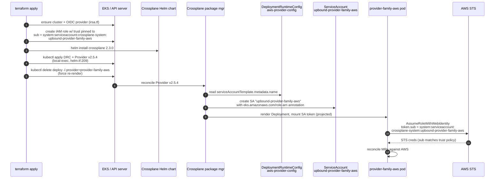

# 20 — SEG-2 Plan: Terraform infrastructure + IRSA

**Author:** opus planner (initial draft)
**Status:** PRE-REVIEW
**Dependencies:** PR #98 merged; SEG-1 awaits this

## 1. Scope summary

This segment owns everything Terraform applies for the Crossplane v1→v2
migration, plus the manifest heredocs Terraform produces:

- `terraform/management/variables.tf` — three version-string pins
  (`crossplane_provider_family_aws_version` → `v2.5.4`,
  `crossplane_provider_aws_secretsmanager_version` → `v2.5.4`,
  `crossplane_function_patch_and_transform_version` → `v0.10.6`).
  Already bumped by PR #98.
- `terraform/management/helm.tf` — the
  `locals.crossplane_aws_provider_manifest` heredoc
  (DeploymentRuntimeConfig + Provider) at L173–207; the
  `terraform_data.crossplane_function_patch_and_transform` block at
  L255–278 whose embedded Function manifest uses the wrong apiVersion
  (`pkg.crossplane.io/v1beta1`) for Crossplane v2.
- `terraform/management/irsa.tf` — `module.irsa_crossplane` at L89–105,
  trust-policy pin
  `"crossplane-system:upbound-provider-family-aws"`.
- `versions.env` (top of repo) and `tests/chainsaw/versions.env` —
  ensure no stale `v1.x` pins leak back in via merge.
- `terraform/management/terraform.tfvars.example` — stale doc-only
  drift (`crossplane_version = "2.0.1"`,
  `crossplane_provider_family_aws_version = "v1.12.0"`); fix for
  hygiene but not on the critical path.

**Out of scope:** Crossplane k8s manifests under `crossplane/` (SEG-1);
test harness (SEG-3); fixture / kubeconform-schema regen (SEG-4); PR
reconciliation (SEG-5).

### Sequence diagram — terraform apply → IRSA token exchange



If the DRC SA-name override is silently ignored, step 7 creates a SA
named `upbound-provider-aws-<hash>` instead, step 10's sub-claim no
longer matches the trust policy from step 2, and STS returns
`AccessDenied` on every MR reconcile.

## 2. Migration approach (step-by-step)

The single load-bearing question — **does v2.5.4 honour
`serviceAccountTemplate.metadata.name`?** — has documentary evidence
that it does. From the Crossplane v2.3 Providers docs (verified via
WebFetch on `docs.crossplane.io/latest/packages/providers/`):

> "Setting the `serviceAccountTemplate.metadata.name` field will
> override the name of service account created by the package manager
> and used in the provider deployment."

The doc adds a caveat — Crossplane will own that SA and the override is
"strongly discouraged" because of cross-package conflicts — but the
mechanism is preserved. Upbound's own IRSA guide
(`docs.upbound.io/manuals/packages/providers/aws-auth/aws-irsa/`)
confirms the default SA name in v2 is `upbound-provider-aws-<hash>`
(hash-suffixed) and recommends either a wildcard
(`StringLike` on `upbound-provider-aws-*`) **or** the DRC pin we
already use. We are using the second pattern; it remains valid.

Conclusion: **path (a) from the hard rules applies — the simple
version bump is enough for IRSA, but we still owe two manifest-shape
fixes inside the terraform heredocs.**

### Step 1 — confirm version pins land (PR #98 already does this)

- `variables.tf` defaults: `v2.5.4`, `v2.5.4`, `v0.10.6`, chart
  `2.3.0`. Already correct.
- `versions.env` (top of repo) contains only `KUBECONFORM_VERSION`;
  no Crossplane pins live there, so nothing to bump. (The earlier
  prompt's note that `versions.env` carries the Crossplane pin is
  incorrect — that file is for CI-tool pins; the cluster-runtime
  pins live exclusively in `variables.tf`.) Document this in the
  PR so reviewers don't expect a second touch-up.
- `tests/chainsaw/versions.env` is SEG-3's concern; flag for them.

### Step 2 — fix the Function apiVersion in helm.tf

`terraform_data.crossplane_function_patch_and_transform`
(helm.tf:255–278) currently emits:

```yaml
apiVersion: pkg.crossplane.io/v1beta1
kind: Function
```

Crossplane v2.3 promoted `Function` to `pkg.crossplane.io/v1`
(`docs.crossplane.io/latest/packages/functions/`). The v1beta1 group
may still resolve via conversion but should not be relied on. Change
to:

```yaml
apiVersion: pkg.crossplane.io/v1
kind: Function
```

Add `var.crossplane_function_patch_and_transform_version` to the
`triggers_replace` list (it is already there) so the bump to v0.10.6
re-applies the Function.

### Step 3 — leave the DRC + Provider heredoc alone in this PR

`locals.crossplane_aws_provider_manifest` (helm.tf:173–207) is
correct for v2:

- `pkg.crossplane.io/v1beta1` `DeploymentRuntimeConfig` — still the
  current GA API in v2.3.
- `pkg.crossplane.io/v1` `Provider` — unchanged across v1/v2.
- `serviceAccountTemplate.metadata.name: upbound-provider-family-aws`
  — verified to override the package-manager default in v2 (see
  evidence above).
- `runtimeConfigRef` pointing at the DRC — supported.

The `kubectl delete deploy` hack (helm.tf:242–244) stays — it forces
re-render after a DRC edit, behaviour that is unchanged in v2.

### Step 4 — leave irsa.tf alone

`module.irsa_crossplane` (irsa.tf:89–105) pins the trust policy to
`system:serviceaccount:crossplane-system:upbound-provider-family-aws`.
Because the DRC pin (step 3) continues to be honoured, the SA name on
the cluster will match this trust policy verbatim. **No change
required** to the IRSA module.

Contingency (path (b) from the hard rules): if a post-apply check
reveals the SA is actually `upbound-provider-aws-<hash>` despite the
DRC pin, switch `irsa.tf:98` to either:

- `["crossplane-system:upbound-provider-family-aws",
   "crossplane-system:upbound-provider-aws-*"]` — but the
  `iam-role-for-service-accounts-eks` module emits `StringEquals` on
  the OIDC sub, not `StringLike`, so the wildcard pattern would need a
  hand-written trust policy.
- The cleaner fallback is to drop the DRC SA-name pin entirely, let
  the default `upbound-provider-aws-<hash>` SA exist, and adopt the
  `deploymentTemplate.spec.template.spec.serviceAccountName` pattern
  Upbound recommends — pre-create a stable SA (via a new
  `terraform_data` `kubectl apply`) and reference it. This requires
  more plumbing; only execute if step 6 below proves the override
  ineffective.

### Step 5 — confirm no ProviderConfig is generated by terraform

Already true (see doc 12 §"ProviderConfig generation paths"). The
`default` ProviderConfig is created only by the chainsaw harness, not
by terraform. The v2 requirement that `providerConfigRef` carry
`kind: ClusterProviderConfig` is **SEG-1's** problem (it touches the
Composition manifests under `crossplane/`). Document the dependency
and move on; no terraform change needed.

### Step 6 — verification step (insurance against the load-bearing
unknown)

Before merging this PR, run a one-off local kind-cluster smoke to
prove the DRC override works for v2.5.4. The terraform-test.yml
`[management] verify` step only checks pod-Running, so it will not
catch a silent IRSA mismatch — we cannot rely on CI alone.

```bash
# laptop-side, ~5 minutes
kind create cluster --name crossplane-v2-saname-probe
helm repo add crossplane-stable https://charts.crossplane.io/stable
helm install crossplane crossplane-stable/crossplane \
  --version 2.3.0 --namespace crossplane-system --create-namespace
kubectl apply -f - <<'YAML'
apiVersion: pkg.crossplane.io/v1beta1
kind: DeploymentRuntimeConfig
metadata: { name: aws-provider-config }
spec:
  serviceAccountTemplate:
    metadata:
      name: upbound-provider-family-aws
---
apiVersion: pkg.crossplane.io/v1
kind: Provider
metadata: { name: provider-family-aws }
spec:
  package: xpkg.upbound.io/upbound/provider-family-aws:v2.5.4
  runtimeConfigRef:
    apiVersion: pkg.crossplane.io/v1beta1
    kind: DeploymentRuntimeConfig
    name: aws-provider-config
YAML
# wait for INSTALLED=True HEALTHY=True
kubectl get sa -n crossplane-system
# PASS: a SA named exactly upbound-provider-family-aws exists
# FAIL: only upbound-provider-aws-<hash> exists → invoke path (b)
```

Cost: ~5 min wall, zero AWS. No IRSA required to test SA naming alone.
Document the result in the PR description.

### Step 7 — tidy `terraform.tfvars.example`

Bump the stale `2.0.1` / `v1.12.0` example values to match the new
defaults so a fresh local clone doesn't override back to v1. Pure
documentation hygiene; no functional effect on CI.

## 3. Open questions

1. **(Resolved with caveat)** Does v2.5.4 honour
   `serviceAccountTemplate.metadata.name`? Docs say yes; the kind
   probe in step 6 is insurance against an undocumented regression
   on the v2.5.x line specifically.
2. Does the `Function` v1beta1→v1 promotion require any migration on
   already-installed v1beta1 Function objects, or does the conversion
   webhook handle it silently? Step 2's edit applies a v1 object on
   top of a v1beta1 — if the conversion webhook is absent the apply
   could fail. Verify in step 6's kind cluster by first applying the
   v1beta1 form, then re-applying as v1.
3. The `kubectl delete deploy` hack carries a comment claiming the
   underlying bug was fixed in Crossplane 2.2. We're on 2.3.0; is
   the hack still needed? Leaving it in is safe (idempotent
   `--ignore-not-found`) but worth dropping post-migration if a
   future run confirms it's redundant. Defer.
4. Is there a v2.3.x crossplane chart > 2.3.0 worth bumping to before
   this lands, or do we stay pinned? Defer to SEG-5 (in-flight PR
   reconciliation).

## 4. Failure recovery

| Failure mode | Symptom in CI | Recovery |
|---|---|---|
| v2.5.4 ignores DRC SA-name pin (path b triggered) | `[management] e2e-verify` chainsaw scenarios still time out at 245 s; provider pod logs `AccessDenied`; `kubectl get sa -n crossplane-system` shows only `upbound-provider-aws-<hash>` | Adopt the Upbound-recommended pattern: pre-create SA + annotation via a new `terraform_data` resource; switch DRC to `deploymentTemplate.spec.template.spec.serviceAccountName: <stable-name>`; keep IRSA trust policy unchanged. ETA: 1 PR, ~2 h |
| Function v1 apply fails on a cluster that already has the v1beta1 Function object | `terraform apply` returns kubectl error from the local-exec block | Add `kubectl delete function function-patch-and-transform --ignore-not-found` before the apply; bump the `triggers_replace` sentinel string so the delete runs |
| Stale `terraform.tfvars.example` confuses a developer running locally → terraform deploys v1 packages over v2 | Crossplane provider rolled back, MRs revert to v1 behaviour, `PendingExternalResource` returns | Step 7 prevents this; if it still happens, the trigger hash on `var.crossplane_provider_family_aws_version` re-applies cleanly on the next push |
| PR #98 reverted by a downstream merge | `variables.tf` defaults flip back to `v1.12.0` and full regression | Re-bump in the SEG-2 PR itself and assert the values in a CI check; flag for SEG-5 |
| `kubectl delete deploy` step races provider re-install and leaves cluster pod-less for longer than the verify timeout | `[management] verify` flakes on pod-Running check | Already `|| true`-guarded; if it becomes a problem, add a `kubectl rollout status` wait after the delete |

## 5. Hot files

Absolute paths (Edit-scope for this segment):

- `/home/user/k8-platform/terraform/management/helm.tf` — touch the
  `terraform_data.crossplane_function_patch_and_transform` block
  only (apiVersion v1beta1→v1).
- `/home/user/k8-platform/terraform/management/variables.tf` — read
  only; assert defaults are `v2.5.4` / `v2.5.4` / `v0.10.6` / `2.3.0`.
- `/home/user/k8-platform/terraform/management/irsa.tf` — read only;
  no edit unless path (b) is triggered.
- `/home/user/k8-platform/terraform/management/terraform.tfvars.example`
  — bump stale example values (cosmetic).

Read-only context (do not modify in this segment):

- `/home/user/k8-platform/versions.env` (no Crossplane pins live
  here; clarify in PR description).
- `/home/user/k8-platform/tests/chainsaw/versions.env` (SEG-3 owns).

## 6. Cross-segment dependencies

- **PR #98** must merge first (provides the version bump).
- **SEG-1** depends on this segment for the Function v1 apiVersion fix
  (Composition pipelines reference the Function by name; if the
  Function isn't installed cleanly under v1, the renders fail).
- **SEG-1** owns the ProviderConfig kind: addition and the
  `aws.m.upbound.io` MR group rewrites — none of which terraform
  emits.
- **SEG-3** owns `tests/chainsaw/versions.env` and the chainsaw
  ProviderConfig fixture; SEG-2's PR description should call out
  that the ProviderConfig the harness applies needs the v2 group
  (`aws.m.upbound.io/v1beta1`) and a `ClusterProviderConfig` kind.
- **SEG-4** owns kubeconform schema regen against v2 CRDs; that
  happens after the provider is installed (downstream of this PR).
- **SEG-5** owns the in-flight-PR reconciliation; SEG-2 should
  rebase on top of #98 cleanly and not invite conflicts with #91,
  #94, #97.

Recommended merge order: PR #98 → **SEG-2 PR** → SEG-1 PR → SEG-3 PR
→ SEG-4 PR → SEG-5 cleanup.

## 7. Estimated execution time

| Activity | Wall time |
|---|---|
| Step 6 kind-cluster SA-name probe (local) | 10 min |
| Step 2 helm.tf Function apiVersion edit | 5 min |
| Step 7 tfvars.example bump | 2 min |
| PR write-up referencing this plan and the probe result | 15 min |
| CI round-trip (`terraform-test.yml`, ~20 min for management + e2e) | 25 min |
| Buffer for one CI fix-up cycle | 30 min |
| **Total** | **~90 min** |

If path (b) fires (DRC override ineffective), add roughly 2 hours for
the fallback design (pre-create stable SA, switch DRC reference) and
a second CI round-trip.
