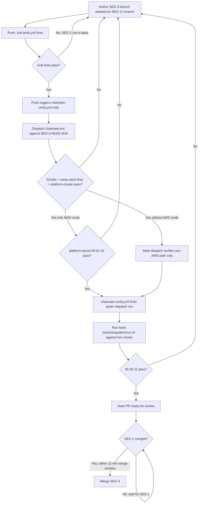

# 20 — SEG-3 plan: test infrastructure migration

**Author:** opus implementation-architect
**Status:** POST-REVIEW-R1
**Source impact doc:** [`13-impact-test-infra.md`](./13-impact-test-infra.md)
**Sibling segments:** SEG-1 (production manifests), SEG-2 (Terraform), SEG-4 (fixture regen), SEG-5 (in-flight PR reconciliation)

---

## Revision log (R1)

| Item | Source | Change |
|---|---|---|
| Hard-pin `ClusterProviderConfig` everywhere (heredoc, unit-test assertions, integration rewrites) | R1B F1 + pre-committed cross-segment decision | Removed all occurrences of `kind: ProviderConfig`; every plan row now names `ClusterProviderConfig` explicitly; `metadata.namespace` removed from heredoc (cluster-scoped has none) |
| Integration test 06 inline XRD: add `spec.scope: Namespaced` | R1B F2 | §2.3 row for 06 now explicitly includes `spec.scope: Namespaced` in the XRD patch |
| Unit XRD tests: add `spec.scope: Namespaced` assertions | R1B coverage gap | §2.3 NEW rows for `test_platform_secret_xrd.sh` and `test_platform_cluster_xrd.sh` now include a positive assertion that `spec.scope == Namespaced` |
| Merge-train gating made unambiguous | R1A flaw 1 | §2.1 now states the hard merge-order rule; §2.4 updated to show gate |
| SEG-4 fixture race: ownership clarified | R1A flaw 2 | §1 out-of-scope bullets now state SEG-4 must ship fixture regen in the same merge wave as schema regen, or SEG-3 disclaims the `should_fail_*` fixtures to SEG-4; §6 cross-segment dependency made hard |
| Integration-tests.yml dispatch added to Definition of Done | R1A flaw 3 | §2.4 verification flow extended with explicit `bash tests/integration/run.sh` step against live cluster |
| Chainsaw dispatch gate made explicit | R1A flaw 4 | §2.4 and §2.1 now state: dispatch chainsaw against SEG-3 HEAD SHA after PR opens; green is required before merging the stack |
| `providerConfigRef.kind` resolved from open question to hard decision | R1A minor + pre-committed decision | Open question 2 closed: `ClusterProviderConfig`; §3 updated |
| RBAC dependency row removed from §1 | R1B RBAC finding | SEG-1 plan confirmed no edit to `01-crossplane-externalsecrets.yaml`; false dependency removed |
| Diagnostic block `-A` row removed from §2.3 | R1B F5 | Row was a no-op; removed to avoid confusion |

---

## 1. Scope

In scope for SEG-3 (test infrastructure that **executes** tests against the migrated stack):

| Area | Files | Why this segment owns it |
|---|---|---|
| Chainsaw orchestrator | `tests/chainsaw/run.sh` | ProviderConfig heredoc L229–241 hardcodes the v1 `aws.upbound.io/v1beta1` API group; v2 moves it to `aws.m.upbound.io/v1beta1` AND requires `kind: ClusterProviderConfig` on the heredoc object and on every `providerConfigRef` consumer (coordinated with SEG-1's Compositions) |
| Chainsaw scenarios | `tests/chainsaw/_smoke/` (no-op), `tests/chainsaw/platform-cluster/00-xrd-establishes/` (no-op), `tests/chainsaw/platform-secret/{00,01,02}/chainsaw-test.yaml` | The three `platform-secret/*` scenarios use the v1 claim→XR promotion pointer `spec.resourceRef.name`. v2 namespaces the XR (no claim, no promotion); the lookup pattern must change to label-or-direct-name |
| Integration tests | `tests/integration/05_crossplane_managed_resource.sh`, `06_crossplane_xrd_claim.sh`, `11_platform_secret_e2e.sh` | All three embed v1 API groups; 06 additionally inlines an XRD with `claimNames:` which v2 rejects at admission, and is missing `spec.scope: Namespaced`; 11 uses the same promotion pointer |
| Unit composition tests | `tests/unit/test_platform_secret_composition.sh`, `tests/unit/test_platform_cluster_composition.sh` | Per impact doc §"single biggest test-layer blocker": these run on every push, have no AWS dependency, and immediately gate ALL push CI the moment SEG-1's production Compositions are migrated |
| Unit XRD tests | `tests/unit/test_platform_secret_xrd.sh`, `tests/unit/test_platform_cluster_xrd.sh` | Assert `spec.claimNames.*` which the v2 XRD shape removes; must also gain a positive `spec.scope: Namespaced` assertion |
| Workflow files | `.github/workflows/chainsaw.yml` (verify only) | Per impact doc §"workflow files" — none of the four workflow files reference v1 API groups; the SEG-3 deliverable for them is a re-read pass, not edits |

**Explicitly out of scope** (handled by other segments — do not touch from this branch):

- `crossplane/compositions/*`, `crossplane/xrds/*`, `crossplane/claims/*`, `crossplane/rbac/*` → SEG-1
- `terraform/management/*`, anything under `terraform/` → SEG-2
- `tests/unit/fixtures/crossplane-trace/*.json` (6 files) → SEG-4
- `tests/unit/fixtures/kubeconform/*.yaml` (4 files, including all three `should_fail_*` fixtures) → SEG-4. **SEG-4 fixture-ownership constraint (hard):** SEG-4 must ship fixture regen in the same merge wave as schema regen. If SEG-4 regenerates schemas before shipping updated fixtures, `test_kubeconform_manifests.sh` (every-push gate) will silently `statusSkip` on the three `should_fail_*` cases — turning a gating test into a no-op. SEG-4 owns this entirely; SEG-3 must not merge after schema regen unless SEG-4 has already landed or will land in the same merge batch.
- `tests/unit/fixtures/composition-render/composition-missing-string-type.yaml` → SEG-4
- `kubeconform-schemas/` schema-store regen (53 files) → SEG-4
- `scripts/crossplane-trace.sh`, `scripts/diag-component.sh`, `scripts/fetch-crds-for-kubeconform.sh` (the session-built tools that grep v1 patterns) → SEG-4
- PR #91 (meta-catch-fires branch), PR #94 (C4 / composition-drift branch), PR #97 → SEG-5

The `tests/unit/test_chainsaw_kind_config.sh` pinning test, `tests/unit/test_crossplane_trace.sh` (script-only — its fixtures are SEG-4), `tests/unit/test_kubeconform_manifests.sh` (script is schema-agnostic), and the integration tests outside the Crossplane four (`01–04`, `07–10`, `12`, `13`) all pass through unchanged and need no SEG-3 edits.

## 2. Migration approach

### 2.1 Strategy: lockstep with SEG-1, dispatch-then-PR for chainsaw

Per AGENTS.md §6.7 the Chainsaw heavy workflow is `workflow_dispatch`-only — a push to a branch does NOT run chainsaw scenarios; it runs only the `chainsaw-verify.yml` gate which looks for a previously-dispatched green run. That gives SEG-3 a deliberate staging buffer: chainsaw edits can land on the integration branch alongside SEG-1's manifest changes without flipping required PR checks red.

The unit composition tests do NOT have that buffer. `unit-tests.yml` runs on every push, includes `test_platform_secret_composition.sh` and `test_platform_cluster_composition.sh`, and the moment SEG-1 merges its Composition rewrite the assertions at L41 (`secretsmanager.aws.upbound.io/v1beta1`) and L66/L70 (`eks.aws.upbound.io/v1beta1`) go red on every subsequent push from any branch.

There are three correct ways to handle this; SEG-3 picks option (c):

| Option | Mechanism | Why not chosen |
|---|---|---|
| (a) Update unit tests FIRST with skip-with-warning behavior, accept temporary loss of coverage | Add `if grep -q 'aws.m.upbound.io' "$COMP"; then skip; fi` shim | Loss of guard against partial migrations; the bug class the test defends (wrong ASM prefix, wrong ES namespace) is exactly what a half-finished v2 migration would re-introduce |
| (b) Update unit tests BEFORE SEG-1 with new v2 expectations | Flips the test red until SEG-1 lands | Blocks every other PR for the duration of the merge gap |
| **(c) Update unit tests in the SAME PR that SEG-1 lands**, atomically | Stacked-PR: SEG-3 branch stacked on SEG-1's branch | Chosen: zero coverage gap, zero red-CI gap, but requires coordinated merge |

**Merge-train gating (non-negotiable):**

1. SEG-3's child PR **must** have its base set to SEG-1's branch, not `main`.
2. SEG-3's child PR is **not** marked ready-for-review until SEG-1's PR is ready-for-review.
3. SEG-3's child PR is **not** merged until SEG-1 has merged.
4. After SEG-1 merges, GitHub auto-retargets SEG-3's PR onto `main`. SEG-3 **must merge within the same deployment window** (target: within 15 minutes of SEG-1's merge). Any push to any branch after SEG-1 merges but before SEG-3 merges will trip the unit-composition assertion red. If that window cannot be guaranteed, SEG-1 and SEG-3 must be squashed into a single PR and merged as one commit.
5. After SEG-3's PR opens (stacked on SEG-1), dispatch `chainsaw.yml` against SEG-3's HEAD SHA. **Green chainsaw dispatch is required before merging the stack.** Do not merge SEG-1 and then rush SEG-3 without first having a green chainsaw signal against the combined changes.

### 2.2 Test-update order (Gantt)

```mermaid
gantt
    title SEG-3 test-update order — vertical dependency chain on SEG-1
    dateFormat X
    axisFormat %s

    section External dep
    SEG-1 production manifests (Compositions, XRDs, RBAC)   :crit, seg1, 0, 4

    section Unit (gating — every push)
    test_platform_secret_composition.sh   (LOCKSTEP w/ SEG-1)   :crit, ut1, 4, 1
    test_platform_cluster_composition.sh  (LOCKSTEP w/ SEG-1)   :crit, ut2, 4, 1
    test_platform_secret_xrd.sh           (LOCKSTEP w/ SEG-1)   :crit, ut3, 4, 1
    test_platform_cluster_xrd.sh          (LOCKSTEP w/ SEG-1)   :crit, ut4, 4, 1

    section Chainsaw orchestrator (dispatch-gated, can stage)
    tests/chainsaw/run.sh — ClusterProviderConfig heredoc apiGroup+kind   :cs1, 5, 1
    tests/chainsaw/platform-secret/00 — drop spec.resourceRef     :cs2, after cs1, 1
    tests/chainsaw/platform-secret/01 — drop spec.resourceRef     :cs3, after cs1, 1
    tests/chainsaw/platform-secret/02 — drop spec.resourceRef     :cs4, after cs1, 1

    section Integration (workflow_dispatch only — can lag)
    05_crossplane_managed_resource.sh — s3 group rename + namespace   :it1, 6, 1
    06_crossplane_xrd_claim.sh — drop claimNames, add scope Namespaced, rewrite as XR   :it2, 6, 2
    11_platform_secret_e2e.sh — drop promotion pointer            :it3, 6, 1

    section Verification
    Dispatch chainsaw against SEG-3 HEAD SHA (AGENTS.md §6.7)    :ver1, after cs4, 1
    Require green chainsaw before marking PR ready-for-review     :crit, ver2, after ver1, 1
    bash tests/integration/run.sh against live cluster            :ver3, after ver2, 1
    Open PR ready-for-review (chainsaw green)                     :ver4, after ver3, 1
```

Read the chart as: the four unit tests in section "Unit (gating)" sit on the critical path AND must move atomically with SEG-1. Chainsaw is dispatch-gated and may stage. Integration tests are workflow_dispatch-only and may lag further, but a manual `bash tests/integration/run.sh` against a live cluster is a required Definition of Done step (see §2.4).

### 2.3 Per-file edit plan

**Cross-cutting hard pin:** every occurrence of `providerConfigRef.kind` in SEG-3-owned files must use `kind: ClusterProviderConfig`. This is a pre-committed cross-segment decision (cluster-scoped, one shared config, matches SEG-1's choice). Do not use `kind: ProviderConfig` (namespaced) anywhere.

| File | Edit | Notes |
|---|---|---|
| `tests/chainsaw/run.sh` L230–241 | (a) `apiVersion: aws.upbound.io/v1beta1` → `apiVersion: aws.m.upbound.io/v1beta1`; (b) `kind: ProviderConfig` → `kind: ClusterProviderConfig`; (c) remove `metadata.namespace` field — `ClusterProviderConfig` is cluster-scoped and has no namespace | The pre-committed cross-segment decision: `ClusterProviderConfig` named `default`. Removing namespace is required — a cluster-scoped object with a namespace field will be rejected by admission |
| `tests/chainsaw/platform-secret/00-claim-creates-secret/chainsaw-test.yaml` L68–69 | Drop `xr=$(kubectl get platformsecret … spec.resourceRef.name)`; replace with `xr=${CLAIM_NAME}` (in v2 the XR name == what the user creates) and `uid=$(kubectl get xplatformsecret -n default "$xr" -o jsonpath='{.metadata.uid}')` | `xplatformsecret` is now namespaced |
| `tests/chainsaw/platform-secret/01-claim-deletion-cleanup/chainsaw-test.yaml` L50–51 | Same edit as scenario 00 | |
| `tests/chainsaw/platform-secret/02-data-rotation/chainsaw-test.yaml` L52–53 | Same edit as scenario 00 | |
| `tests/chainsaw/platform-cluster/00-xrd-establishes/chainsaw-test.yaml` | No edit | No v1 patterns; passes through |
| `tests/chainsaw/_smoke/chainsaw-test.yaml` | No edit | No v1 patterns |
| `tests/integration/05_crossplane_managed_resource.sh` L27, L38, L42, L50 | All four `s3.aws.upbound.io` → `s3.aws.m.upbound.io`; remove `deletionPolicy: Delete` at L35 (v2 disallows for namespaced MRs); add `metadata.namespace: crossplane-system` to the Bucket MR (v2.5.4 `s3.aws.m.upbound.io/v1beta1 Bucket` is namespaced — see §3 Q1 resolution); update `wait-for-claim.sh` call from `wait-for-claim.sh "$kind" "$BUCKET" "" 180` to `wait-for-claim.sh "$kind" "$BUCKET" "crossplane-system" 180` | Namespace `crossplane-system` matches where the chainsaw harness applies ProviderConfig; symmetry with the ClusterProviderConfig used by all Compositions |
| `tests/integration/06_crossplane_xrd_claim.sh` L28–93 | (a) Remove `claimNames:` block (L38–40); (b) **add `spec.scope: Namespaced`** to the inline XRD — required for v2 to treat the CRD as namespaced; without it the CRD defaults to `LegacyCluster` scope, the namespace on the XR apply is silently ignored, and wait-for-XR fails; (c) change `kind: PlatformTestBucket` resource consumption: replace L85–93 TestBucket claim with a direct XR creation in `$TEST_NS`; (d) s3 group rename at L70 (`s3.aws.upbound.io` → `s3.aws.m.upbound.io`); (e) remove `deletionPolicy: Delete` at L74; (f) update `wait-for-claim.sh` arg to XR kind `PlatformTestBucket` in `$TEST_NS` | Highest-rewrite file in this segment. `spec.scope: Namespaced` is a blocker — do not skip it |
| `tests/integration/11_platform_secret_e2e.sh` L76, L82 | Drop `XR=$(kubectl get platformsecret … spec.resourceRef.name)`; `XR=$CLAIM`, then `XR_UID=$(kubectl get xplatformsecret -n "$TEST_NS" "$XR" -o jsonpath='{.metadata.uid}')` | Mirror of the chainsaw scenario fix |
| `tests/unit/test_platform_secret_composition.sh` L41 | `secretsmanager.aws.upbound.io/v1beta1` → `secretsmanager.aws.m.upbound.io/v1beta1` | The lockstep-with-SEG-1 assertion |
| `tests/unit/test_platform_secret_composition.sh` L80–81 | Delete the `composition_asm_deletionPolicy_Delete` assertion — v2 removes `deletionPolicy` for namespaced MRs and SEG-1 will have stripped it; replace with `assert_eq "composition_asm_no_deletionPolicy" "null" "$ASM_DELETION"` to actively guard against accidental re-introduction | Removing an assertion is a coverage loss; the replacement guards regression |
| `tests/unit/test_platform_secret_composition.sh` L88–89 | `spec.claimRef.namespace` → `metadata.namespace` (the XR is now in the user's namespace directly) | The "ES namespace derivation" assertion changes target field path |
| `tests/unit/test_platform_secret_composition.sh` (NEW) | Add assertions: (a) every `base.spec.providerConfigRef` block has `kind: ClusterProviderConfig` (hard-pinned — no other value is correct); (b) `base.apiVersion` matches `secretsmanager.aws.m.upbound.io/v1beta1` | Contract assertions defending SEG-1's migration from regressing |
| `tests/unit/test_platform_cluster_composition.sh` L64–70 | `eks.aws.upbound.io/v1beta1` → `eks.aws.m.upbound.io/v1beta1` (both CLUSTER_API and NG_API) | |
| `tests/unit/test_platform_cluster_composition.sh` (NEW) | Same `providerConfigRef.kind: ClusterProviderConfig` assertions as above | |
| `tests/unit/test_platform_secret_xrd.sh` L33, 47, 51 (five assertions) | (a) Delete the `spec.claimNames.*` block of assertions; replace with one assertion that `spec.claimNames` is absent (`null`) — guards against v1-pattern regression; (b) **add assertion** that `spec.scope == Namespaced` — positive check that the XRD was correctly migrated to namespaced scope | Both deletions AND the new positive assertion are required |
| `tests/unit/test_platform_cluster_xrd.sh` L28, 37–40 | Same as above — remove `spec.claimNames.*` assertions, add absent-guard, **add `spec.scope == Namespaced` assertion** | |
| `.github/workflows/chainsaw.yml` | No edit | Re-read pass per §6.7 confirmed no v1 references |
| `.github/workflows/chainsaw-verify.yml`, `unit-tests.yml`, `integration-tests.yml` | No edit | Same |

### 2.4 Verification flow

**Definition of Done — all of the following must be true before merging:**

1. `unit-tests.yml` green on SEG-3's branch (stacked on SEG-1's branch).
2. `chainsaw.yml` dispatched against SEG-3 HEAD SHA; run is green (or green on non-AWS path with documented AWS skip).
3. `chainsaw-verify.yml` finds the green dispatch run and gates green.
4. `bash tests/integration/run.sh` executed manually against a live cluster with SEG-1+SEG-3 applied; integration tests 05, 06, and 11 pass.
5. SEG-1 has merged.
6. SEG-3 merges within 15 minutes of SEG-1 (or both are squashed into one commit).

## 3. Open questions

1. **v2 MR namespace for `05_crossplane_managed_resource.sh`** — **RESOLVED.** v2 `s3.aws.m.upbound.io/v1beta1 Bucket` is namespaced. Edit commits to `namespace: crossplane-system` (symmetric with where the chainsaw harness applies the ClusterProviderConfig). `wait-for-claim.sh` args updated accordingly. No further action required.

2. **`providerConfigRef.kind` value** — **RESOLVED (pre-committed cross-segment decision).** `kind: ClusterProviderConfig` named `default`. Every occurrence in SEG-3 files is hard-pinned to this value. No further action required.

3. **`scripts/wait-for-claim.sh` ownership.** This script is consumed by SEG-3's integration tests (06, 11, chainsaw via run.sh diagnostics) but lives under `scripts/`. The impact doc puts session-built scripts in SEG-4. If `wait-for-claim.sh` is SEG-4, then SEG-3 takes a soft dependency on SEG-4 landing first OR SEG-3 patches wait-for-claim in-place and SEG-4 owns the eventual refactor. **Action:** confirm `scripts/wait-for-claim.sh` ownership in the cross-segment kickoff. This is the only remaining open question.

4. **Chainsaw `_setup/` re-introduction.** `run.sh` comment L201–208 explicitly says setup belongs in the orchestrator, not in `_setup/` scenarios. v2 changes nothing about that decision; keep the heredoc in run.sh. Confirm no agent has re-introduced a `_setup/` directory during the migration window.

## 4. Failure recovery

| Failure mode | Detection | Recovery |
|---|---|---|
| Unit composition tests go red on main after SEG-1 merges without SEG-3 | First push from any branch flips `unit-tests.yml` red | Cherry-pick the SEG-3 unit-test commits onto main as a hotfix PR; do NOT revert SEG-1 (the Compositions themselves are correct) |
| chainsaw dispatch fails on ProviderConfig apply (`no matches for kind ClusterProviderConfig in version aws.m.upbound.io/v1beta1`) | First chainsaw dispatch run after SEG-3 attempt | Confirm SEG-1's `provider-family-aws` v2.5.0 is actually installed. If the provider is installed, confirm the run.sh heredoc uses `kind: ClusterProviderConfig` and `apiVersion: aws.m.upbound.io/v1beta1` with no namespace field; re-push if the edit did not land |
| chainsaw dispatch fails with `cannot find ClusterProviderConfig default` on MR reconcile | chainsaw scenario 00/01/02 | The `ClusterProviderConfig` object was not applied (heredoc did not apply cleanly, or the namespace field caused rejection). Verify the heredoc has no `metadata.namespace`; re-dispatch. |
| Integration test 06 rejected by Crossplane v2 at admission (`spec.claimNames is not allowed`) | First dispatch of `integration-tests.yml` against the v2 cluster | The XRD inline schema must drop `claimNames:` AND have `spec.scope: Namespaced` — confirm both edits landed; re-push |
| Integration test 06 XR apply lands in wrong namespace (cluster-scoped behavior) | wait-for-XR fails even though XR apply returns 200 | `spec.scope: Namespaced` was missing from the inline XRD — add it and re-run |
| `platform-secret/0X` chainsaw scenario times out at 245s with `Successfully requested creation / Waiting for confirmation` (the exact symptom from §1 of 00-situation.md) | chainsaw asserts time out, dump-diagnostics fires | This is the v1-provider-on-v2-control-plane symptom returning — means SEG-1 did NOT actually migrate to v2.5.0 providers, OR `versions.env` got reverted. Recover by re-asserting `PROVIDER_FAMILY_AWS_VERSION=v2.5.0` in `tests/chainsaw/versions.env` and the corresponding production provider manifest |
| `meta-catch-fires` scenario starts failing | chainsaw run on PR #91's branch | Out of scope for SEG-3 (PR #91 owned by SEG-5); raise to SEG-5 |
| ESO `ClusterSecretStore` apply in run.sh L250–270 stops working | chainsaw smoke + AWS-creds run | Out of scope — ESO is independent of Crossplane (per 00-situation.md §8); if it breaks the cause is unrelated to this migration |
| `test_kubeconform_manifests.sh` `should_fail_*` cases show `statusSkip` | Every-push CI after schema regen | SEG-4 fixture regen has not landed alongside schema regen; block SEG-4 schema merge until fixtures are updated. Do not attempt to fix from SEG-3 — SEG-4 owns these files |

## 5. Hot files

In write-priority order (highest first):

1. `tests/unit/test_platform_secret_composition.sh` — gating signal, every-push CI
2. `tests/unit/test_platform_cluster_composition.sh` — gating signal, every-push CI
3. `tests/unit/test_platform_secret_xrd.sh` — gating signal, every-push CI
4. `tests/unit/test_platform_cluster_xrd.sh` — gating signal, every-push CI
5. `tests/chainsaw/run.sh` — orchestrator, gates every chainsaw scenario; `ClusterProviderConfig` heredoc fix is a blocker
6. `tests/chainsaw/platform-secret/00-claim-creates-secret/chainsaw-test.yaml`
7. `tests/chainsaw/platform-secret/01-claim-deletion-cleanup/chainsaw-test.yaml`
8. `tests/chainsaw/platform-secret/02-data-rotation/chainsaw-test.yaml`
9. `tests/integration/11_platform_secret_e2e.sh` — phase-2 e2e
10. `tests/integration/06_crossplane_xrd_claim.sh` — biggest single-file rewrite (inline XRD + `spec.scope: Namespaced`)
11. `tests/integration/05_crossplane_managed_resource.sh` — smallest integration delta

## 6. Cross-segment dependencies

| This segment depends on | What we need | Blocking? |
|---|---|---|
| **SEG-1 production manifests** | Compositions migrated to `*.m.upbound.io` groups; XRDs with `claimNames:` removed and `spec.scope: Namespaced` added; `providerConfigRef.kind: ClusterProviderConfig` applied throughout | **YES** — unit composition tests are contract specifications; they cannot be updated without knowing the manifest's final shape. The lockstep / stacked-PR pattern in §2.1 is the mitigation |
| **SEG-2 Terraform** | The IRSA scope `arn:aws:secretsmanager:*:*:secret:k8-platform/*` in `terraform/management/irsa.tf` (read by `test_platform_secret_composition.sh` L59) must remain `k8-platform/*` post-migration | NO — this is a read-only cross-check; SEG-2's edit (if any) is independent |
| **SEG-4 fixtures and session tools** | `scripts/wait-for-claim.sh` v2-awareness; fixture regen for `crossplane-trace`, `kubeconform`, `composition-render`; `scripts/crossplane-trace.sh` API-group handling. **HARD constraint:** SEG-4 must ship `should_fail_*` fixture updates in the same merge wave as schema regen, or `test_kubeconform_manifests.sh` degrades to a no-op on every push | **HARD on schema/fixture timing** (see §1); soft on `wait-for-claim.sh` (SEG-3 patches in-place if SEG-4 hasn't landed first) |
| **SEG-5 in-flight PR reconciliation** | PRs #91 (meta-catch-fires), #94 (composition-drift), #97 may have authored chainsaw scenarios against v1 patterns and must be rebased onto SEG-1+SEG-3 | NO — SEG-3 ships against SEG-1's branch; SEG-5 owns the rebase |
| **PR #98** (already open, provider version bump) | `tests/chainsaw/versions.env` has `PROVIDER_FAMILY_AWS_VERSION=v2.5.0` etc. on main | Done — confirmed in 00-situation.md §5 |

**Single most consequential coupling:** the SEG-3-on-SEG-1 stacked merge and the 15-minute merge window. If the window is not kept, main goes red for all unrelated PRs. The mitigation is squashing into a single commit if the window cannot be guaranteed.

## 7. Estimated execution time

| Phase | Hours | Notes |
|---|---|---|
| Confirm stacked-PR base and merge-train setup against SEG-1's branch | 0.25 | Gate step — do before any edits |
| Unit composition + XRD test edits (4 files, including new `scope: Namespaced` and `ClusterProviderConfig` assertions) | 1.25 | Slightly more than original estimate due to new assertion rows |
| Chainsaw run.sh `ClusterProviderConfig` heredoc fix (apiGroup + kind + remove namespace) | 0.5 | Three-line diff; do not get this wrong |
| Chainsaw platform-secret scenarios (3 files, identical edit) | 0.5 | Same diff applied three times |
| Integration test 05 (S3 raw MR + namespace + wait-for-claim args) | 0.5 | Open question 1 resolved; edits are now defined |
| Integration test 11 (platform-secret e2e) | 0.5 | Mirror of chainsaw scenario edit |
| Integration test 06 (inline XRD: claimNames removal + scope:Namespaced + Claim→XR apply + wait-for-claim call signature) | 2.0 | Largest single rewrite |
| Dispatch chainsaw verification, iterate on failures | 2.5 | Budgeted up from 2h; AWS-cred-required scenarios add latency |
| `bash tests/integration/run.sh` against live cluster (Definition of Done step) | 1.0 | New DoD item; requires live cluster |
| Code review + adjustments | 1.0 | |
| **Total** | **~10 hours** | Assuming SEG-1 lands first or stacked-PR works on first try |

If SEG-1 has not landed and stacked-PR is not viable, add 4 hours of merge-conflict reconciliation post-SEG-1-merge.
