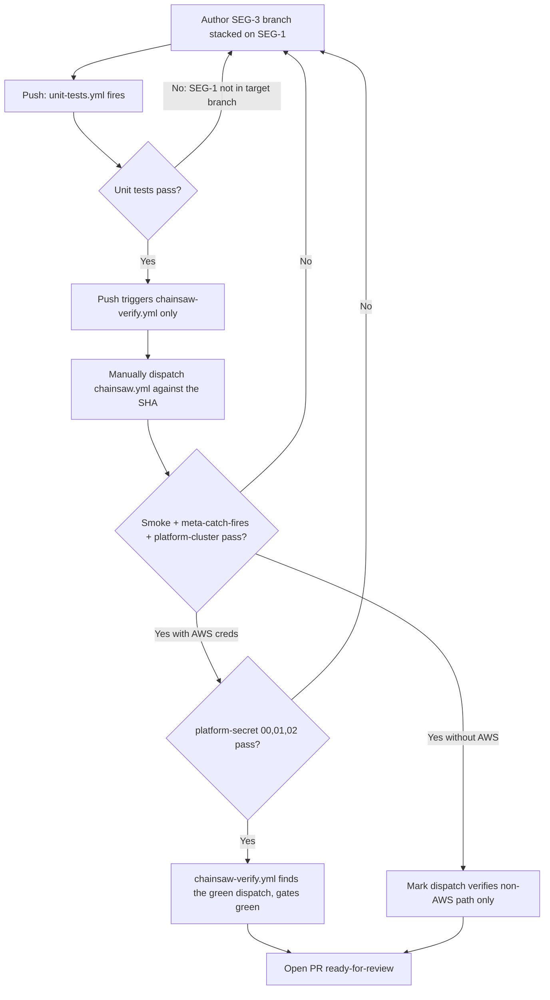

# 20 — SEG-3 plan: test infrastructure migration

**Author:** opus implementation-architect
**Status:** draft plan for one slice of the Crossplane v1→v2 migration
**Source impact doc:** [`13-impact-test-infra.md`](./13-impact-test-infra.md)
**Sibling segments:** SEG-1 (production manifests), SEG-2 (Terraform), SEG-4 (fixture regen), SEG-5 (in-flight PR reconciliation)

---

## 1. Scope

In scope for SEG-3 (test infrastructure that **executes** tests against the migrated stack):

| Area | Files | Why this segment owns it |
|---|---|---|
| Chainsaw orchestrator | `tests/chainsaw/run.sh` | ProviderConfig heredoc L229–241 hardcodes the v1 `aws.upbound.io/v1beta1` API group; v2 moves it to `aws.m.upbound.io/v1beta1` AND requires a `kind:` on every `providerConfigRef` consumer (coordinated with SEG-1's Compositions) |
| Chainsaw scenarios | `tests/chainsaw/_smoke/` (no-op), `tests/chainsaw/platform-cluster/00-xrd-establishes/` (no-op), `tests/chainsaw/platform-secret/{00,01,02}/chainsaw-test.yaml` | The three `platform-secret/*` scenarios use the v1 claim→XR promotion pointer `spec.resourceRef.name`. v2 namespaces the XR (no claim, no promotion); the lookup pattern must change to label-or-direct-name |
| Integration tests | `tests/integration/05_crossplane_managed_resource.sh`, `06_crossplane_xrd_claim.sh`, `11_platform_secret_e2e.sh` | All three embed v1 API groups; 06 additionally inlines an XRD with `claimNames:` which v2 rejects at admission; 11 uses the same promotion pointer |
| Unit composition tests | `tests/unit/test_platform_secret_composition.sh`, `tests/unit/test_platform_cluster_composition.sh` | Per impact doc §"single biggest test-layer blocker": these run on every push, have no AWS dependency, and immediately gate ALL push CI the moment SEG-1's production Compositions are migrated |
| Unit XRD tests | `tests/unit/test_platform_secret_xrd.sh`, `tests/unit/test_platform_cluster_xrd.sh` | Assert `spec.claimNames.*` which the v2 XRD shape removes |
| Workflow files | `.github/workflows/chainsaw.yml` (verify only) | Per impact doc §"workflow files" — none of the four workflow files reference v1 API groups; the SEG-3 deliverable for them is a re-read pass, not edits |
| RBAC apply coordination | `tests/chainsaw/run.sh` applies `crossplane/rbac/01-crossplane-externalsecrets.yaml` | The chainsaw harness depends on SEG-1 having migrated that RBAC manifest to v2 group names before this segment's chainsaw run goes green |

**Explicitly out of scope** (handled by other segments — do not touch from this branch):

- `crossplane/compositions/*`, `crossplane/xrds/*`, `crossplane/claims/*`, `crossplane/rbac/*` → SEG-1
- `terraform/management/*`, anything under `terraform/` → SEG-2
- `tests/unit/fixtures/crossplane-trace/*.json` (6 files) → SEG-4
- `tests/unit/fixtures/kubeconform/*.yaml` (4 files) → SEG-4
- `tests/unit/fixtures/composition-render/composition-missing-string-type.yaml` → SEG-4
- `kubeconform-schemas/` schema-store regen (53 files) → SEG-4
- `scripts/crossplane-trace.sh`, `scripts/diag-component.sh`, `scripts/fetch-crds-for-kubeconform.sh` (the session-built tools that grep v1 patterns) → SEG-4
- PR #91 (meta-catch-fires branch), PR #94 (C4 / composition-drift branch), PR #97 → SEG-5

The `tests/unit/test_chainsaw_kind_config.sh` pinning test, `tests/unit/test_crossplane_trace.sh` (script-only — its fixtures are SEG-4), `tests/unit/test_kubeconform_manifests.sh` (script is schema-agnostic), and the integration tests outside the Crossplane four (`01–04`, `07–10`, `12`, `13`) all pass through unchanged and need no SEG-3 edits.

## 2. Migration approach

### 2.1 Strategy: lockstep with SEG-1, dispatch-then-PR for chainsaw

Per AGENTS.md §6.7 the Chainsaw heavy workflow is `workflow_dispatch`-only — a push to a branch does NOT run chainsaw scenarios; it runs only the `chainsaw-verify.yml` gate which looks for a previously-dispatched green run. That gives SEG-3 a deliberate staging buffer: chainsaw edits can land on the integration branch alongside SEG-1's manifest changes without flipping required PR checks red.

The unit composition tests do NOT have that buffer. `unit-tests.yml` runs on every push, includes `test_platform_secret_composition.sh` and `test_platform_cluster_composition.sh`, and the moment SEG-1 merges its Composition rewrite the assertions at L41 (`secretsmanager.aws.upbound.io/v1beta1`) and L66/L70 (`eks.aws.upbound.io/v1beta1`) go red on every subsequent push from any branch.

There are three correct ways to handle this; SEG-3 picks option (c):

| Option | Mechanism | Why not chosen |
|---|---|---|
| (a) Update unit tests FIRST with skip-with-warning behavior, accept temporary loss of coverage | Add `if grep -q 'aws.m.upbound.io' "$COMP"; then skip; fi` shim | Loss of guard against partial migrations; the bug class the test defends (wrong ASM prefix, wrong ES namespace) is exactly what a half-finished v2 migration would re-introduce |
| (b) Update unit tests BEFORE SEG-1 with new v2 expectations | Flips the test red until SEG-1 lands | Blocks every other PR for the duration of the merge gap |
| **(c) Update unit tests in the SAME PR that SEG-1 lands**, atomically | Co-authored or stacked-PR pattern | Chosen: zero coverage gap, zero red-CI gap, but requires coordinated merge |

The mechanism for (c): SEG-3 produces its unit-test patch on a child branch stacked on top of SEG-1's branch (`stacked-pr-on-feature-branch` skill applies). The SEG-3 branch's PR opens with **base = SEG-1's branch**, not main. When SEG-1 merges, GitHub auto-retargets SEG-3's child PR onto main, and the unit test changes land in the next merge with zero window where main is red.

### 2.2 Test-update order (Gantt)

```mermaid
gantt
    title SEG-3 test-update order — vertical dependency chain on SEG-1
    dateFormat X
    axisFormat %s

    section External dep
    SEG-1 production manifests (Compositions, XRDs, RBAC)   :crit, seg1, 0, 4

    section Unit (gating — every push)
    test_platform_secret_composition.sh   (LOCKSTEP w/ SEG-1)   :crit, ut1, 4, 1
    test_platform_cluster_composition.sh  (LOCKSTEP w/ SEG-1)   :crit, ut2, 4, 1
    test_platform_secret_xrd.sh           (LOCKSTEP w/ SEG-1)   :crit, ut3, 4, 1
    test_platform_cluster_xrd.sh          (LOCKSTEP w/ SEG-1)   :crit, ut4, 4, 1

    section Chainsaw orchestrator (dispatch-gated, can stage)
    tests/chainsaw/run.sh — ProviderConfig heredoc apiGroup+kind   :cs1, 5, 1
    tests/chainsaw/platform-secret/00 — drop spec.resourceRef     :cs2, after cs1, 1
    tests/chainsaw/platform-secret/01 — drop spec.resourceRef     :cs3, after cs1, 1
    tests/chainsaw/platform-secret/02 — drop spec.resourceRef     :cs4, after cs1, 1

    section Integration (workflow_dispatch only — can lag)
    05_crossplane_managed_resource.sh — s3 group rename           :it1, 6, 1
    06_crossplane_xrd_claim.sh — drop claimNames, rewrite as XR   :it2, 6, 2
    11_platform_secret_e2e.sh — drop promotion pointer            :it3, 6, 1

    section Verification
    Dispatch chainsaw on integration commit (AGENTS.md §6.7)      :ver1, after cs4, 1
    Open PR with green dispatch-verify check                      :ver2, after ver1, 1
```

Read the chart as: the four unit tests in section "Unit (gating)" sit on the critical path AND must move atomically with SEG-1. Everything below is gated only by the dispatch-verify pattern, so it can land sequentially after.

### 2.3 Per-file edit plan

| File | Edit | Notes |
|---|---|---|
| `tests/chainsaw/run.sh` L230 | `apiVersion: aws.upbound.io/v1beta1` → `apiVersion: aws.m.upbound.io/v1beta1` | The ProviderConfig type itself moves to the namespaced API group |
| `tests/chainsaw/run.sh` L318–324 | Diagnostic block: change `kubectl get xplatformsecret` and `xplatformcluster` to use `-A` consistently; XRs are namespaced now | Diagnostic only — degraded but not test-breaking |
| `tests/chainsaw/platform-secret/00-claim-creates-secret/chainsaw-test.yaml` L68–69 | Drop `xr=$(kubectl get platformsecret … spec.resourceRef.name)`; replace with `xr=${CLAIM_NAME}` (in v2 the XR name == what the user creates) and `uid=$(kubectl get xplatformsecret -n default "$xr" -o jsonpath='{.metadata.uid}')` | `xplatformsecret` is now namespaced |
| `tests/chainsaw/platform-secret/01-claim-deletion-cleanup/chainsaw-test.yaml` L50–51 | Same edit as scenario 00 | |
| `tests/chainsaw/platform-secret/02-data-rotation/chainsaw-test.yaml` L52–53 | Same edit as scenario 00 | |
| `tests/chainsaw/platform-cluster/00-xrd-establishes/chainsaw-test.yaml` | No edit | No v1 patterns; passes through |
| `tests/chainsaw/_smoke/chainsaw-test.yaml` | No edit | No v1 patterns |
| `tests/integration/05_crossplane_managed_resource.sh` L27, L38, L42, L50 | All four `s3.aws.upbound.io` → `s3.aws.m.upbound.io`; `deletionPolicy: Delete` on L35 is removed (v2 disallows for namespaced MRs); MR must move to a namespace or the test needs an explicit `-n` flag | Cluster-scoped vs namespaced behavior depends on whether v2 keeps the legacy cluster-scoped MR shape — needs confirmation against the v2.5.4 CRD |
| `tests/integration/06_crossplane_xrd_claim.sh` L28–93 | Remove `claimNames:` block (L38–40); change `kind: PlatformTestBucket` resource consumption to a namespaced XR apply (replace L85–93 TestBucket claim with a direct XR creation in `$TEST_NS`); s3 group rename at L70; remove `deletionPolicy: Delete` at L74; `wait-for-claim.sh` arg at L101 must be the XR kind `PlatformTestBucket` not the (now-removed) claim kind `TestBucket` | Highest-rewrite file in this segment — also: `wait-for-claim.sh` itself may need a v2-aware mode flag (out of scope here if `scripts/wait-for-claim.sh` belongs to SEG-4; verify in §5) |
| `tests/integration/11_platform_secret_e2e.sh` L76, L82 | Drop `XR=$(kubectl get platformsecret … spec.resourceRef.name)`; `XR=$CLAIM`, then `XR_UID=$(kubectl get xplatformsecret -n "$TEST_NS" "$XR" -o jsonpath='{.metadata.uid}')` | Mirror of the chainsaw scenario fix |
| `tests/unit/test_platform_secret_composition.sh` L41 | `secretsmanager.aws.upbound.io/v1beta1` → `secretsmanager.aws.m.upbound.io/v1beta1` | The lockstep-with-SEG-1 assertion |
| `tests/unit/test_platform_secret_composition.sh` L80–81 | Delete the `composition_asm_deletionPolicy_Delete` assertion — v2 removes `deletionPolicy` for namespaced MRs and SEG-1 will have stripped it | Removing an assertion is a coverage loss; replace with `assert_eq "composition_asm_no_deletionPolicy" "null" "$ASM_DELETION"` to actively guard against accidental re-introduction |
| `tests/unit/test_platform_secret_composition.sh` L88–89 | `spec.claimRef.namespace` → `metadata.namespace` (the XR is now in the user's namespace directly) | The "ES namespace derivation" assertion changes target field path |
| `tests/unit/test_platform_secret_composition.sh` (NEW) | Add assertions: every `base.spec.providerConfigRef` block has `kind: ClusterProviderConfig` (or whatever SEG-1 chose); add assertion that `base.apiVersion` matches `*.m.upbound.io` group | These are the contract assertions that defend the SEG-1 migration from regressing |
| `tests/unit/test_platform_cluster_composition.sh` L64–70 | `eks.aws.upbound.io/v1beta1` → `eks.aws.m.upbound.io/v1beta1` (both CLUSTER_API and NG_API) | |
| `tests/unit/test_platform_cluster_composition.sh` (NEW) | Same providerConfigRef.kind assertions | |
| `tests/unit/test_platform_secret_xrd.sh` L33, 47, 51 (five assertions) | Delete the `spec.claimNames.*` block of assertions; replace with one assertion that `spec.claimNames` is absent (`null`) — guards against v1-pattern regression | |
| `tests/unit/test_platform_cluster_xrd.sh` L28, 37–40 | Same as above | |
| `.github/workflows/chainsaw.yml` | No edit | Re-read pass per §6.7 confirmed no v1 references |
| `.github/workflows/chainsaw-verify.yml`, `unit-tests.yml`, `integration-tests.yml` | No edit | Same |

### 2.4 Verification flow

## 3. Open questions

1. **v2 MR namespace requirement for cluster-scoped tests.** Integration test `05_crossplane_managed_resource.sh` creates a Bucket MR with no namespace ("bucket is cluster-scoped raw MR" — file comment at L41). v2 namespaces MRs by default. Does `provider-family-aws v2.5.4` still support a cluster-scoped MR mode, or must every MR move to a namespace? If the latter, 05 needs an `apiVersion: s3.aws.m.upbound.io/v1beta1` AND a `metadata.namespace: crossplane-system` (or similar) line, AND `wait-for-claim.sh "" ""` → `wait-for-claim.sh ns name`. **Action:** confirm against the v2.5.4 CRD shape before authoring 05's edit. (Resolution likely belongs in SEG-1's spike on the same question, then SEG-3 inherits the answer.)
2. **`providerConfigRef.kind` value.** SEG-1 must decide whether to use `kind: ClusterProviderConfig` (cluster-scoped, mirrors v1 behavior) or `kind: ProviderConfig` (namespaced per-namespace ProviderConfig). SEG-3's unit-test assertions need to know which one. **Action:** depend on SEG-1's published decision before authoring the new `providerConfigRef.kind` assertions.
3. **`scripts/wait-for-claim.sh` ownership.** This script is consumed by SEG-3's integration tests (06, 11, chainsaw via run.sh diagnostics) but lives under `scripts/`. The impact doc puts session-built scripts in SEG-4. If `wait-for-claim.sh` is SEG-4, then SEG-3 takes a soft dependency on SEG-4 landing first OR SEG-3 patches wait-for-claim in-place and SEG-4 owns the eventual refactor. **Action:** confirm `scripts/wait-for-claim.sh` ownership in the cross-segment kickoff.
4. **Chainsaw `_setup/` re-introduction.** `run.sh` comment L201–208 explicitly says setup belongs in the orchestrator, not in `_setup/` scenarios. v2 changes nothing about that decision; keep the heredoc in run.sh. Confirm no agent has re-introduced a `_setup/` directory during the migration window.
5. **`-A` flag against v2 namespaced XRs.** Diagnostic block in run.sh uses `kubectl get xplatformsecret -A`; the `-A` flag is correct for namespaced resources. No edit strictly required, but the diagnostic output format changes (namespace column appears). Worth a one-line check on the dispatch run that the on-failure dump still parses.

## 4. Failure recovery

| Failure mode | Detection | Recovery |
|---|---|---|
| Unit composition tests go red on main after SEG-1 merges without SEG-3 | First push from any branch flips `unit-tests.yml` red | Cherry-pick the SEG-3 unit-test commits onto main as a hotfix PR; do NOT revert SEG-1 (the Compositions themselves are correct) |
| chainsaw dispatch fails on ProviderConfig apply (`no matches for kind ProviderConfig in version aws.upbound.io/v1beta1`) | First chainsaw dispatch run after SEG-3 attempt | Confirm SEG-1's `provider-family-aws` v2.5.4 actually installed; if so, the run.sh L230 edit did not land — push the apiGroup rename |
| Integration test 06 rejected by Crossplane v2 at admission (`spec.claimNames is not allowed`) | First dispatch of `integration-tests.yml` against the v2 cluster | Per §2.3 row for 06 — the XRD inline schema must drop `claimNames:`; rewrite the Claim apply as a direct XR apply in $TEST_NS |
| `platform-secret/0X` chainsaw scenario times out at 245s with `Successfully requested creation of external resource / Waiting for external resource existence to be confirmed` (the exact symptom from §1 of 00-situation.md) | chainsaw asserts time out, dump-diagnostics fires | This is the v1-provider-on-v2-control-plane symptom returning — means SEG-1 did NOT actually migrate to v2.5.4 providers, OR `versions.env` got reverted. Recover by re-asserting `PROVIDER_FAMILY_AWS_VERSION=v2.5.4` in `tests/chainsaw/versions.env` and the corresponding production provider manifest |
| `meta-catch-fires` scenario starts failing | chainsaw run on PR #91's branch | Out of scope for SEG-3 (PR #91 owned by SEG-5); raise to SEG-5 |
| ESO `ClusterSecretStore` apply in run.sh L250–270 stops working | chainsaw smoke + AWS-creds run | Out of scope — ESO is independent of Crossplane (per 00-situation.md §8); if it breaks the cause is unrelated to this migration |

## 5. Hot files

In write-priority order (highest first):

1. `tests/unit/test_platform_secret_composition.sh` — gating signal, every-push CI
2. `tests/unit/test_platform_cluster_composition.sh` — gating signal, every-push CI
3. `tests/unit/test_platform_secret_xrd.sh` — gating signal, every-push CI
4. `tests/unit/test_platform_cluster_xrd.sh` — gating signal, every-push CI
5. `tests/chainsaw/run.sh` — orchestrator, gates every chainsaw scenario
6. `tests/chainsaw/platform-secret/00-claim-creates-secret/chainsaw-test.yaml`
7. `tests/chainsaw/platform-secret/01-claim-deletion-cleanup/chainsaw-test.yaml`
8. `tests/chainsaw/platform-secret/02-data-rotation/chainsaw-test.yaml`
9. `tests/integration/11_platform_secret_e2e.sh` — phase-2 e2e
10. `tests/integration/06_crossplane_xrd_claim.sh` — biggest single-file rewrite (inline XRD)
11. `tests/integration/05_crossplane_managed_resource.sh` — smallest integration delta

## 6. Cross-segment dependencies

| This segment depends on | What we need | Blocking? |
|---|---|---|
| **SEG-1 production manifests** | Compositions migrated to `*.m.upbound.io` groups; XRDs with `claimNames:` removed; `providerConfigRef.kind` value chosen and applied; RBAC manifest `crossplane/rbac/01-crossplane-externalsecrets.yaml` updated to v2 group names | **YES** — unit composition tests are contract specifications; they cannot be updated without knowing the manifest's final shape. The lockstep / stacked-PR pattern in §2.1 is the mitigation |
| **SEG-2 Terraform** | The IRSA scope `arn:aws:secretsmanager:*:*:secret:k8-platform/*` in `terraform/management/irsa.tf` (read by `test_platform_secret_composition.sh` L59) must remain `k8-platform/*` post-migration | NO — this is a read-only cross-check; SEG-2's edit (if any) is independent |
| **SEG-4 fixtures and session tools** | `scripts/wait-for-claim.sh` v2-awareness; fixture regeneration for `crossplane-trace`, `kubeconform`, `composition-render`; `scripts/crossplane-trace.sh` API-group handling | Soft — SEG-3's integration tests use `wait-for-claim.sh`; if SEG-4 ships first, SEG-3 inherits the v2-aware helper. If SEG-3 ships first, SEG-3 must take the hit of patching wait-for-claim in-place. See open question 3 |
| **SEG-5 in-flight PR reconciliation** | PRs #91 (meta-catch-fires), #94 (composition-drift), #97 may have authored chainsaw scenarios against v1 patterns and must be rebased onto SEG-1+SEG-3 | NO — SEG-3 ships against main; SEG-5 owns the rebase |
| **PR #98** (already open, provider version bump) | `tests/chainsaw/versions.env` has `PROVIDER_FAMILY_AWS_VERSION=v2.5.4` etc. on main | Done — confirmed in 00-situation.md §5 |

**Single most consequential coupling:** SEG-1 chooses the `providerConfigRef.kind` value (`ClusterProviderConfig` vs namespaced `ProviderConfig`). That choice propagates into SEG-3's `tests/chainsaw/run.sh` ProviderConfig heredoc AND every new assertion added to the unit composition tests. If SEG-1 and SEG-3 disagree on this value, chainsaw runs go red AND every push to main goes red simultaneously — the worst case of CI signal collapse.

## 7. Estimated execution time

| Phase | Hours | Notes |
|---|---|---|
| Read SEG-1's published manifest deltas; confirm `providerConfigRef.kind` choice and v2 cluster-scoped-MR question | 0.5 | Blocks all SEG-3 edits |
| Unit composition + XRD test edits (4 files) | 1.0 | Mechanical except for the new providerConfigRef.kind assertions |
| Chainsaw run.sh ProviderConfig heredoc + diagnostic block | 0.5 | Single targeted edit |
| Chainsaw platform-secret scenarios (3 files, identical edit) | 0.5 | Same diff applied three times |
| Integration test 05 (S3 raw MR) | 0.5 | Pending answer to open question 1 (cluster-scoped MR support in v2) |
| Integration test 11 (platform-secret e2e) | 0.5 | Mirror of chainsaw scenario edit |
| Integration test 06 (inline XRD claim) | 2.0 | Largest single rewrite — XRD reshape + Claim→XR apply + wait-for-claim call signature |
| Stacked-PR setup (branch on top of SEG-1) | 0.5 | Per `stacked-pr-on-feature-branch` skill |
| Dispatch chainsaw verification, iterate on failures | 2.0 | Per AGENTS.md §6.7 — heavy workflow, ~5min per run, ~3 iterations expected |
| Code review + adjustments | 1.0 | |
| **Total** | **~9 hours** | Assuming SEG-1 lands first or stacked-PR works on first try |

If SEG-1 has not landed and stacked-PR is not viable, add 4 hours of merge-conflict reconciliation post-SEG-1-merge.
