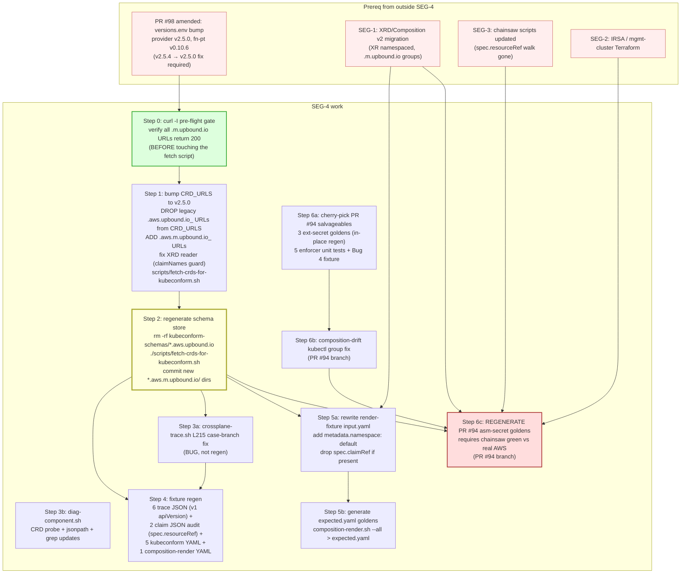

# 20 — SEG-4 plan: tooling regeneration

**Segment:** SEG-4 (kubeconform schema store + diagnostic scripts +
fixtures + PR #94 goldens).
**Author:** opus implementation-architect
**Status:** POST-REVIEW-R1
**Reviewers:** R1A (sequencing, REVISE-MINOR), R1B (correctness, REVISE-MAJOR)

## Revision log (R1)

| Item | Change |
|---|---|
| Version pin | `v2.5.4` → **`v2.5.0`** everywhere (v2.5.4 tag doesn't exist; latest is v2.5.0). All references updated in §2.2, §2.3 DAG labels, §3, §4, §7. |
| PR #98 amendment note | PR #98's `versions.env` pins `v2.5.4` — that pin is also wrong. PR #98 must be amended to use v2.5.0 before this segment starts. Added note in §2.3 and §6. |
| Pre-flight `curl -I` gate | Promoted from Open Q2 to **Step 0** of PR-T1. Executor must verify all URLs return 200 before editing the fetch script. Exact URL pattern confirmed: `https://raw.githubusercontent.com/crossplane-contrib/provider-upjet-aws/v2.5.0/package/crds/secretsmanager.aws.m.upbound.io_secrets.yaml` → 200. |
| Drop legacy URLs | v2.5.0 ships BOTH `.aws.upbound.io_*.yaml` (cluster-scoped, legacy) AND `.aws.m.upbound.io_*.yaml` (namespaced, v2). Fetch script must **explicitly remove** the legacy `.aws.upbound.io_` URLs from `CRD_URLS` — not merely rewrite them — otherwise the regenerated store contains dual schemas. Added explicit requirement in §2.2 schema-store section and §2.3 DAG Step 1 label. |
| `kind: ClusterProviderConfig` | Pre-committed. Kubeconform fixture edits hard-code `kind: ClusterProviderConfig`. Open Q2/SEG-1 cross-segment uncertainty resolved. |
| Trace fixture inventory | Complete: **14 files** (was listed as 6). Full list in §1 scope table. Files without v1 API groups (claim-*.json, provider-*.json, xr-empty-conditions.json) still require audit for `spec.resourceRef`/`spec.claimRef` v1 patterns; audit outcome recorded per file. |
| PR-T1 independence | Made explicit: PR-T1 does NOT block on SEG-1. Schemas derive from upstream URLs, not in-repo manifests. Statement added to §2.3. |
| XR namespace edit | §2.2 render-fixture section now commits to adding `metadata.namespace: default` — v2 namespaced XR is certain, not conditional. |
| #94 disposition | Pre-committed cross-segment decision: close #94, but PR-T3 **salvages 3 deterministic external-secret goldens in-place** (rename API group + adjust `providerConfigRef.kind`) and the **5 enforcer unit tests + Bug 4 fixture cherry-picked** onto SEG-4's branch. Only the 3 asm-secret goldens require live-chainsaw regen. |

---

## 1. Scope

Files this plan owns. Counts are the inventory the segment must touch
end-to-end:

| Group | Path(s) | Count | Touch type |
|---|---|---|---|
| Schema store | `kubeconform-schemas/{secretsmanager,ec2,eks,iam}.aws.upbound.io/` (delete) and 4 new `.m.upbound.io` siblings (generate) | 53 JSON files deleted + ~9 new files | delete-and-regenerate |
| Schema fetcher | `scripts/fetch-crds-for-kubeconform.sh` | 1 | edit (URL pins: v2.5.0, drop legacy URLs, add `.m.` URLs; XRD reader fix) |
| Trace script | `scripts/crossplane-trace.sh` | 1 | edit (bug fix L215 case-branch) |
| Trace fixtures — v1 apiVersion edit required | `tests/unit/fixtures/crossplane-trace/mr-ok.json`, `mr-access-denied.json`, `mr-failing-long.json`, `xr-ok.json`, `xr-with-mrs.json`, `xr-12-refs.json` | 6 | edit (apiVersion strings: `.aws.upbound.io` → `.aws.m.upbound.io`) |
| Trace fixtures — audit only, no v1 apiVersion | `tests/unit/fixtures/crossplane-trace/claim-ok.json`, `claim-failing.json` | 2 | audit `spec.resourceRef` (v2: XR is user-facing, no claim→XR walk); edit if present |
| Trace fixtures — no AWS group, no edit | `tests/unit/fixtures/crossplane-trace/provider-pkg.json`, `provider-pod-ok.json`, `provider-pod-sa-mismatch.json`, `provider-sa-ok.json`, `provider-sa-mismatch.json`, `xr-empty-conditions.json` | 6 | verify-only; no AWS apiVersion strings |
| Kubeconform fixtures | `tests/unit/fixtures/kubeconform/{should_pass_composition,should_fail_string_transform_no_type,should_fail_unknown_field,multi_doc_first_valid_second_invalid,should_pass_skip_header}.yaml` | 5 | edit (apiVersion + v1 fields; add `kind: ClusterProviderConfig`) |
| Composition-render fixture | `tests/unit/fixtures/composition-render/composition-missing-string-type.yaml` | 1 | edit (apiVersion + drop v1 fields + add `kind: ClusterProviderConfig`) |
| Render-fixture XR inputs | `crossplane/xrds/{platform-secret,platform-cluster}/render-fixtures/input.yaml` | 2 | rewrite (add `metadata.namespace: default`; drop `spec.claimRef` if present) |
| Render goldens | `crossplane/xrds/*/render-fixtures/expected.yaml` | 0 (bootstrap mode today) | generate net-new |
| Diag script | `scripts/diag-component.sh` | 1 | edit (jsonpath + grep + CRD probe) |
| Composition-render script | `scripts/composition-render.sh` | 1 | review-only (no v1 strings; depends on regenerated inputs) |
| PR #94 asm-secret goldens | `tests/chainsaw/platform-secret/{00,01,02}/expected/asm-secret.yaml` (on branch `origin/claude/auto-run-2026-05-25-phase-2-C4`) | 3 (×3 fields each = 9 edits) | regenerate from live chainsaw |
| PR #94 external-secret goldens (salvaged) | `tests/chainsaw/platform-secret/{00,01,02}/expected/external-secret.yaml` (on PR #94 branch) | 3 | deterministic in-place edit (rename API group + `providerConfigRef.kind`) |
| PR #94 enforcer unit tests + Bug 4 fixture (salvaged) | 5 unit test files + 1 fixture (on PR #94 branch) | 6 | cherry-pick onto SEG-4 branch |
| PR #94 meta-test | `tests/chainsaw/_meta/composition-drift/chainsaw-test.yaml` | 1 | edit (kubectl group string) |

Out of scope (owned by other segments): production XRDs/Compositions
under `crossplane/` (SEG-1); Terraform (SEG-2); the unit/integration/
chainsaw scripts themselves (SEG-3, except the C4 meta-test which
co-lives with the C4 goldens).

## 2. Migration approach

### 2.1 Strategy summary

The schema-store regen is the **hinge** of this segment — every fixture
update and every golden regen wants to validate against the new schemas,
and there's no point editing fixture `apiVersion` strings before the
schema store knows the new groups exist.

Two viable paths to obtain v2 CRDs:

| Path | Cost | Coverage | Determinism | Verdict |
|---|---|---|---|---|
| (a) Live v2 cluster (kind + provider apply, or hit a real dev cluster) | high (need a running provider, AWS creds for ProviderConfig) | complete — every installed CRD captured incl. transitive deps | depends on what's installed at scrape time | reject for first cut |
| (b) Pinned upstream CRD YAMLs (the `CRD_URLS` array in `fetch-crds-for-kubeconform.sh`) | low (`curl` only, no cluster) | exactly what we list | byte-deterministic — URLs are immutable refs | **adopt** |

Path (b) is cleaner: the fetch script already supports it as a fallback,
the pinned-URL approach is what the schema store has always actually
been built from in CI, and v2.5.0 provider-family-aws ships the v2 CRDs
under the `.m.upbound.io` group at the same upstream repo
(`crossplane-contrib/provider-upjet-aws`) just at a new tag. We bump
the URL pins from `v1.12.0` → `v2.5.0` and rewrite the URL path from
`.aws.upbound.io_` to `.aws.m.upbound.io_`.

Live-cluster mode (path a) is preserved as an opt-in escape hatch (the
fetch script auto-detects `kubectl version`), so anyone with a real v2
cluster can regenerate from it. But CI and the canonical store both run
from the pinned URLs.

### 2.2 Per-area approach

**Schema store.** The fetch script `CRD_URLS` array requires two changes:

1. **Remove legacy `.aws.upbound.io_*.yaml` URLs** — v2.5.0 ships BOTH
   the old cluster-scoped (`*.aws.upbound.io_*.yaml`, `scope: Cluster`)
   and new namespaced (`*.aws.m.upbound.io_*.yaml`, `scope: Namespaced`)
   CRDs at the same tag for back-compat. The URL-path rewrite alone is
   insufficient — if both URL sets remain in `CRD_URLS`, the regen
   script will download and install both, producing a dual-schema store.
   Legacy URLs must be **deleted from `CRD_URLS`**, not rewritten.

2. **Add the new `.aws.m.upbound.io_*.yaml` URLs** at tag `v2.5.0` (e.g.,
   `secretsmanager.aws.m.upbound.io_secrets.yaml`, `iam.aws.m.upbound.io_roles.yaml`,
   etc.) for each managed resource the repo uses.

After updating `CRD_URLS`: bump function-patch-and-transform pin to
v0.10.6 (the same version PR #98 puts in `versions.env`). **Delete the
four old `*.aws.upbound.io/` schema directories** (53 files) — they
will reappear if we don't actively prune. Concrete invocation:

```bash
rm -rf kubeconform-schemas/*.aws.upbound.io
./scripts/fetch-crds-for-kubeconform.sh
```

Commit the new schemas plus the deletion in one PR.

**Fetcher XRD-reader fix.** Lines 196–222 read `spec.claimNames.kind`
from each XRD to also write the claim's schema. In v2 XRDs there is no
`claimNames` — the XR is the user-facing kind. Simplify the loop to
emit only the XR kind. Drop the `(x_kind, claim_kind)` tuple iteration.
Keep the read tolerant of `claimNames` being absent (guard with
`if spec.claimNames?`) rather than removing the field read entirely —
defensive against mixed-version XRDs during the rollout.

**crossplane-trace.sh bug fix (L215).** The case glob
`secretsmanager.aws.upbound.io|*.aws.upbound.io|aws.upbound.io` doesn't
match `.m.upbound.io` groups (the `.m.` infix breaks the glob), so the
PROVIDER and IRSA layers silently disappear for any v2 MR. **This is a
code bug, not a regen.** Replace with a pattern that matches both:

```bash
case "$group" in
  *.aws.upbound.io|aws.upbound.io|*.aws.m.upbound.io|aws.m.upbound.io)
    echo "upbound-provider-family-aws" ;;
```

Keep v1 alternatives in the case for two reasons: (1) defensive — a
fresh-cluster trace might still observe a stale v1 CRD before the v2
provider drops them; (2) the unit-test fixtures cover both shapes after
the regen so the case must accept both.

**Trace JSON fixtures — full inventory of 14 files.**

Files requiring apiVersion edits (6 — `secretsmanager.aws.upbound.io/v1beta1`
→ `secretsmanager.aws.m.upbound.io/v1beta1`):

- `mr-ok.json`
- `mr-access-denied.json`
- `mr-failing-long.json`
- `xr-ok.json`
- `xr-with-mrs.json`
- `xr-12-refs.json`

Files requiring audit for `spec.resourceRef` / `spec.claimRef` (2 — use
`platform.k8-platform.io/v1alpha1` which is our own group, unchanged,
but these carry claim→XR walk fields that disappear in v2):

- `claim-ok.json` — carries `spec.resourceRef`; under v2 the XR is the
  user-facing object, so `spec.resourceRef` no longer exists on a claim.
  Update the fixture to reflect v2 shape (drop or update the field).
- `claim-failing.json` — same audit and update as `claim-ok.json`.

Files with no AWS groups and no v2-breaking fields (6 — verify-only,
no edits expected):

- `provider-pkg.json` — `pkg.crossplane.io/v1` only
- `provider-pod-ok.json` — core `v1` only
- `provider-pod-sa-mismatch.json` — core `v1` only
- `provider-sa-ok.json` — core `v1` only
- `provider-sa-mismatch.json` — core `v1` only
- `xr-empty-conditions.json` — `platform.k8-platform.io/v1alpha1` only;
  carries `spec.resourceRefs: []` (list, not singular `resourceRef`) —
  this field exists on XRs in both v1 and v2; no change needed.

The mock kubectl shim dispatches on `kind_lc/name` not apiVersion, so
no shim change is needed (per 13-impact-test-infra §test_crossplane_trace).

**Kubeconform fixtures.** Five fixture YAMLs that exercise the meta-
test paths. Apply the apiVersion bump *and* drop v1 fields
(`deletionPolicy`, bare `providerConfigRef: name:` without `kind:`)
where present, and add `kind: ClusterProviderConfig` to `providerConfigRef`
(pre-committed decision). Otherwise the regenerated schemas will reject
them via the meta-test's `should_fail_unknown_field.yaml` (unknown-field
rejection now triggers on the wrong field).

**composition-render meta-test fixture.** Apply the same bump
(apiVersion + drop `deletionPolicy` + add `kind: ClusterProviderConfig`
to `providerConfigRef`). The fixture's purpose is to verify
`crossplane render` exits non-zero on a missing
`string transform type` — that bug is API-group-independent, but the
fixture must not fail earlier for unrelated v1 reasons.

**Render-fixture XR inputs (`crossplane/xrds/*/render-fixtures/input.yaml`).**
These use `platform.k8-platform.io/v1alpha1` for the XR — that's our
own group, not an AWS group, so the apiVersion itself is unchanged.
Required edits (v2 namespaced XR is certain per 00-situation §4):

- Add `metadata.namespace: default` (or the dedicated test namespace SEG-1
  defines — coordinate, but `default` is the safe baseline).
- Drop `spec.claimRef:` block if present (v2 XRs are themselves the
  user-facing object; no separate claim object).
- The `metadata.uid` pin stays — it's the load-bearing reproducibility
  hack.

This is a **hard coordination point with SEG-1**: this segment can't
finalize the input.yaml shape until SEG-1 lands the XRD migration.
Easiest sequencing: SEG-1 lands first, this segment rebases on top.

**Render goldens (`expected.yaml`).** Currently none exist (the
helper is in bootstrap mode). SEG-1's XRD changes will determine the
render output shape. Once SEG-1 + this segment's input.yaml rewrite
are merged, run `scripts/composition-render.sh --all` against the v2
manifests, redirect the output into per-fixture `expected.yaml`, and
commit. **This is the right time to create the goldens** — bootstrap
mode is what the helper was designed for.

**diag-component.sh.** Three v1 patterns:
- L64: CRD probe list contains `secrets.secretsmanager.aws.upbound.io`
  → change to `.m.upbound.io`.
- L59–60: probes `platformsecrets` / `xplatformsecrets` claim+XR pair
  — under v2 only `xplatformsecrets` exists (no claim CRD). Drop the
  `platformsecrets.platform.k8-platform.io` probe.
- L94–95: jsonpath `.spec.resourceRef.name` for XR lookup — v2 has no
  `spec.resourceRef` on the XR (it IS the user-facing object). Replace
  the claim→XR walk with a direct `kubectl get xplatformsecret -n
  $CLAIM_NS $CLAIM_NAME`. Same rewrite applies to L99–106.
- L105: `kubectl get secrets.secretsmanager.aws.upbound.io` → `.m.`.

This is a script edit, but it's small enough to ride with the
schema-store regen PR.

**PR #94 disposition (pre-committed).** Close PR #94. PR-T3 branch
cherry-picks the following in-place salvageable items from the PR #94
branch before the PR closes:

- **3 deterministic external-secret goldens** (`tests/chainsaw/platform-secret/{00,01,02}/expected/external-secret.yaml`)
  — deterministic; regen in-place by renaming API group
  (`secretsmanager.aws.upbound.io` → `secretsmanager.aws.m.upbound.io`) +
  adjusting `providerConfigRef.kind: ClusterProviderConfig`. No live
  chainsaw needed.
- **5 enforcer unit tests** — cherry-pick onto SEG-4 branch.
- **Bug 4 fixture** — cherry-pick onto SEG-4 branch.

**3 asm-secret goldens** (`tests/chainsaw/platform-secret/{00,01,02}/expected/asm-secret.yaml`)
contain volatile AWS-shape fields that require live chainsaw regen.
These are the only PR #94 items that block on a working v2 AWS stack.

**composition-drift meta-test (PR #94).** Single edit:
`kubectl get secret.secretsmanager.aws.upbound.io` →
`kubectl get secret.secretsmanager.aws.m.upbound.io`. Rides with the
golden regen PR.

### 2.3 Dependency DAG



**Note on PR-T1 independence:** PR-T1 (Steps 0–4 + 3a/3b) does **not**
block on SEG-1. Schemas derive from upstream CRD URLs, not from in-repo
manifests. PR-T1 can land before SEG-1 and in fact enables SEG-1 authors
to run `test_kubeconform_manifests.sh` locally against the new store to
validate their manifest changes.

### 2.4 Suggested PR slicing

| PR | Contents | Depends on |
|---|---|---|
| **PR-T1** "schema store regen + script fixes" | Step 0 pre-flight `curl -I` matrix (gate, not committed); fetch-crds-for-kubeconform.sh URL bumps (drop legacy, add v2.5.0 `.m.` URLs) + XRD reader fix; regenerated schema store (delete old, add new); crossplane-trace.sh L215 fix; diag-component.sh updates; all 6 trace JSON apiVersion edits + 2 claim JSON audits; all 5 kubeconform fixtures (with `kind: ClusterProviderConfig`); composition-render meta-test fixture | PR #98 **amended** to v2.5.0 and merged; NO dependency on SEG-1 |
| **PR-T2** "render-fixture inputs + goldens" | crossplane/xrds/*/render-fixtures/input.yaml rewrites (namespace + claimRef drop); first-time expected.yaml goldens | SEG-1 merged; PR-T1 merged |
| **PR-T3** "C4 golden regen + salvage" (on `origin/claude/auto-run-2026-05-25-phase-2-C4`) | Cherry-pick salvageables from PR #94 (3 ext-secret goldens in-place regen; 5 enforcer unit tests; Bug 4 fixture); composition-drift kubectl-group fix; 3 asm-secret.yaml goldens regenerated from live chainsaw | SEG-1, SEG-2, SEG-3, PR-T1 all merged; chainsaw green on fresh AWS account |

## 3. Open questions

1. **Cross-segment seam with SEG-1: does the namespaced XR keep
   `spec.claimRef`?** v2 namespaced XRs technically don't need it (the
   XR's own namespace == the user's namespace). If SEG-1 drops
   `claimRef` from the XRD spec, the render-fixture input.yaml must
   drop it too, and Composition patches reading `spec.claimRef.namespace`
   change to a literal or to a `metadata.namespace` reference. Need
   confirmation from SEG-1's plan.

2. ~~**Does `provider-family-aws` v2.5.4 actually publish CRDs…**~~ —
   **RESOLVED (R1):** URL pattern verified: tag is v2.5.0 (not v2.5.4).
   Exact URL confirmed 200:
   `https://raw.githubusercontent.com/crossplane-contrib/provider-upjet-aws/v2.5.0/package/crds/secretsmanager.aws.m.upbound.io_secrets.yaml`.
   Pre-flight `curl -I` gate (Step 0) verifies all URLs before any
   edits are made.

3. **Does the v2 ProviderConfig CRD ship under the family-aws package or
   a separate sub-package?** This matters for the URL list — if it's
   separate we need a 13th URL for ProviderConfig schema (currently
   none — ProviderConfig was always pulled from the cluster, not the
   schema store).

4. **For PR #94 goldens: who owns the chainsaw run?** This segment owns
   the file edits, but the actual chainsaw run requires AWS creds and
   the full SEG-1/2/3 stack working. If SEG-3 includes the chainsaw run
   as part of its acceptance, the PR-T3 work might just be "diff the
   output of the SEG-3 run into committed goldens." Coordinate.

5. **Do we keep both v1 *and* v2 schemas in the store during a
   transition period?** — **RESOLVED (R1):** Hard cutover. Legacy
   `.aws.upbound.io_` URLs are removed from `CRD_URLS` and the old
   directories are deleted in PR-T1. Any in-flight PR touching v1
   manifests will go red until rebased — acceptable; this is the correct
   behavior to catch staleness.

6. **PR #98 amendment:** PR #98's `versions.env` currently pins `v2.5.4`
   which doesn't exist. PR #98 must be amended to `v2.5.0` before
   PR-T1 can start. Track as a blocking pre-requisite.

## 4. Failure recovery

| Failure | Recovery |
|---|---|
| Pre-flight `curl -I` returns 404 on a new v2 URL (URL path scheme changed from expected) | Manually inspect `https://github.com/crossplane-contrib/provider-upjet-aws/tree/v2.5.0/package/crds`, update the URL template in the fetch script. If the structure is fundamentally different (e.g. per-resource sub-packages), regenerate via path (a) — spin up a kind cluster, `kubectl apply` the provider, scrape live CRDs. Do NOT proceed past Step 0 until all URLs return 200. |
| `fetch-crds-for-kubeconform.sh` returns 404 after Step 0 passed (transient) | Retry. The URLs are immutable refs at a pinned tag; a 404 after a successful `curl -I` indicates a transient network issue. |
| Regenerated schemas reject a previously-passing v2 manifest with `additionalProperties false` (the `harden_schema` transformation is too aggressive for some v2 shape) | Add the offending path to the `x-kubernetes-preserve-unknown-fields: true` opt-out list inside the original CRD, OR loosen the converter at the specific node. The transformation is load-bearing (it catches Bug 1 typos) so don't remove it wholesale. |
| `crossplane render` against v2 Compositions/XRDs fails with `function input rejected` or `unknown field` (function-pt v0.10.6 has stricter validation than v0.8.2) | Bisect with the Composition diff in isolation. The render-fixture inputs are minimal so the failure is usually in the Composition itself (SEG-1 scope) — kick back to SEG-1. |
| Chainsaw run for PR #94 goldens passes locally but the captured MR shape differs from CI's run (region, account ID, UID leak) | Re-confirm the chainsaw normalization (the spec lists exactly which fields to strip: uid, resourceVersion, creationTimestamp, ownerReferences, managedFields, status). If a new field leaks through, extend the normalization script in `composition-render.sh` and re-capture — the two specs share a normalizer. |
| crossplane-trace.sh L215 fix introduces a regression for the v1 fixture tests (now both v1 and v2 should map to the same provider) | The case-branch keeps both alternatives, so v1 fixtures still resolve `upbound-provider-family-aws`. Unit tests should be green. If they go red, the unit test is asserting on a path that doesn't go through the case branch — investigate the failure. |
| Schema-store regen produces a different directory layout than expected (e.g. v2 CRDs have a different `spec.group` than just `.m.` prefix) | The fetch script derives the directory from `spec.group` directly, so whatever the CRD declares is what we get. If a Composition uses a different group than the CRD declares, kubeconform will skip — surface this early with a `find kubeconform-schemas -type d` diff in the PR. |
| Dual schemas appear in the store (both `.aws.upbound.io` and `.aws.m.upbound.io`) | The pre-flight Step 0 didn't catch a legacy URL left in `CRD_URLS`. Run `find kubeconform-schemas -type d` — if both groups appear, re-audit `CRD_URLS` and remove all remaining legacy entries before re-running the fetch script. |

## 5. Hot files

Files most likely to change repeatedly during execution (avoid stacking
two open PRs that both touch them):

1. `scripts/fetch-crds-for-kubeconform.sh` — touched by PR-T1; any
   subsequent provider/version bump will re-touch it. Single owner: this
   segment.
2. `kubeconform-schemas/**` — regenerated by PR-T1, can be re-regen'd
   by any future schema-affecting PR. Treat as generated; never
   hand-edit.
3. `scripts/crossplane-trace.sh` — line 215 only; rest of the script is
   stable. Conflicts unlikely.
4. `tests/chainsaw/platform-secret/{00,01,02}/expected/asm-secret.yaml`
   — lives on the PR #94 branch; will conflict with anything else that
   branch carries.
5. `crossplane/xrds/*/render-fixtures/input.yaml` — first edit in this
   segment + first edit ever by SEG-1 if SEG-1 changes XR shape.
   Sequence carefully.

## 6. Cross-segment dependencies

| From | To | Why |
|---|---|---|
| **PR #98 amended to v2.5.0** → **SEG-4** (PR-T1) | hard | PR #98's current v2.5.4 pin doesn't exist; amendment required before SEG-4 executes |
| **SEG-1** → **SEG-4** (PR-T2, PR-T3) | hard | render-fixture inputs and PR #94 goldens depend on the actual production XRD/Composition v2 shape |
| **SEG-2** → **SEG-4** (PR-T3) | hard | C4 golden regen needs a working v2 cluster, which requires SEG-2's IRSA / management-cluster Terraform updates |
| **SEG-3** → **SEG-4** (PR-T3) | hard | chainsaw scripts must be updated to v2 idioms (no `spec.resourceRef` walk) before chainsaw can run green to produce goldens |
| **SEG-4 PR-T1** → **SEG-3** | weak | SEG-3's unit tests will validate against the new schema store; if SEG-3 lands first against the old store, the new schemas may cause test churn |
| **SEG-4 PR-T1** → **SEG-1 verification** | weak | SEG-1 manifest authors will want to run `test_kubeconform_manifests.sh` locally against the new store to validate their changes; PR-T1 enables that loop. PR-T1 does NOT block on SEG-1. |

## 7. Estimated execution time

| Step | Engineer-time | Wall-clock | Notes |
|---|---|---|---|
| 0. Pre-flight `curl -I` URL matrix | 15 min | 15 min | gate; required before any edits |
| 1. URL pin bump + legacy URL removal + XRD reader fix in fetch script | 30 min | 30 min | small edit; Step 0 already confirmed URLs |
| 2. Schema store regen (run fetch script, delete old dirs, commit ~62 files) | 30 min | 30 min | mechanical |
| 3a. crossplane-trace.sh L215 bug fix | 15 min | 15 min | trivial; unit tests already cover the case |
| 3b. diag-component.sh updates | 30 min | 30 min | 3 distinct edits + manual smoke |
| 4. Fixture regen (14 files: 6 apiVersion edits + 2 claim audits + 5 kubeconform YAML + 1 render YAML) | 1 hr | 1 hr | mechanical edits + run unit tests |
| **PR-T1 subtotal** | **3 hr** | **3 hr** | one PR, single reviewer |
| 5a. Render-fixture input.yaml rewrites | 30 min | depends on SEG-1 wall-clock | blocked until SEG-1 merges |
| 5b. Generate expected.yaml goldens | 30 min | 30 min | `composition-render.sh --all` + commit |
| **PR-T2 subtotal** | **1 hr** | **+ SEG-1 wait** | sequence after PR-T1 |
| 6a. Cherry-pick PR #94 salvageables (3 ext-secret goldens + enforcer tests + Bug 4 fixture) | 30 min | 30 min | deterministic edits; no cluster needed |
| 6b. composition-drift kubectl group fix | 10 min | 10 min | one line |
| 6c. C4 asm-secret golden regen (chainsaw against real AWS) | 1 hr edit + 30 min chainsaw + 30 min normalization | 2–4 hr (kind cluster bootstrap + AWS creds + chainsaw scenarios 00/01/02 each run ~5 min) | **highest risk** — flake-prone |
| **PR-T3 subtotal** | **2.25 hr** | **2–4 hr + SEG-1/2/3 wait** | on PR #94 branch |
| **Segment total** | **~6.25 hr** | **~6 hr** plus blocking on other segments | three PRs, mostly serial |

The wall-clock is dominated by waiting on SEG-1 (manifest migration) and
the AWS chainsaw flake risk. The pure-edit work is < 6 hours of focused
time.
