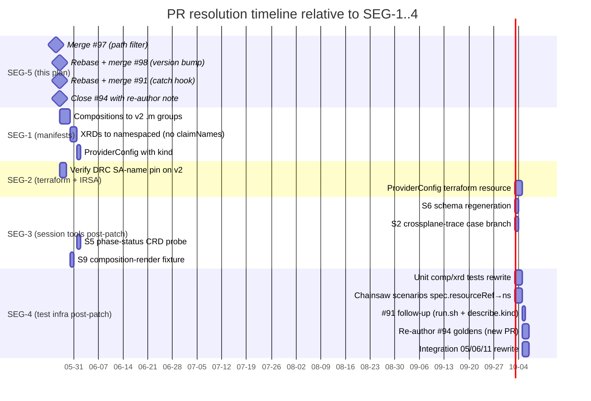

# 20 — Plan SEG-5: In-flight PR reconciliation strategy

**Author:** implementation architect (SEG-5)
**Date:** 2026-05-26
**Scope:** Decide disposition for the 4 currently-open PRs (#91, #94, #97, #98) and
enumerate the post-v2 follow-up patches owed by the 8 already-merged session PRs.
**Out of scope:** the patches themselves (SEG-1/2/3/4 own those) and branch-protection mechanics.

---

## 1. TL;DR — recommended disposition

| PR | Title | Recommendation | Owner segment |
|---|---|---|---|
| **#97** | kubeconform render-fixtures path filter | **Merge as-is, FIRST** (independent fix, currently red on main) | SEG-5 (this plan) |
| **#98** | Provider/function version bump v1.12.0 → v2.5.4 | **Merge SECOND** as the entry point of the migration; immediately freeze chainsaw heavy-CI behind `_smoke` filter while SEG-1/SEG-2 work | SEG-5 → SEG-1 |
| **#91** | SPEC-A4 chainsaw catch hook | **Merge-then-amend.** Catch-block logic is API-group-agnostic. Two pin-point follow-ups (run.sh ProviderConfig group; literal `describe.kind: PlatformSecret` in catch block) move to SEG-4. | SEG-5 merge → SEG-4 amend |
| **#94** | SPEC-C4 chainsaw golden files (stacks on #91) | **Close without merging; re-author against v2 shape in SEG-4.** Goldens hard-code v1 apiVersion + `deletionPolicy` + bare `providerConfigRef` across 6 files. Cheaper to regenerate from a green v2 chainsaw run than to rebase. Keep the unit-test scaffolding (5 enforcer tests) by cherry-picking onto SEG-4's re-authored branch. | SEG-4 (re-author) |

**Most contentious decision:** #94. Closing-and-re-authoring throws away the unit-test scaffolding visibly, even though we'll cherry-pick it. The alternative — keeping #94 open as a placeholder, then force-pushing a v2 rewrite — preserves PR history but invites stale-review confusion (the open review threads on the v1 goldens become meaningless). Trade-off is review hygiene vs. PR-link continuity. Recommendation lands on **close** because the v2 goldens require a green chainsaw run (gated on SEG-1 landing), and a 2-week-stale "rebase-after-SEG-1" PR causes more confusion than a fresh PR linked back via "Re-authoring of #94 against v2 shape."

---

## 2. State-transition diagram — per open PR

```mermaid
stateDiagram-v2
    [*] --> open

    state "open" as open

    state PR97 {
        [*] --> open97 : opened 2026-05-25
        open97 --> merge_clean : path-filter fix; v2-agnostic
        merge_clean --> [*]
    }

    state PR98 {
        [*] --> open98 : opened 2026-05-26
        open98 --> rebase_on_97 : rebase onto post-#97 main
        rebase_on_97 --> merge_entry_point : SEG-1 gate opens
        merge_entry_point --> [*]
    }

    state PR91 {
        [*] --> open91 : opened 2026-05-25
        open91 --> rebase_on_98 : pick up #98 first
        rebase_on_98 --> merge_with_asterisks : catch logic is v1-agnostic; cite SEG-4 follow-ups in merge comment
        merge_with_asterisks --> seg4_amend : SEG-4 patches run.sh ProviderConfig group + describe.kind
        seg4_amend --> [*]
    }

    state PR94 {
        [*] --> open94 : opened 2026-05-25 (stacked on #91)
        open94 --> rebase_to_main : auto-retarget when #91 merges
        rebase_to_main --> close_no_merge : v1 goldens cannot be salvaged
        close_no_merge --> seg4_reauthor : SEG-4 re-authors against green v2 chainsaw run
        seg4_reauthor --> new_pr_merged : new PR cherry-picks the 5 enforcer tests
        new_pr_merged --> [*]
    }
```

Legend:
- `merge_clean` — merge as-is, no rework.
- `merge_with_asterisks` — merge despite known v1 residue, with explicit SEG-4 follow-up tickets.
- `close_no_merge` — close the PR, cherry-pick the salvageable parts into a fresh branch.

---

## 3. Timeline relative to SEG-1/2/3/4 milestones



Key sequencing constraints:

1. **#97 unblocks main.** It's currently red because S6's audit catches the render fixtures. Merging it makes subsequent CI signal legible.
2. **#98 must merge before #91.** #91 wants a clean rebase target and the v2 provider package available so its meta-test runs against the actual target stack.
3. **#94 re-author waits for SEG-1 + SEG-4 chainsaw scenario rewrite.** You cannot author goldens until `chainsaw run` produces a green v2 MR to capture.
4. **SEG-2 ProviderConfig terraform work waits on SEG-1's `kind:` field decision.** SEG-2 needs to know whether to provision `ProviderConfig` or `ClusterProviderConfig`.

---

## 4. Per-PR detailed analysis

### 4.1 PR #97 — kubeconform render-fixtures path filter

**Verdict:** **Merge as-is, immediately, ahead of #98.**

- Single-file structural fix (`tests/unit/test_kubeconform_manifests.sh`) adds `-not -path '*/render-fixtures/*'` to the audit's `find` invocation.
- Zero references to AWS API groups; the change is path-shaped, not schema-shaped.
- Main is red until this lands (S6 audit flags both render fixtures as `schemaInvalid` because they include `spec.claimRef`).
- Post-v2 implication: render-fixtures will be REGENERATED (SEG-3 task S9) but they will still be excluded by this path filter — the structural argument ("offline render fixtures are not authored cluster manifests") survives the v2 migration unchanged.

**Action:** Approve and merge. No rebase needed (PR is already against the current `main` SHA `f25f790`).

---

### 4.2 PR #98 — provider/function version bump

**Verdict:** **Rebase onto post-#97 main, merge SECOND. This is the migration entry point.**

- Changes 8 lines across `terraform/management/variables.tf` and `tests/chainsaw/versions.env`. No manifest, no script, no test logic.
- Per `00-situation.md` §5 and `12-impact-terraform-infra.md`: `terraform apply` succeeds; the v2 provider package installs cleanly; the chainsaw `PendingExternalResource` symptom disappears and is replaced by a DIFFERENT, useful failure mode (admission rejection on v1 manifests).
- The replacement failure mode is the diagnostic the project needs — it surfaces the gap that SEG-1/2/3/4 close.
- IRSA SA-name pin risk (DRC override may not survive v2 — `12-impact §IRSA-SA pinning`) is THE single biggest open question post-merge. SEG-2 verifies this within 48h of #98 landing; if it breaks, all SEG-1 work is blocked behind a one-line `DeploymentRuntimeConfig` SA name adjustment.

**Pre-merge guard:** confirm `_smoke`-only chainsaw filter is in place on `main` so heavy CI does not flap red between #98 merge and SEG-1 completion.

**Action:** Rebase onto post-#97 main (trivial — no overlap). Merge. Announce the freeze in PR comment.

---

### 4.3 PR #91 — SPEC-A4 chainsaw catch hook

**Verdict:** **Merge-then-amend.** Rebase onto post-#98 main; merge despite two known v1 residues; file a SEG-4 follow-up ticket for the residues.

**Why merge despite v1 residues:**

The catch block's core value (post-mortem dump on red chainsaw scenarios) is API-group-agnostic. It walks `spec.resourceRefs` and uses kubectl with generic resource names. The enforcer unit test (`test_chainsaw_catch_block.sh`) verifies the verbatim block was pasted into every scenario — that contract is what the rest of the migration depends on. Holding this PR open until the v2 migration is done means SEG-1/SEG-4 chainsaw scenario rewrites land WITHOUT the catch-block enforcer in place, and we lose ~2 weeks of post-mortem coverage at the exact moment failures will spike.

**Known v1 residues that move to SEG-4:**

1. **`tests/chainsaw/run.sh` L230** — ProviderConfig heredoc uses `apiVersion: aws.upbound.io/v1beta1`. Must become `aws.m.upbound.io/v1beta1`. (Per `13-impact §run.sh`.)
2. **Literal `describe.kind: PlatformSecret`** in the catch block — the catch block describes the claim kind by name. v2 removes `PlatformSecret` as a CRD (claim/XR merge). Three options for SEG-4:
   - (a) drop the `describe PlatformSecret` line entirely (the `describe xplatformsecret` line below it covers the namespaced XR);
   - (b) rename to `xplatformsecret`;
   - (c) keep both and tolerate the not-found error for the claim line.
   Recommendation: **(a)** — cleanest; the v2 namespaced XR IS the user-facing resource, the claim description was a v1-era luxury.

**Hard rule resolution:** the brief asks "rebase or merge-then-amend?" — recommendation is **merge-then-amend**, because (i) the catch block fires correctly on v1 today and will fire correctly on v2 after the two pin-point amendments, and (ii) the amendments are mechanical and atomic enough to live in the SEG-4 PR alongside the chainsaw scenario rewrites. Rebasing in-place would mean holding the PR open while two other segments land, and the rebase-conflict surface grows linearly with delay.

**Action:** Rebase onto post-#98 main. Add a `## v2 follow-up` section to the PR body enumerating the two residues + their SEG-4 owners. Merge. Open SEG-4 tracking issue.

---

### 4.4 PR #94 — SPEC-C4 chainsaw golden files

**Verdict:** **Close without merging. Re-author in SEG-4 against a green v2 chainsaw run. Cherry-pick the unit-test scaffolding.**

**Why not rebase + partial rework:**

The 6 golden YAML files (3 scenarios × {asm-secret, external-secret}) are the WHOLE diff that matters. Every one hardcodes:

- `apiVersion: secretsmanager.aws.upbound.io/v1beta1` → must become `.m.upbound.io/v1beta1`
- `deletionPolicy: Delete` → must be removed (v2 drops `deletionPolicy` on namespaced MRs)
- `providerConfigRef: { name: default }` → must add `kind: ClusterProviderConfig` (or namespaced ProviderConfig)
- `metadata.name` is derived from XR UID — under v2 the XR is namespaced; the UID-derivation may or may not survive (depends on SEG-1's compositeTypeRef rewrite)

These aren't isolated string substitutions — they're contract assertions over a manifest shape that SEG-1 is materially restructuring. Authoring the v2 goldens REQUIRES a green chainsaw run against the v2 Compositions to capture the actual rendered MR shape. That gate is exactly the SEG-1+SEG-4 milestone.

**What we keep (salvage list):**

5 unit-test scaffolding scripts under `tests/unit/`:
- `test_chainsaw_golden_files_present.sh`
- `test_golden_no_volatile_fields.sh`
- `test_golden_has_spec_forProvider.sh`
- `test_chainsaw_assert_references_golden.sh`
- `test_golden_region_uses_binding.sh`
- `test_chainsaw_golden_catches_bug4.sh`

Plus `tests/fixtures/compositions/platform-secret-pre-pr61.yaml` (Bug 4 replay fixture — its v1 shape is INTENTIONAL because it represents pre-PR-#61 history; this file does NOT need updating).

Plus `tests/chainsaw/_meta/composition-drift/chainsaw-test.yaml` — needs the v1 `kubectl get secret.secretsmanager.aws.upbound.io` updated to `.m.upbound.io`, otherwise structurally sound.

**What we throw away:**

The 6 golden YAMLs themselves and the `assert: { file: ... }` wiring in the 3 platform-secret scenarios. SEG-4 regenerates these from a green v2 chainsaw run.

**Hard rule resolution:** the brief asks "abandon and re-author OR keep open as placeholder?" — recommendation is **close** with explicit re-author plan in SEG-4. A 2-week-stale placeholder PR confuses reviewers; reviewers will keep trying to "fix" the v1 goldens. A closed PR with a link to the SEG-4 successor is unambiguous.

**Action:** Close #94. Cherry-pick the 7 salvage files (6 enforcer scripts + 1 Bug 4 fixture) onto the SEG-4 working branch. Re-author the goldens after SEG-1 + SEG-4's chainsaw-scenario-rewrite produces a green run.

---

## 5. Already-merged PRs — follow-up patch enumeration

Each merged PR introduced code that bakes in v1 patterns. SEG-3 (session tools) and SEG-4 (test infra) own the patches. SEG-5's job here is just enumeration — what owes what.

| Merged PR | Spec | What it added | Follow-up owed | Owner segment |
|---|---|---|---|---|
| **#85** | SPEC-S4 | `scripts/whereami.sh`, `scripts/_lib/aws-cli-helpers.sh` | **None.** `OK-SYNTACTIC` per `10-impact §S4`. | — |
| **#86** | SPEC-S7 | `scripts/wait-for-claim.sh`, `scripts/_lib/k8s-helpers.sh` | **None functional**, but every CALLER (integration 05/06/11) passes v1 group names — caller fix is SEG-4. Script itself is generic. | SEG-4 (callers) |
| **#87** | SPEC-S9 | `scripts/composition-render.sh`, render-fixture inputs, meta-test fixture | (1) `tests/unit/fixtures/composition-render/composition-missing-string-type.yaml` — v1 apiVersion + `deletionPolicy` + bare `providerConfigRef` (3 fixes). (2) Render fixture inputs under `crossplane/xrds/*/render-fixtures/input.yaml` use v1 XR shape (`spec.claimRef`) — regenerate against v2 XRDs. | SEG-3 |
| **#88** | SPEC-S3 | `scripts/irsa_trust_validator.py`, IRSA fixtures | **None.** `OK-SYNTACTIC` per `10-impact §S3`. | — |
| **#89** | SPEC-S10 | `docs/runbooks/runbook-apply-zero-resources.md` | **None.** Provider deployment name unchanged across v1/v2. | — |
| **#90** | SPEC-S5 | `scripts/phase-status.sh` | Phase 2 probe at L230/L246 reads `kubectl get crd platformsecrets.platform.k8-platform.io` — v2 removes this CRD. **Re-point probe to `xplatformsecrets.platform.k8-platform.io` (XR CRD, which v2 keeps).** | SEG-3 |
| **#92** | SPEC-S2 | `scripts/crossplane-trace.sh`, 6 fixture JSONs | (1) `provider_for_apiversion()` case branch L215 — pattern `*.aws.upbound.io` misses `.m.upbound.io`. Add `*.aws.m.upbound.io` arm. (2) All 6 fixture JSONs (`mr-*.json`, `xr-*.json`) — `secretsmanager.aws.upbound.io/v1beta1` → `.m.upbound.io/v1beta1` (17 occurrences). | SEG-3 |
| **#93** | SPEC-S6 | `scripts/fetch-crds-for-kubeconform.sh`, `kubeconform-schemas/**` (53 files) | (1) `fetch-crds-for-kubeconform.sh` L131–141 — 7 CRD URLs pinned to `v1.12.0` of `provider-upjet-aws`. Must repoint to the v2.5.4 Upbound provider CRD source (likely `upbound/provider-aws-*` repo, NOT `crossplane-contrib/provider-upjet-aws` — verify package source). (2) XRD extractor L210 reads `spec.get("claimNames")` — drop or repoint to the namespaced XR's own kind. (3) Re-run the script and commit the regenerated `kubeconform-schemas/` (old v1 group directories deleted, new `.m.upbound.io` directories added). (4) Update 5 kubeconform fixture YAMLs under `tests/unit/fixtures/kubeconform/` to v2 apiVersions. | SEG-3 + SEG-4 (fixtures) |
| **#95** | retro | retrospective document | **None.** Documentation; captures history. |  — |
| **#96** | (gap in numbering — appears to be a closed-without-merge or housekeeping PR) | n/a | n/a | — |

Total follow-up patches owed by merged PRs: **5 PRs need patches (#87, #90, #92, #93, plus #86 indirectly via callers).** 3 are no-ops (#85, #88, #89). #95 is documentation.

---

## 6. Risks & open questions

1. **#98's IRSA-SA-name pin survives v2?** Per `12-impact §IRSA-SA pinning`, this is the highest-impact unknown. Mitigation: SEG-2 verifies within 48h; if broken, terraform-side fix is one DRC field change.
2. **SEG-1 timing for #94 re-author.** If SEG-1's XRD rewrite takes longer than 5 days, the SEG-4 golden-file re-author slips. Goldens cannot be authored against a broken Composition. No mitigation other than gating SEG-4d on SEG-1.
3. **Closing #94 vs. force-push rewrite.** Reviewers may have already invested time reviewing v1 goldens. Mitigation: post a closure comment that explicitly says "the unit-test scaffolding is preserved; only the 6 YAML goldens are being regenerated."
4. **`tests/chainsaw/run.sh` is touched by #91 (catch-block enforcer) AND by SEG-4 (ProviderConfig group fix).** Both edits hit the same file. If #91 merges first as recommended, SEG-4's edit lands cleanly on top. If ordering inverts, manual conflict resolution.
5. **PR #96 numbering gap.** Brief lists 8 merged session PRs and identifies #95 as the retro. Check: is #96 a real PR that's closed, or just a numbering skip? Worth confirming before SEG-5 actions begin — does not affect dispositions but affects retro completeness.

---

## 7. Sequencing summary (the actionable list)

1. **Today:** merge #97 (red main → green main).
2. **Today:** rebase #98 onto post-#97 main, merge it, post freeze announcement.
3. **Today+1:** rebase #91 onto post-#98 main, add v2-follow-up section to PR body, merge it. Open SEG-4 tracking issue with the two residues.
4. **Today+1:** close #94 with re-author note + link to SEG-4 tracking issue. Cherry-pick the 7 salvageable files onto the SEG-4 working branch immediately so the work isn't lost.
5. **SEG-1/2/3/4 execute** per their own plans, picking up the follow-ups from §5 of this document.
6. **SEG-4 re-authors #94 as a new PR** once a green v2 chainsaw run is available.

End state: 0 v1-shaped PRs open. 1 new v2-shaped golden-file PR open (the #94 successor). All other v1 residue tracked under SEG-3/SEG-4.
