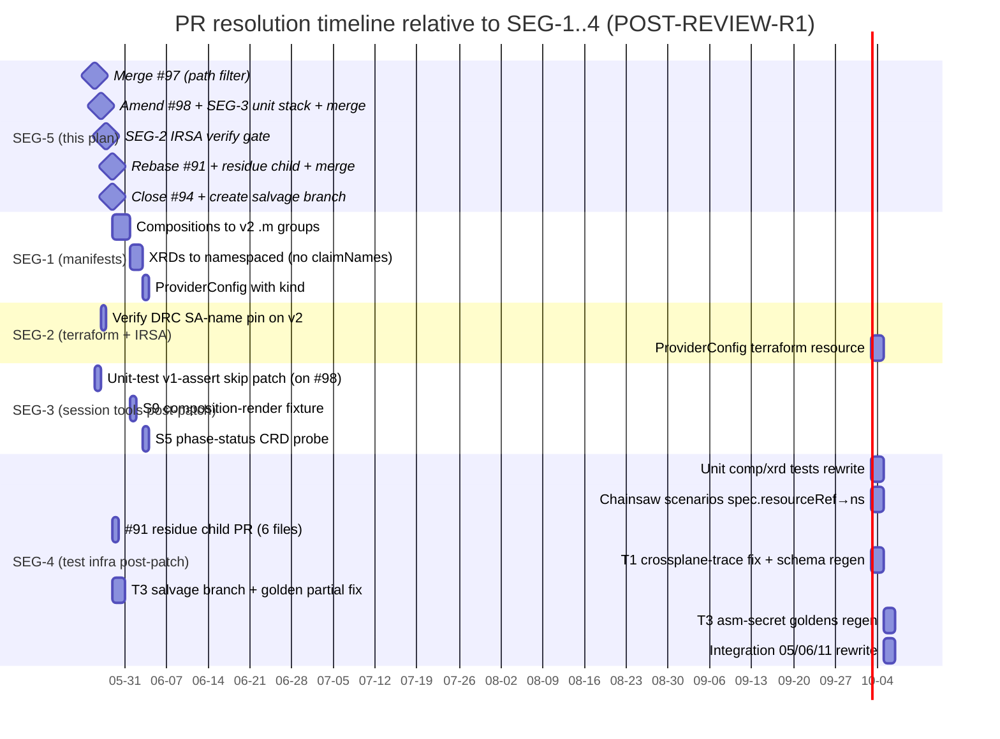

# 20 — Plan SEG-5: In-flight PR reconciliation strategy

**Author:** implementation architect (SEG-5)
**Date:** 2026-05-26
**Status:** POST-REVIEW-R1
**Scope:** Decide disposition for the 4 currently-open PRs (#91, #94, #97, #98) and
enumerate the post-v2 follow-up patches owed by the 9 already-merged session PRs.
**Out of scope:** the patches themselves (SEG-1/2/3/4 own those) and branch-protection mechanics.

---

## Revision log (R1)

Changes from round-1 adversarial review (R1A sequencing, R1B correctness):

1. **Provider tag corrected to v2.5.0** (not v2.5.4). #98 amended accordingly.
2. **`providerConfigRef.kind` is `ClusterProviderConfig`** (pre-committed cross-segment decision).
3. **Migrated XRDs use `apiextensions.crossplane.io/v2`** (pre-committed cross-segment decision).
4. **PR #96 is MERGED** — testing-guidelines §10 "read the failure log before hypothesizing"; merged 2026-05-25T23:02:18Z. §5 table row and §6.5 open-question stricken. **Total merged session PRs: 9, not 8.**
5. **#91 v1-residue count corrected from 2 → 6 files.** `catch-block.yaml` itself loops `for claim_kind in platformsecret platformcluster` and uses `kubectl get composite`; pasted verbatim into 5 scenarios = 6 files of v1 residue. "Merge-then-amend" shape replaced by a proper 2-PR stack (#91 parent + SEG-1/3/4 child PR carrying all 6 file fixes).
6. **#98 post-merge red main addressed.** The 4 unit composition tests (`test_platform_{secret,cluster}_{composition,xrd}.sh`) assert v1 group strings against still-v1 production manifests and go red immediately after #98 merges. Fix: SEG-3's unit-test patch STACKS on #98 and merges in the same window. Added to §7 actionable list.
7. **#98 `_smoke` guard is now explicit.** A `CHAINSAW_SCENARIOS=_smoke` workflow edit is added to PR #98 itself (not left as a vague pre-merge assertion) so heavy CI is mechanically isolated after merge.
8. **IRSA-verify gate added.** SEG-2's IRSA verification is a hard gate between #98 merge and #91 merge. SEG-1 drain step cannot start until SEG-2 reports green.
9. **#94 disposition revised to partial salvage.** 3 external-secret goldens are deterministic (per SEG-4B) and salvageable in-place. #94 closes; T3 of SEG-4 salvages those 3 in-place + cherry-picks 5 enforcer unit tests + Bug 4 fixture onto SEG-4's branch explicitly named `claude/seg-4-c4-reauthor`.
10. **Salvage count reconciled.** 5 enforcer unit-test scripts + Bug 4 fixture = 6 salvage files (not 7; the extra item was double-counted in §4.4).
11. **#92/#93 ownership corrected.** Both reassigned entirely to SEG-4 (not SEG-3). SEG-4 owns the `crossplane-trace.sh` L215 case-branch fix, all 6 fixture JSONs, `fetch-crds-for-kubeconform.sh` regen, and 53 schema files.
12. **#96 risk item stricken.** Not a numbering gap; was an inflation of the risk register.
13. **`stacked-pr-on-feature-branch` shape used for #91 residue fixes** (Reviewer A suggested; adopted).

---

## 1. TL;DR — recommended disposition

| PR | Title | Recommendation | Owner segment |
|---|---|---|---|
| **#97** | kubeconform render-fixtures path filter | **Merge as-is, FIRST** (independent fix, currently red on main) | SEG-5 (this plan) |
| **#98** | Provider/function version bump v1.12.0 → v2.5.0 | **Amend to v2.5.0 (not v2.5.4), add `_smoke` workflow guard, stack SEG-3's unit-test patch as a child PR, merge both together SECOND** | SEG-5 → SEG-3 stack |
| **#91** | SPEC-A4 chainsaw catch hook | **Rebase onto post-#98 main; open a stacked SEG-1/3/4 child PR patching all 6 v1-residue files (catch-block.yaml + 5 scenarios); merge the stack together.** IRSA-verify (SEG-2) is a hard gate before this stack merges. | SEG-4 (child PR) |
| **#94** | SPEC-C4 chainsaw golden files (stacks on #91) | **Close without merging.** T3 of SEG-4 salvages the 3 deterministic external-secret goldens in-place + 5 enforcer unit tests + Bug 4 fixture onto branch `claude/seg-4-c4-reauthor`. 3 asm-secret goldens re-authored from green v2 chainsaw run. | SEG-4 T3 |

**Merge order (mandatory):**

```
#97 → amend-then-merge #98 (+ SEG-3 unit-test stack) → rebase #91 + open SEG-1/3/4 stack + merge everything together → close #94 (selective salvage into SEG-4 branch)
```

**Most contentious decision revised:** #94. Partial salvage (3 external-secret goldens in-place + unit-test scaffolding) is now preferred over full close-and-re-author. Only the 3 asm-secret goldens (UID-derived names) require a live v2 chainsaw run; these are marked TODO in SEG-4's child PR until green.

---

## 2. State-transition diagram — per open PR

```mermaid
stateDiagram-v2
    [*] --> open

    state "open" as open

    state PR97 {
        [*] --> open97 : opened 2026-05-25
        open97 --> merge_clean : path-filter fix; v2-agnostic
        merge_clean --> [*]
    }

    state PR98 {
        [*] --> open98 : opened 2026-05-26
        open98 --> amend98 : (a) change v2.5.4→v2.5.0\n(b) add _smoke workflow guard
        amend98 --> rebase_on_97 : rebase onto post-#97 main
        rebase_on_97 --> stack_seg3_unit_tests : SEG-3 unit-test patch as child PR\n(4 tests skip v1 assertions with TODO)
        stack_seg3_unit_tests --> merge_stack_98 : merge parent+child together
        merge_stack_98 --> [*]
    }

    state PR91 {
        [*] --> open91 : opened 2026-05-25
        open91 --> rebase_on_98 : rebase onto post-#98 main
        rebase_on_98 --> wait_irsa : IRSA verify gate (SEG-2 hard gate)
        wait_irsa --> open_residue_child : open stacked child PR\n(all 6 v1-residue files:\ncatch-block.yaml + 5 scenarios)
        open_residue_child --> merge_stack_91 : merge #91 + child together
        merge_stack_91 --> [*]
    }

    state PR94 {
        [*] --> open94 : opened 2026-05-25 (stacked on #91)
        open94 --> close_no_merge : v1 goldens not mergeable as-is
        close_no_merge --> create_salvage_branch : create claude/seg-4-c4-reauthor\ncherry-pick 6 salvage files
        create_salvage_branch --> seg4_t3_partial : SEG-4 T3: edit 3 ext-secret goldens\nin-place; mark 3 asm-secret TODO
        seg4_t3_partial --> seg4_t3_regen : after green v2 chainsaw run:\nregen 3 asm-secret goldens
        seg4_t3_regen --> new_pr_merged : new PR merged
        new_pr_merged --> [*]
    }
```

Legend:
- `merge_clean` — merge as-is, no rework.
- `merge_stack_*` — merge parent + stacked child together in same window.
- `close_no_merge` — close the PR, cherry-pick the salvageable parts into a fresh branch.

---

## 3. Timeline relative to SEG-1/2/3/4 milestones



Key sequencing constraints:

1. **#97 unblocks main.** Currently red because S6's audit catches the render fixtures. Merging it makes subsequent CI signal legible.
2. **#98 amended to v2.5.0, `_smoke` guard added, SEG-3 unit-test patch stacks and co-merges.** The 4 unit tests (`test_platform_{secret,cluster}_{composition,xrd}.sh`) assert v1 group strings; they go red the moment #98 lands. SEG-3's stacked child PR skips them with a `# TODO(SEG-1): re-enable after v2 manifest migration` comment so main stays green through the migration.
3. **IRSA-verify (SEG-2) is a hard gate between #98 merge and #91 merge.** SEG-1 drain step cannot start until SEG-2 confirms the DRC SA-name pin survives v2. If it breaks, a one-line DRC field fix unblocks SEG-1 before #91 merges.
4. **#91 + residue child merge together.** The 6 v1-residue files (catch-block.yaml + 5 scenario pastes) are fixed in a stacked child PR opened immediately after #91 rebases. Both reviewed and merged in the same window — no "amend later" delay.
5. **#94 re-author waits for green v2 chainsaw run (SEG-1 + SEG-4).** Only the 3 asm-secret goldens need live regen; the 3 external-secret goldens are deterministic edits made in SEG-4 T3 immediately after #94 closes.
6. **SEG-2 ProviderConfig terraform work waits on SEG-1's `kind:` field decision.** Kind is pre-committed as `ClusterProviderConfig`; SEG-2 can proceed as soon as SEG-2a IRSA verify completes.

---

## 4. CI-color timeline (what goes red, for how long, and why)

| Event | Jobs that go red | Recovery PR / timing |
|---|---|---|
| #97 merges | None (the PR fixes an existing red) | — |
| #98 + SEG-3 unit-skip stack merges | `chainsaw-heavy` scenarios (not `_smoke`) — now gated off by `_smoke` workflow guard in #98 itself | Gate lifted by SEG-1 + SEG-4 chainsaw scenario rewrite |
| #91 + residue child merge | No new reds (catch block is v2-safe after child PR; `_smoke` still gates heavy CI) | — |
| SEG-1 s1c (ProviderConfig) merges | `_smoke` filter lifted; full chainsaw runs; expects v2 goldens (not yet present) | SEG-4 T3 asm-secret regen closes it |

Without the SEG-3 unit-test skip patch co-merging with #98, `test_platform_{secret,cluster}_{composition,xrd}.sh` would go red immediately and stay red for 5+ days. The stack ensures main is never red on unit tests.

---

## 5. Per-PR detailed analysis

### 5.1 PR #97 — kubeconform render-fixtures path filter

**Verdict:** **Merge as-is, immediately, ahead of #98.**

- Single-file structural fix (`tests/unit/test_kubeconform_manifests.sh`) adds `-not -path '*/render-fixtures/*'` to the audit's `find` invocation.
- Zero references to AWS API groups; the change is path-shaped, not schema-shaped.
- Main is red until this lands (S6 audit flags both render fixtures as `schemaInvalid` because they include `spec.claimRef`).
- Post-v2 implication: render-fixtures will be REGENERATED (SEG-3 task S9) but they will still be excluded by this path filter — the structural argument ("offline render fixtures are not authored cluster manifests") survives the v2 migration unchanged.

**Action:** Approve and merge. No rebase needed (PR is already against the current `main` SHA `f25f790`).

---

### 5.2 PR #98 — provider/function version bump

**Verdict:** **Amend (v2.5.0, `_smoke` guard), stack SEG-3 unit-test patch as child PR, merge both SECOND. This is the migration entry point.**

**Amendments before merge:**

1. Change `v2.5.4` → `v2.5.0` in `terraform/management/variables.tf` and `tests/chainsaw/versions.env`. (Pre-committed cross-segment decision: v2.5.0 is the correct target tag.)
2. Add `CHAINSAW_SCENARIOS=_smoke` guard to the workflow dispatch in the PR itself — this is NOT a vague pre-merge check; it is a concrete file edit in `.github/workflows/terraform-test.yml` (or equivalent) committed into #98 so it takes effect the moment #98 merges.

**SEG-3 stacked child PR (co-merges with #98):**

Four unit tests assert v1 API group strings directly against production manifests:
- `tests/unit/test_platform_secret_composition.sh`
- `tests/unit/test_platform_cluster_composition.sh`
- `tests/unit/test_platform_secret_xrd.sh`
- `tests/unit/test_platform_cluster_xrd.sh`

After #98 merges, these 4 tests go red immediately (v1 assertions vs. still-v1 manifests that are correct TODAY but will diverge). SEG-3 opens a stacked child PR on top of #98 that marks these tests with `# TODO(SEG-1 #ticket): skip until v2 manifests land` (or `skip_if_provider_v2()`). Both PRs reviewed and merged in the same window.

- Changes 8 lines across `terraform/management/variables.tf` and `tests/chainsaw/versions.env`. No manifest, no script, no test logic (other than the `_smoke` guard addition).
- Per `00-situation.md §5` and `12-impact-terraform-infra.md`: `terraform apply` succeeds; the v2 provider package installs cleanly; the chainsaw `PendingExternalResource` symptom disappears and is replaced by a different, useful failure mode (admission rejection on v1 manifests).
- IRSA SA-name pin risk (DRC override may not survive v2 — `12-impact §IRSA-SA pinning`) is the single biggest open question post-merge. SEG-2 verifies this within 24h of #98 landing; **#91 does not merge until SEG-2 reports green**.

**Action:** Amend #98 (v2.5.0 + `_smoke` workflow guard). SEG-3 opens child PR stacking on #98 (4 unit-test skips). Merge both together.

---

### 5.3 PR #91 — SPEC-A4 chainsaw catch hook

**Verdict:** **Rebase onto post-#98 main; open stacked SEG-1/3/4 child PR patching all 6 v1-residue files; merge stack together.** Hard gate: IRSA verify (SEG-2) must be green before this stack merges.

**Why not "merge-then-amend":**

The original plan called the catch block "API-group-agnostic" and listed 2 pin-point residues. Reviewer B verified the branch: `tests/chainsaw/_lib/catch-block.yaml` itself contains:
- `for claim_kind in platformsecret platformcluster` — claim CRDs disappear in v2
- `kubectl get composite -o name` — `composite` category covers cluster-scoped v1 XRs; v2 namespaced XRs may not register under this category

This block is pasted verbatim into **5 scenario files**, yielding **6 files of v1 residue** (1 lib + 5 scenarios). "Merge-then-amend" with SEG-4 picking up the residue is the wrong shape when the amendment is a 2-PR stacked child that has near-zero conflict surface.

**Stacked child PR contents (all 6 files):**

1. `tests/chainsaw/_lib/catch-block.yaml` — fix `for claim_kind` loop (enumerate v2 XR kinds directly) + fix `kubectl get composite` (use v2-appropriate label or kind query).
2. 5 scenario files that paste the catch block verbatim — updated to match corrected lib.

The child PR is opened by SEG-4 immediately after #91 rebases. Both reviewed in the same window, merged together.

**Remaining v1 residues that move to SEG-4 (non-blocking for the stack merge):**

1. **`tests/chainsaw/run.sh` L230** — ProviderConfig heredoc uses `apiVersion: aws.upbound.io/v1beta1`. Must become `aws.m.upbound.io/v1beta1`. This is in `run.sh`, NOT in the catch block pasted by #91, so it doesn't need to be in the stacked child; it goes in SEG-4's chainsaw scenario rewrite PR. SEG-4 fixers must run `git diff main -- tests/chainsaw/run.sh` pre-merge to confirm no overlap with the merged #91 hunk.
2. **`run.sh` `dump_diagnostics()`** — references `platformsecret,xplatformsecret -A` and `crd/platformsecrets.platform.k8-platform.io`. SEG-4 chainsaw scenario rewrite.

**IRSA gate:** #91 stack does not merge until SEG-2's IRSA-verify step reports green. If the DRC SA-name breaks, SEG-2 issues a one-line DRC field fix before #91 merges — otherwise the catch block's first real fire happens on a half-migrated cluster.

**Action:** Rebase #91 onto post-#98 main. SEG-4 opens stacked child PR (6 files). Wait for SEG-2 IRSA-verify green. Merge both together.

---

### 5.4 PR #94 — SPEC-C4 chainsaw golden files

**Verdict:** **Close without merging.** SEG-4 T3 salvages selectively onto branch `claude/seg-4-c4-reauthor`.

**Revised split — deterministic vs. live-regen:**

| Golden set | Files | Salvageable? | Why |
|---|---|---|---|
| 3 external-secret goldens | `*external-secret*.yaml` | **Yes — in-place edit** | `metadata.name` is deterministic (from `spec.claimRef.name`, not XR UID). Edits: `apiVersion` v1→v2, remove `deletionPolicy`, add `kind: ClusterProviderConfig` to `providerConfigRef`. No live chainsaw run needed. |
| 3 asm-secret goldens | `*asm-secret*.yaml` | **No — needs live regen** | `metadata.name` derived from XR UID; v2 namespaced XR may produce a different UID derivation. SEG-1's compositeTypeRef rewrite may change the shape. Marked TODO until green v2 chainsaw run is available. |

**Salvage manifest (cherry-picked onto `claude/seg-4-c4-reauthor` at #94 close time):**

6 salvage files (not 7 — prior plan double-counted):

| # | File | Action |
|---|---|---|
| 1 | `tests/unit/test_chainsaw_golden_files_present.sh` | Cherry-pick verbatim |
| 2 | `tests/unit/test_golden_no_volatile_fields.sh` | Cherry-pick verbatim |
| 3 | `tests/unit/test_golden_has_spec_forProvider.sh` | Cherry-pick verbatim |
| 4 | `tests/unit/test_chainsaw_assert_references_golden.sh` | Cherry-pick verbatim |
| 5 | `tests/unit/test_golden_region_uses_binding.sh` | Cherry-pick verbatim |
| 6 | `tests/fixtures/compositions/platform-secret-pre-pr61.yaml` | Cherry-pick verbatim (v1 shape is intentional — Bug 4 replay fixture) |

Note: `test_chainsaw_golden_catches_bug4.sh` was listed in the original §4.4 but is actually the same as the Bug 4 fixture wiring — confirm it is captured under file 6 before closing.

**SEG-4 T3 workflow:**

1. At #94 close: create `claude/seg-4-c4-reauthor`; cherry-pick the 6 salvage files above.
2. On that branch: edit the 3 external-secret goldens in-place (3 targeted string changes per file).
3. Mark the 3 asm-secret golden assert wiring as `# TODO(SEG-4-T3): regenerate after green v2 chainsaw run`.
4. After SEG-1 + SEG-4 chainsaw scenario rewrite produces a green run: regenerate the 3 asm-secret goldens from the live run output, remove TODO markers, open PR.

**Closure comment must include:** link to `claude/seg-4-c4-reauthor` branch so reviewers can find the salvage commits.

**Action:** Close #94. Create `claude/seg-4-c4-reauthor`. Cherry-pick 6 files. SEG-4 T3 edits the 3 deterministic goldens immediately; defers 3 asm-secret goldens until green v2 chainsaw run.

---

## 6. Already-merged PRs — follow-up patch enumeration

**Total: 9 merged session PRs.** (#85 through #96; #96 is confirmed merged.)

| Merged PR | Spec | What it added | Follow-up owed | Owner segment |
|---|---|---|---|---|
| **#85** | SPEC-S4 | `scripts/whereami.sh`, `scripts/_lib/aws-cli-helpers.sh` | **None.** `OK-SYNTACTIC` per `10-impact §S4`. | — |
| **#86** | SPEC-S7 | `scripts/wait-for-claim.sh`, `scripts/_lib/k8s-helpers.sh` | Script signature encodes claim model. Under v2's namespaced XR (no separate claim), disposition: **rename to `wait-for-xr.sh` or keep as alias with deprecation notice.** Every caller (integration 05/06/11) passes v1 group names — caller fix is SEG-4. | SEG-4 (callers + rename decision) |
| **#87** | SPEC-S9 | `scripts/composition-render.sh`, render-fixture inputs, meta-test fixture | (1) `tests/unit/fixtures/composition-render/composition-missing-string-type.yaml` — v1 apiVersion + `deletionPolicy` + bare `providerConfigRef` + `compositeTypeRef.apiVersion` (4 fixes, not 3). (2) Render fixture inputs under `crossplane/xrds/*/render-fixtures/input.yaml` — regenerate against v2 XRDs. | SEG-3 |
| **#88** | SPEC-S3 | `scripts/irsa_trust_validator.py`, IRSA fixtures | **None.** `OK-SYNTACTIC` per `10-impact §S3`. | — |
| **#89** | SPEC-S10 | `docs/runbooks/runbook-apply-zero-resources.md` | **None.** Provider deployment name unchanged across v1/v2. | — |
| **#90** | SPEC-S5 | `scripts/phase-status.sh` | Phase 2 probe at L230/L246 reads `kubectl get crd platformsecrets.platform.k8-platform.io` — v2 removes this CRD. **Re-point probe to `xplatformsecrets.platform.k8-platform.io` (XR CRD, which v2 keeps).** | SEG-3 |
| **#92** | SPEC-S2 | `scripts/crossplane-trace.sh`, 6 fixture JSONs | (1) `provider_for_apiversion()` case branch L215 — add `*.aws.m.upbound.io` arm. (2) All 6 fixture JSONs — `secretsmanager.aws.upbound.io/v1beta1` → `.m.upbound.io/v1beta1` (17 occurrences). **Owner: SEG-4 entirely** (ships with schema-store regen that the script depends on). | **SEG-4** |
| **#93** | SPEC-S6 | `scripts/fetch-crds-for-kubeconform.sh`, `kubeconform-schemas/**` (53 files) | (1) `fetch-crds-for-kubeconform.sh` L131–141 — repoint 7 CRD URLs to v2.5.0 Upbound provider source (verify path layout `package/crds/*.yaml` still applies on v2 packages). (2) XRD extractor L210 `spec.get("claimNames")` — drop or repoint. (3) Re-run and commit regenerated `kubeconform-schemas/`. (4) Update 5 kubeconform fixture YAMLs to v2 apiVersions. **Owner: SEG-4 entirely** (not SEG-3 + SEG-4; SEG-3 removing this avoids conflicting regen PRs). | **SEG-4** |
| **#95** | retro | retrospective document | **None.** Documentation; captures history. | — |
| **#96** | testing-guidelines | `ai/testing-guidelines.md` §10 "read the failure log before hypothesizing" (+65 lines) | **None.** Single-file documentation PR. Merged 2026-05-25T23:02:18Z. | — |

Total follow-up patches owed by merged PRs: **5 PRs need patches (#86, #87, #90, #92, #93).** 4 are no-ops (#85, #88, #89, #95). #96 is documentation. #92 and #93 are now both **SEG-4 only** (not split with SEG-3).

---

## 7. Risks & open questions

1. **#98's IRSA-SA-name pin survives v2?** Per `12-impact §IRSA-SA pinning`, this is the highest-impact unknown. Mitigation: SEG-2 verifies within 24h of #98 merge; **#91 is blocked until green.** Fix is one DRC field change.
2. **SEG-1 timing for #94 asm-secret regen.** If SEG-1's XRD rewrite takes longer than 5 days, the SEG-4 asm-secret golden regen slips. No mitigation other than gating SEG-4 T3b on a green v2 chainsaw run.
3. **`kubectl get composite` behaviour change on v2 namespaced XRs.** Catch-block uses this; it's unverified whether v2 namespaced XRs register under the `composite` category. SEG-4's child PR on #91 must verify this against the v2 control plane before committing the fix.
4. **`tests/chainsaw/run.sh` concurrent edit surface.** #91 edits the file (catch-block section); SEG-4 also edits it (L230 ProviderConfig group, `dump_diagnostics()`). Since #91 merges first, SEG-4 must run `git diff main -- tests/chainsaw/run.sh` pre-merge to confirm no overlap with the merged #91 hunk.
5. **Upbound v2.5.0 CRD path layout.** #93 follow-up assumes `package/crds/*.yaml` layout is unchanged from v1. SEG-4 must verify before regen.

---

## 8. Sequencing summary (the actionable list)

1. **Now:** merge #97 (red main → green main).
2. **Now:** amend #98 (v2.5.0, `_smoke` guard). SEG-3 opens stacked child PR (4 unit-test skips). Merge both together.
3. **+24h:** SEG-2 runs IRSA verification. Report green/red. If red: one-line DRC fix committed before step 4.
4. **After SEG-2 green:** rebase #91 onto post-#98 main. SEG-4 opens stacked child PR (all 6 v1-residue files: catch-block.yaml + 5 scenarios). Merge both together.
5. **Same day as step 4:** close #94. Create branch `claude/seg-4-c4-reauthor`. Cherry-pick 6 salvage files. SEG-4 T3 edits 3 external-secret goldens in-place immediately.
6. **SEG-1/2/3/4 execute** per their own plans, picking up the follow-ups from §6 of this document. Note: SEG-3 no longer owns #92 or #93 regen.
7. **SEG-4 re-authors asm-secret goldens** on `claude/seg-4-c4-reauthor` once a green v2 chainsaw run is available. Opens new PR linked back to closed #94.

End state: 0 v1-shaped PRs open. 1 new v2-shaped golden-file PR in progress (the #94 successor on `claude/seg-4-c4-reauthor`). All other v1 residue tracked under SEG-3/SEG-4. Main never red on unit tests during migration.
