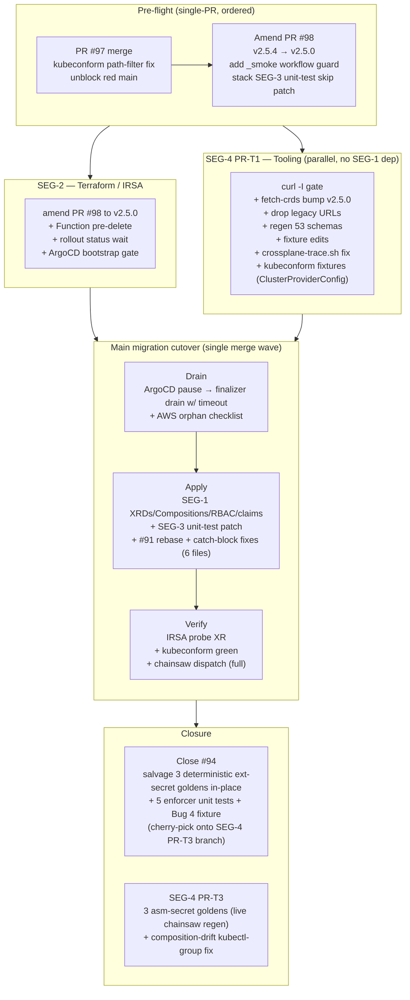
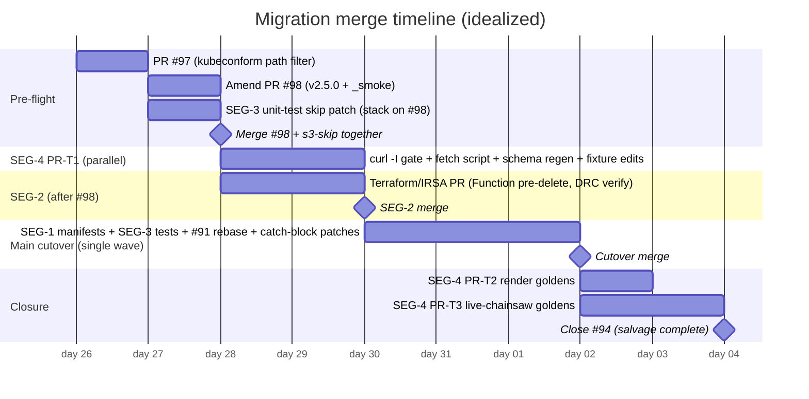
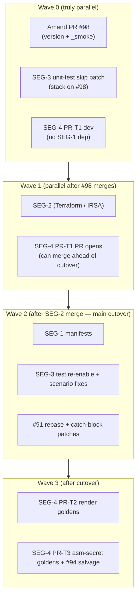
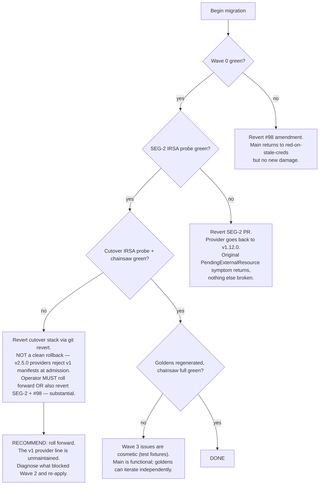

# 40 — Final synthesized plan: Crossplane v1 → v2 migration

**Date:** 2026-05-25
**Status:** READY-FOR-EXECUTION (not executed)
**Author:** lead agent (synthesis of 5 segment plans + 10 round-1 reviews + 5 round-2 author revisions)

This is the master plan. It synthesizes the segment plans in `20-plan-SEG-*.md` after one round of adversarial review per segment (R1A sequencing + R1B correctness) and one round of author revision (R2). All five revised plans converged on the same cross-segment decisions; no round-3 review was needed.

---

## 1. One-diagram summary

---

## 2. Pre-committed cross-segment decisions

These were settled before round-2 author revisions to prevent further divergence; all 5 revised plans use them verbatim.

| Decision | Value | Rationale | Sources |
|---|---|---|---|
| Provider tag | **v2.5.0** | Verified existence via WebFetch of `https://raw.githubusercontent.com/crossplane-contrib/provider-upjet-aws/v2.5.0/...` (SEG-4 R1B). Upbound Marketplace listed v2.5.4 but the upstream tag does not exist. PR #98 amendment required. | SEG-4 R1B |
| `providerConfigRef.kind` | **`ClusterProviderConfig`** | Repo pattern is one cluster-wide ProviderConfig named `default` shared by every Composition. Upbound v2.x providers ship both `ClusterProviderConfig` (cluster-scoped) and `ProviderConfig` (namespaced) as distinct CRDs. The cluster-scoped option matches the existing access pattern. | SEG-1 R2 §1.D2 |
| XRD apiVersion | **`apiextensions.crossplane.io/v2`** | v2 introduces this group specifically for namespaced XRDs. `v1 + spec.scope: Namespaced` is either silently ignored or rejected by the v2.3 apiserver. | SEG-1 R2 §B1 |
| `deletionPolicy` removal pairing | **add `managementPolicies: [Observe, Create, Update, Delete]`** on every MR base | Removing `deletionPolicy: Delete` without a replacement leaves MR lifecycle semantics undefined. `managementPolicies` is the v2 replacement and the all-actions list preserves prior behavior. | SEG-1 R1B §B7 |
| Unit composition test sequencing | **Stacked child PR off SEG-1's branch; co-merge** | Prevents the unit composition tests (which assert v1 group strings) from going red on every push for the days between SEG-1 manifest changes and SEG-3 test updates. | SEG-3 R1A, SEG-5 R1A |
| #91 v1 residue handling | **All 6 catch-block-bearing files patched in SEG-3/SEG-4 stacked PR** | Original "merge-then-amend" undercounted residues 3×: catch-block.yaml itself uses v1 idioms (`for claim_kind in platformsecret platformcluster`) and is pasted into 5 scenarios. | SEG-5 R1B |
| #94 disposition | **Close, but salvage 3 deterministic external-secret goldens in-place + 5 enforcer unit tests + Bug 4 fixture into SEG-4 PR-T3** | Reconciles SEG-4's "external-secret goldens are deterministic" finding with SEG-5's "close entire PR" recommendation. Only 3 asm-secret goldens need live-chainsaw regen. | SEG-4 + SEG-5 R2 |
| v2 CRD URL handling | **DROP legacy `.aws.upbound.io_*.yaml` URLs entirely (not rewrite)** | v2.5.0 ships BOTH legacy and `.m.upbound.io_` CRDs in the same package. Rewriting alone would install dual-mode CRDs. | SEG-4 R1B |

---

## 3. Segment ownership matrix

```mermaid
flowchart LR
    subgraph S1["SEG-1 — Production manifests"]
      direction TB
      S1a["crossplane/xrds/* (apiextensions/v2)"]
      S1b["crossplane/compositions/*"]
      S1c["crossplane/rbac/01-*"]
      S1d["crossplane/claims/example-*"]
      S1e["clusters/platform/platform-cluster-claim.yaml"]
      S1f["argocd/* (ArgoCD Application paths)"]
      S1g["policies/audit/09-*<br/>(delete; replaced by namespaced XR)"]
      S1h["crossplane/xrds/*/render-fixtures/input.yaml"]
    end

    subgraph S2["SEG-2 — Terraform / IRSA"]
      S2a["terraform/management/variables.tf (v2.5.0)"]
      S2b["terraform/management/helm.tf (DRC + Function pre-delete)"]
      S2c["IRSA trust policy (unchanged; verified)"]
      S2d["tests/chainsaw/versions.env (v2.5.0)"]
    end

    subgraph S3["SEG-3 — Test infra"]
      S3a["tests/chainsaw/run.sh (ProviderConfig heredoc)"]
      S3b["tests/chainsaw/_smoke/<br/>+ platform-*/<br/>+ meta-catch-fires/<br/>scenario apiVersions"]
      S3c["tests/integration/05_*, 06_*, 11_*, 13_*"]
      S3d["tests/unit/test_platform_*_composition.sh<br/>(stacked PR off SEG-1)"]
      S3e["GitHub workflows (no v1 refs)"]
    end

    subgraph S4["SEG-4 — Tooling regen"]
      S4a["scripts/fetch-crds-for-kubeconform.sh"]
      S4b["kubeconform-schemas/** (53 files, regen)"]
      S4c["scripts/crossplane-trace.sh (case-branch bug)"]
      S4d["scripts/diag-component.sh"]
      S4e["tests/unit/fixtures/crossplane-trace/*.json (14)"]
      S4f["tests/unit/fixtures/kubeconform/*.yaml (5)"]
      S4g["tests/unit/fixtures/composition-render/*.yaml"]
      S4h["3 ext-secret goldens (deterministic salvage)"]
      S4i["3 asm-secret goldens (live regen, PR-T3)"]
    end

    subgraph S5["SEG-5 — In-flight PRs"]
      S5a["#97 merge as-is"]
      S5b["#98 amend (v2.5.0 + _smoke + SEG-3 stack)"]
      S5c["#91 rebase + SEG-3/4 catch-block stack"]
      S5d["close #94 (selective salvage to SEG-4)"]
    end

    S2 --> S1
    S2 --> S3
    S4 -. parallel .-> S1
    S4 -. parallel .-> S3
    S1 --> S5c
    S3 --> S5c
```

---

## 4. Merge sequence (sequential view)

**Strict serial order:**

1. **PR #97** — merge as-is (kubeconform path filter; unblocks red main)
2. **Amend PR #98** to `v2.5.0` + add `_smoke` workflow guard
3. **SEG-3 unit-test skip patch** stacks on #98 (skip the 4 composition tests with TODO comments)
4. **Merge #98 + skip patch together** (single merge wave)
5. **SEG-4 PR-T1** opens in parallel (does NOT depend on SEG-1)
6. **SEG-2 PR** opens after #98 merges
7. **Wait for SEG-2 merge** (IRSA verify is the hard gate)
8. **Cutover wave** opens as a single stack of stacked PRs:
   - SEG-1 (XRDs, Compositions, RBAC, claims, render-fixtures, kyverno-09 delete)
   - SEG-3 unit-test re-enable + chainsaw scenario apiVersion fixes
   - #91 rebase + 6-file catch-block v1 residue patches
9. **Cutover merge** (single wave)
10. **SEG-4 PR-T2** opens (render goldens regen)
11. **SEG-4 PR-T3** opens (live-chainsaw asm-secret goldens regen; cherry-picks PR #94 enforcer tests + Bug 4 fixture; closes #94 selectively)

---

## 5. What can run in parallel

Within Wave 2 (cutover) the three PRs MUST merge as a single stack — the `tests/unit/test_platform_*_composition.sh` assertions are tightly coupled to the Composition shapes; they can't be staggered without red-CI windows.

Within Wave 3, T2 and T3 are independent and can be developed concurrently. T3 depends on chainsaw being green against the v2 manifests, so it can only OPEN after Wave 2 merges; T2 can open immediately after Wave 2.

---

## 6. Hot files matrix (touched by ≥2 segments)

| File | Segments | Hot why |
|---|---|---|
| `tests/chainsaw/versions.env` | SEG-2 + SEG-4 | SEG-2 owns the version pin; SEG-4 references it in T1 |
| `tests/chainsaw/run.sh` | SEG-3 + SEG-4 | SEG-3 owns ProviderConfig heredoc + dump_diagnostics; SEG-4 owns crossplane-trace consumer changes |
| `tests/unit/run.sh` | SEG-3 + SEG-4 | New test files (SEG-3) + edited test files (SEG-4) |
| `tests/chainsaw/_lib/catch-block.yaml` | SEG-3 + #91 stack | Lives on #91 branch; SEG-3 patches v1 residues in the stack |
| `tests/chainsaw/platform-secret/*/chainsaw-test.yaml` | SEG-3 (apiVersion) + SEG-4 (goldens) + #94 salvage | 3 scenarios touched by 3 segments |
| `crossplane/xrds/*/render-fixtures/input.yaml` | SEG-1 (XR shape) + SEG-4 (fixture regen) | SEG-1 changes XR shape, SEG-4 regenerates fixtures off the new shape |
| `tests/integration/05_*.sh`, `06_*.sh` | SEG-3 (XR/MR refs) + SEG-4 (fixture refs) | Inline XRD + MR API group updates |
| `scripts/crossplane-trace.sh` | SEG-4 only — but consumes XR/MR shapes from SEG-1 | Internal coupling, not file-level |

**Parallelism limit:** Wave 0/1 have ~5 parallel work streams. Wave 2 collapses to a single stacked PR. Wave 3 has 2 parallel streams. Roughly **3-5x serialization** vs full parallel ideal.

---

## 7. Open questions deferred from segment plans

These remain unresolved as of synthesis time. Each plan flags them; the master plan does NOT resolve them — they're for the operator at execution time.

| ID | Question | Owning segment | Default if unresolved |
|---|---|---|---|
| Q-1 | **Drain-vs-import for live PlatformCluster with running workloads.** If at migration time there's a live `PlatformCluster` carrying real workloads, the plan currently drains and recreates. If that's unacceptable, the plan needs an `Observe`-only management-policies import path. | SEG-1 §3 Q1 | Drain — assumes no production workload on the cluster |
| Q-2 | **`scripts/wait-for-claim.sh` ownership for chainsaw script call site updates.** SEG-3 left this open. | SEG-3 §3 Q3 | SEG-3 owns it |
| Q-3 | **Function v1beta1 served-status verification.** SEG-2 made the pre-delete unconditional; if v2.3 STILL serves v1beta1 the pre-delete is unnecessary churn (no harm done, just wasted work). | SEG-2 §3 Q2 | Pre-delete unconditionally (low cost; safer) |
| Q-4 | **Helm chart `--set args[]` audit.** SEG-2's revision flagged that `--enable-realtime-compositions=false` etc. were never verified against v2.3 chart values. | SEG-2 §3 Q5 | Audit before SEG-2 PR opens; flag any deprecated flags |
| Q-5 | **CRD URL path layout stability.** SEG-4 verified the pattern for one CRD; pre-flight `curl -I` matrix in PR-T1 Step 0 catches divergence at execution time. | SEG-4 §3 Q5 | Pre-flight gate is the mitigation; no advance work needed |

---

## 8. Failure recovery overview

Per-segment failure tables are in each segment plan (§4). High-level rollback shape:

**The Wave 2 rollback is the load-bearing risk.** Once v2.5.0 providers are installed, the v1 manifests are admission-rejected. This is why SEG-1's drain + cutover MUST happen in a single PR (no half-state where v2 providers are running but v1 manifests are still being applied by ArgoCD).

---

## 9. Round-1 review highlights

Across 10 round-1 reviewers (2 per segment), 3 themes dominated. All resolved before round-2.

| Theme | Reviewers flagging | Resolution |
|---|---|---|
| **`ProviderConfig` vs `ClusterProviderConfig` cross-segment inconsistency** | SEG-1B + SEG-3A + SEG-3B + SEG-4A (4 reviewers) | Pre-committed to `ClusterProviderConfig`. All 5 R2 plans now align. |
| **`v2.5.4` provider tag doesn't exist** | SEG-4B (with WebFetch verification) | Pre-committed to `v2.5.0`. PR #98 amendment required. |
| **Test sequencing — unit composition tests assert v1 strings against still-v1 manifests after #98 merges** | SEG-3A + SEG-5A | SEG-3 unit-test skip patch stacks on #98 and co-merges. Reinstate as part of the cutover wave. |

Single most consequential finding:

- **#91 v1 residue count was undercounted ~3×** (SEG-5 R1B). The `catch-block.yaml` file itself uses v1 idioms (`for claim_kind in platformsecret platformcluster`; `kubectl get composite`). Pasted into 5 scenarios = 6 files of v1 residue, not 2. Resolved in SEG-5 R2 by changing the disposition from "merge-then-amend" to a 2-PR stack.

Single most embarrassing finding:

- **PR #96 is MERGED, not a numbering gap** (SEG-5 R1B). It's the `testing-guidelines §10` rule "read the failure log before hypothesizing" — the very rule the lead agent broke earlier this session when speculating about AWS issues without reading the chainsaw log. Adjusted in SEG-5 R2; session merged PR count corrected to 9.

---

## 10. Estimated total cost

| Segment | Engineer-hours | Wall-clock |
|---|---|---|
| Pre-flight (#97 merge, #98 amend) | ~0.5h | same day |
| SEG-2 (Terraform / IRSA) | ~3h (incl. kind probe) | 1-2 days incl. CI |
| SEG-4 PR-T1 (tooling, no SEG-1 dep) | ~3h | 1 day, parallel with SEG-2 |
| Wave 2 cutover (SEG-1 + SEG-3 + #91 stack) | ~6h | 2-3 days (incl. chainsaw dispatch + verify) |
| SEG-4 PR-T2 + PR-T3 closure | ~3h | 1-2 days |
| **Total** | **~15.5h** | **1 week wall-clock with conservative gating** |

Aggressive timeline (no waits between gates): ~3-4 days.

---

## 11. Definition of done

1. PR #98 merged with `v2.5.0` everywhere.
2. SEG-2's IRSA probe XR reaches `Ready=True` against the v2.5.0 provider stack.
3. All `crossplane/` manifests use `*.m.upbound.io` API groups, `ClusterProviderConfig` kind, `managementPolicies` on every MR, no `claimNames` on XRDs, `apiextensions.crossplane.io/v2` on XRDs.
4. `bash tests/unit/run.sh` green (with `test_helm_render.sh` continuing to be a known-broken exception).
5. `chainsaw.yml` dispatched green against the post-Wave-2 SHA, full scenario set (not just `_smoke`) — including the 3 platform-secret scenarios that surfaced the original `PendingExternalResource` symptom.
6. `bash tests/integration/run.sh` against a live cluster: all scenarios pass.
7. `terraform-test.yml` `[management] e2e-verify` step passes.
8. Phase 1 + Phase 2 verified on a fresh AWS account.
9. #94 closed with salvage complete; all 6 goldens regenerated and committed.
10. `retrospective/` updated with the migration's lessons.

---

## 12. Where to find what

- `00-situation.md` — root cause analysis, evidence, breaking-change list
- `10-impact-session-tools.md` — impact on the 10 session tools
- `11-impact-production-manifests.md` — impact on K8s manifests
- `12-impact-terraform-infra.md` — impact on Terraform + IRSA
- `13-impact-test-infra.md` — impact on test infrastructure
- `20-plan-SEG-1-production-manifests.md` — segment plan (POST-REVIEW-R1)
- `20-plan-SEG-2-terraform-infra.md` — segment plan (POST-REVIEW-R1)
- `20-plan-SEG-3-test-infra.md` — segment plan (POST-REVIEW-R1)
- `20-plan-SEG-4-tooling-regen.md` — segment plan (POST-REVIEW-R1)
- `20-plan-SEG-5-in-flight-prs.md` — segment plan (POST-REVIEW-R1)
- `30-review-SEG-{1..5}-R1{A,B}-*.md` — 10 round-1 reviews
- `40-final-plan.md` — this file

Each segment plan contains its own §1 scope, §2 step-by-step migration with mermaid, §3 open questions, §4 failure recovery, §5 hot files, §6 cross-segment dependencies, §7 time estimate.

---

*Ready for execution. The next session (or whoever picks this up) should: (a) read this file and the 5 segment plans, (b) amend PR #98 to v2.5.0, (c) follow §4 merge sequence.*
