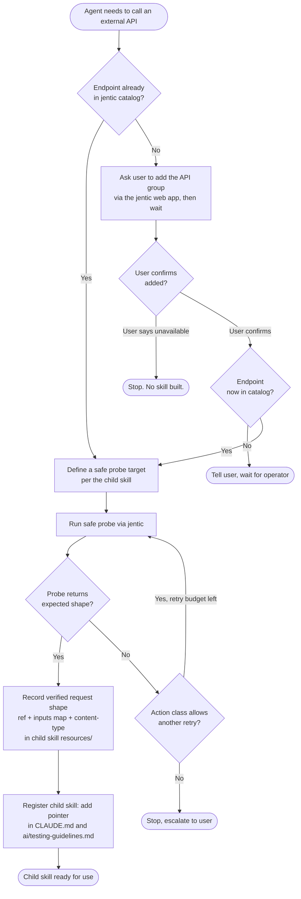

# External API Bridge + ext-github — Design Spec

## Agent instructions (READ FIRST)

You are picking this work up cold in a fresh session. Everything you need is
in this file plus a small list of project files. **Do not** search the
repository for issues, pull requests, comments, or discussions to discover
the origin of this work — that material is intentionally fenced out of
this file. Looking for it pollutes context with a rejected design and
risks repeating mistakes already made.

### Required reading, in order

1. This file, end to end.
2. `ai/handoff.md` — current state of the platform iteration.
3. `ai/testing-guidelines.md` — the phase-by-phase test procedure that
   this work is meant to unblock.
4. `CLAUDE.md` — operating rules for this repository.

### Non-goals — do not build, do not resurrect

- **Do not** introduce, restore, or extend any file-commit-based CI trigger
  (e.g. `.trigger-action.json`, `agent-trigger.yml`, or branch-name auto-triggers
  like `test/**`). These mechanisms were removed in PR #23 because they exist
  *only* to work around the very sandbox limitation that this skill removes.
  If you find references to them in historical files (retrospectives,
  summaries, `ai/archive/`, prior sections of this very file), treat those as
  history, not as design input.
- **Do not** preserve "fallback paths" to the old mechanisms. There is no
  fallback. `terraform-test.yml` is `workflow_dispatch`-only by design, and
  this skill is what dispatches it.
- **Do not** synthesize a hybrid design from this spec and any other doc.
  If this spec disagrees with anything else in the repo, **this spec wins**.
  Stop and ask the user before reconciling.
- **Do not** "be helpful" by harmonizing this design with patterns you find
  elsewhere in the codebase. The previous attempt at this work failed
  precisely because the agent tried to merge this spec with the (now
  deleted) trigger-file machinery. The user spent significant effort
  constructing this design; treat it as load-bearing, not a starting point.

### Required procedure

1. **Process every open risk in §Open risks before doing any other
   review.** For each numbered item, ask the user to either select one of the three
   proposed mitigations (a / b / c) or write a fourth in 1–3 sentences,
   and record the user's selection in the §Resolutions
   table near the top of this file.
2. **Then perform a fresh-eyes critical review of the design as a whole,
   with the user's resolutions incorporated.** Use the §Critique section.
   Surface concerns the prior review loop missed. Be specific about
   likelihood and severity using the same Low / Med / High scale used
   in §Open risks.
3. **Wait for explicit user confirmation before any implementation
   work.** The deliverables — PR1 (the `external-api-bridge` meta-skill)
   and PR2 (the `ext-github` child skill) — are not to be started until
   the user signs off on the resolved spec.

---

## Resolutions

To be populated by the next agent by querying user before §Critique. One row per open risk.

| # | Risk title                              | Selected mitigation | Reasoning |
|---|-----------------------------------------|---------------------|-----------|
| 1 | Probe has side effects                  | (d) Defer per-skill | Meta-skill (PR1) prompts the user to negotiate a test plan at child-authoring time. No one-size-fits-all probe policy baked into the template; user chooses what may/may not be live-fired for each new ext-* skill. |
| 2 | Retry cap against mutating API          | (c) No retries      | One shot per call, then escalate. Probe-time verification (negotiated per Risk #1) makes production retries unnecessary; eliminates misclassification risk. |
| 3 | Concurrency vs cancel-in-progress       | (c)+queue-depth gate | Disable `cancel-in-progress` so dispatches queue. ext-github also checks queue depth before dispatching: if >2 runs already queued, the agent attempts a non-destructive diagnosis (why is the queue stacking up?). If it can't resolve non-destructively, it stops and asks the user. Implies a workflow edit (out of pure-PR1 scope — flag for Phase B). |
| 4 | Jentic search output fidelity           | (d) Test-plan dialog | During PR1's test-plan negotiation (Risk #1 mechanism), the meta-skill explicitly recommends a full live test of every API to be exposed, citing this risk. At call time, if the live response shape has drifted from what's recorded in the child skill, the agent notifies the user and asks what to do (no silent re-validation, no auto-fix). |
| 5 | Cross-session discoverability           | (d) Aggressive metadata | Rely on a generous, trigger-phrase-rich `description:` in each skill's frontmatter (parent and children). If a future session still misses the skill, the user adjusts the frontmatter and proposes a change to the PR1 template. No CLAUDE.md/INDEX/hook plumbing added preemptively; revisit only if discoverability problems are actually observed. |
| 6 | Wait-state across context compaction    | (c) One-turn timeout | Skill waits exactly one user turn for confirmation that the missing API has been added to jentic, then stops. User re-invokes if needed. No persistence machinery. |
| 7 | Mandatory sections on `ext-*` skills    | (a) TEMPLATE + checklist | TEMPLATE.md ships with required headings (action class, test plan, expected response shape, concurrency precondition, etc.) plus a pre-commit checklist. Meta-skill procedure instructs the agent to verify the checklist before declaring the child ready. No CI lint added now. |
| 8 | Scope creep in `ext-github`             | (d) Accept           | What is and isn't covered by an MCP server depends on the sandbox host's policy and can change at any time. The boundary cannot be enforced at the skill level. No forbidden-surface list, no rename, no per-endpoint split. The user manages scope per session as the gaps shift. |
| 9 | Jentic outage mid-loop                  | (a) handoff fallback | When ext-github call fails (jentic 5xx, rate-limited, or unreachable), agent writes the intended next dispatch (phase/action/ref) to ai/handoff.md, commits, stops. Human resumes via Actions UI. Documented in ai/testing-guidelines.md. |
| 10| Auto-redispatch on CI failure           | (b) Class-based      | Auto-retry once on classified-transient failures (network, AWS throttling, runner allocation, jentic 5xx). Hand off on logic failures (Terraform diagnostics, schema errors, drift). Classification leans on terraform-ci-watch's `failure-taxonomy.md`; ext-github respects the outer 3-strike envelope from that skill. |
| 11| Sandbox-budget policy for long CI runs  | (a) Fire-and-forget  | Agent dispatches regardless of remaining sandbox budget. Human collects results from Actions UI if a run outlives the sandbox. The whole workflow only needs to be durable until platform implementation completes — total dispatch volume is 10–20 ever, so optimising for the rare end-of-session case is overengineering. |
| 12| Dispatch targeting `main`               | (c) Rely on repo     | No skill-level restriction. Relies on repository branch protections / environment protection rules. Consistent with the lightweight, "fix-when-it-bites" stance from Risks #5/#7/#11. |

(Add rows 13+ here if §Critique introduces additional risks worth slotting in.)

---

## Critique

To be populated by the next agent after §Resolutions. Free-form section
for new concerns, design alternatives, recommended adjustments, and any
items the prior review loop missed.

---

## Background

This work happens inside Claude Code on the web — an ephemeral, isolated
cloud sandbox in which Claude Code executes one session at a time. The
sandbox is cloned fresh from the repository at session start and is
reclaimed when the session ends, so anything worth keeping must be
committed and pushed before the container dies. The active deployment
target during a CI run is a Pluralsight AWS sandbox with a fixed wall
clock (4 hours), an instance count cap, and a constrained list of allowed
instance types. Operational envelope and per-phase resource budgets live
in `ai/testing-guidelines.md`.

The platform itself is built in iterative phases (0 through 6, see
`ai/handoff.md`). Phases 0 and 1 are Terraform modules (`base` and
`management`); later phases layer in Kubernetes resources, Crossplane
claims, and platform components on top of that base. The repo's CI
workflow (`.github/workflows/terraform-test.yml`) accepts a `phase ×
action` dispatch matrix — values for `phase` currently correspond to the
two Terraform modules (`base`, `management`) and values for `action`
include `plan`, `apply`, `verify`, `apply-and-verify`, and `destroy`. A
single working session fires many dispatches: one per phase per state
transition, plus retries inside the inner debug loop when something fails
and a phase is reapplied. The agent's intended role is to drive that loop
end to end without human intervention until a phase is green.

**The blocker driving this spec:** the GitHub MCP server attached to the
sandbox exposes pull request, issue, content, branch, and release
operations only. It does **not** expose `workflow_dispatch`. The sandbox
provides no `gh` CLI, no `hub` CLI, and no direct GitHub REST API access —
the network policy blocks the egress. The agent therefore cannot trigger
any `workflow_dispatch` CI run on its own. Pushes to a `test/**` branch
already auto-trigger a plan-only CI run (see `CLAUDE.md`), but every
mutating per-action transition (`apply`, `verify`, `destroy`, and the
combined `apply-and-verify`) still requires a human to open the Actions UI
and click "Run workflow," turning the human into a synchronous gatekeeper
even when hours of sandbox budget remain.

A second MCP server — **jentic** — *is* attached to the sandbox. Jentic
is a third-party broker for external APIs: the agent calls jentic, jentic
calls the upstream API, jentic returns the result. Credentials for
upstream APIs are managed by the user inside jentic's own web app, not in
this repository and not in the sandbox environment. Jentic's coverage is
discoverable at runtime via a search call against its API catalog. If a
needed API is not yet exposed, the user can add it to jentic out of band.

The strategy below uses jentic to reach GitHub's `workflow_dispatch`
endpoint, bypassing the missing MCP primitive without introducing new
tokens or secrets into the repository or the sandbox environment.

---

## Source material

### Problem

> Claude Code on the web has **no primitive for `workflow_dispatch`**.
> The available GitHub MCP toolset exposes PR, issue, content, branch,
> and release operations — but no `dispatch_workflow`, no `gh` CLI, and
> no direct GitHub REST API access from the agent's sandbox. The
> environment notes for Claude Code on the web confirm this is by design.
>
> The practical consequence is that the agent cannot follow the
> phase-by-phase procedure in `ai/testing-guidelines.md` end to end on
> its own. Every transition that requires CI — `apply-and-verify`,
> `verify`, `destroy` — needs a human to open the Actions UI and click
> "Run workflow". That breaks the agent's role as driver of the inner
> debug loop, and forces the human into a synchronous babysitting role
> even when the sandbox has hours of budget left.
>
> This was masked until now because the workflow had a single
> `apply-and-destroy` mode and the human kicked it off once per session.
> With the per-phase `phase × action` dispatch matrix added recently,
> the dispatch frequency goes up sharply (one per phase per state
> transition, plus inner-debug-loop retries), so the gap matters more.

### User's directive (verbatim, with two edits noted below)

The user gave this direction in lieu of an earlier proposal that is
intentionally fenced out of this file. Two edits to the original message
text:

1. The opening sentence that rejected the earlier proposal has been
   removed because it references material outside this file's scope.
2. The original skill names (`jailbreak-api`, `jb-{service}`) have been
   replaced with the agreed final names (`external-api-bridge`,
   `ext-{service}`), shown in square brackets.

> Instead use a [bridge] with the jentic mcp server hitting GitHub api.
>
> First, create a skill for using jentic to call an api when the sandbox
> blocks direct access or you hit an auth wall. The name of this skill
> should be [`external-api-bridge`].
>
> The way you do this is you check to see if a service exposes an api
> you want to call. Then use the jentic mcp server, and search for the
> api you need. If you can't find anything, ask the user to add that
> api group to jentic, then wait for user confirmation. If user says it
> isn't available, stop. Otherwise, check again with jentic server. If
> it is still not found tell user and wait for operator. If it comes
> back found, try to set up a test so you can ensure the api does what
> you want. If it doesn't, experiment up to 5 times with variations of
> this api or other apis. If you can't figure it out, tell user and wait.
> The name for these created skills should be [`ext-{service name}`],
> for instance for GitHub it would be [`ext-github`], for aws would be
> [`ext-aws`]. If you figured it out, then enter that api and instructions
> in the ext-{servicename} skill for how to use it, what it does, and when it should be used.
> If it doesn't exist, use the template in [`external-api-bridge`]/resources
> to create. You should create this template as part of creating the external-api-bridge skill,
> explaining to the future agent user of an ext-{servicename} skill how to access a skill with jentic
> mcp, and how to add new APIs to this ext-{servicename} skill (the sequence I described
> above).
>
> Then use this to create [an `ext-github`] skill to do what you need.

---

## Modified design

Two skills, shipped in two pull requests.

**PR1 — `external-api-bridge` (parent meta-skill).** Scaffolding only.
Provides a `TEMPLATE.md`, a `resources/` directory, and documentation
explaining the discovery-and-test procedure shown in the flowchart below.
No API calls of its own. The output of PR1 is a reusable pattern that
future agents follow when they need to reach an API the sandbox cannot
reach directly. Naming convention for children: `ext-{service-name}`
(e.g. `ext-github`, `ext-aws`).

**PR2 — `ext-github` (child skill).** Narrowly scoped. Wraps GitHub's
`workflow_dispatch` endpoint (and the minimum supporting read endpoints —
e.g. list runs, get run status — needed to drive the inner debug loop).
Does not wrap PR/issue/content/branch/release operations; those remain
the GitHub MCP server's job.

**Order of operations for this deployment.** Before any skill
scaffolding is written, the agent runs a jentic discovery probe to
confirm GitHub's `workflow_dispatch` endpoint is reachable via jentic.
Only on confirmation (either an immediate hit, or a user-confirmed add)
does scaffolding begin.

**Credentials.** The user holds GitHub credentials inside the jentic
web app. The repository and the sandbox environment never see a token
or App key.

**Audit trail.** Each dispatch is recorded in the GitHub Actions run
history and in jentic's own logs. There is intentionally no per-dispatch
artifact committed to the repository. This trade-off is accepted.

---

## Meta-skill procedure (flowchart)

The retry gate is deliberately governed by **action class** (see Open
risk 2), not a flat retry count, because some actions have side effects
that make blind retries dangerous.

---

## Decisions already taken

- **Auth/credentials.** Managed exclusively by the user in the jentic
  web app. No tokens enter the repository or the sandbox environment.
- **Audit trail.** Each dispatch appears in the GitHub Actions run
  history and in jentic logs only. No per-dispatch git artifact.
- **Naming.** Parent skill is `external-api-bridge`. Children follow
  `ext-{service-name}` (e.g. `ext-github`, `ext-aws`).
- **Sequencing.** Parent meta-skill ships in PR1; concrete `ext-github`
  in PR2. PR2 is gated on a successful jentic discovery probe.

Everything else — the items in the §Open risks list below — is open
and requires the next agent's resolution before implementation.

---

## Rating scale

All risks below use the same three-level rating scale.

- **Likelihood** — probability the risk materializes during normal use.
  - **L** — would need an unusual coincidence.
  - **M** — plausible in a typical session.
  - **H** — close to certain on first contact.
- **Severity** — consequence if it does materialize, with no mitigation.
  - **L** — minor inconvenience, no data loss, easily reversed.
  - **M** — wasted session time, manual cleanup required, no permanent damage.
  - **H** — corrupted Terraform state, orphaned cloud resources, or loss
    of agent autonomy for the rest of the session.

Ranges (e.g. `L–M`) and split ratings (e.g. `M for plan-class targets,
H for apply-class`) are permitted when the answer genuinely depends on
context the risk explanation calls out. Use a single value when no such
split applies.

---

## Open risks

Each item is in addition to the explanation given — the risk, impact,
likelihood, severity, and three alternative mitigations are layered on
top of the original concern, not a replacement for it.

### 1. Probe has side effects

**Explanation.** The discovery probe step in the meta-skill procedure
(the directive's "set up a test so you can ensure the api does what
you want" step) cannot be a no-op for `workflow_dispatch`. There is no
dry-run mode in GitHub's API — every dispatch is a real run.
A probe that fires `workflow_dispatch` consumes a runner, authenticates
to AWS, writes to S3 and DynamoDB state, and bills against the 4-hour
sandbox clock.

**Risk.** The act of validating that the endpoint works costs real
resources and real time.

**Impact if unmitigated.** Every new `ext-*` child skill, during initial
authoring, fires at least one live CI run before the agent knows whether
the wiring is correct. For `apply` or `destroy` action classes that
cost is much higher than for `plan`.

**Likelihood.** H. The probe is part of the standard procedure and
will run every time a new `ext-*` skill is added.

**Severity.** M for `plan`-class probes; H if the procedure is followed
blindly for `apply`/`destroy`-class targets because Terraform state can
end up half-applied.

**Three alternative mitigations.**

- **(a)** Require every child skill to declare a "probe target" in its
  front matter. For `ext-github` the probe target is fixed to
  `phase=base, action=plan` — the cheapest, read-only path — and the
  meta-skill template enforces that probe targets must be read-only
  where the upstream API supports it.
- **(b)** Add a `dry_run: true` workflow input to `terraform-test.yml`
  that returns immediately after parsing inputs and writes a synthetic
  success status; probes invoke that mode. Cost: small workflow change.
- **(c)** Skip the live probe entirely and verify the endpoint via
  jentic's schema/introspection response alone. Cheapest but accepts
  the risk of a schema-vs-runtime mismatch surfacing only on first
  real use.

---

### 2. Retry cap against a mutating API

**Explanation.** The user's directive allows up to five experimental
variations during probe setup. Five failed dispatches against a
mutating workflow action (`apply`, `destroy`) at 2–5 minutes each is
10–25 minutes of session time plus partial AWS state churn — half-applied
resources, orphaned ENIs or IAM roles, lock contention on the state file.

**Risk.** A flat five-retry policy treats read-only and mutating
endpoints identically, which they aren't.

**Impact if unmitigated.** First-time setup of any new `ext-*` skill
that targets a mutating endpoint can leave the AWS account in a state
the agent then has to clean up — burning more time and possibly tripping
the sandbox instance cap.

**Likelihood.** M — only happens during initial skill authoring or
when an API contract changes upstream, not on routine use.

**Severity.** H when it does happen for `apply`/`destroy`-class
targets: state-file lock-out is one of the slowest recovery paths in
this repo.

**Three alternative mitigations.**

- **(a)** Cap retries by **action class** in the meta-skill template.
  Read-only classes (`plan`, `verify`) may retry up to N; mutating
  classes (`apply`, `destroy`) hard-fail after one attempt and escalate
  to the user. The action-class declaration is mandatory in every
  child skill.
- **(b)** Per-action configurable retry count, with a default of 1 for
  any action whose class isn't proven read-only. Allows tuning per
  child skill but raises the cost of misclassification.
- **(c)** Disable in-skill retries entirely — one shot, then escalate.
  If the probe verifies the call shape on first authoring, retries
  shouldn't be needed in production.

---

### 3. Concurrency vs the workflow's `cancel-in-progress`

**Explanation.** `terraform-test.yml` uses GitHub Actions' `concurrency`
block with `cancel-in-progress: true` to prevent overlapping runs from
clobbering each other. A second `workflow_dispatch` for the same
`(ref, phase)` will silently cancel the first run. If the first run is
mid-`terraform apply`, cancellation leaves a held state lock and
possibly half-applied resources.

**Risk.** A follow-up dispatch fired from inside the inner debug loop —
because the agent thinks the prior run stalled, or because of a retry —
will kill a still-running `apply` it shouldn't kill.

**Impact if unmitigated.** Corrupted Terraform state, held DynamoDB
lock requiring manual unlock, orphaned AWS resources, lost run logs.

**Likelihood.** M — the agent can plausibly misjudge "stalled" vs
"slow" during a 20-minute apply.

**Severity.** H — recovering a corrupted state file is among the most
expensive failure modes in this repo and can easily lose the rest of the
session.

**Three alternative mitigations.**

- **(a)** `ext-github` performs a pre-flight check: list workflow runs
  via jentic, refuse to dispatch when a run for the same `(ref, phase)`
  is `in_progress` or `queued`. Error returned to the caller with the
  active run URL.
- **(b)** Pre-flight wait: if a prior run is active, wait up to a
  bounded interval (e.g. 30 minutes) for it to finish; fail if still
  active after that. Trades responsiveness for safety.
- **(c)** Disable `cancel-in-progress: true` in the workflow-level
  `concurrency` block in `terraform-test.yml` so follow-up dispatches
  queue rather than cancel. Avoids the data hazard but can stack up runs
  and burn budget.

---

### 4. Jentic search output fidelity

**Explanation.** A "hit" in jentic's API catalog might return only the
endpoint name and URL, without the full input schema (in this case the
specific `inputs` keys the workflow expects — `phase`, `action`, plus
their enum values). Wrong inputs result in a silent HTTP 422 from
GitHub, or worse, a run that proceeds with default values that don't
match the agent's intent.

**Risk.** Treating "endpoint exists in jentic" as equivalent to
"endpoint is correctly callable" leaves a schema gap that surfaces only
at runtime.

**Impact if unmitigated.** A skill is registered as ready, then fails
on first real use (or worse, succeeds but runs the wrong phase/action).

**Likelihood.** M–H — depends on how much detail jentic returns;
treat as the high end of the range until the probe verifies the
actual response shape.

**Severity.** M for `plan`-class miscalls; H for `apply`/`destroy`
miscalls.

**Three alternative mitigations.**

- **(a)** The meta-skill's record step requires capturing the *exact*
  verified request shape from the successful probe — `ref`, inputs map,
  content-type, full request body — into the child skill's
  `resources/` directory, not just an endpoint reference.
- **(b)** Require a "contract test" artifact (a JSON file showing a
  known-good request body) checked in alongside the child skill, with a
  brief test script that re-validates the shape against jentic on
  every use.
- **(c)** Use jentic's introspection API (if it has one) to fetch the
  full endpoint schema before declaring the skill ready, and store the
  schema in `resources/` for offline reference.

---

### 5. Cross-session discoverability

**Explanation.** Skills are not auto-indexed by topic. A fresh Claude
Code session that needs to dispatch CI will not know `ext-github`
exists unless something points at it from the files the session reads
on startup.

**Risk.** The skill is built, committed, and then never invoked because
later sessions don't know it's there.

**Impact if unmitigated.** The CI-dispatch capability is dark — humans
remain in the loop because future agents don't reach for the right tool.

**Likelihood.** H — the default behaviour of a fresh session is to use
the GitHub MCP tools it can already see; skills are discovered only
via explicit pointers.

**Severity.** M — wastes the investment in building the skill but
doesn't damage anything.

**Three alternative mitigations.**

- **(a)** Add a one-line pointer in `CLAUDE.md` and in the relevant
  section of `ai/testing-guidelines.md` directing future agents to
  `ext-github` when they need to dispatch CI. The meta-skill template
  requires every child skill to self-register at those two locations
  on creation.
- **(b)** Maintain `external-api-bridge/INDEX.md` listing all `ext-*`
  children, what each does, and when to invoke it. `CLAUDE.md` carries
  one pointer to the index instead of N pointers to children.
- **(c)** Add a `SessionStart` hook that scans for `ext-*` skills and
  surfaces them in the session's opening summary so the agent knows
  they exist without needing to read documentation.

---

### 6. Wait-state across context compaction

**Explanation.** The meta-skill procedure has the agent pause and
wait for the user to add a missing API to jentic. If the session
compacts context (or restarts) while the agent is waiting, the resume
agent loses the "I'm waiting on the user" state and is likely to either
forget about the request or start over.

**Risk.** The wait state lives only in the active context window.

**Impact if unmitigated.** A request to add an API to jentic that the
user actioned an hour ago goes unnoticed on resume, or is re-asked,
confusing both sides.

**Likelihood.** M — sessions compact when they get long, which they
will when the agent is driving multiple CI loops.

**Severity.** L–M — annoying, costs time, doesn't damage anything.

**Three alternative mitigations.**

- **(a)** Persist the wait state to a tracked file (e.g.
  `.claude/pending-ext-api.json`) before yielding. The skill's entry
  point checks that file first on every invocation and resumes from it.
- **(b)** Encode the wait into `ai/handoff.md` as a "blocked on" entry,
  so the next session inherits the wait via the normal handoff flow
  rather than a skill-specific file.
- **(c)** Don't yield indefinitely. Set a timeout (e.g. one user turn)
  and if no confirmation arrives by then, stop and require explicit
  re-invocation. Trades patience for simplicity.

---

### 7. Mandatory sections on `ext-*` skills

**Explanation.** Several of these risks (probe target, action class,
concurrency precondition, rollback path) are addressed by content
inside each child skill. Without enforcement, that content drifts —
the first `ext-*` skill includes it; the second skips it; the third
copies the second.

**Risk.** The meta-skill becomes a name convention only, with no
guarantee that safety content is consistently present.

**Impact if unmitigated.** Each new `ext-*` skill is a fresh
opportunity to reintroduce the risks above.

**Likelihood.** H over the lifetime of the parent skill, M for the
first one or two children.

**Severity.** Depends on which sections are skipped; M on average,
H when a probe-target field is omitted on a mutating API.

**Three alternative mitigations.**

- **(a)** The meta-skill ships a `TEMPLATE.md` with required headings
  (when to use, side effects, probe target, action class, concurrency
  precondition, rollback) plus a checklist the child must complete
  before commit.
- **(b)** Add a lint script under `.github/scripts/` that validates
  `ext-*` skills have all required sections, and run it as a CI check
  on PRs that touch the skills tree.
- **(c)** Convention only — the meta-skill documents the required
  sections but enforcement falls to code review. Cheapest, weakest.

---

### 8. Scope creep in `ext-github`

**Explanation.** The name `ext-github` is generic enough to invite
future use for any GitHub API call. Future agents will reach for it to
post PR comments, edit files, fetch CI logs — all things the existing
GitHub MCP server already covers — creating two paths for the same
operation and divergent behaviour over time.

**Risk.** The skill silently grows into a general-purpose GitHub API
wrapper, duplicating the MCP server.

**Impact if unmitigated.** Confusion about which path to use, drift
between the two paths, and a maintenance burden on a skill that was
meant to fill exactly one gap.

**Likelihood.** H over time — the path of least resistance for a
future agent that finds the skill already in place.

**Severity.** L–M — mostly a maintainability problem, not an
operational one.

**Three alternative mitigations.**

- **(a)** Skill description explicitly states "`workflow_dispatch` and
  workflow run status only; for anything else use the native GitHub
  MCP tools," with an explicit "forbidden surface" list (PRs, issues,
  contents, branches, releases).
- **(b)** Split `ext-github` into per-endpoint files
  (`ext-github/workflow-dispatch.md`, `ext-github/run-status.md`); only
  named endpoints are addressable from the skill.
- **(c)** Rename the skill to `ext-github-dispatch` to make scope
  obvious from the name, leaving room for `ext-github-*` siblings if a
  separate gap appears.

---

### 9. Jentic outage mid-debug-loop

**Explanation.** If jentic returns a 5xx (or is rate-limited) after
`apply` has succeeded but before `verify` is dispatched, the agent is
stuck with live AWS resources and no path forward from inside the
sandbox.

**Risk.** A jentic-side fault leaves the system in a half-built,
half-verified state.

**Impact if unmitigated.** The agent stalls, the human has to manually
fire the next dispatch from the Actions UI, and if the human isn't
around the AWS resources live until the Pluralsight sandbox expires.

**Likelihood.** L–M — depends on jentic's reliability.

**Severity.** M — recoverable, costs time and possibly money.

**Three alternative mitigations.**

- **(a)** Documented fallback in `ai/testing-guidelines.md`: when
  `ext-github` is unreachable, the agent writes the intended next
  dispatch (phase/action) to `ai/handoff.md`, commits, and stops.
  A human picks up by clicking the Actions UI.
- **(b)** Cache the last known good request signature plus a "manual
  recovery" runbook inside the skill itself, so any session can
  recover even with no conversation context.
- **(c)** Accept the risk and document it as a known limitation in the
  skill, with no automatic recovery flow.

---

### 10. Auto-redispatch on CI failure

**Explanation.** When CI fails mid-loop, the agent has to decide
whether to dispatch a fresh run automatically (after attempting a fix)
or hand off to the user.

**Risk.** Auto-redispatching after misdiagnosed failures wastes runs;
always handing off defeats the point of the skill.

**Impact if unmitigated.** Either the agent burns sandbox budget on
repeated wrong fixes, or the human ends up in the loop on every
failure — the very thing this work is meant to eliminate.

**Likelihood.** H — CI will fail at some point in any non-trivial
session.

**Severity.** M — depends on misdiagnosis rate.

**Three alternative mitigations.**

- **(a)** Always hand off on CI failure. The agent reports the failure
  with diagnosis and waits for explicit user direction before any
  further dispatch.
- **(b)** Auto-retry once for transient failures (network, AWS
  throttling, runner allocation), hand off on logic failures. The
  skill or the agent classifies which is which.
- **(c)** User configures a max-auto-retry value at session start;
  defaults to zero. Skill respects the limit.

---

### 11. Sandbox-budget policy for long CI runs

**Explanation.** The 4-hour sandbox clock can elapse during a CI run.
A dispatch fired late in a session can plausibly outlive the sandbox —
even at the documented per-action runtimes in `ai/testing-guidelines.md`,
a chain of phases plus inner-debug-loop retries near the session end can
easily exceed the remaining budget.

**Risk.** Firing a long dispatch near the end of the sandbox creates
work the agent can't supervise.

**Impact if unmitigated.** Either the agent fires and the sandbox dies
before the run completes (results lost to the agent, AWS resources
live), or it doesn't fire and useful work is left undone.

**Likelihood.** M — depends on session pacing, common enough at
session ends.

**Severity.** M — wasted CI cost, possible orphaned AWS resources,
agent can't react to the result.

**Three alternative mitigations.**

- **(a)** Fire-and-forget. The agent dispatches regardless of remaining
  budget. The human picks up results via the Actions UI when they're
  back. Simple but loses the agent-driven verify step on long runs.
- **(b)** Refuse to dispatch if estimated runtime would exceed
  remaining sandbox budget. Agent writes a "blocked on time" entry to
  `ai/handoff.md` instead, so the next session resumes.
- **(c)** Hybrid: fire-and-forget for read-only actions (`plan`,
  `verify`); refuse for mutating actions (`apply`, `destroy`) so no
  long-running mutation is started without supervision.

---

### 12. Dispatch targeting `main`

**Explanation.** Nothing in the design prevents `ext-github` from
firing a dispatch against `ref=main`. Per `CLAUDE.md` invariants, the
agent must never commit to `main` directly; running CI against `main`
without thought is in the same spirit.

**Risk.** An agent dispatch targets `main`, runs `apply` or `destroy`
against the canonical Terraform on the default branch, and bypasses the
branch-based review the repository relies on.

**Impact if unmitigated.** Worst case: AWS resources are applied or
destroyed from `main` by an agent action without ever going through a
branch and pull-request review — the opposite of the operating model
`CLAUDE.md` codifies.

**Likelihood.** L — the agent has explicit instructions not to touch
`main`, but the workflow doesn't currently enforce that on dispatch.

**Severity.** H — among the worst failure modes available here.

**Three alternative mitigations.**

- **(a)** Hard refusal in `ext-github`: error if `ref` matches the
  default branch. User must explicitly override with a documented flag
  to dispatch against `main` (and the override is logged in
  `ai/handoff.md`).
- **(b)** Refuse on `main` for mutating actions only (`apply`,
  `destroy`); allow `plan`/`verify` because they're read-only. Lets the
  agent inspect `main` state without risking a mutation.
- **(c)** No skill-level restriction. Rely on the workflow's own
  branch protections / environment protection rules to gate dispatches
  against `main`. Cheapest, weakest — depends entirely on repo settings
  staying correct.

---

## Implementation deliverables (for after sign-off, not before)

- **PR1.** `external-api-bridge` meta-skill: `SKILL.md`, `TEMPLATE.md`,
  `resources/` directory, an example child skill stub, and pointers
  added to `CLAUDE.md` and `ai/testing-guidelines.md`.
- **PR2.** `ext-github` child skill scoped to `workflow_dispatch` and
  the minimum read endpoints needed to drive the inner debug loop.
  Includes the verified request shape captured during the discovery
  probe and the resolutions from §Resolutions baked in as the skill's
  normative behaviour.

Neither PR is to be started until the §Resolutions table is filled in
and the user signs off on the resolved spec.
