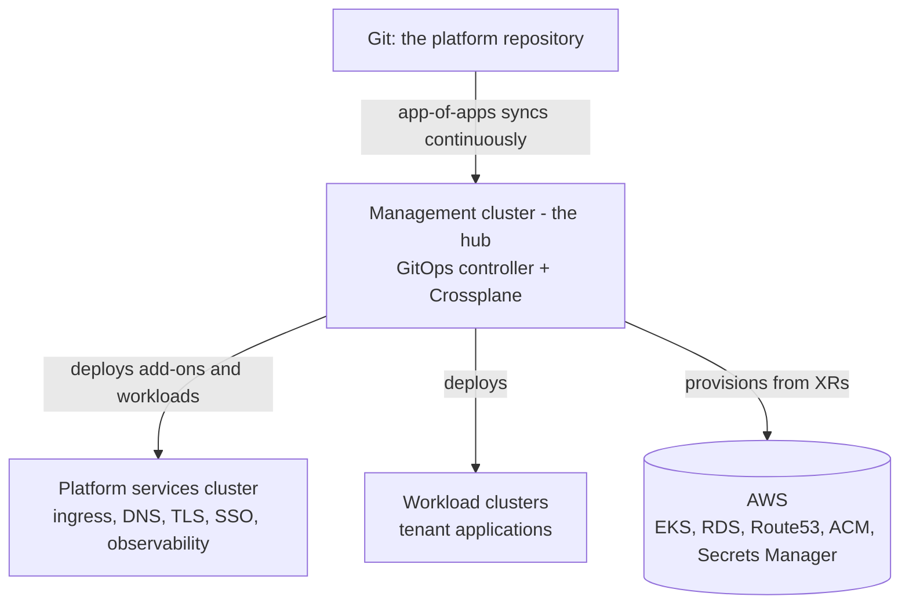

# Platform topology

Why the platform is shaped the way it is, at concept level: a hub that
manages, spokes that serve, and one Git repository driving all of it.

## The hub and the spokes

**The management cluster (hub)** runs exactly two kinds of machinery:
the GitOps controller (Argo CD) that deploys everything, and the
infrastructure engine (Crossplane) that turns composite resources into
cloud resources. It is deliberately the one part of the platform *not*
managed by the platform itself — it is provisioned by Terraform, so a
bad platform change can never take down the thing that would repair
it. That is the recovery story: the hub can always rebuild the spokes.

**The platform services cluster** is a spoke that carries the shared
machinery every tenant relies on — ingress, DNS automation,
certificates, single sign-on, observability. Isolating it means a
platform upgrade doesn't share fate with tenant workloads, and tenant
load can't starve platform services.

**Workload clusters** are spokes for tenant applications. A new one is
a composite resource plus a Git commit — the hub provisions it, wires
its certificate and DNS scope, and registers it for delivery.

## One write path

Every change — a tenant app, a component upgrade, a new cluster, a
database — is a commit to the repository the hub watches. The
app-of-apps pattern makes this recursive: the hub syncs a directory of
Application definitions, each of which syncs a component or workload.
Reconciliation is continuous, with pruning and self-healing, which has
two practical consequences:

- the cluster always converges back to Git (hand edits don't survive),
- rollback is `git revert`, because the platform has no state that
  isn't in Git or derivable from it.

## Clusters know the facts; apps stay ignorant

Applications receive exactly two facts from the platform: the DNS
**domain** and their cluster's **subdomain**. Everything
account-specific (the real domain, role identifiers, regions,
certificate identity) is attached to each cluster at registration time
and injected during deployment. That is why application manifests in
Git contain placeholders instead of real values — and why the same
chart deploys unchanged onto every spoke.

## Ephemeral by intention

The platform is a demonstration and learning reference. Its cloud
account **rotates**, and being rebuilt from the repository — from
nothing, without hand-work — is treated as the product's core feature,
exercised repeatedly rather than feared. Docs pages marked `stable`
describe behavior that has survived that rebuild loop; the marker
system exists precisely because rebuild-from-Git is the platform's
definition of "working".

## What this topology does *not* give you (yet)

- **Placement control**: workloads deploy to registered spokes as a
  set; choosing a specific cluster per workload is a later phase.
- **Human identity**: `kubectl` access via your directory group and
  SSO logins to platform UIs are the identity phase — its pages will
  arrive marked `contract` before the implementation lands.
- **Tenant-visible telemetry**: the observability stack exists as
  components, but the tenant logs/metrics story is blocked on a known
  storage gap.
