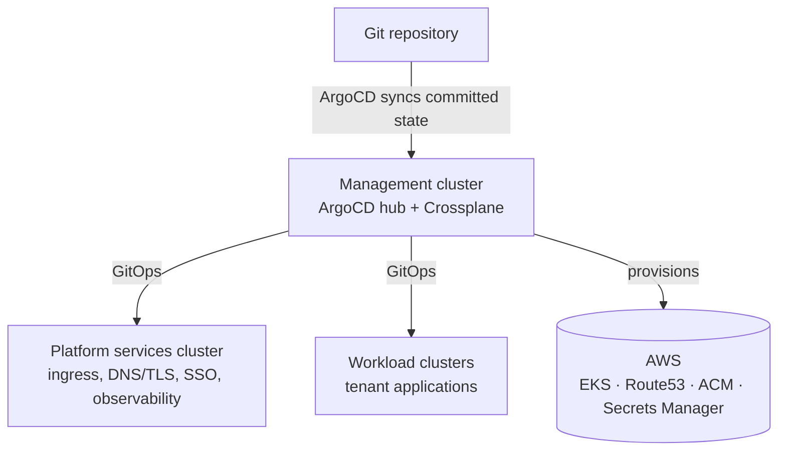

# The k8s-platform

A production-*like* Kubernetes platform on AWS, built in the open as a
learning reference and the companion to a blog series. It demonstrates
the layer that application tutorials skip: everything that has to exist
*before* an application can run the way enterprises actually run them —
automatic DNS and TLS, single sign-on, secrets that never live in Git,
cross-cluster observability, and a management plane that survives a bad
rollout.

## Who these docs are for

| You are a… | You want to… | Start with |
|---|---|---|
| **Tenant developer** | deploy and operate an application on the platform | [How-to guides](how-to/index.md) |
| **Tenant admin** | onboard your team and manage its footprint | [How-to guides](how-to/index.md) |
| **Platform operator** | change, upgrade, and verify the platform itself | [How-to guides](how-to/index.md) and [Reference](reference/index.md) |
| **Engineer end-user** | get access and run your first workload | [Tutorials](tutorials/index.md) |

Every page describes what you can see and do through the platform's
**public surfaces** — Git repositories, the Kubernetes API of the
cluster you use, published hostnames, and the platform's own status
surfaces. No page requires reading the platform's implementation.
Read [About these docs](about.md) for the conventions used throughout,
including the stability marker at the top of every page.

## The shape of the platform

- A **management cluster** is the hub: it runs ArgoCD and Crossplane,
  and it is the only part of the platform not managed by the platform
  itself (so a bad rollout elsewhere is always recoverable).
- A **platform services cluster** runs the shared machinery every
  tenant uses: ingress, automatic DNS and TLS certificates, identity,
  and the observability stack.
- **Workload clusters** run tenant applications. New clusters are
  declared in Git as Crossplane composite resources and provisioned by
  the platform — adding capacity is a commit, not a console session.

## How you interact with it

Everything is Git-driven. There is no console-clicking path and no
imperative deployment API:

- **Applications deploy via GitOps.** You commit manifests; ArgoCD
  reconciles the cluster to match.
- **Infrastructure is self-service.** Databases, secrets, and clusters
  are requested by creating a Crossplane **composite resource (XR)** —
  a small Kubernetes manifest that hides the AWS-specific details.
- **DNS and TLS are automatic.** Exposing a service on a platform
  hostname yields a public DNS record and a valid certificate without
  filing a ticket.
- **Secrets never live in Git.** A platform secret XR provisions the
  secret material in AWS Secrets Manager and syncs it into your
  namespace as a native Kubernetes `Secret`.

## Scope, honestly

This is a demonstration platform, and it is **intentionally
ephemeral**: the AWS account it runs in rotates regularly, and the
platform is rebuilt from its Git repository — from nothing — as a
matter of routine. "Working" is a property of the repository, not of
any long-lived environment. That discipline is the point of the
project, and it shapes these docs: pages describe behavior that a
rebuild reproduces, and each page's stability marker tells you how
strongly to rely on it.
