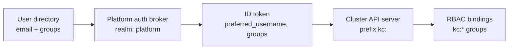

# Identity mapping

How a person in the platform's user directory becomes a Kubernetes
identity, claim by claim. This page is the contract the platform's
auth layer implements; the how-to guides
([kubectl access](../how-to/kubectl-access-via-directory-group.md),
[UI SSO](../how-to/log-into-platform-uis-with-sso.md)) are the
task-oriented views of the same mechanism.

## The identity chain

The directory is the **only** place users and group memberships live.
The platform's auth broker (realm `platform` at
`https://auth.platform.<domain>`) holds no user or group state of its
own: it federates every login to the directory and reshapes the
resulting claims. No account created in the broker, no group defined
there, is part of this contract.

## Claim mapping, hop by hop

| Hop | Field | Value |
|---|---|---|
| Directory → broker | login | your directory email + password |
| Directory → broker | `cognito:groups` claim | your directory group names, e.g. `k8s-admins` |
| Broker → ID token | `preferred_username` | your directory email |
| Broker → ID token | `groups` | the directory group names, copied verbatim on **every** login |
| Token → cluster | username | `kc:` + `preferred_username` → `kc:<email>` |
| Token → cluster | groups | `kc:` + each `groups` entry → e.g. `kc:k8s-admins` |

Group membership is re-copied from the directory on every fresh
broker login (never cached across logins, never editable in the
broker) — the directory is authoritative at each authentication.

## The `kc:` prefix

Every username and group arriving through the directory path is
prefixed `kc:` before the cluster sees it. Identities from the
platform's AWS-IAM access path carry no such prefix, so a directory
identity can never collide with — or impersonate — an IAM-mapped
identity, and RBAC rules can target each path unambiguously.

## Group → access matrix

| Directory group | Cluster sees | Bound role | Scope |
|---|---|---|---|
| `k8s-admins` | `kc:k8s-admins` | `cluster-admin` | platform services cluster |
| `k8s-viewers` | `kc:k8s-viewers` | `view` | platform services cluster |

The bindings are ordinary `ClusterRoleBinding` manifests, Git-managed
and deployed by the platform's GitOps flow — access policy changes are
pull requests, not console edits. Any other directory group a user
carries is passed through (as `kc:<group>`) but grants nothing until a
reviewed binding names it.

## Federated clusters

| Cluster | Directory-based kubectl | Notes |
|---|---|---|
| Platform services cluster | **yes** — this contract | username claim `preferred_username`, groups claim `groups`, both prefixed `kc:` |
| Management cluster | no | operator break-glass via AWS IAM only, by design |

## OIDC clients (the broker's registry)

| Client | Type | Used by |
|---|---|---|
| `kubernetes` | public, PKCE (S256) enforced, no secret | `kubectl oidc-login` (loopback redirect URIs only) |
| `cognito` (broker connection) | confidential — secret held server-side, never distributed | the broker's own federation to the directory |

Confidential client secrets for platform UIs (Argo CD, Grafana) join
this registry as those integrations land; none of them is ever
committed to Git or handed to end users.

## Revocation bounds

| Event | Takes effect |
|---|---|
| Removed from a directory group / account disabled | next fresh broker login — **and** cached sessions persist until they expire, bounded by the platform session maximum (hours, not days) |
| Session ended in the account console (self-service) or by an operator | immediately for new requests |
| AWS IAM break-glass path | unaffected by any of the above — independent by design |

The practical rule: treat directory revocation as *eventually*
effective within one session lifetime, and use session termination
when it must be immediate.

!!! info "What this contract deliberately excludes"
    No user or group management inside the broker, no per-cluster
    local accounts, no long-lived bearer tokens handed to humans, and
    no directory-based access to the management cluster. Each
    exclusion is a boundary the platform enforces, not a gap it hasn't
    got to.
