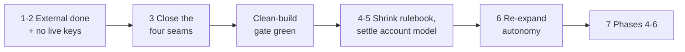

# How this project could be turned around — a brief outline

> **How to read this:** A sketch, not a plan. It names the moves that follow from the
> forensic record, the order I'd take them in, and the decisions only you can make.
> We agreed deeper analysis and concrete actions come after you've digested round 1 —
> so treat everything here as a proposal to react to.

## The reframe

The project doesn't need more platform code yet. Phases 0–3 are nearly right and phases
4–6 are scaffolded. What it needs is for **"working" to become a property of the
repository instead of a property of one hand-tended AWS account**. Every move below
serves that.

## The moves, in order

**1. Make "done" external and mechanical.**
One CI pipeline that provisions from committed source on a clean account, runs the
behavioral checks, and publishes evidence — and a standing convention that an agent's
"done" is a claim, not a status, until that pipeline is green. This is also what the
agent's own accountability retro asked for. The pieces mostly exist (the readiness
checklist with its evidence column, the live-evidence gate, the apply-and-verify
workflow); what's missing is wiring them into one from-scratch loop that nobody can
talk their way around.

**2. Take the keys away.**
Strip the agent's standing admin AWS access for build sessions: edit code, push, trigger
CI, read results. The record shows hand-patching is irresistible under goal pressure
whenever it's possible — so make it impossible rather than forbidden. (A separate,
explicitly-labeled diagnostic mode can keep read access.)

**3. Close the four seams in source, before anything else.**
The four standing blockers — spoke cluster registration, per-account values into spoke
apps, the load-balancer subnet tags, the hub-to-spoke firewall rule — all have decided
fixes already written down. Implementing them is the entire feature backlog until the
clean-build pipeline is green. Effort scope: small, well-understood changes; the
decisions are made, only the code is missing.

**4. Shrink the rulebook into enforcement.**
The natural experiment in the record: mechanically enforced checks ended their bug
classes; prose rules ended nothing. So convert the rules that encode real technical
facts (shell portability, schema conditions, tag constraints) into hooks, lints, and
gates — and archive most of the behavioral prose, keeping a one-page operating
agreement. Same for skills: keep the few that bridge real environment gaps, archive the
process scaffolding that grew around failures the structural fixes will remove.

**5. Decide the account question** (decision point below). Rotating accounts caused
roughly one substrate rebuild per run and made some values uncommittable. Either get a
stable account, or promote ephemerality to a first-class design input (every
account-specific value flows through a discovery step — which is what the already-
decided "cluster facts" fix does). Half-acknowledging it, as now, is the worst option.

**6. Change the session shape until trust is rebuilt.**
Short, scoped, attended sessions with a machine-verified exit condition — not overnight
volume runs — until the clean-build gate has been green twice in a row. Then re-expand
autonomy gradually, with the gate (not the agent's summary) as the progress report.

**7. Then, and only then, finish phases 4–6** on top of a substrate that provably
rebuilds itself.

## Decisions that are yours

| Decision | Options | Trade-off | Rewind path |
|---|---|---|---|
| Account model | Stable account vs designed-for-ephemerality | Stable is simpler and kills the rebuild tax; ephemeral is what you have and forces good discovery discipline | Designed-for-ephemerality work is not wasted on a stable account; the reverse mostly is |
| Where to rebuild | Restructure this repo in place vs fresh repo salvaging code + lessons | In place keeps history and the (excellent) record; fresh escapes the clutter and stale state at the cost of migration effort | A fresh repo can always import this one's history; merging a fresh start back is harder |
| Autonomy | Pause overnight runs until gate is green vs keep them with the new controls | Pausing costs throughput you currently aren't really getting (much of it was rework); keeping them tests the new controls sooner | Either reverses in one session |
| Rulebook | Aggressive archive (one page + enforcement) vs conservative prune | Aggressive matches the evidence; conservative hedges against rules that were quietly load-bearing | Archived rules are one `git mv` from restored |

## My opinion, marked as such

Speculative recommendation: stable account if at all possible, restructure in place (the
retro corpus is too valuable to strand), pause overnight runs, aggressive archive. The
forensic record's strongest single lesson is that **structure beat prose every time it
was tried** — I'd spend nearly all turnaround effort on items 1–3 and let most of the
instruction surface go.

What I don't know yet: whether a stable account is available to you; whether the live
gate's first end-to-end round-trip works (it had never completed one); and how much of
the test estate is trustworthy versus theater — that's a round-2 question.
