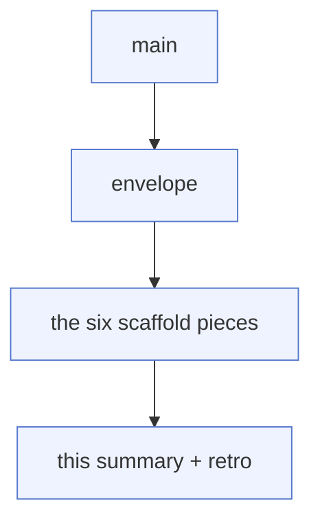

# Last night's run, in plain terms — test overhaul (auto-013)

**What this is:** the morning read-out of an overnight run on a fresh AWS account.
It says what we set out to do, where we actually got to, what to merge, and what
to decide. Precise references (plan sections, run IDs) live in the last section so
they don't clutter the read. The pull-request descriptions hold the code-level
detail.

---

## The short version: goal, plan, what changed, what's next

**What we were trying to do.** Start executing the big test overhaul — the one that
replaces "tests that check the YAML *says* X" with "tests that prove X actually
works on a real cluster, under the real restricted identity." Last night's slice:
stand up a real management cluster on the fresh account, prove the riskiest
mechanism works before building on it, and ship the first layer of the new test
machinery.

**Where the night would have gone if everything broke our way.** Bring the cluster
up → run the full proof-of-mechanism (the "spike") → build the safety scaffold →
**wire that scaffold into the real build pipeline** → start deepening the actual
behavioural coverage. In other words: by morning, the new tests would be both built
*and switched on* in the live pipeline, with real behavioural checks starting.

**What actually changed the plan.** Three honest findings pulled the night up short
of that:

1. **The cluster is the slow part, and it's the gate for everything live.** The
   management cluster coming up is the long pole of the night; the proof-of-mechanism
   can't start until it's healthy. That's expected, but it means the live work all
   bunches at the end.
2. **The sandbox can't talk to the cluster's API directly** (its certificate is
   private). So the live checks have to be run *through* a CI workflow, not from
   here. That's fine for read-only probes, but it makes the heavier "provision a
   throwaway resource and watch it fail on purpose" check a bigger job than a
   one-liner — so I did the read-only half and stopped there.
3. **The step that switches the new tests on edits the live build pipeline itself.**
   Landing that unvalidated could break the very bring-up we depend on. The rule
   (and good sense) says validate a pipeline change by *running* it before merging.
   I couldn't safely do that in one unattended pass, so I built everything it needs
   and left the wiring as the first job for next time.

**What's next (in order).** (1) Finish the proof-of-mechanism: provision one cheap
throwaway resource and confirm the v2 "what did this compose into?" field, then do
the deliberate-failure check. (2) Wire the scaffold into the pipeline and validate
it by dispatching a build. (3) Then start the behavioural coverage layers.

Green = done · amber = partly done · grey = not started.

---

## What's live right now

The substrate came up clean on the fresh account, and the auto-012 eight-blocker
chain did **not** come back. More importantly, the one assumption the whole overhaul
rests on — *can we prove permission gaps by driving the real controller under its
real cluster identity?* — checked out on the live cluster.

| Thing we wanted to confirm | Result | How we know |
|---|---|---|
| Management cluster comes up green | **Yes** | base + management bring-up both passed |
| Crossplane uses the real cluster IRSA identity, not static keys | **Yes** | provider config source is exactly `IRSA` |
| No static AWS keys hiding in the provider pod | **Yes** | pod has the web-identity token + role ARN, no access-key env |
| All providers healthy | **Yes** | all eight report Healthy |
| The v2 resource definitions are the namespaced kind we expect | **Yes** | all four established, namespaced scope |
| The v2 "what did this compose into?" field on a *live* resource | **Not yet** | nothing's been provisioned to read it from |

The first five are the load-bearing ones, and they passed. That means the scaffold
I built sits on confirmed ground for the identity question — the one thing that, if
wrong, would have meant rebuilding from scratch. The sixth needs a provisioned
resource and is the first thing to finish next session.

## What got built

Six small, independent pieces of the new test machinery. Every one is pure
scripts-and-tests — no cloud, no cluster needed to run them — and each passed its
own checks both locally and in CI. In plain terms:

| Piece | What it does, in one sentence | Risk to merge |
|---|---|---|
| Any-apply triggers verify | Makes it impossible to bring the cluster up without the live checks also running | None — a derived flag + its test |
| Coverage deriver | Generates the list of "things our compositions create" from the compositions themselves, so a new resource with no test is caught automatically | None — scripts + tests |
| Inverted-skip runner | The new live-test runner where "everything got skipped" reads as **RED**, not green (the old runner read all-skipped as a pass — the core disease) | None — scripts + tests |
| Live-evidence gate | A pre-merge check that fails unless there's proof a real verified build ran for this exact config, account, and cluster | None — logic + tests; not yet switched on |
| Scoped verifier identity | A new, deliberately tiny AWS role for the test harness to use instead of the admin keys, with no wildcard permissions and tag-locked delete rights | Low — adds Terraform that only takes effect on the next cluster apply |
| Disable-register lint | Makes every "we turned this check off" entry carry a reason, an owner, and an expiry date, and caps how many can pile up | None — scripts + tests |

**Speculative recommendation (my opinion, not fact):** the inverted-skip runner and
the live-evidence gate are the two that matter most — together they're what make
"the tests can't quietly pass by doing nothing" true. If you only review two, review
those.

## The order to merge them

They're stacked, so each one's changes show up cleanly against the one below it.
Merge bottom-to-top and GitHub re-points each to `main` as the one under it lands.

1. Envelope (the run's contract) — merges into `main`.
2. → 3. → ... the six scaffold pieces, in stack order.
8. This summary + the retrospective.

Five of the six are pure scripts and tests with **no infrastructure risk at all**.
The one exception is the scoped verifier identity: it adds a new AWS role and a
small lock table that only come into being on the *next* cluster apply — so read
that policy before that apply, but it changes nothing at merge time.

## Decisions you may want to confirm

You pre-answered all four of these in the run brief, so I acted on them rather than
stopping to ask. Here's what I did and how to undo each if you'd call it differently.

1. **Stand up the tiny scoped role for the test harness.** *Done* — built it with
   zero wildcard permissions and tag-locked deletes. *Undo:* drop that one piece.
   *Still open:* right now anything in the account can assume it (gated by a run
   tag); tighten that to a named CI role once one exists.
2. **Make sure CI can reach the spoke cluster's API.** *Carried* — I'll confirm the
   allow-list and access entry when phase-3 actually provisions a spoke. *If it
   can't:* fall back to reading effects via CloudTrail plus hub-side config.
3. **Tighten the broad `Resource: "*"` grants so the "this should be denied" tests
   have teeth.** *Carried, and I recommend doing it* — but only alongside the deny
   tests, and never in a way that breaks provisioning; where it's risky, the deny
   test stays written-down-but-deferred rather than weakening the real grants.
4. **Look into the ArgoCD controller role having no policies attached.** *Confirmed
   it really is empty* in the Terraform. *Carried:* figure out whether spoke
   registration needs a policy there and add it if so. No change made yet.

## What I deliberately did NOT do (and why)

- **Wire the scaffold into the live build pipeline.** It edits the pipeline that
  brings the cluster up; landing it without first running it risks breaking the
  bring-up. Everything it needs is built and tested — this is the first job next
  session.
- **The deliberate-failure half of the proof-of-mechanism** (provision a resource
  with a permission removed and confirm it fails the right way). Needs a throwaway
  resource and a crippled-on-purpose role; the read-only half already confirmed the
  identity question.
- **Provision the phase-3 platform cluster.** Out of scope for this layer; needed
  later to read the live "what did this compose into?" field and the spoke checks.
- **The later coverage layers** (deepen read-only checks, isolation/cleanup,
  provision-and-verify, deliberate-failure tests, hardening) — sequenced behind the
  proof-of-mechanism and the wiring.
- **Actually create the scoped role in AWS.** Its Terraform is written and reviewed
  by tests, but it only materialises on the next cluster apply.

## If you want to undo any of it

| To undo | Revert | What survives |
|---|---|---|
| The whole run | the envelope and everything above it | the repo as it was before last night |
| Just the work, keep the contract | everything from the first scaffold piece up | the envelope |
| Just the new AWS role | the verifier-identity piece | everything else (and no live resource existed yet) |
| Nothing destructive happened live | — | the cluster is a normal fresh bring-up; nothing was deleted or rotated |

---

## Pointers and audit trail

*The precise references, kept out of the read above so they don't get in the way.*

- **Run:** auto-013 · 2026-06-07 · fresh account `695454131301`.
- **Authoritative plan:** `planning/test-overhaul/FINAL-PLAN.md`. Run contract:
  `planning/test-overhaul/SCOPE-ENVELOPE-auto-013.md` (PR #170).
- **Live evidence (CI run IDs):** base apply `27085405081`; management
  apply-and-verify `27085571769`; read-only spike via the `kube-diagnose` workflow
  `27085946167`. All green.
- **Spike detail:** provider config `spec.credentials.source == IRSA`; the only
  `clusterproviderconfig` is `default source=IRSA` (no static-cred config layered
  over it); the `upbound-provider-family-aws` pod carries `AWS_ROLE_ARN` +
  `AWS_WEB_IDENTITY_TOKEN_FILE` and no `AWS_ACCESS_KEY_ID`; all eight providers
  `Healthy=True`; all four XRDs `Established=True`, `scope=Namespaced`. The "drive a
  real claim and read `spec.crossplane.resourceRefs`" check (plan SPIKE-6) is the
  one still open — no XR provisioned yet.
- **PRs, with the plan sections each implements:**

  | PR | Branch | Plan ref | Title |
  |----|--------|----------|-------|
  | #170 | `…blissful-faraday-RsPY2` | — | scope envelope |
  | #171 | `…p1-compute-gates` | §4.1 | `mgmt_live_verify` derived gate (any mgmt apply ⇒ verify) |
  | #172 | `…p1-coverage-deriver` | §4.5 | Pipeline-mode coverage deriver + byte-identical fixture |
  | #173 | `…p1-live-orchestrator` | §4.4 | inverted-skip live orchestrator (`tests/live/run.sh`) |
  | #174 | `…p1-live-evidence-gate` | §4.3 | FAIL-closed live-evidence gate |
  | #175 | `…p1-verifier-iam` | §3.4 | scoped zero-wildcard verifier/reaper IAM role |
  | #176 | `…p1-skip-register-lint` | §4.6 | SKIP_REGISTER lint |
  | #177 | `…run-summary` | — | summary + retrospective + handoff |

- **The four decisions map to** plan §14.7 (scoped role — done in #175), §14.2 (spoke
  CIDR/AccessEntry — carried), §14.3 (tighten `Resource:"*"` — carried), and the
  ArgoCD `role_policy_arns = {}` at `terraform/management/irsa.tf` (`module.irsa_argocd`
  — confirmed present, carried).
- **The scoped role's open sub-choice:** its assume-role trust is currently
  account-root scoped + gated on a `live-verify` session tag; tighten to a named CI
  role ARN once that role exists.
- **Tests:** ~67 new hermetic assertions across five new files under `tests/unit/`,
  all wired into `tests/unit/run.sh`; unit-tests CI green on each implementation
  branch.
- **Decision briefs:** none written — the four §14 questions were pre-answered in the
  run brief, so none reached "ask the user" territory.
- **Subagents dispatched:** none.
- **Retrospective + its rule/decision drafts:** `retrospective/2026-06-07-177.md` and
  the sibling directory (two proposed AGENTS.md rules, one ADR draft on the
  coverage-gate enforce/warn split).
- **Branch chain at run end (top to bottom):** `…run-summary` → `…p1-skip-register-lint`
  → `…p1-verifier-iam` → `…p1-live-evidence-gate` → `…p1-live-orchestrator` →
  `…p1-coverage-deriver` → `…p1-compute-gates` → `…blissful-faraday-RsPY2` → `main`.
