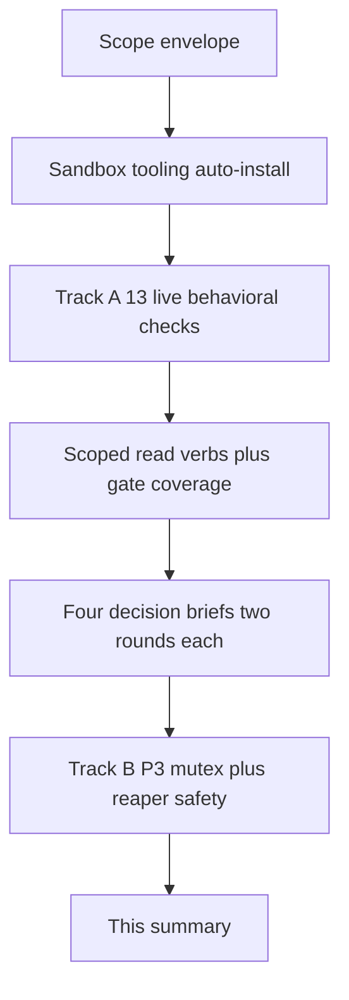

# Run summary — auto-014 (unattended, 2026-06-08)

*Your morning review artifact. Lead section is the headline; exact IDs/SHAs are in
the Pointers footer at the bottom.*

---

## The four-part orientation

**1. What this run set out to do.** Make the platform's live test suite check a lot
more than it did. It could already prove, against the real AWS account, that a
Crossplane-built database exists and is healthy — but only the database. The job was
to write the same kind of "is the real cloud thing actually there and healthy?" check
for thirteen more resource types (certificates, the cluster, node groups, IAM roles,
DNS records, secrets, and so on), wire them into the gate, and then start building the
next safety layer underneath: a lock that stops two test runs from stepping on each
other, and the "cleaner" that removes leaked test resources without ever touching real
ones.

**2. Where the night would have gone if everything broke our way.** Confirm the
existing database-evidence pipeline still works end to end; fan out and write all
thirteen new checks; run them against the real account and watch them pass; broaden the
gate to cover them; settle the four open owner questions with written, reviewed briefs;
then build the isolation/cleanup machinery, the create-and-verify harness, and the
"prove the guard fired" security tests — each as its own reviewable pull request.

**3. What changed the plan.** Two things, both worth knowing. First, **I cannot make
changes to the live clusters from this sandbox** — the identity here is read-only, and
the create/delete tiers (the harness and the negative tests) need to actually
create and destroy cloud resources. So those land as designed-and-tested-in-isolation,
but their *live* validation has to run through CI, not from here. I was explicit about
this rather than pretending otherwise. Second, near the end **GitHub's release
downloads started returning 504 errors across the board** (helm charts, the kubeconform
binary) — so the unit-test CI is red on several PRs for a reason that has nothing to do
with the code. It will clear when GitHub recovers and the jobs are re-run.

**4. What's next, in order.** (a) Merge the stack bottom-up. (b) For the one PR that
broadens the gate, follow the merge → terraform apply → dispatch sequence so the
producer goes green (details below). (c) Pick up Track B where I left it: wire the
mutex + reaper into the live runner, then the create-and-verify harness (P4) and the
guard-fired negatives (P5) — the design questions for these are already settled in the
decision briefs.

---

## What's confirmed working (and how I know)

| Thing | Status | How I know |
|---|---|---|
| The database-evidence round trip (STEP 0) | **Working** | Dispatched the live-verify producer on `main`; it ran green and uploaded evidence (two green runs). |
| 11 of the 13 new behavioral checks | **Pass against the real account** | Ran the live suite from the sandbox against account `878302603783`: 11 PASS (each emits its coverage line), 0 FAIL. |
| The other 2 + 2 checks correctly **skip** | **Correct** | ExternalSecret, IAM OIDC provider, IAM inline RolePolicy, and Secrets Manager have no healthy Crossplane-built instance in this account yet, so they cleanly skip — and the orchestrator turns a skip into a failure only when the kind is declared as expected. |
| The scoped role needed exactly 3 more read verbs | **Confirmed, not guessed** | Assumed the real scoped role from the sandbox and watched the acm/iam calls get denied; every other call already worked. |
| The account mutex | **Works live** | Ran acquire → block → renew → release → re-acquire against the real DynamoDB lock table under the scoped role; all correct. |
| The reaper's "what is safe to delete" logic | **Unit-proven** | A pure decision function with a test covering every protect-branch and the single delete-path. |
| The spoke cluster is reachable and not isolated | **Confirmed** | `kubectl get nodes` on the spoke through the relay returns 2 ready nodes; the sandbox identity has a spoke access entry + view policy. |
| The live-evidence gate fails closed correctly | **Confirmed (as designed)** | On the stacked PRs it goes red demanding fresh evidence for the new SHA, exactly as the fail-closed design intends. |

---

## The shape of the run

---

## Suggested merge order (stack-bottom first)

Merge bottom-up. Each is independently reviewable; the notes call out the one with a
sequencing requirement.

1. **#191 — scope envelope.** Doc only. Safe to merge anytime.
2. **#192 — sandbox tooling auto-install.** The fix you asked for (kubectl + Docker).
   Independent of everything else; safe to merge first if you like.
3. **#194 — the 13 behavioral checks + registry.** Adds the checks, keeps the gate's
   coverage where it was. Read-only; safe.
4. **#195 — 3 scoped read verbs + broaden the gate to 10 kinds.** ⚠️ **Sequencing:**
   the 3 verbs take effect only on a terraform apply. Order: merge → `terraform apply`
   (management) → dispatch live-verify → the producer goes green on all 10 kinds. Until
   the apply, the acm/iam/route53 checks skip under the scoped role and the producer is
   red. (I could not apply terraform from here.)
5. **#196 — four decision briefs + registry re-tiers.** Docs + cost-tier labels; no
   live effect.
6. **#197 — account mutex.** New library + test; no live effect until wired.
7. **#198 — reaper safety logic.** New library + test; no live effect until wired.
8. **#199 — this summary.** Doc only.

Independently mergeable without the chain: **#192** (tooling) and **#196** (briefs/docs).

---

## PRs opened

| PR | What it does, in plain words | Merge risk |
|---|---|---|
| #191 | The run's scope agreement (first file, for rewind) | None (doc) |
| #192 | Auto-installs kubectl + session-manager-plugin and starts Docker at session start | Low |
| #194 | 13 read-only "is the real cloud resource healthy?" checks, one per kind | Low (read-only) |
| #195 | 3 more read verbs for the scoped role + grows the gate from 1 to 10 kinds | Medium — needs apply before green |
| #196 | Four owner decisions, each argued through two rounds of real review | None (docs + labels) |
| #197 | A per-account lock so two mutating runs never collide | Low (new lib) |
| #198 | The cleaner's "never delete a real resource" decision logic | Low (new lib) |
| #199 | This summary | None (doc) |

---

## Decisions you may want to confirm

These are the four open owner questions, each settled via two rounds of real
adversarial review (not me arguing with myself). Full reasoning is in the briefs.

| Decision | What I did | The alternative | How to undo |
|---|---|---|---|
| **Cost tiers** | Re-labeled three kinds so the create-and-verify harness won't try to make them per-run (they share AWS-managed policies or the shared secret store). | Leave them as cheap-and-isolated. | Revert the registry hunk in #196. |
| **Tighten the broad IAM/RDS permissions** | **Did not** — I can't prove a tightening won't break the next real build from here. Anchored it with an open-issue entry + a starter script so it isn't forgotten. | Tighten the IAM subset now (a reviewer showed it's likely safe). | Revert the open-issue + stub in #196. |
| **Hub-to-spoke end-to-end test** | **Deferred, no placeholder** (a skip-forever placeholder would quietly read green). Probed the public URL — it doesn't resolve yet, so there's nothing to test against. | Build it now against the public ingress. | Revert the open-issue in #196. |
| **Open the spoke to CI/sandbox** | **Did not widen anything.** Diagnosis showed the spoke is already reachable and the earlier failure was a transient tunnel hiccup. | Add an access entry / widen the allowlist. | Nothing to undo. |

---

## What I deliberately did NOT do

- **Did not touch the live clusters** beyond read-only checks and a throwaway lock-row
  self-test — the sandbox identity is read-only and the run's hard boundaries forbid
  widening any access.
- **Did not tighten the live provider IAM policy** (see the decision above) — would be
  unverifiable from here and could silently break the next bring-up.
- **Did not finish Track B.** The mutex and the reaper's *decision* logic are done and
  tested; still to do: wire them into the live runner, build the create-and-verify
  harness (P4), and the guard-fired negative tests (P5). The design choices for these
  are already made in the briefs. They were deferred because they require creating and
  deleting real cloud resources, which only CI can do — not because they were skipped.
- **Did not green-wash the gate.** The four kinds with no healthy instance stay out of
  the expected-coverage set; they join the moment they're really provisioned.

---

## How to undo any of it

| To undo… | Revert |
|---|---|
| The entire run (back to pre-run `main`) | The whole #191→#199 chain |
| The work but keep the scope agreement | From #192 onward |
| Just the gate broadening (the one with the apply caveat) | #195 |
| Just the cost-tier re-labels | The registry hunk in #196 |
| Just the new mutex / reaper libraries | #197 / #198 |

No live cloud state was changed by this run (all checks read-only; the mutex self-test
row was released; no terraform was applied).

---

## CI status note (read before worrying about red)

Two kinds of red on the stacked PRs are **expected, not bugs**:

1. **Unit tests red** = GitHub's own release downloads (helm charts, kubeconform) were
   returning 504 across the board during the run. Nothing in the diff causes it. Re-run
   the failed jobs once GitHub recovers.
2. **Live-evidence gate red** = working as designed. The stack changes a file under
   `policies/`, so the fail-closed gate demands fresh live evidence for the new SHA,
   which won't exist until the merge → apply → dispatch sequence runs (#195's note).

---

## Pointers / audit trail

- **Run:** auto-014 · **Date:** 2026-06-08 · **Account:** 878302603783 · **Region:** us-east-1.
- **Trunk branch:** `claude/test-overhaul-unattended-run-eWZgz`; stacked branches
  `claude/auto-014-*`. Pre-run `main` = `ffd5d7d`.
- **PRs:** #191 (envelope), #192 (sandbox tooling), #194 (13 checks + registry), #195
  (verbs + expect-full), #196 (decision briefs), #197 (account-mutex), #198
  (reaper-select), #199 (this summary).
- **STEP 0:** live-verify.yml dispatched on `main`; runs `27115878085` (owner-triggered)
  and `27117649494` (this run) both green.
- **Live suite result (sandbox, admin creds):** 11 PASS / 4 SKIP / 0 FAIL across the 15
  after-tier checks; `expect-full-violations=0` for the broadened 10-kind set.
- **Scoped-role gap confirmed:** `acm:ListTagsForCertificate`, `iam:ListRoles`,
  `iam:ListRoleTags` denied under `k8-platform-mgmt-live-verifier-reaper`; added in #195.
- **Decision briefs:** `planning/test-overhaul/decisions/auto-014-00{1,2,3,4}-*.md`
  (two rounds, ≥3 real subagent reviewers each; 24 reviewers total).
- **Open issues filed:** OI-2026-06-08-1 (Resource:\* tightening deferral),
  OI-2026-06-08-2 (hub→spoke e2e gap, with the NXDOMAIN probe evidence).
- **New artifacts:** `tests/live/checks/after/*-live.sh` (13), `tests/live/lib/
  account-mutex.sh`, `tests/live/lib/reaper-select.sh`, `tests/unit/test_account_mutex.sh`,
  `tests/unit/test_reaper_select.sh`, `scripts/derived-arn-inventory.sh`.
- **FINAL-PLAN refs:** Track A = §4.4/§4.5; P3 = §8/§14.8; the open calls = §5/§14.5,
  §14.3, §14.2/§10.
- **Subagents:** ~7 Track-A authoring + 1 deep-read wave + 24 adversarial reviewers.
- **CI outage:** GitHub releases 504s on `test_helm_render.sh` chart fetches +
  kubeconform install (runs `27119414423`, `27119636995`, `27119776245`).
