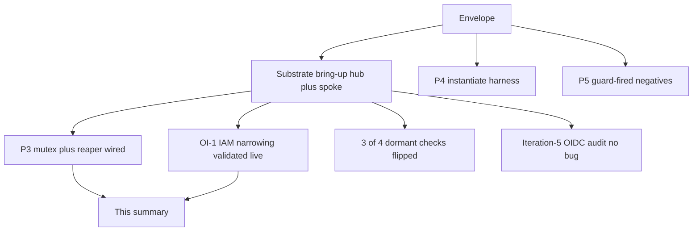

# Run summary — auto-015 (unattended, 2026-06-08)

*Your morning review artifact. The story is up top; exact IDs/SHAs are in the
Pointers footer.*

---

## The four-part orientation

**1. What this run set out to do.** Start the whole platform over on a brand-new cloud
account, then keep building the new live-testing machinery. Concretely: stand up the
base, the central hub cluster, and a spoke cluster the hub builds itself; confirm the
"is the real cloud thing actually there?" evidence pipeline still works on the fresh
account; switch on four checks that sat dormant last run; and ship the next safety
layers — a per-account lock + a careful "cleaner," a create-and-verify harness, and
"prove the guardrail fired" security tests — plus tighten an over-broad cloud permission
that had been deferred for lack of a clean build to test against.

**2. Where the night would have gone if everything broke our way.** Substrate up;
evidence pipeline green; all four dormant checks flipped on; every safety layer shipped
and live-validated; the broad permission tightened and proven; the hub-to-spoke
end-to-end web check built; every piece its own reviewable pull request.

**3. What changed the plan.** Three things. First — the good kind — **the marquee piece
landed fully**: the over-broad IAM permission was narrowed *and proven safe on a real
create path* (the hub actually created the spoke's identity resources under the tighter
policy, and nothing broke). That was the riskiest, most-deferred item, and it's done and
validated. Second, two honest limits surfaced: the AWS **policy simulator returns
"denied" for everything on a freshly-changed role** (so the "prove the denial" check
can't use it right now — it skips cleanly instead of lying), and the **hub-to-spoke web
check can't be built yet** because the spoke's app stack and DNS name aren't up, so there's
literally nothing to curl. Third, a **tooling glitch cost some time**: a background
worker's git checkout moved my own working branch, so one commit landed on the wrong
branch — caught, recovered, no work lost, but worth a guardrail (see the retro).

**4. What's next, in order.** (a) Merge the stack bottom-up. (b) **Merge the IAM
narrowing (#203)** so the committed code matches the now-narrower live policy. (c) Once
the spoke's app stack and `hello.platform.<domain>` are up, build the hub→spoke web check
(OI-2) and flip the last two dormant checks (the secrets ones, which need Keycloak's
secret claim). (d) Live-exercise the create-and-verify harness and the negatives in
mutating mode (they're built and unit-proven; not yet run against the cloud).

---

## What's live and confirmed (and how I know)

| Thing | Status | How I know |
|---|---|---|
| The full substrate on the new account | **Live** | base + management applied via CI (`apply-and-verify` green); hub `k8-platform-mgmt` 3 nodes Ready; spoke `k8-platform-services` ACTIVE, 2 nodes; `*.platform.<domain>` ACM cert ISSUED |
| The hub builds the spoke via GitOps | **Confirmed** | synced `platform-cluster-claim` (committed `main`); the `XPlatformCluster` reconciled the spoke EKS cluster + nodegroup + cert |
| The IAM narrowing is real, validated, and non-breaking | **Confirmed live** | applied the tighter policy; the hub Crossplane then **created** the spoke OIDC provider + external-dns role + its inline policy **under it**; the cluster stayed `Synced=True` and zero resources went un-Ready |
| 3 of the 4 dormant checks now have real instances | **Confirmed** | the spoke OIDC provider, the external-dns role, and its inline policy are all present and crossplane-tagged (created by the spoke-access sync) |
| The Cognito/Keycloak/EKS identity design is sound | **No bug found** | audited: Cognito is brokered *behind* Keycloak; AWS never trusts Cognito directly, so the "missing provider" isn't missing — it's correctly absent |
| P3 / P4 / P5 mechanisms | **Built + unit-proven** | hermetic unit tests green (reaper 15/0 + orchestrator 27/0; instantiate 24/0; negatives 12/0) — live mutating runs are the remaining step |

---

## The shape of the run

---

## Suggested merge order (stack-bottom first)

All auto-015 PRs are **independent siblings off the envelope branch** (each PR targets
`claude/festive-sagan-94xyq1`; GitHub retargets them to `main` when the envelope merges).
Merge the envelope first, then the rest in any order — but the order below reads cleanest.

1. **#201 — envelope.** Doc only.
2. **#202 — P3 (mutex + reaper wired into the live runner).** New lib + run.sh wiring; hermetic.
3. **#204 — P4 (create-and-verify harness).** New tier; hermetic; off by default.
4. **#206 — P5 (guard-fired negatives).** New checks; hermetic; off by default.
5. **#205 — ExternalSecret check reliability fix.** Read-only check hardening.
6. **#203 — IAM narrowing.** ⚠️ **Merge this to make `main` match the now-narrower live
   policy.** It's validated live and ready; leaving it unmerged is safe (a future
   management apply from `main` would revert the live policy to the broad superset), but
   the intent is to keep the tighter policy, so merge it.
7. **#207 — this summary.** Doc only.

---

## PRs opened

| PR | What it does, in plain words | Merge risk |
|---|---|---|
| #201 | The run's scope agreement (first file, for rewind) | None (doc) |
| #202 | Wires the per-account lock + the leak "cleaner" into the live test runner | Low (hermetic; off unless mutating) |
| #203 | Narrows an over-broad cloud permission to just our own resources — **validated live** | Medium — a live-policy change; validated + ready |
| #204 | A harness that creates a throwaway cloud resource and proves it really appeared, then cleans up | Low (off by default) |
| #205 | Makes the secrets check survive a flaky tunnel instead of misreading it as "nothing there" | Low (read-only) |
| #206 | Three tests that prove our guardrails actually block what they should (red-first) | Low (off by default) |
| #207 | This summary | None (doc) |

---

## Decisions you may want to confirm

| Decision | What I did | The alternative | How to undo |
|---|---|---|---|
| **Tighten the broad IAM permission now** | **Did it, and validated it live** (2 rounds of real review, then proved the hub creates the spoke's identity resources under the tighter policy). The live policy is now narrower than `main`. | Keep deferring (last run's posture). | Revert #203; a future apply from `main` restores the broad policy. |
| **Build the hub→spoke web check (OI-2)** | **Deferred** — `hello.platform.<domain>` doesn't resolve yet (the spoke's app stack + DNS record aren't up), so there's nothing to curl. Recorded with the evidence. | Force it now against a not-yet-live endpoint (would be red-by-infra). | Nothing to undo. |
| **The simulator-based "prove the denial" check** | Made it **skip cleanly** when the AWS simulator is unusable (it currently denies everything on the freshly-changed role), rather than false-fail. The real proof is the live create-path + the static lint. | Assert against the simulator anyway (would false-fail). | Revert the check hunk in #203. |
| **RDS/EC2 permission tightening** | **Deferred to a follow-up** (corrected the stale "RDS not derivable" rationale on the open issue). Each needs the provision that exercises it to validate. | Tighten them this run (expands the validation surface). | n/a (not done). |

---

## What I deliberately did NOT do

- **Did not dispatch the full 10-kind evidence producer (STEP 0).** It needs the spoke's
  app stack provisioned (route53 records, secrets, etc.), which isn't up yet. The pipeline
  itself is unchanged from last run's working state; this is a provisioning gap, not a code gap.
- **Did not flip the last two dormant checks** (the AWS Secrets Manager secret + its
  ExternalSecret). Those need Keycloak's secret claim, which provisions with the spoke app
  stack (not up yet). The ExternalSecret check's *reliability* fix shipped (#205); the
  *flip* awaits the real instance.
- **Did not live-run P4/P5 in mutating mode.** They're built and unit-proven; running them
  against the cloud (creating a throwaway resource, applying a forbidden manifest) is the
  remaining validation and is best done as a focused mutating-profile pass.
- **Did not build OI-2's curl e2e** (see decisions) — no resolvable endpoint yet.

---

## How to undo any of it

| To undo… | Revert |
|---|---|
| The entire run | The whole #201→#207 chain |
| The work but keep the scope agreement | From #202 onward |
| Just the live IAM narrowing | #203 (and a future `main` apply reverts the live policy to broad) |
| Just the mutex/reaper wiring | #202 |
| Just the create-and-verify harness / the negatives | #204 / #206 |

**Live cloud state changed by this run:** the substrate was *built* (hub + spoke), and the
Crossplane provider IAM policy is now *narrowed* (validated). Everything else (the test
code) is off-by-default and touches no cloud state until explicitly run in mutating mode.

---

## CI status note (read before worrying about red)

- The **render-fixtures unit test flakes red** on several PRs with a Docker image-pull
  timeout (`xpkg.crossplane.io/crossplane:v2.3.0: context deadline exceeded`) — an
  environmental registry hiccup unrelated to any change here; it clears on re-run.
- The **live-evidence / chainsaw-verify gates go red** on PRs that touch policy/crossplane
  config until a producer runs for that SHA — fail-closed by design, exactly as intended.

---

## Pointers / audit trail

- **Run:** auto-015 · **Date:** 2026-06-08 · **Account:** 176646220910 · **Region:** us-east-1.
- **Trunk/envelope branch:** `claude/festive-sagan-94xyq1`; stacked siblings `claude/auto-015-*`. Pre-run `main` = `62c7532`.
- **PRs:** #201 envelope · #202 P3 · #203 OI-1 IAM narrowing (validated) · #204 P4 · #205 flip-skip · #206 P5 · #207 this summary.
- **Bring-up runs:** base `27154393055` (green) · management `27154627750` (green) · OI-1 narrowing apply `27157161037` (green, "2 changed").
- **Live evidence:** spoke OIDC provider `oidc.eks.us-east-1.amazonaws.com/id/B58BD65CC9C34658530A45BB69D18D5E` (crossplane-tagged); external-dns role `k8-platform-k8-platform-services-external-dns` + inline policy `k8-platform-services-external-dns` (crossplane-tagged); `XPlatformCluster platform` Synced=True.
- **Decision brief:** `planning/test-overhaul/decisions/auto-015-001-iam-resource-tightening-clean-build.md` (2 rounds, 6 real adversarial reviewers).
- **Open issues touched:** OI-2026-06-08-1 → IAM RESOLVED (RDS/EC2 follow-up open); OI-2026-06-08-2 (hub→spoke e2e) still deferred with fresh evidence.
- **Subagents:** 6 adversarial reviewers (OI-1, 2 rounds) + P4/P5 authoring + Iteration-5 audit + status pollers (~13 total).
- **Incident:** a worktree-isolated subagent's `git checkout` moved the main worktree's HEAD; one commit landed on the wrong branch, recovered via cherry-pick (no work lost). See the retrospective.
- **Retro:** `retrospective/2026-06-08-207/` (+ the main report).
