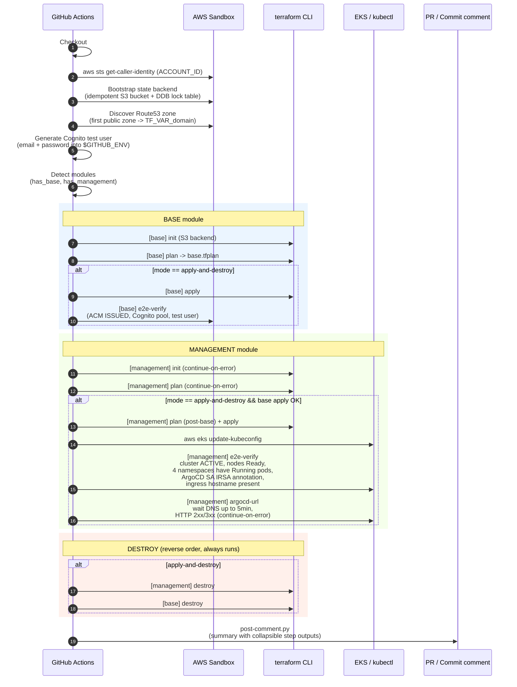
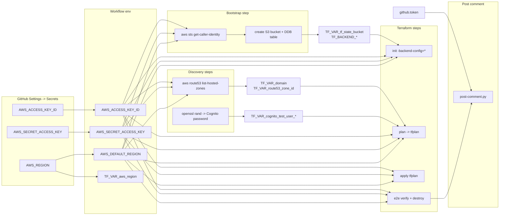
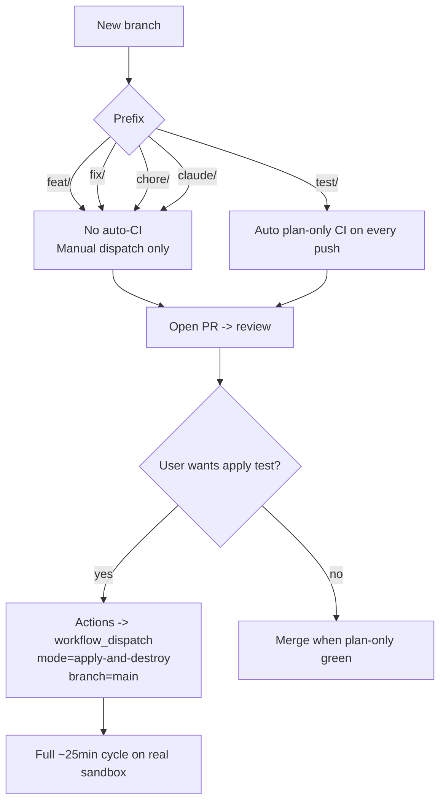
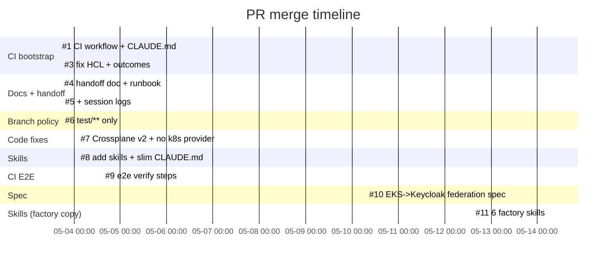
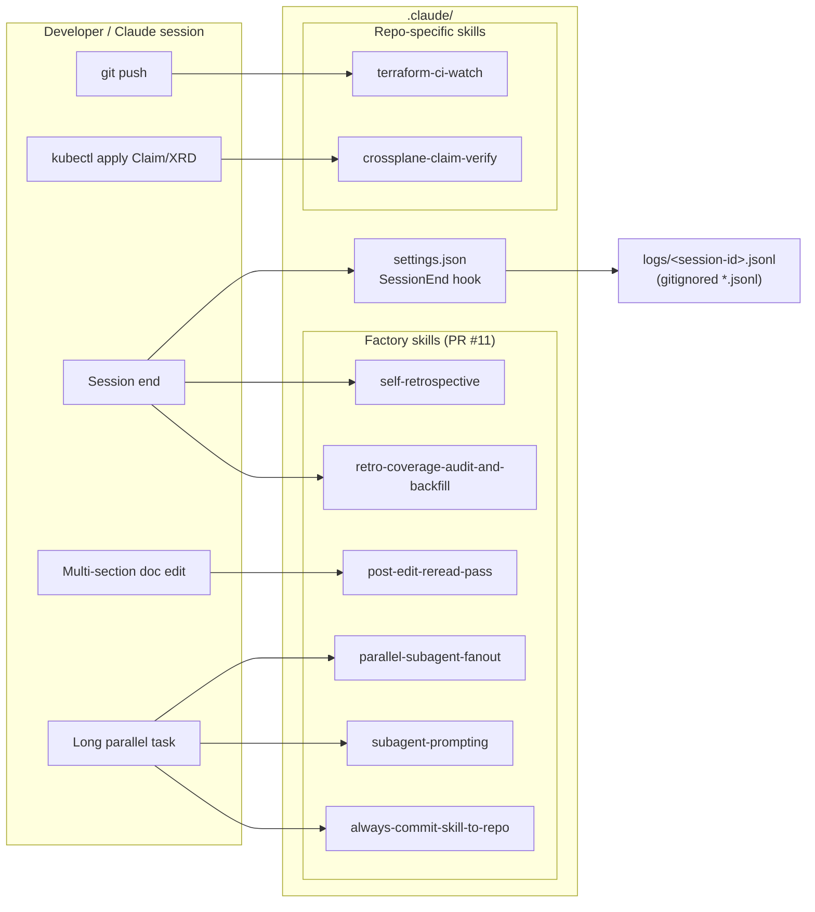
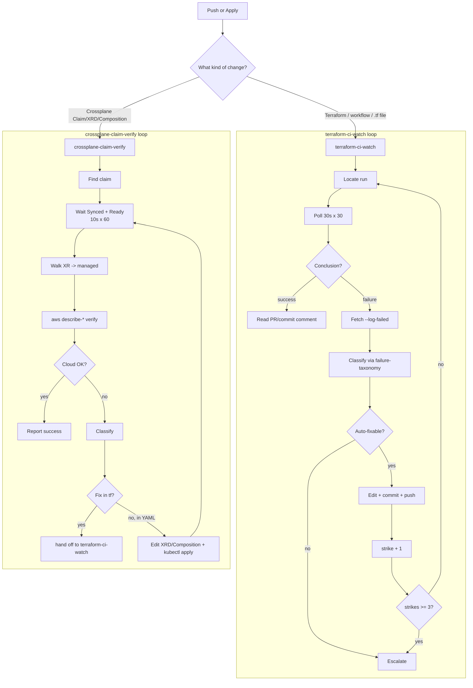
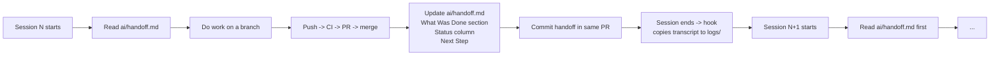

# k8-platform — Development Workflow Functional Summary

*Snapshot date: 2026-05-17*
*Repo: [`lago-morph/k8-platform`](https://github.com/lago-morph/k8-platform)*
*Scope: how the development loop actually works today — CI, branches, secrets, issues, skills, hooks, handoff.*

This document describes the **process side** of the repo (workflows, branches, agents, skills) rather than the **product** (the Kubernetes platform itself). For product/architecture see [`ai/DESIGN.md`](../ai/DESIGN.md) and [`README.md`](../README.md).

---

## 0. TL;DR

- **CI is a single GitHub Actions workflow** — [`.github/workflows/terraform-test.yml`](../.github/workflows/terraform-test.yml) — that runs `terraform init/plan` (and optionally `apply` + e2e verify + `destroy`) for both modules (`terraform/base` and `terraform/management`).
- **Only three GitHub secrets** are required: `AWS_ACCESS_KEY_ID`, `AWS_SECRET_ACCESS_KEY`, `AWS_REGION`. Everything else (state bucket, Route53 zone, Cognito creds, domain) is **auto-discovered or auto-generated at workflow runtime**.
- **Branch prefixes carry semantics.** Only `test/**` auto-triggers CI on push; everything else needs manual `workflow_dispatch`.
- **No PR templates, no Issue templates** exist in `.github/`. There is exactly **1 issue** in repo history (#2, closed) and **10 merged PRs** (#1, #3–#11; #2 is the issue, sharing the number namespace).
- **CI results are surfaced as PR comments**, or commit comments when no PR exists — posted by [`.github/scripts/post-comment.py`](../.github/scripts/post-comment.py).
- **Two repo-specific Claude skills** (`terraform-ci-watch`, `crossplane-claim-verify`) plus **six factory skills** (copied from `lago-morph/software-factory` in PR #11) drive the agent loop. A `SessionEnd` hook in [`.claude/settings.json`](../.claude/settings.json) auto-captures session transcripts to `logs/`.
- **Session continuity** is enforced via [`ai/handoff.md`](../ai/handoff.md), updated at the end of every agent session.

---

## 1. Repository layout

```
k8-platform/
├── CLAUDE.md                        # Operating instructions for Claude (branch policy, secrets, skills)
├── README.md                        # Human-facing intro + iteration table
├── .gitignore                       # Ignores *.jsonl (session transcripts) etc.
├── .github/
│   ├── workflows/
│   │   └── terraform-test.yml       # THE one CI workflow (push test/**, workflow_dispatch)
│   └── scripts/
│       └── post-comment.py          # Helper called as the final workflow step
├── .claude/
│   ├── settings.json                # SessionEnd hook -> logs/<session>.jsonl
│   └── skills/                      # 8 skills total (2 repo-specific + 6 factory)
│       ├── terraform-ci-watch/      # Drives the post-push CI loop
│       ├── crossplane-claim-verify/ # Drives the post-claim verification loop
│       ├── always-commit-skill-to-repo/
│       ├── parallel-subagent-fanout/
│       ├── post-edit-reread-pass/
│       ├── retro-coverage-audit-and-backfill/
│       ├── self-retrospective/
│       └── subagent-prompting/
├── ai/
│   ├── DESIGN.md                    # Architecture decisions, ADRs
│   ├── REQUIREMENTS.md              # REQ-* numbered requirements
│   ├── handoff.md                   # Session handoff — first thing each new session reads
│   ├── testing-guidelines.md        # Pluralsight sandbox constraints (4h, 9 instances, t3.medium)
│   ├── archive/                     # Superseded docs (e.g. testing-overview.md)
│   └── blog/                        # Blog-post outlines for the iteration series
├── docs/
│   └── operations.md                # User-facing runbook
├── logs/
│   └── README.md                    # Explains transcript capture (*.jsonl gitignored)
├── terraform/
│   ├── base/                        # Iteration 0 — VPC, Route53, Cognito, ACM
│   └── management/                  # Iteration 1 — EKS, IRSA, ArgoCD, Crossplane, ESO
├── argocd/                          # ArgoCD Applications & Projects
├── crossplane/                      # XRDs, Compositions, Claims (not yet populated)
├── clusters/                        # Per-cluster overlays
├── platform-services/               # Helm values for platform components
└── summary/                         # This document lives here
```

There is **no `.github/ISSUE_TEMPLATE/`** directory, **no PR template**, **no Dependabot config**, **no CODEOWNERS** file, and only **one workflow YAML**.

---

## 2. End-to-end developer flow

```mermaid
flowchart TD
    A[Developer / Claude<br/>creates feat|fix|chore|test branch] --> B[Edit files locally<br/>or in agent worktree]
    B --> C{Branch prefix?}
    C -- "test/**" --> D[git push]
    C -- "feat/**, fix/**, chore/**" --> D
    D --> E{Branch matches<br/>test/** ?}
    E -- yes --> F[GH Actions auto-trigger<br/>terraform-test workflow<br/>mode=plan-only]
    E -- no --> G[No auto-CI<br/>use workflow_dispatch<br/>if validation needed]
    F --> H[Bootstrap S3+DDB<br/>Discover Route53 zone<br/>Generate Cognito creds]
    G --> H
    H --> I[base init -> plan]
    I --> J[management init -> plan]
    J --> K{mode == apply-and-destroy?}
    K -- yes --> L[apply base -> e2e verify<br/>apply mgmt -> e2e verify<br/>destroy mgmt -> destroy base]
    K -- no --> M[skip apply/destroy]
    L --> N[post-comment.py<br/>posts summary]
    M --> N
    N --> O{Open PR exists<br/>for this branch?}
    O -- yes --> P[Comment posted on PR]
    O -- no --> Q[Comment posted on commit SHA]
    P --> R[Claude invokes<br/>terraform-ci-watch skill<br/>to read result + react]
    Q --> R
    R --> S{CI green?}
    S -- yes --> T[Open PR / merge]
    S -- no --> U[Skill classifies failure,<br/>fixes, re-pushes<br/>3-strike escalation]
    U --> D
    T --> V[ai/handoff.md updated<br/>at session end]
```

### Branch-name convention (from `CLAUDE.md`)

| Prefix    | Intent                       | Auto CI? |
|-----------|------------------------------|----------|
| `feat/`   | New functionality            | No       |
| `fix/`    | Bug or CI fix                | No       |
| `chore/`  | Maintenance (deps, docs, refactor) | No |
| `test/`   | Experimental — wants CI on every push | **Yes** |
| `claude/` | (Observed) Agent-created branches; behave like feat/fix | No |

The `test/` prefix is the only one that fires CI automatically. This was a deliberate decision in **PR #6** to prevent the Pluralsight sandbox from being burned by every doc commit.

---

## 3. The CI workflow in depth

File: [`.github/workflows/terraform-test.yml`](../.github/workflows/terraform-test.yml) (426 lines).

### 3.1 Trigger surface (lines 3–18)

```yaml
on:
  push:
    branches:
      - "test/**"            # only test/** auto-runs
  workflow_dispatch:
    inputs:
      mode:
        default: plan-only
        options:
          - plan-only
          - apply-and-destroy
```

Concurrency group (lines 21–23): `terraform-${{ github.ref }}` with `cancel-in-progress: true` — newer pushes cancel in-flight runs on the same branch.

### 3.2 Job steps (sequence)



### 3.3 Key step properties

| Step                          | `continue-on-error` | Why                                                                  |
|-------------------------------|:-------------------:|----------------------------------------------------------------------|
| `[management] init`           | yes                 | Plan may fail if base state empty — workflow shouldn't hard-fail.    |
| `[management] plan`           | yes                 | Same — needs base remote state.                                      |
| `[management] argocd-url`     | yes                 | DNS / NLB propagation is slow; failure shouldn't block destroy.      |
| `[management] destroy`        | yes                 | Best-effort cleanup; partial state must still attempt `[base] destroy`. |
| `[base] destroy`              | yes                 | Same as above.                                                       |
| `Post summary comment`        | always              | Run regardless of any prior failure.                                 |

### 3.4 Permissions block (lines 40–43)

```yaml
permissions:
  contents: write       # for checkout + commit comments
  issues: write         # for PR/issue comments (Issues API)
  pull-requests: write  # PR metadata access
```

These are the minimum needed by the `post-comment.py` step.

### 3.5 The `post-comment.py` helper

Pure-stdlib Python (no `pip install` needed). Reads outcome env vars set by the workflow and `tee`d log files under `${RUNNER_TEMP}`, then:

1. Builds a Markdown body containing an **Overall status line** plus collapsible `<details>` sections (max 100 lines each, truncated head-first).
2. Calls `GET /repos/{repo}/pulls?head={branch}&state=open` to look for an open PR.
3. POSTs the comment to either `/repos/{repo}/issues/{N}/comments` (PR comment) or `/repos/{repo}/commits/{sha}/comments` (commit comment).

`STEP_LABELS` and `OUTCOMES` cover all 11 tracked steps:

```
init_base, plan_base, apply_base, e2e_base, destroy_base,
init_mgmt, plan_mgmt, apply_mgmt, e2e_mgmt, e2e_argocd_url, destroy_mgmt
```

---

## 4. Secrets — where they're defined and where they flow

### 4.1 Required (configured manually in GitHub repo Settings)

| Secret                  | Used by                                                                                  |
|-------------------------|------------------------------------------------------------------------------------------|
| `AWS_ACCESS_KEY_ID`     | Workflow env (every AWS step)                                                            |
| `AWS_SECRET_ACCESS_KEY` | Workflow env (every AWS step)                                                            |
| `AWS_REGION`            | Workflow env (`AWS_DEFAULT_REGION`, `TF_VAR_aws_region`, used by Route53/EKS discovery) |

### 4.2 Auto-computed at runtime (NOT secrets)

| Value                                | Source                                                  |
|--------------------------------------|---------------------------------------------------------|
| `TF_BACKEND_BUCKET`                  | `k8-platform-tfstate-${ACCOUNT_ID}` (sts:GetCallerIdentity) |
| `TF_BACKEND_DYNAMODB_TABLE`          | Hard-coded `k8-platform-tfstate-lock`                   |
| `TF_VAR_tf_state_bucket`             | Same as backend bucket                                  |
| `TF_VAR_domain`                      | First public Route53 hosted zone in the account         |
| `TF_VAR_route53_zone_id`             | Same zone, ID stripped of `/hostedzone/` prefix         |
| `TF_VAR_cognito_test_user_email`     | `ci-test@${TF_VAR_domain}`                              |
| `TF_VAR_cognito_test_user_password`  | `CiTest${openssl rand -hex 4 | upper}99`                |
| `GH_TOKEN`                           | `${{ github.token }}` (built-in)                        |

### 4.3 Secret-to-step flow diagram



The point: **the workflow's bootstrap-then-discover pattern means a fresh Pluralsight sandbox session needs only the three AWS creds rotated in repo Settings — nothing else.**

---

## 5. Branch policy & PR flow (observed reality)

`CLAUDE.md` says "Never commit to `main` directly." The merged PR history confirms this — every change since #1 has gone through a branch + PR.

### Branch-prefix -> behavior map



PR turnaround for this repo is **extraordinarily fast** — most PRs were opened and merged within minutes (see §7 below). This is consistent with a single-author project where each PR is also reviewed by that author.

---

## 6. Issues — labels, templates, lifecycle

- **Issue templates**: none (`.github/ISSUE_TEMPLATE/` does not exist).
- **Labels**: none observed on any issue or PR. The single issue (#2) has zero labels.
- **Lifecycle automation**: none. No `actions/stale`, no auto-close.

### All issues to date

| #  | Title                                                                                   | State  | Labels | One-line summary                                              |
|----|-----------------------------------------------------------------------------------------|--------|--------|---------------------------------------------------------------|
| 2  | `running github action from ci-setup branch resulted in errors in management init step` | CLOSED | (none) | Surfaces an HCL syntax error in `helm.tf:117` and asks for the summary script to flag failing steps. Fixed by PR #3. |

Issue #2 is the canonical example of the loop: human reports a CI failure → branch `fix/helm-syntax-ci-summary` → PR #3 fixes the HCL **and** upgrades `post-comment.py` to surface all step outcomes with an overall status line. Closed by the merge.

---

## 7. PR timeline — every merged PR

PR numbers `#2`, `#4`'s pair etc. are NOT missing — `#2` is the one issue (PRs and issues share the number namespace) and there's no PR `#4` in the table because that number went to an issue or unreviewed superseded PR (`#4` was actually a precursor to `#5`, both touched `chore/docs-handoff-and-runbook`, see below).

| #  | Title                                                                | Merged           | Purpose (one line)                                                                                                                |
|----|----------------------------------------------------------------------|------------------|-----------------------------------------------------------------------------------------------------------------------------------|
| 1  | Add CI workflow and agent operating instructions                     | 2026-05-03 15:46 | Bootstrap PR: creates `terraform-test.yml`, `post-comment.py`, and the first `CLAUDE.md`.                                         |
| 3  | fix: HCL syntax in helm.tf; surface all step outcomes in CI summary  | 2026-05-03 16:54 | Fixes issue #2; multi-line `set` blocks; adds 8-outcome reporting + overall status header.                                        |
| 4  | chore: add session handoff doc and operations runbook                | 2026-05-03 17:06 | First version of `ai/handoff.md` + `docs/operations.md`; adds Session Handoff section to `CLAUDE.md`.                              |
| 5  | chore: add session handoff doc, operations runbook, and session logs | 2026-05-03 17:14 | Adds `logs/` directory and the `*.jsonl` gitignore rule; re-bundles #4's content cleanly.                                          |
| 6  | chore: restrict CI auto-trigger to test/** branches only             | 2026-05-03 17:15 | Switches push trigger from `branches-ignore: main` to `branches: [test/**]`; documents new prefix semantics.                       |
| 7  | Remove kubernetes provider; upgrade Crossplane to v2 APIs            | 2026-05-04 01:20 | Eliminates the `kubernetes` Terraform provider; `ControllerConfig`→`DeploymentRuntimeConfig`; `provider-aws v0.46`→`v1.12`.       |
| 8  | chore: add Claude skills, slim CLAUDE.md, reorganize ai/             | 2026-05-04 01:30 | Adds `terraform-ci-watch` + `crossplane-claim-verify` skills; slims `CLAUDE.md` from ~200 to ~110 lines; adds SessionEnd hook.    |
| 9  | Add end-to-end verification steps to Terraform test workflow         | 2026-05-04 14:15 | Adds `[base] e2e-verify`, `[management] e2e-verify`, `[management] argocd-url` steps + new outcomes in `post-comment.py`.         |
| 10 | spec: federate EKS API server to Keycloak for kubectl access         | 2026-05-10 06:52 | Spec-only: extends Iteration 5 with REQ-AUTH-07..10 and ADR-007; no Terraform changes.                                            |
| 11 | chore: copy six factory skills from software-factory repo            | 2026-05-14 05:48 | Verbatim copy of 6 generalized skills (`parallel-subagent-fanout`, `self-retrospective`, `subagent-prompting`, ...) into `.claude/skills/`. |



Observation: the project moves in **bursts of related PRs within minutes of each other**, then sits quiet for days. PRs are uniformly authored by `jonathanmanton` and almost all bodies carry a `https://claude.ai/code/session_*` trailer, indicating Claude-Code-assisted authorship.

---

## 8. The `.claude/` setup — skills and hooks



### 8.1 Repo-specific skills (the load-bearing ones)

#### `terraform-ci-watch` (`.claude/skills/terraform-ci-watch/SKILL.md`)

Phases:

1. **Locate the run** — `gh api repos/$REPO/actions/runs?branch=$BRANCH&per_page=1`; confirm `head_sha` matches local HEAD.
2. **Poll until terminal** — 30s interval, hard cap 30 polls (15 min).
3. **On success** — read the `post-comment.py` summary (PR comment if PR exists, **commit comment** otherwise — this two-path distinction was added after the 2026-05-04 session discovered it).
4. **On failure** — fetch logs via `gh run view $RUN_ID --log-failed | tail -200`; classify with [`reference/failure-taxonomy.md`](../.claude/skills/terraform-ci-watch/reference/failure-taxonomy.md); apply targeted fix; commit with `fix(ci): <category> — <cause>`; re-push.
5. **3-strike escalation** — after 3 failed fixes, halt and emit the structured report from [`reference/escalation-template.md`](../.claude/skills/terraform-ci-watch/reference/escalation-template.md).

Failure taxonomy covers: `provider-version`, `tf-syntax`, `lockfile-drift`, `iam-permission`, `aws-conflict`, `missing-secret` (escalate), `state-lock` (retry then escalate), `benign-init`, `aws-slow`, `provider-checksum`, `state-drift` (escalate).

#### `crossplane-claim-verify` (`.claude/skills/crossplane-claim-verify/SKILL.md`)

Phases:

1. **Locate the claim** (`kubectl get <claim-kind> -A`, sort by creationTimestamp).
2. **Wait for `Synced=True` AND `Ready=True`** — poll every 10s, cap 60 polls (10 min).
3. **Descend into managed resources** via the XR's `spec.resourceRefs[]`.
4. **Verify the actual cloud resource out-of-band** (`aws eks describe-cluster`, `aws secretsmanager get-secret-value`, etc.) — `Ready=True` is necessary but not sufficient.
5. **On failure** — classify with [`reference/failure-taxonomy.md`](../.claude/skills/crossplane-claim-verify/reference/failure-taxonomy.md) (provider-not-installed, composition-error, xrd-schema, iam-permission, aws-quota...).
6. **3-strike escalation** — same pattern.

The skill explicitly references **`terraform-ci-watch` as a companion** when an IAM fix requires re-running Terraform.



### 8.2 Factory skills (copied from `lago-morph/software-factory` in PR #11)

| Skill                              | One-line purpose                                                                 |
|------------------------------------|----------------------------------------------------------------------------------|
| `parallel-subagent-fanout`         | Decompose a goal into N independent subtasks, dispatch agents in parallel, merge in plan order, deliver one PR with embedded run report. |
| `post-edit-reread-pass`            | After multi-section doc edits to docs >200 lines, do at least one full re-read for cross-section drift; iterate until clean.   |
| `retro-coverage-audit-and-backfill`| Audit PR history for retrospective coverage gaps ("dark zones"); optionally synthesize back-filled retros from PR descriptions. |
| `self-retrospective`               | Harvest session knowledge before context truncation — writes `retrospective/YYYY-MM-DD-PPP.md` + sibling spec dir + agents-file suggestions. |
| `subagent-prompting`               | 9-section brief template + subagent type selection + parallel/serial dispatch rules; loaded before any `Agent` call.            |
| `always-commit-skill-to-repo`      | Sandbox-persistence reminder: only files committed AND pushed AND in a PR survive; never write to `~/.claude/skills/` (ephemeral). |

These are **generalized authoring/orchestration patterns**, not k8-platform-specific. They supplement the two repo-specific skills.

### 8.3 The `SessionEnd` hook

[`.claude/settings.json`](../.claude/settings.json):

```json
{
  "hooks": {
    "SessionEnd": [{
      "hooks": [{
        "type": "command",
        "command": "jq -r '\"\\(.transcript_path)\\t\\(.session_id)\"' | { IFS=$'\\t' read -r src sid; if [ -n \"$src\" ] && [ -n \"$sid\" ] && [ -f \"$src\" ]; then cp \"$src\" \"$CLAUDE_PROJECT_DIR/logs/$sid.jsonl\"; fi; } 2>/dev/null || true"
      }]
    }]
  }
}
```

On session end: copies the transcript file to `logs/<session-id>.jsonl`. The repo `.gitignore` ignores `*.jsonl` so transcripts land untracked — humans review them for secrets and `git add -f` selectively. [`logs/README.md`](../logs/README.md) explains the workflow.

---

## 9. Session handoff — how state crosses session boundaries

[`ai/handoff.md`](../ai/handoff.md) is the **single source of truth a new session reads first**. It contains:

- A **Current State** section dated to the most recent session (currently `2026-05-10`).
- An **Iteration progress** table with a Status column (✅ / 🟡 / not started) per iteration 0–6.
- A reverse-chronological list of "What Was Done — YYYY-MM-DD" entries.
- An **Immediate Next Step** section with exact commands.
- A **Key Design Decisions (summary)** table cross-referencing `ai/DESIGN.md`.

`CLAUDE.md` enforces updates: *"At the end of every session... update `ai/handoff.md`."* PR #5 introduced both the doc and the rule.



---

## 10. Where each piece of documentation lives

| Question                                            | Authoritative file                            |
|-----------------------------------------------------|------------------------------------------------|
| How does an agent operate in this repo?             | [`CLAUDE.md`](../CLAUDE.md)                    |
| How does a human run tests / deploy / debug?        | [`docs/operations.md`](../docs/operations.md)  |
| What is the architecture and why?                   | [`ai/DESIGN.md`](../ai/DESIGN.md) (ADRs)       |
| What are the functional requirements?               | [`ai/REQUIREMENTS.md`](../ai/REQUIREMENTS.md)  |
| What iteration are we on / what's next?             | [`ai/handoff.md`](../ai/handoff.md)            |
| What are the sandbox limits (4h, 9 instances, …)?   | [`ai/testing-guidelines.md`](../ai/testing-guidelines.md) |
| How is CI implemented?                              | [`.github/workflows/terraform-test.yml`](../.github/workflows/terraform-test.yml) + [`.github/scripts/post-comment.py`](../.github/scripts/post-comment.py) |
| What's the post-push agent loop?                    | [`.claude/skills/terraform-ci-watch/SKILL.md`](../.claude/skills/terraform-ci-watch/SKILL.md) |
| What's the post-Crossplane-apply agent loop?        | [`.claude/skills/crossplane-claim-verify/SKILL.md`](../.claude/skills/crossplane-claim-verify/SKILL.md) |
| How are session transcripts captured?               | [`logs/README.md`](../logs/README.md) + [`.claude/settings.json`](../.claude/settings.json) |
| Why is X branch-named `test/**`?                    | PR #6 description + `CLAUDE.md` Branch Policy |

---

## 11. Notable gaps / not documented

Recording these honestly so a future contributor isn't misled.

- **No PR template** — PR bodies follow a loose `## Summary` / `## Test plan` convention by habit, not enforcement.
- **No issue template** — only one issue has ever been filed, so this hasn't been needed.
- **No labels exist on any issue or PR.**
- **No CODEOWNERS, no Dependabot, no branch protection rules** are visible from the repo (branch protection settings are not in-tree, so this is observational).
- **No `crossplane/` content yet** — Iteration 2 is "not started" per handoff. The `crossplane-claim-verify` skill exists ahead of the resources it will verify.
- **No retrospectives directory** — the `self-retrospective` and `retro-coverage-audit-and-backfill` skills exist (from PR #11) but `retrospective/` has not been created in this repo yet.
- **`apply-and-destroy` end-to-end against the management module has never been confirmed green** — per `ai/handoff.md` §"Immediate Next Step", this is still the next milestone.

---

## 12. One-page mental model

```mermaid
flowchart TB
    subgraph Human["Human / Pluralsight"]
        Sandbox[(Pluralsight AWS Sandbox<br/>4h, 9 instances)]
        Secrets["GitHub Secrets:<br/>AWS_*  (3 only)"]
    end

    subgraph Repo["lago-morph/k8-platform"]
        Handoff[ai/handoff.md<br/>session state]
        Claude[CLAUDE.md<br/>agent rules]
        Skills[.claude/skills/<br/>8 skills]
        Hook[.claude/settings.json<br/>SessionEnd hook]
        Workflow[.github/workflows/<br/>terraform-test.yml]
        Script[.github/scripts/<br/>post-comment.py]
        TFBase[terraform/base/]
        TFMgmt[terraform/management/]
    end

    subgraph Loop["The agent loop"]
        Branch[Create branch<br/>feat|fix|chore|test|claude]
        Edit[Edit files]
        Push[git push]
        CI{Branch == test/**?}
        Run[Run workflow]
        Comment[PR or commit comment]
        SkillRun[terraform-ci-watch skill]
        Fix[Fix or escalate]
        Merge[Open PR + merge]
        Update[Update ai/handoff.md]
    end

    Human --> Secrets --> Workflow
    Sandbox --> Workflow

    Claude --> Branch
    Handoff --> Branch
    Branch --> Edit
    Edit --> Push
    Push --> CI
    CI -->|yes| Run
    CI -->|no, but workflow_dispatch used| Run
    Workflow --> Run
    Run --> TFBase --> TFMgmt
    Run --> Script --> Comment
    Comment --> SkillRun
    Skills --> SkillRun
    SkillRun --> Fix
    Fix --> Push
    Fix --> Merge
    Merge --> Update
    Update --> Handoff
    Hook -.transcript on session end.-> Repo
```

That's the entire process surface of the repo today.
