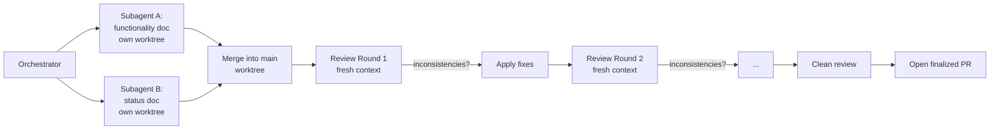

# Multi-Agent Documentation Run Log — 2026-05-17

This log records the multi-agent workflow used to produce
`summary/functionality-2026-05-17.md` and `summary/status-2026-05-17.md`,
including each fresh-context review pass and the inconsistencies it
surfaced.

---

## Workflow

The two research subagents ran in **parallel** in isolated git worktrees
to avoid stepping on each other. Each reviewer gets a fresh context (a
brand-new subagent) so it cannot rationalize earlier mistakes.

---

## Phase 1 — Parallel Research

| Agent | Worktree branch | File produced | Lines | Commit |
|-------|-----------------|---------------|-------|--------|
| Functionality | `worktree-agent-aa24ac93c43e62c14` | `summary/functionality-2026-05-17.md` | 654 | `e6ea0df` |
| Status | `worktree-agent-aa56826dbc865d5df` | `summary/status-2026-05-17.md` | 354 | `0563fee` |

Both ran in parallel; total wall-clock ≈ 6 minutes (longest of the two).

---

## Phase 2 — Fresh-Context Review Loop

Each round records:
- **Findings** — what the fresh reviewer flagged
- **Severity** — major / minor-factual / cosmetic
- **Resolution** — which file was edited and why (or why the reviewer was wrong)

