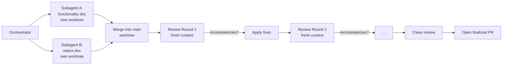

# Multi-Agent Documentation Run Log — 2026-05-17

This log records the multi-agent workflow used to produce
`summary/functionality-2026-05-17.md` and `summary/status-2026-05-17.md`,
including each fresh-context review pass and the inconsistencies it
surfaced.

---

## Workflow

The two research subagents ran in **parallel** in isolated git worktrees
to avoid stepping on each other. Each reviewer gets a fresh context (a
brand-new subagent) so it cannot rationalize earlier mistakes.

---

## Phase 1 — Parallel Research

| Agent | Worktree branch | File produced | Lines | Commit |
|-------|-----------------|---------------|-------|--------|
| Functionality | `worktree-agent-aa24ac93c43e62c14` | `summary/functionality-2026-05-17.md` | 654 | `e6ea0df` |
| Status | `worktree-agent-aa56826dbc865d5df` | `summary/status-2026-05-17.md` | 354 | `0563fee` |

Both ran in parallel; total wall-clock ≈ 6 minutes (longest of the two).

---

## Phase 2 — Fresh-Context Review Loop

Each round records:
- **Findings** — what the fresh reviewer flagged
- **Severity** — major / minor-factual / cosmetic
- **Resolution** — which file was edited and why (or why the reviewer was wrong)

### Round 1 — verdict: `needs_fixes` (15 findings: 4 major, 8 minor-factual, 3 cosmetic)

The first fresh-context reviewer was aggressive and produced 15 findings. Major
ones were all real and load-bearing; orchestrator verified each against the
source before editing.

| # | Sev | File | Claim flagged | Resolution |
|---|-----|------|---------------|------------|
| F1 | major | status §3 heading | "PRs merged over time (all 10 merged; PR #11 closed-not-merged)" — heading contradicts the bullet below | Edited heading to drop the parenthetical; rewrote stale "merged:false" bullet |
| F2 | major | status §1 + §4 | Iter 1 claimed cert-manager Helm + IRSA and ExternalDNS Helm install | Verified `terraform/management/helm.tf` has 4 `helm_release`s (no cert-manager) and `irsa.tf` line 149 explicitly says cert-manager is not installed. Rewrote Iter 1 row to list only the 4 actual Helm releases and 4 IRSA roles |
| F3 | major | both docs | "Repo `.gitignore` ignores `*.jsonl`" | Verified root `.gitignore` only ignores `.claude/*` paths; the `*.jsonl` rule is in `logs/.gitignore`. Fixed both citations |
| F4 | major | status §10 | "9 skills (2+6+1)" | Verified `ls .claude/skills/` shows 8 directories; PR #11 brought in 6 factory skills *including* `always-commit-skill-to-repo`. Changed to "8 skills (2+6)" |
| F5 | minor | functionality §3 | "terraform-test.yml (426 lines)" | `wc -l` reports 425. Changed |
| F6 | minor | functionality §7 | Intro paragraph claimed "no PR #4 in the table" but #4 IS in the table | Rewrote the intro paragraph |
| F7 | minor | status §3 bullet | Confusing API-quirk note about PR #11 merge state | Replaced with a clean "all 10 merged" bullet |
| F8 | minor | status §7 B2 | "State (S3+DDB) dies with the session" misleads re: 4-hour clock | Reworded: state survives within a sandbox account; idempotent Bootstrap recreates on a new account |
| F10 | minor | status §1 + §10 | "9 files, ~440 LoC" for `terraform/base/` | Actual: 8 `.tf` + `tfvars.example`, 427 HCL LoC. Updated both places |
| F11 | minor | status §4 | Iter 0 credited only to PRs #1, #3, etc. — but the scaffold was a direct pre-PR commit | Added attribution: initial scaffold landed via direct commit `3c08966` before PR #1 (same for Iter 1 via `3765c29`) |
| F12 | minor | status §7 B6 | Cited Cognito-groups note as "Immediate next step" section — it's actually a sub-bullet under the 2026-05-10 entry | Corrected citation |
| F9, F13, F14, F15 | cosmetic | various | wording / placeholder-gantt note / informal `claude/` prefix annotation | Not changed — cosmetic, would not mislead a reader |

After Round 1: 11 edits applied across both files; cosmetic items skipped.

### Round 2 — verdict: `needs_fixes` (6 minor-factual findings, 0 major)

A second fresh-context reviewer was dispatched after the Round 1 commit
landed. Quality of round 1 fixes was good — no regressions found and no
major errors remained. Round 2 caught smaller residual slips, most of
which were artifacts the round-1 reviewer had not specifically targeted.

| # | Sev | File | Claim flagged | Resolution |
|---|-----|------|---------------|------------|
| F1 | minor | status §2 + §10 | "`terraform/management/*.tf` (9 files, ~680 LoC)" | Verified `ls terraform/management/*.tf` = 8 (+ `terraform.tfvars.example`); HCL total ~681. Aligned both rows to the same `8 .tf + tfvars.example` format used for `terraform/base/` |
| F2 | minor | functionality §5 | "every change since #1 has gone through a branch + PR" | Verified two direct-to-main commits: `6ed86c8` (blog draft) and `9e68e2b` (k8s version bump 2026-05-04). Softened the claim and named both commits |
| F3 | minor | status §8 F7 | "PR #8 / 2026-05-03 cleanup" | PR #8 merged 2026-05-04 (matches the functionality doc's own PR table). Fixed the date |
| F4 | minor | functionality §9 | Handoff has "✅ / 🟡 / not started" status icons | `grep` confirms no 🟡 ever appears in handoff.md — only ✅ and the literal text "Not started". Removed the 🟡 reference |
| F5 | minor | status §11 step 2 | "the seven Iter 2 deliverables" | Status doc's own §2 lists 5 deliverables; REQ-XP-01..04 is 4 reqs. Replaced "seven" with explicit list (~5 items) |
| F6 | minor | functionality §1 | `docs/` tree only shows `operations.md` | `ls docs/` shows 3 additional empty subdirs (decisions, diagrams, iterations). Added them to the tree with "empty placeholder" annotations |

After Round 2: 6 edits applied across both files. No major findings; no
regressions from round 1. Dispatching round 3 to confirm convergence.

