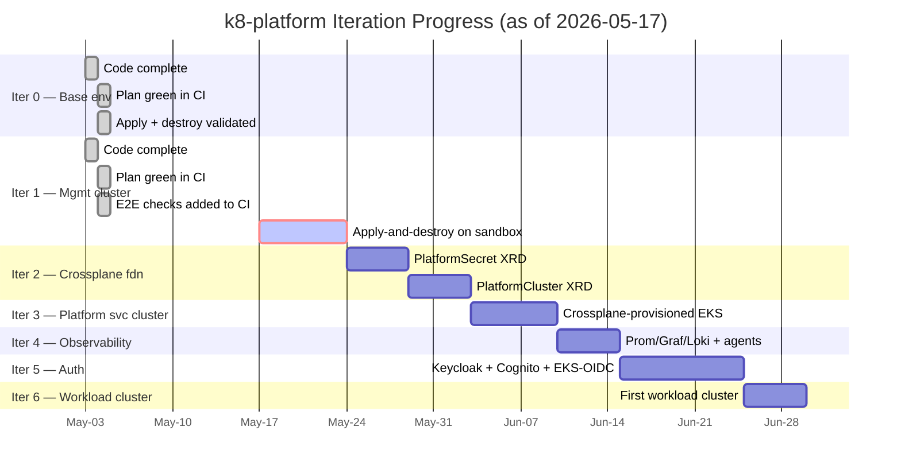
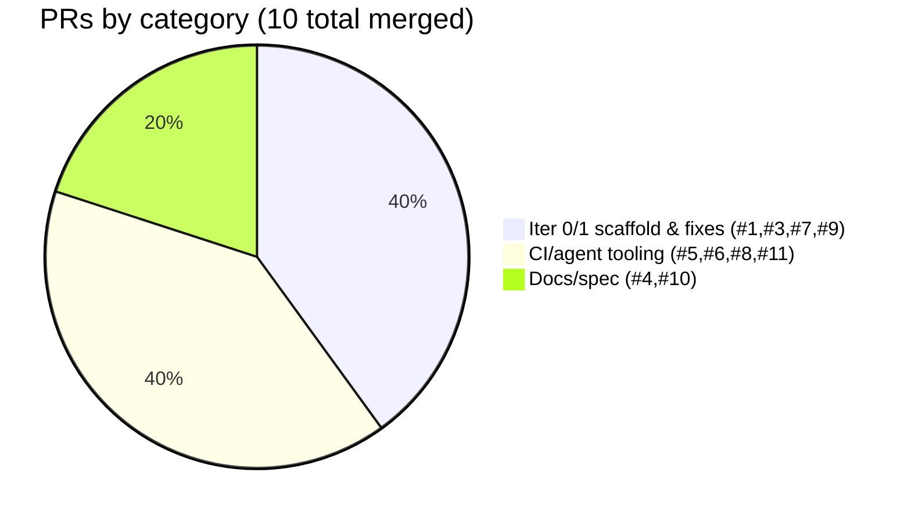
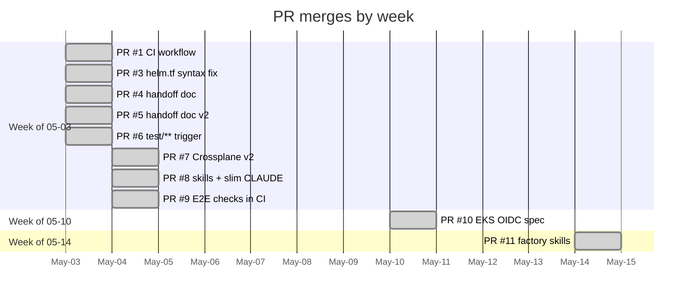
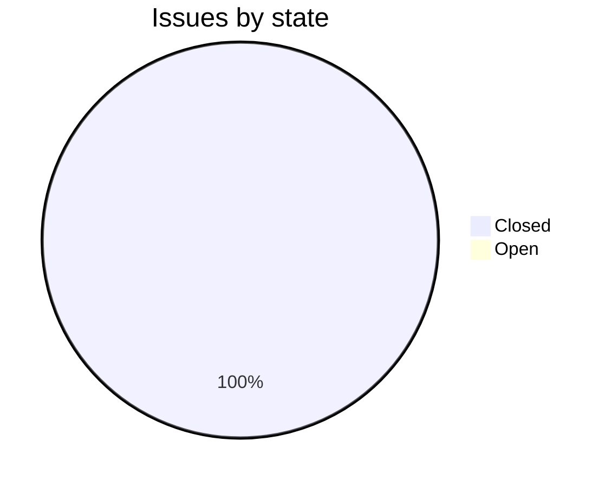
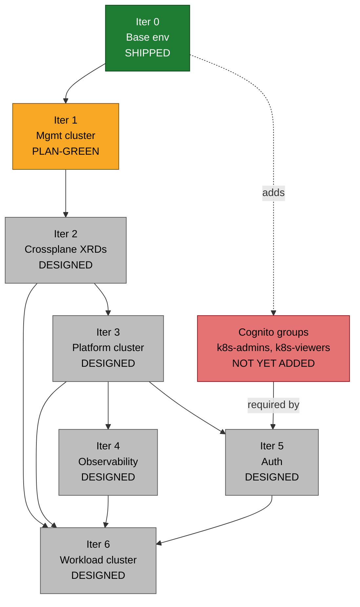
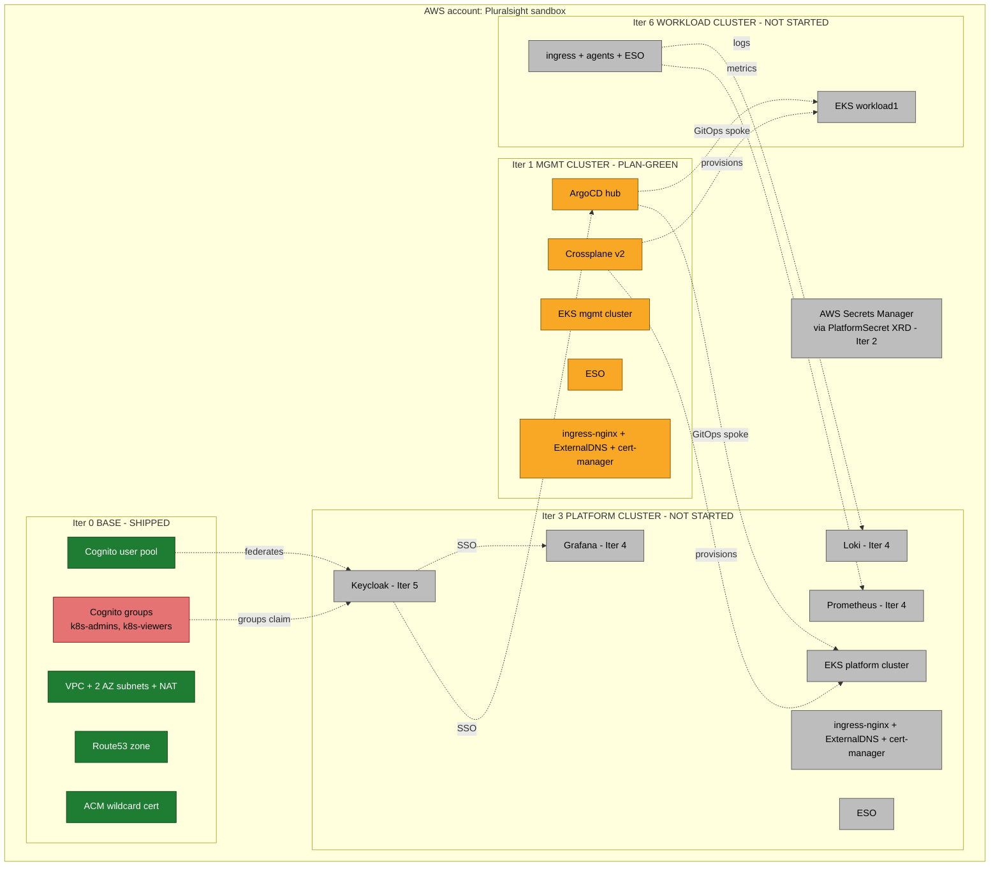
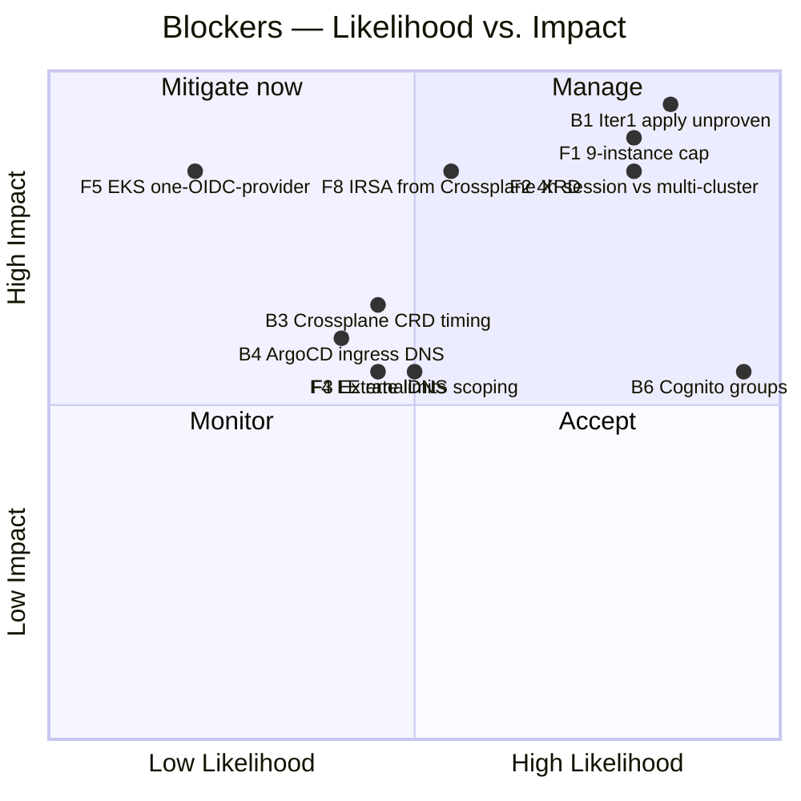

# k8-platform — Project Status

**Date:** 2026-05-17
**Repo:** `lago-morph/k8-platform`
**Author of status:** automated read of repo state, PRs, issues, and design docs
**Latest commit on `main`:** `c125c21` — *chore: copy six factory skills from software-factory repo (#11)* (2026-05-14)

---

## 1. Executive Summary

The project is in **early-mid implementation**. Of the seven planned iterations (0–6), only **Iterations 0 and 1 have code**, and only **Iteration 0 has been validated end-to-end on real AWS** (apply + destroy confirmed 2026-05-04). Iteration 1 (management cluster) is *code-complete and plan-green* in CI but has **never had a successful `apply` against the sandbox** — that is the immediate blocking milestone.

Everything from **Iteration 2 onward exists only on paper** (design docs and requirements). The `argocd/`, `crossplane/`, `clusters/`, and `platform-services/` directories are all stubbed with `.gitkeep` files and no real content.

Recent activity has been:
- Spec extension for Iteration 5 (Keycloak ↔ EKS API server federation) merged 2026-05-10 (PR #10) — design-only.
- Tooling additions (Claude skills, factory skills) merged 2026-05-04 and 2026-05-14 (PRs #8, #11) — no platform code.
- **No new platform/infrastructure work has merged since 2026-05-04** (PR #9, E2E verification in CI).

---

## 2. Iteration Progress at a Glance



### Status legend

| Symbol | Meaning |
|--------|---------|
| Shipped | A merged PR delivers usable code + has been exercised against AWS |
| Plan-green | Code exists; `terraform plan` passes in CI; **never applied** |
| Designed | Requirements + ADR exist in `ai/REQUIREMENTS.md` / `ai/DESIGN.md`; no code |
| Stubbed | Directory exists with `.gitkeep` only |

### Per-iteration status table

| # | Iteration | Status | Evidence | Notes |
|---|-----------|--------|----------|-------|
| 0 | Base environment (VPC, Route53, Cognito, ACM) | **Shipped** | `terraform/base/*.tf` (9 files, ~440 LoC), apply+destroy confirmed 2026-05-04 (handoff.md) | Cognito groups still need to be added before Iter 5 begins (see ADR-007 consequence) |
| 1 | Management cluster (EKS, IRSA, ArgoCD, Crossplane v2, ESO) | **Plan-green, NOT applied** | `terraform/management/*.tf` (9 files, ~680 LoC); PRs #3, #7, #9 all merged; E2E verification scaffolded in CI but never observed passing | Crossplane upgraded to v2 APIs in PR #7 but the new manifest application path is untested live |
| 2 | Crossplane foundations (`PlatformSecret` + base cluster XRD) | **Designed only** | `crossplane/xrds/`, `crossplane/compositions/`, `crossplane/claims/` all empty (`.gitkeep`) | REQ-XP-01..04 defined; no code |
| 3 | Platform services cluster + ingress/DNS/TLS | **Designed only** | `clusters/platform/` and `platform-services/{ingress,external-dns,cert-manager}` empty | REQ-PLAT-01..06 defined |
| 4 | Observability (Prom/Graf/Loki) | **Designed only** | `platform-services/observability/` empty | REQ-OBS-01..05 defined |
| 5 | Authentication (Keycloak + Cognito + EKS-API OIDC) | **Designed — recently extended** | PR #10 (2026-05-10) added REQ-AUTH-07..10, ADR-007, and the kubectl-via-Keycloak flow | Spec is the most detailed of the not-yet-coded iterations |
| 6 | First workload cluster | **Designed only** | `clusters/workload-template/` empty | Depends on Iter 2 (XRDs) and Iter 3 (platform stack) being live |

### What's done vs. what's left, per iteration

| Iteration | Done | Left |
|-----------|------|------|
| **0 Base env** | VPC (2 AZ, 2 NAT GW), Route53 zone discovery, Cognito user pool + auto-generated test user, ACM wildcard, S3+DDB state bootstrap (CI), apply+destroy proven | Add Cognito groups `k8s-admins`, `k8s-viewers` (deferred prerequisite for Iter 5) |
| **1 Mgmt cluster** | EKS module config (v20+), IRSA roles for ArgoCD/Crossplane/ESO/ExternalDNS/cert-manager, Helm installs (ArgoCD, Crossplane v2.0.1, ESO, ingress-nginx, ExternalDNS, cert-manager), ArgoCD ingress via Helm values, `terraform_data` + `local-exec` to apply Crossplane manifests, E2E check steps in CI workflow | A **single successful `apply-and-destroy` run** with all E2E assertions green; verify ArgoCD UI reachable; verify Crossplane `DeploymentRuntimeConfig` timing |
| **2 XRDs** | Nothing | `PlatformSecret` XRD+Composition, `PlatformCluster` XRD+Composition, `ClusterSecretStore` for ASM, ArgoCD `Application` pointing at `crossplane/`, end-to-end claim test |
| **3 Platform cluster** | Nothing | `PlatformCluster` claim for platform cluster, ApplicationSet, ingress-nginx, ExternalDNS scoped to `platform.<domain>`, cert-manager + Let's Encrypt ClusterIssuer, `hello.platform.<domain>` smoke app |
| **4 Observability** | Nothing | kube-prometheus-stack, Loki, Grafana Alloy on mgmt, central Grafana with TLS, annotation-driven scrape config |
| **5 Auth** | Spec only (PRs #10) | Keycloak Helm install + realm, Cognito IdP + group attribute mapper, ArgoCD/Grafana SSO, `aws_eks_identity_provider_config` on every cluster, `kc:`-prefixed ClusterRoleBindings, Cognito groups, operations doc update for `oidc-login` |
| **6 Workload cluster** | Nothing | `PlatformCluster` claim for `workload1`, ApplicationSet row, agents, smoke app |

---

## 3. PR Throughput and Issue Volume

### PRs merged over time (all 10 merged; PR #11 closed-not-merged)



Notes:
- PR #11 has `merged_at` populated in the API response despite `merged:false` in summary; the commit `c125c21` is on `main`, so it is in fact merged.
- PR #4 was superseded by PR #5 (same branch, same intent).
- **Roughly half the PR activity has been about CI/agent ergonomics, not platform code.** This is consistent with REQ-NF-05 (explainability) but also a tell that platform-feature velocity has been low for ~2 weeks.

### Throughput by week



### Issues



Only one issue has ever been opened (#2, helm.tf HCL syntax error from a CI run on 2026-05-03; closed by PR #3 the same day). **No open issues** today — there is no GitHub-tracked backlog of Iteration 2+ work; the roadmap lives only in `ai/handoff.md`, `ai/DESIGN.md`, and `ai/REQUIREMENTS.md`.

---

## 4. Iteration → PR → Remaining Work → Blockers

| Iteration | Merged PRs delivering it | Remaining work | Blockers |
|-----------|--------------------------|----------------|----------|
| 0 Base | #1 (CI), #3, #6, #7 (parts), #9 (base E2E) | Add Cognito groups for Iter 5 | None |
| 1 Mgmt cluster | #1, #3, #7 (Crossplane v2), #9 (mgmt E2E) | Live apply-and-destroy validation | Pluralsight sandbox session must be live; risks: Crossplane CRD timing, ArgoCD ingress DNS |
| 2 XRDs | *(none)* | `PlatformSecret`, base cluster XRD, Compositions, ArgoCD App | Blocked on Iter 1 apply success |
| 3 Platform cluster | *(none)* | Crossplane claim, ApplicationSet, ingress stack, smoke app | Blocked on Iter 2 |
| 4 Observability | *(none)* | Whole stack | Blocked on Iter 3 (no cluster to host Grafana) |
| 5 Auth | #10 (spec only) | All implementation: Keycloak, realm, SSO, EKS OIDC config, RBAC, Cognito groups | Blocked on Iter 3 (Keycloak lives on platform cluster) and Iter 0 (Cognito groups not yet added) |
| 6 Workload cluster | *(none)* | Crossplane claim, ApplicationSet row, agents | Blocked on Iter 2 (XRDs) + Iter 3 (platform cluster) for metrics sink |

---

## 5. Dependency Graph



**Critical path:** Iter 1 apply → Iter 2 XRDs → Iter 3 platform cluster. Iter 3 unlocks Iter 4 and Iter 5 in parallel; Iter 6 needs Iter 2, Iter 3, Iter 4, and Iter 5 all done.

---

## 6. Target Architecture, Colored by Status



---

## 7. Current (Concrete) Blockers

These are things blocking work *right now*, with cited evidence.

| # | Blocker | Why it blocks | Mitigation / next action |
|---|---------|---------------|--------------------------|
| B1 | **Iter 1 management apply has never been observed to succeed end-to-end against the sandbox.** Handoff (`ai/handoff.md` §"Current State") flags the apply as the immediate next step; previous attempt was blocked by the EKS + Crossplane bugs that PR #7 fixed. | Iter 2 (XRDs) can't be implemented without a live EKS+Crossplane install to test against. | Start fresh Pluralsight sandbox, copy 3 AWS secrets into GitHub, trigger `workflow_dispatch apply-and-destroy` on `main`, watch with `terraform-ci-watch` skill. Expected duration ~25 min (handoff). |
| B2 | **Sandbox sessions are 4 hours and ephemeral** (`ai/testing-guidelines.md`). State (S3 + DDB) dies with the session. | Any apply must finish + destroy within 4 h; cannot leave clusters running across sessions. | Always run apply-and-destroy in one go; the workflow is designed to do this. Watch the 25-min budget against remaining session time. |
| B3 | **Crossplane `DeploymentRuntimeConfig` (v1beta1) timing risk** (handoff "Known risks"). `terraform_data` + `local-exec` applies Provider manifest before CRD might be fully registered. | First apply could fail intermittently. | `depends_on` is set; if it bites, add a `wait-for-CRD` shell wait before kubectl apply. |
| B4 | **ArgoCD ingress via Helm `server.ingress.*` is untested live** — moved to Helm values in PR #7 from the now-removed `kubernetes` provider. | ExternalDNS may not create CNAME correctly; ArgoCD UI may not be reachable, failing E2E check. | E2E "ArgoCD URL reachability" step is `continue-on-error` (PR #9); inspect the comment, fix, re-run. |
| B5 | **No backlog tracked in GitHub Issues.** Roadmap lives only in `ai/handoff.md` + `ai/DESIGN.md`. | If sessions become parallel or are handed off, work coordination is informal. | Create issues for at least Iter 2 deliverables before starting. |
| B6 | **Cognito groups `k8s-admins`, `k8s-viewers` not yet added to `terraform/base/`** (handoff 2026-05-10 §"Immediate next step"). | Iter 5 cannot be tested end-to-end without them. | Add to `terraform/base/cognito.tf` whenever Iter 1 apply has been validated (so a base re-apply is cheap), or just before Iter 5 starts. |

---

## 8. Anticipated Future Blockers (reasoned)

These have not bitten yet, but the evidence points at them.

| # | Anticipated blocker | Reason it's likely | Likelihood | Impact | Suggested pre-emption |
|---|---------------------|--------------------|-----------:|--------|----------------------|
| F1 | **Sandbox 9-instance cap with multiple clusters** | Mgmt (2 t3.medium) + Platform (≥2) + Workload (≥1) + NAT ENIs already brushes the limit (`ai/testing-guidelines.md`). | High | High — can't run Iter 3+6 simultaneously | Plan to reduce `node_desired_size` to 1 on non-active clusters; or destroy mgmt between iteration tests if state can be reconstituted. |
| F2 | **Sandbox 4-hour session vs. multi-cluster apply** | Mgmt apply alone is ~25 min. Platform cluster + Helm stack will add another ~25–40 min. Iter 3 apply-and-destroy might not fit one session. | High | High | Split iterations; or accept partial-apply runs where destroy happens at end. Consider standing up only mgmt+platform without workload during the same window. |
| F3 | **Single Route53 zone for all clusters** | Sandbox gives one zone; all subdomains share it. ExternalDNS instances on multiple clusters must be scoped via `--domain-filter=<cluster>.<domain>` or they will fight over records. | Medium | Medium — silent DNS overwrites | Verify the Iter 3+ Helm values pin `domainFilters` per cluster. Already mentioned in DESIGN §2.8. |
| F4 | **Let's Encrypt rate limits in repeated apply-destroy cycles** | Iter 3 onward uses LE production via DNS-01. Each apply requests new certs; sandbox is ephemeral, so each session is "new." Per-domain weekly cert quota = 50. | Medium | Medium — could hit limit during heavy testing | Use LE staging issuer during iteration; switch to production only for end-state validation. (Not yet in design — worth an ADR.) |
| F5 | **EKS supports only one external OIDC provider per cluster** (ADR-007). Iter 5 already accounts for this, but the `kc:` prefix discipline must be applied *uniformly* across ClusterRoleBindings in `clusters/<cluster>/` for every cluster created from Iter 3 onward. | Low (design says so) | High if missed (RBAC misbindings) | Bake the prefix into a Composition output or an ApplicationSet template so it can't be forgotten. |
| F6 | **Crossplane provider package `upbound/provider-family-aws:v1.12.0` deprecation/upgrade churn** | Provider was just bumped in PR #7. v2 family providers are moving quickly. | Medium | Low–Medium | Pin in `variables.tf` (already done) and only bump deliberately per CLAUDE.md "Terraform Conventions." |
| F7 | **`docs/operations.md` references `ai/testing-overview.md`** (under "Where to Find Things"), but that file was moved to `ai/archive/` in PR #8 / 2026-05-03 cleanup. | Stale link discovered by reading `docs/operations.md` §"Where to Find Things". | High (already true) | Low (cosmetic) | Update the link to `ai/archive/testing-overview.md` or replace with a pointer to the new skill. |
| F8 | **`PlatformCluster` Crossplane Composition will require IRSA-friendly OIDC issuer URL templating** | Each new cluster needs its own OIDC issuer URL for IRSA on *its own* workloads; getting that out of a Crossplane-provisioned EKS cluster into IAM roles is non-trivial. | Medium | High (Iter 3, 6 will trip on this) | Plan a deliberate ADR for the IRSA bootstrap pattern when XRD is designed. |
| F9 | **Sandbox credentials in repo secrets must be rotated every session** | Pluralsight sandbox credentials expire at session end (`docs/operations.md`). CI silently fails on stale creds. | High (continuous) | Low (operational annoyance) | The current "rotate the 3 GitHub secrets before each session" pattern is the right answer; just document at top of operations.md. |

### Risk matrix



---

## 9. CI / Workflow Status

- **`.github/workflows/terraform-test.yml`** (~425 lines) — single workflow.
- **Push triggers:** only `test/**` branches (PR #6). Other branches require manual `workflow_dispatch`.
- **Modes:** `plan-only` (default) and `apply-and-destroy`.
- **Auto-discovery:** zone, domain, account ID, S3 bucket name, Cognito test user — all derived at runtime; only 3 GitHub secrets required (AWS creds + region).
- **E2E checks (PR #9):** ACM `ISSUED`, Cognito pool + test user, EKS `ACTIVE` + ≥1 Ready node, ArgoCD/Crossplane/ESO/ingress-nginx pods Running, ArgoCD SA IRSA annotation, ArgoCD ingress exists, best-effort ArgoCD URL reachability (continue-on-error).
- **Result reporting:** `post-comment.py` posts a collapsible Markdown comment on PR or on the commit (commit-comment path is the only signal when there's no PR — captured in `terraform-ci-watch` skill).

What CI **does not** yet validate:
- Anything Crossplane Composition / Claim related (Iter 2+).
- Anything ArgoCD GitOps sync related.
- Any Helm-chart drift on the management cluster (no install verification beyond pods running).

---

## 10. Repository State Snapshot

```
terraform/base/          9 files, ~440 LoC      SHIPPED
terraform/management/    9 files, ~680 LoC      PLAN-GREEN
argocd/{apps,projects}/  empty (.gitkeep)       STUBBED
crossplane/{xrds,compositions,claims}/  empty   STUBBED
clusters/{management,platform,workload-template}/  empty   STUBBED
platform-services/{cert-manager,eso,external-dns,ingress,keycloak,observability}/  empty   STUBBED
docs/operations.md       SHIPPED (one stale link to fix)
ai/DESIGN.md             Up-to-date through Iter 5 ADR-007
ai/REQUIREMENTS.md       Up-to-date through REQ-AUTH-10
ai/handoff.md            Last updated 2026-05-10
.github/workflows/terraform-test.yml   ~425 lines, E2E-enabled
.claude/skills/          9 skills present (2 repo-specific, 6 from factory, 1 always-commit)
```

---

## 11. Recommended Immediate Sequence (next 1–3 sessions)

1. **Session N (highest priority):** Run `apply-and-destroy` on `main` against a fresh sandbox. Use `terraform-ci-watch`. Resolve B3/B4 if they bite. Update `ai/handoff.md` with proof. **This unblocks everything.**
2. **Session N+1:** Add Cognito groups to `terraform/base/cognito.tf` (B6); re-plan to confirm. Open GitHub issues for the seven Iter 2 deliverables (closes B5 partially).
3. **Session N+2:** Begin Iter 2 — author `PlatformSecret` XRD + Composition + ArgoCD App + ClusterSecretStore. Drive with `crossplane-claim-verify` skill against the live mgmt cluster.

---

## 12. Open Questions / Things Not Yet Decided

- **LE staging vs. production issuer** for repeated sandbox apply cycles (F4) — not in design.
- **IRSA bootstrap pattern for Crossplane-created EKS clusters** (F8) — design does not yet describe how `iam.eks.amazonaws.com/role-arn` annotations get populated for workloads on platform/workload clusters provisioned by Crossplane.
- **Where ArgoCD ApplicationSet templates live** (`argocd/apps/`?) and how new clusters register themselves — REQ-PLAT-02 says ArgoCD deploys to platform cluster but the mechanism (cluster secret + ApplicationSet generator) isn't fleshed out.
- **Whether `ai/blog/` content should be commit-gated to iteration completion** — currently free-form.

---

*End of status report — 2026-05-17.*
